# CPE 編 (Rall, arXiv:2103.09717v4) 定理インベントリと依存グラフ

対象: P. Rall, "Faster Coherent Quantum Algorithms for Phase, Energy, and Amplitude Estimation",
arXiv:2103.09717v4 (Quantum 2021; v4 は 2022-12-12)。範囲: 本文 §1–§5 全体（§3 は数値比較，§6 は謝辞）。
**v4 に付録はない**。番号付き命題は Definition 1, 2, 6, 9 / Lemma 3, 4, 7, 8, 10, 11, 14, 17 / Proposition 5, 18 /
Theorem 12, 15, 19 / Corollary 13, 16, 20 の計 **20 個**。**"Algorithm" 環境は存在しない**。アルゴリズムは Prop 5, Thm 12,
Thm 15 の証明中の手順（1–5 / 1–4）と Fig. 4 の回路図で与えられる（§3.3 に対応表）。本文中の番号なし主張・観察
25 個を補助行として §3.2 に加え，表は計 45 行。

参照: `design-sketch.md` (v0)，兄弟ファイル `mqsp-core.md`, `mqsp-applications.md`（QSVT 編は GSLW の番号で参照）。
テキストは pdftotext 由来で式が崩れている。上付き文字・床括弧・符号が失われた箇所は文脈から再構成し，
「(要原文確認)」を付けた。

表記（本ファイル共通）:
- `fl_n(λ) := floor(2^n λ) ∈ {0,…,2^n−1}`（λ ∈ [0,1)）。`bit_k(λ)` は fl_n(λ) の下から k 番目のビット（k = 0 が LSB）。
  `Δ_k(λ) := fl_n(λ) mod 2^k`（下位 k ビット）。レジスタは `|Δ_k⟩ = |bit_{k−1}⟩⊗…⊗|bit_0⟩` (77)，`|Δ_0⟩ = 1 ∈ C`。
- `λ^(k) := 2^{n−k−1}(λ − Δ_k/2^n) + φ_k` (89)(111)(122)。`η_k`, `φ_k` は Thm 12 の値（§2 G1）。
- `M_{η→δ}` は Lemma 11 の増幅多項式の次数。`r(t', ε')` は Lemma 14 の Jacobi–Anger 次数関数。
- 表中ではパイプとの衝突を避けるため `ket(x)`, `bra(x)`, `abs(·)` を使う。‖·‖ は作用素ノルム，‖·‖_1 はトレースノルム，
  ‖·‖_⋄ はダイヤモンドノルム。
- 分類: (a) mQSP/QSVT の計画済み一般定理から導出可能，(b) mQSP/QSVT にない新しい再利用可能 primitive（本プロジェクトで
  形式化が必要），(c) 応用固有。Poly ライブラリ由来の (a) は「(a) Poly lib」と書く。
- mQSP 言語表現の記法は §2.0 にまとめる。

---

## 1. 概要

### 1.1 coherent setting

- **設定** (§0, l.84–93): 入力状態は **1 コピーのみ**で，**U の固有状態とは限らない**重ね合わせ `Σ_j α_j |ψ_j⟩`。
  状態は**測定しない**。古典計算機と適応的にやりとりもしない。目標は (1)
  `Σ_j α_j |0^n⟩|ψ_j⟩ → Σ_j α_j |fl_n(λ_j)⟩|ψ_j⟩` を，重ね合わせを壊さずに（ほぼ）決定的に実装すること。
- incoherent な iterative PE [Kit95]（bit ごとに Hadamard test をして古典的に多数決を取る）は，多くのコピーや測定を
  前提にしている。素朴に coherent 化して各サンプルを ancilla に書くと ancilla が膨大になる。本論文の鍵は
  **新しい ancilla を使わずに増幅すること**である。多数決確率 (4) は Hadamard-test 確率 p の多項式なので，
  「増幅多項式」を block encoding に SVT で直接かける。[LC17] の sign 近似を使えば次数は η^{-1} スケールになる。
- coherent 性が本質的な応用 (l.84–93, 258–267): HHL の原型，quantum Metropolis / 固有空間上の Szegedy walk
  [Temme&09, YA11, Lemi&19, JKKA20, WT21]，分配関数 [Mon15]，熱状態準備，Bayesian inference [HW19, AHNTW20]。
  Szegedy walk の二次加速を得るにはエネルギー測定を完全に coherent にする必要がある。加法誤差推定では，誤差を
  固有値ギャップより小さくしない限り足りない。そのため本論文は「n-bit 推定」fl_n を保持する
  （加法誤差 ε/2 は n = ⌈log_2 ε^{-1}⌉ で得られる）。

### 1.2 三つの問題と標準形

- 標準形 (6): `U = Σ_j e^{2πiλ_j}|ψ_j⟩⟨ψ_j|`，`H = Σ_j λ_j|ψ_j⟩⟨ψ_j|`。λ_j ∈ [0,1) を「固有値」と呼ぶ
  （H には 0 ⪯ H ≺ I を課す）。
- **phase estimation**: controlled-U, U† を呼び，(9) `|0^n⟩|ψ_j⟩ → |fl_n(λ_j)⟩|ψ_j⟩` をダイヤモンドノルム δ で実装する (Def 2)。
- **energy estimation**: H の block encoding U_H（Def 9，正規化 1）を呼び，同じ写像を実装する。Hamiltonian simulation を
  経由せず，cos(π2^{n−k}x) を Jacobi–Anger 多項式として SVT の中で直接合成する。
- **(non-destructive) amplitude estimation**: 射影 Π と状態 |Ψ⟩ について，reflection `R_Π = 2Π − I` と
  `R_Ψ = 2|Ψ⟩⟨Ψ| − I` の controlled 版を使う。|Ψ⟩ を 1 コピーだけ使って壊さずに，a² = ‖Π|Ψ⟩‖² の n-bit 推定
  floor(a² 2^n)（または −1）を出す (Cor 20)。

### 1.3 rounding promise: 定義，必要性，扱い

- **定義** (Def 1, (8)): 全 x ∈ {0,…,2^n} について `λ_j ∉ [x/2^n, x/2^n + α/2^n]`（区間端の開閉は要原文確認）。
  禁止区間の総長は n によらず α。
- **必要性**（任意の coherent 推定器に要る; l.239–253, 316–346）:
  (i) 多項式法: 既知ゲートと controlled-e^{2πiλ} からなる回路の出力振幅 α_{x,y}(e^{2πiλ}) (7) は e^{2πiλ} の多項式なので
  λ について連続である。一方，望ましい振幅 indicator[x = fl_n(λ)] は不連続である。δ-近似（≤ δ か ≥ 1−δ）でも，
  加法誤差推定でも同じことが言える。
  (ii) したがって，ある λ では出力が `ξ|λ̂1⟩ + ζ|λ̂2⟩` (2) になり ξ, ζ がどちらも ≉ 0 になる。そうなると uncompute
  [BBBV97] が効かず，入力の重ね合わせは不可逆に壊れる。
  (iii) [TaShma13]（consistent PE）と [Ambainis10] の古典乱数シフトは，位相 1 個なら有効である。しかし位相が [0,1) に
  十分密に分布すると，どんなシフトを選んでも遷移点の近くに位相が残る。[Ambainis10], [KP17], [KLLP18] は，この問題を
  無視した決定的写像を前提にしている（脚注 1）。
  (iv) promise を避ける方法は測定して coherence を捨てることだけである（または [LT21] のように推定を経由しない）。
- **本論文での扱い**: (a) k = 0（LSB）の段だけが promise を使う（η_0 = α/2）。(b) k ≥ 1 の段では下位ビットを差し引くので
  allowed 区間が自動的に離れ，**promise がなくても決定的**になる。区間は 2^{−k}(1+α)/2 まで広げてあり，LSB の誤りも許容する
  (124)。(c) その結果，promise が破れても誤り得るのは LSB だけで，出力は fl_n(λ) と fl_n(λ) − 1 mod 2^n の
  重ね合わせ（phase, Cor 13 (143)）か，固有状態入力での混合（energy, Cor 16 (174)）になる。実用上は α を小さくして
  入力の支持に禁止区間の固有値が少ないことを期待する (l.305–315)。
- **α の削減** (Prop 5, l.568–590): r 余分ビットを推定して丸める方法では α の削減が 2^{−r}，コストが 2^r 倍になり，
  α^{-1} スケールが得られる。median 増幅だけでは α ≈ 10% 以下にできず (Fig. 1)，しかもスケールは α^{-2} になる。

### 1.4 主要な計算量と ancilla

| 手法 | クエリ数 | ancilla / garbage | 備考 |
|---|---|---|---|
| textbook PE (Prop 5) | α ≤ 1/2: `(2^{n+r} − 1)·⌈ln(δ_med^{-1})/(2η_0²)⌉`, r = ⌈log_2(1/(2α))⌉, η_0 = 8/π² − 1/2, δ_med = δ²/6.25。漸近 O(2^n α^{-1} log δ^{-1}) | garbage `(n+r)·⌈ln(δ_med^{-1})/(2η_0²)⌉` = O((n + log α^{-1}) log δ^{-1}) | QFT + sorting network による median。with phases & garbage |
| 新 PE (Thm 12 + Lemma 7 = Cor 13) | `Σ_{k=0}^{n−1} 2^{n−k}·M_{η_k→δ_amp,k}` = O(2^n α^{-1} log δ^{-1}) | **0**（出力 n qubit のみ） | with phases。位相除去は Lemma 3（クエリ 2 倍，コピー用 n qubit） |
| textbook EE (Prop 5 + Lemma 17) | Prop 5 × HamSim コスト | O(a + (n + log α^{-1}) log δ^{-1}) | 基準線 |
| 新 EE (Thm 15 + Lemma 8 + Lemma 7 = Cor 16) | O(α^{-1} log(δ^{-1})·(2^n + log α^{-1})) | a + n + 3（各段で即時 uncompute） | U_H が a ancilla。no phases, no garbage |
| 非破壊振幅推定 (Cor 20) | O(2^n log δ^{-1}) 回の controlled R_Π, R_Ψ | n + O(1) | promise 不要（入力が固有状態）。出力は floor(a²2^n) または −1 |
| 数値 (§3, Fig. 5, 6) | n ≳ 10, α ≲ 2^{−10}, δ ≲ 10^{−30} で PE は約 14 倍，EE は約 10 倍の削減 | — | query complexity のみで比較（textbook に有利な条件） |

### 1.5 下界と不可能性

- **Ω(α^{-1})** (l.347–361, 非形式的): (1,α)-RP 下で fl_1(λ) を求めることは，Grover 回転の位相 arcsin(sqrt(K/N)) を
  平行移動したうえで K ≥ (1/2 + Cα)N と K ≤ (1/2 − Cα)N を判別することに当たる。これは promise gap ~α の近似数え上げで，
  [NW98] の Ω(α^{-1}) が効く。本論文の全アルゴリズムは O(2^n α^{-1} log δ^{-1})
  （EE はこれに log α^{-1} が加わる）を達成する。
- **promise なしの coherent 推定は不可能**（§1.3 (i)–(iv)）。ブロック測定でも，A が射影でない場合に ancilla を
  trace out すると出力は確率混合に崩れる。入力が非固有状態なら入力の重ね合わせも損なわれる ((205)–(212))。
  つまり「出力が決定的でない限り uncompute は不可能」という事実の再導出になっている。

### 1.6 証明の構造（モジュール化）

1. **仕様層**: Def 1（promise），Def 2（estimator; with phases / garbage），Def 6（coherent iterative estimator），
   Def 9（block encoding）。
2. **枠組み補題**: Lemma 3/8（uncompute: copy + inverse + discard），Lemma 7（iterative 段の連結と幾何的誤差配分），
   Lemma 4（スペクトル誤差 → ダイヤモンド誤差）。uncompute をいつ行うか（Lemma 7 の前に Lemma 8，後に Lemma 3，
   またはしない）は利用者が選ぶ (l.1076–1087)。
3. **道具**: Lemma 10（SVT, GSLW の簡約版），Lemma 11（増幅多項式, [LC17]），Lemma 14（Jacobi–Anger, GSLW）。
4. **中核構成**: Thm 12（位相の 1 bit, ancilla ゼロ），Thm 15（エネルギーの 1 bit, a + n + 3 garbage）。
   系は Cor 13 と Cor 16。
5. **独立した道具**: §4 の Prop 18（近似 block encoding → チャネル，誤差 4ε）と Thm 19（block-measurement）。
   主系列は Thm 19 を使わない（Thm 12 は 1 クエリ版，Thm 15 は flag + Lemma 8 で同じことをする）。
6. **応用**: Cor 20（非破壊振幅推定）。基準線は Prop 5 と Lemma 17。

---

## 2. 構成の用語集

### 2.0 mQSP 言語表現の記法（本ファイルでの略記）

```
Wire(V)             既知ユニタリ（oracle なし, cost 0）
Query(U)            port U の 1 クエリ。Inverse(Query U) = Query(U†) も port U のコスト 1
Ctrl(M)            := DirectSum(Wire(I), M)          -- ket(0)bra(0)⊗I + ket(1)bra(1)⊗M（controlled 版）
Pow(M, r)          := Series(M, …, M)  (r 個)         -- cost r·cost(M)
Spec(M, R)         := Spectator(M, R)                 -- M ⊗ I_R
LCU_w(M_1,…,M_L)   := Project(Series(Wire(Prep_w), DirectSum(M_1,…,M_L), Wire(Prep_w†)))
Prod(M_1,…,M_L)    := Project(Series(M_1,…,M_L))      -- ancilla を別々に持つ block encoding の積
QSVT_Φ(M)          := Series(Wire(e^{iφ_0(2Π−1)}), M, Wire(e^{iφ_1(2Π−1)}), Inverse(M), …)   -- GSLW Thm 17
QSPplus_Φ(M)       := Series(Wire(H_anc), QSVT_Φ(M), Wire(H_anc))   -- (W_x,S_z,⟨+,+⟩) 規約, m = 1
DiagPhase_R(θ)     := Wire(Σ_x e^{iθ(x)} ket(x)bra(x) on register R)
Copy_n             := Wire(CNOT^{⊗n})                 -- 推定レジスタ → 新規レジスタ
Flag               := Wire(I_out ⊗ P_0 + X_out ⊗ (I − P_0))   -- P_0 = ancilla 全 0 射影 (Thm 15 手順 4)
CtrlZero           := Wire(X_out ⊗ P_0 + I_out ⊗ (I − P_0))   -- Thm 19 の modified CNOT
WireBE(X)          既知縮小作用素 X の block encoding（oracle なし; ユニタリ拡大）
Full(M)            Project しない: ancilla を出力 qubit として読む（列 M(ket(0)⊗ψ) 全体が意味を持つ）
Discard(R), Measure(R)    新規: チャネル層（mQSP にない; §5.1 F7）
```

### 2.1 用語集

**G1. rounding promise とビット分解**（Def 1; (83)–(89), (109)(110), (118)(119), (123)(124); Fig. 2, 3）
- 入力: n, α ∈ (0,1)，U または H のスペクトル。
- 内容: `bit_k(λ) = parity(floor(2^{n−k}(λ − Δ_k/2^n)))` (83)。`amp(x) = 1 (x > 1/2), 0 (x < 1/2)` (85) を使うと
  `bit_k(λ) = amp(cos²(πλ^(k)))` (88)。位相シフトは `φ_0 := 1 − mean(1/2 + α/2, 1)` (109)，
  `φ_k := 1 − mean(1/2, 1/2 + 2^{−k}(1/2 + α/2))`（k ≥ 1）(110)。マージンは `η_0 := α/2`, `η_k := 1/2 − 2^{−k}(1/2 + α/2)`
  (118)(119)（崩れた式からの再構成。要原文確認）で，k ≥ 1 では η_k ≥ (1−α)/4。
- 保証: k = 0 では RP の下で λ^(0) − φ_0 mod 1 ∈ [α/2, 1/2]（bit 0）または [1/2 + α/2, 1]（bit 1）(123)。
  k ≥ 1 では **RP なしで** ∈ [0, 2^{−k}(1+α)/2]（bit 0）または [1/2, 1/2 + 2^{−k}(1+α)/2]（bit 1）(124)。
  傾き 2 の直線で下から押さえると，cos²(πλ^(k)) は bit = 0 なら ≤ 1/2 − η_k，bit = 1 なら ≥ 1/2 + η_k になる (126)
  （(126)–(128) の場合分けの印字は逆転しているとみられる。§5.4 G-1）。
- 資源: なし（算術と実解析）。

**G2. 推定器の仕様**（Def 2, 6）
- with phases (11): `|0^n⟩|ψ_j⟩ → e^{iϕ_j}|fl_n⟩|ψ_j⟩`。with garbage (10): `|0^n⟩|0…0⟩|ψ_j⟩ → |fl_n⟩|garbage_j⟩|ψ_j⟩`。
  確保して確実に返す ancilla は garbage に数えない。iterative 版 (74) は入力部分空間（Δ_k が正しい下位ビット）上でだけ
  制約し，それ以外では任意。誤差はダイヤモンドノルムで測る。これは uncompute 後に ancilla を捨てる必要があるため
  （(12)–(14) の非正規化の例）。

**G3. 位相信号の block encoding**（Thm 12 手順 1–3, (107)–(117), Fig. 4(a)(b)）
- 入力: controlled-U（port U），Δ_k レジスタ（k qubit），出力 qubit 1 個。
- 構成: Δ 依存の位相 `e^{−2πiΔ̂_k/2^n} := Σ_Δ e^{−2πiΔ/2^n}|Δ⟩⟨Δ|` (107) は qubit ごとの位相ゲートの積。
  `e^{2πiλ̂^(k)} := (e^{−2πiΔ̂_k/2^n} ⊗ U)^{2^{n−k−1}}·e^{2πiφ_k}` (112)（指数の付き方は要原文確認）。
  `U_signal^(k) := (H̃ ⊗ I)·Ctrl(e^{2πiλ̂^(k)})·(H̃ᵀ ⊗ I)`，`H̃ = (1/√2)[[1,1],[i,−i]]` (113)。
- 保証: 同時固有ベクトル |Δ⟩|ψ_j⟩ ごとに
  `U_signal = e^{iπλ^(k)}·[[cos πλ^(k), sin πλ^(k)],[sin πλ^(k), −cos πλ^(k)]]` (116)。
  つまり `Σ cos(πλ^(k))·(±e^{iπλ^(k)}) |Δ,ψ_j⟩⟨Δ,ψ_j|` の 1-ancilla block encoding で，これが SVD になっている (117)。
  本質は Hadamard test，すなわち I と U^(k) の等重み LCU `(I + e^{2πiλ̂^(k)})/2 = cos(πλ)e^{iπλ}` (91)(92) である。
  **"U + U†" トリックではない**。H̃ を使うのは信号を「位相つき反射」型にして Lemma 10 の m = 1 特例に載せるため。
- 資源: 1 回あたり controlled-U を 2^{n−k−1} 回，ancilla 1。

**G4. エネルギー信号**（Thm 15 手順 1–3, (158)–(166)）
- 入力: U_H = Be[H]（a ancilla，正規化 1，0 ⪯ H ≺ I），Δ_k レジスタ。
- 構成: (i) `W_k := 2Σ_Δ (Δ/2^n)|Δ⟩⟨Δ|` (158) の block encoding。ket(+^{n−1}) を準備し，比較 x < Δ_k を計算して
  ket(1) に postselect し，最後に ket(+^{n−1}) に postselect する (159)–(162)。ancilla は n，クエリなし。
  (ii) LCU で `H^(k) := (1/2)I⊗H − (1/4)W_k⊗I + (1/4)(4φ_k 2^{k−n}) I⊗I` (163) を作る（制御 qubit 2，ancilla a + n + 2，
  U_H 1 クエリ）。固有値は `2^{k−n}λ^(k)` (165)(166)。(iii) cos(π2^{n−k}x) の Jacobi–Anger 多項式 (Lemma 14) を
  SVT の中で合成する。**Hamiltonian simulation を経由しない**。
- 保証: `p̃(H^(k))` の固有値は `p̃(2^{k−n}λ^(k)) ≈ A(cos²(πλ^(k)))` (168) で，Thm 12 と同じ形になる。
- 代替 (l.2045–2056): A の shift・scale・和で直接周期関数を作る（[LC17] の rectangle 法）と O(2^n α^{-1} log δ^{-1}) になる。
  ただし n ≈ 10, α ≈ 2^{−10} では Jacobi–Anger 法のほうが数値的に有利。

**G5. 増幅多項式**（Lemma 11; (4), (95)）
- median 増幅の代わりに使う。`A(x) ≈ amp(x) = 1/2 − (1/2)sign(2x − 1)` (95)。x ∈ [0, 1/2 − η] で ≥ 1 − δ，
  [1/2 + η, 1] で ≤ δ，[0,1] で ∈ [0,1]（出力は反転し，「確率」を 0/1 に増幅する）。多数決多項式 (4) なら次数
  O(η^{-2} log δ^{-1})，[LC17] の sign 近似なら O(η^{-1} log δ^{-1})（最適）。SVT で信号に直接かけるので
  **新しい ancilla は要らない**。FPAA は使わない（ただし同じ sign 多項式族である）。

**G6. SVT の適用**（Lemma 10）
- 偶・実・abs ≤ 1 の多項式 p を d クエリ（U_A, U_A†，制御なし）でかける。m ancilla は m+1 になる。
  m = 1 で反射型の信号なら ancilla 1 のまま（Thm 12 で使う）。δ は古典的な角度計算の誤差である。

**G7. ビットの読み出し（4 種類）**
1. **ancilla 読み出し**（Thm 12; (121), (129)–(138); §4 (197)(198)）: SVT の唯一の ancilla が出力 qubit になる。
   `|0⟩|Δ⟩|ψ_j⟩ ↦ (p̃|0⟩ + γ|1⟩)|Δ⟩|ψ_j⟩`，ユニタリ性から abs(p̃)² + abs(γ)² = 1。p̃ ≈ 1 − bit なので，
   出力 qubit は位相つきで |bit⟩ になる。garbage はない。
2. **flag 読み出し**（Thm 15 手順 4）: SVT の後に Flag（ancilla ≠ 0 なら出力反転）をかける。1 クエリで済むが，
   ancilla の失敗分岐が garbage として残り，Lemma 8 で除去する。
3. **block-measurement**（Thm 19; (194)–(204)）: `V_A = U_A†·CtrlZero·U_A` は `X⊗A² + I⊗(I − A²)` の
   block encoding になる (200)。2 クエリで，Prop 18 によりチャネル誤差 4√2ε。
4. **LCU + OAA**（§4 冒頭）: `|0⟩⊗I − √2|−⟩⊗Π` を作り，T_5 の OAA で 1/(1+√2) を除く（GSLW Thm 28）。5 クエリ。
- 1 クエリ版の位相補正を除けるか（GSLW Thm 3 の P, Q を正実に選べるか）は未解決 (l.2640–2648)。

**G8. 振幅の帳簿付けと誤差変換**（Thm 12 (125)–(140), Lemma 4）
- 各固有ベクトルで「正しいビットの確率 ≥ 1 − ε」を示す。位相 ϕ_j を γ の偏角に選ぶと，理想状態との距離は
  ≤ sqrt(2ε)。Lemma 4 でダイヤモンドノルム ≤ 2 sqrt(2ε) に変換する。分配は `δ_amp := (1 − 10^{−m})δ²/8`,
  `δ_svt := 10^{−m}δ²/8` (140)。クエリ数には δ_amp だけが効くので，m を大きくすれば古典計算に負担を寄せられる。

**G9. coherent iteration（stitching）**（Lemma 7, Fig. 4(d)）
- k = 0, …, n−1 の段を順に並べ，段 k の出力 qubit が Δ_{k+1} の最上位になる。誤差は `δ_k = δ2^{−k−1}`（幾何配分）で，
  等分だと O(2^n log n) 項が出るが幾何配分なら避けられる。計算量は k = 0（LSB）の段が支配する。
  上位ビットほど η_k が大きく，増幅が少なくて済む。

**G10. uncompute とゴミ処理**（Lemma 3, 8; (17), (79)）
- Λ → 推定レジスタを新規レジスタにコピー → Λ^{-1} → 旧レジスタを discard。クエリは 2 倍で，各段の許容誤差は δ/2。
  Λ はユニタリ実装を持たなければならない。EE では Lemma 8 を Lemma 7 より先に適用して garbage の蓄積を避ける (l.2261–2266)。
  PE は位相だけを持ち，熱状態準備のように位相が無害な応用では uncompute を省ける (l.1855–1860)。

**G11. block encoding → チャネル**（Prop 18, Lemma 17）
- ‖A − V‖ ≤ ε なら，ancilla を ket(0) で始めて U_A をかけ，ancilla を捨てるチャネルは V に 4ε-近い。
  証明は postselect 成功分岐 Λ_0（2ε）と失敗分岐の総重み（≤ 2ε − ε²）への分解。
  「ε-正確な block encoding」と「ε-正確なユニタリ実装」は別物で，前者は 4ε，後者は 2ε になる (l.2364–2366)。

**G12. promise なしの振る舞い**（Cor 13 後半, Cor 16 後半）
- PE: `|0^n⟩|ψ_j⟩ ↦ (ξ|fl_n⟩ + ζ|fl_n − 1⟩)|ψ_j⟩` (143) と，重ね合わせを保つ。
- EE: garbage があるので k = 0 段は (182) の形になり uncompute できない。出力を測定して garbage を捨て，以降も
  garbage を捨てる。そのため固有状態入力に限り，`p|fl⟩⟨fl| + (1−p)|fl−1⟩⟨fl−1|` (174) を得る。

**G13. 非破壊振幅推定**（Cor 20, (213)–(216)）
- Π = (I + R_Π)/2 と |Ψ⟩⟨Ψ| = (I + R_Ψ)/2 を LCU で作り，積 `A = |Ψ⟩⟨Ψ|Π|Ψ⟩⟨Ψ| = a²|Ψ⟩⟨Ψ|` の block encoding を得る。
  これに Cor 16 の promise なし版を |Ψ⟩（A の固有状態）でかける。誤った推定でも入力を壊さないので promise は不要。
  [HW19] と比べた利点 (l.2750–2783): ancilla が少ない（n + O(1) vs O(n log δ^{-1})），実行時間が固定（適応的修復なし），
  a の下界が不要，加法誤差を許す，arcsin を経由せず a² を直接推定する。a 自体が必要なら sqrt の SVT（GSLW Cor 66）を
  使う（将来課題）。

**G14. textbook PE と丸めトリック**（Prop 5, Fig. 1）
- 一様重ね合わせ，位相 −2πt(1−α)/2^{n+1}（floor にするため），逆 QFT，Fejér 核 `abs(β)² ≥ γ(λ^(x)) = sin²(πx)/(π²x²)`，
  M 回の反復と sorting network による median，という流れ。α ≤ 1/2 では r 余分ビットを推定して丸める
  （隣接 2 bin の和 ≥ 8/π² (73)）。

**G15. 応用**
- Metropolis, Szegedy walk, HHL, 分配関数，熱状態，Bayesian inference は**動機として挙がるだけ**で，形式的な主張は
  Cor 20 だけである（[HW19, AHNTW20] が非破壊振幅推定を明示的に要求する）。形式化対象としては Cor 20 で十分。

---

## 3. 定理インベントリ

列: ID / kind / short name / category / 主張（仮定 → 結論） / 証明の要点 / depends on / used by / 分類 / mQSP 言語表現 /
Lean home / 難度 (1–5) / priority / notes。

### 3.1 番号付き命題（20 個）

| ID | kind | short name | category | statement | proof idea | depends on | used by | class | mQSP expression | Lean home | diff | prio | notes |
|---|---|---|---|---|---|---|---|---|---|---|---|---|---|
| Def 1 | Def | (n,α)-rounding promise | error/probability | H エルミートで H = Σ_j λ_j ket(ψ_j)bra(ψ_j), 0 ≤ λ_j < 1, かつ全 x ∈ {0,…,2^n} について λ_j ∉ [x/2^n, x/2^n + α/2^n] (8)。ユニタリ U = Σ e^{2πiλ_j} ket(ψ_j)bra(ψ_j) も同様。禁止区間の総長は n によらず α | 定義 | — | Def 2, Def 6, Aux.Bit, Thm 12, Thm 15, Prop 5 | (b) | oracle の promise 集合: `Promise_U = {U : spec(U) ⊆ exp(2πi·Allowed(n,α))}`。energy は `{U_H : U_H = Be[H], spec(H) ⊆ Allowed(n,α)}` | `MQSP/CPE/RoundingPromise.lean` | 1 | core | 区間端の開閉は要原文確認。Lean では `Allowed n α : Set ℝ` と `spectrum ℝ H ⊆ Allowed n α`。x = 0 の区間 [0, α/2^n] も禁止される |
| Def 2 | Def | phase / energy estimator (with phases, with garbage) | error/probability | プロトコル (n, α, δ) ↦ controlled-U, U† を呼ぶ回路。U が (n,α)-RP を満たせば，回路のチャネルは ket(0^n)ket(ψ_j) ↦ ket(fl_n(λ_j))ket(ψ_j) (9) に ‖·‖_⋄ で δ-近い。energy 版は U_H = Be[H] (Def 9) を呼ぶ。クエリ数 Q(n,α,δ) は U（U_H）の呼び出し回数。"m qubit garbage" は ket(0^n)ket(0…0)ket(ψ_j) ↦ ket(fl_n)ket(garbage_j)ket(ψ_j) (10)，"with phases" は e^{iϕ_j} が付く (11)。確保して捨てる ancilla は garbage に数えない | 定義 | Def 1, Def 9 | Lemma 3, Lemma 7, Prop 5, Cor 13, Cor 16 | (b) | 入力部分空間 `ket(0^n) ⊗ H_sys` 上の仕様判断 `ApproxImpl δ M W_est`。出力型 `EstReg n` | `MQSP/CPE/Estimator.lean` | 3 | core | 理想写像は固有ベクトル上でしか与えられない（縮退は固有射影 P_λ で扱う）。garbage の積形は Thm 15 と厳密には合わない (§5.4 G-5)。ベクトルレベル仕様 + 変換補題を推奨 |
| Lemma 3 | Lem | Getting rid of phases and garbage | coherent-iteration | 位相/garbage つき estimator がユニタリ実装を持ちクエリ Q(n,α,δ) なら，位相・garbage なしの estimator がクエリ 2Q(n,α,δ/2) で作れる | 回路 (17): Λ，推定レジスタを新規 n qubit に CNOT コピー，Λ^{-1}，旧レジスタと garbage を捨てる。理想写像では exact に戻る (18)–(20)。Λ と Λ^{-1} の誤差が δ/2 ずつ (22)。部分トレースはトレースノルムを縮める (23)–(27) | Def 2, Aux.TrNorm, mQSP Inverse | Lemma 8（同じ証明），Cor 13 の位相除去，Prop 5 の後処理，§3 | (b) | `Uncompute(M) := Series(M, Spec(Copy_n), Inverse(M)) ; Discard(out_old ⊗ garb)` | `MQSP/CPE/Uncompute.lean` | 3 | core | ベクトル版: S 上で ‖V − W‖ ≤ ε なら，V^{-1}·Copy·V は clean な理想写像に 2ε-近い（Discard なしの純粋状態の主張）。Λ のユニタリ性が必須 |
| Lemma 4 | Lem | Diamond norm from spectral norm | error/probability | U, V ユニタリで ‖U − V‖ ≤ δ なら ‖Γ_U − Γ_V‖_⋄ ≤ 2δ（Γ_U(ρ) = UρU†） | (31)–(35): ŪρŪ† − V̄ρV̄† = Ūρ(Ū − V̄)† + (Ū − V̄)ρV̄† と ‖XρY‖_1 ≤ ‖X‖‖ρ‖_1‖Y‖ | トレースノルムの Hölder（外部） | Prop 5 (66), Thm 12 (139), Thm 15, Lemma 17, Prop 18 | (b) | （意味論レベルで，module ではない） | `MQSP/Channel/Diamond.lean` | 3 | derived | 証明は ‖U‖, ‖V‖ ≤ 1 の縮小写像でも通る。Lemma 17 (187) は実際に非ユニタリの A に使っているので，縮小版で述べるべき |
| Prop 5 | Prop | Standard (textbook) phase estimation | resource | 位相・garbage つきの phase estimator が存在する。γ(x) := sin²(πx)/(π²x²), η_0 := 8/π² − 1/2, δ_med := δ²/6.25 (36)。α ≤ 1/2 なら r := ⌈log_2(1/(2α))⌉ として，クエリ (2^{n+r} − 1)·⌈ln(δ_med^{-1})/(2η_0²)⌉ (37)，garbage (n+r)·⌈ln(δ_med^{-1})/(2η_0²)⌉ qubit。α > 1/2 なら η := γ((1−α)/2) − 1/2 として，クエリ (2^n − 1)·⌈ln(δ_med^{-1})/(2η²)⌉ (38)，garbage n·⌈…⌉ | 一様重ね合わせ + 位相 −2πt(1−α)/2^{n+1} (39) + 逆 QFT (40)–(44)。Fejér 核 abs(β)² = sin²(πλ^(x))/(4^n sin²(πλ^(x)/2^n)) ≥ γ(λ^(x)) (50)–(55)。M 回の反復と sorting network で median (46)。Chernoff–Hoeffding で exp(−2Mη²) (57)–(59)。スペクトル誤差 sqrt(2 − 2sqrt(1−δ_med)) (60)–(65) と Lemma 4 で 2.5 sqrt(δ_med) (66)。α ≤ 1/2 は r 余分ビット + 隣接 2 bin の和 ≥ 1/2 + η_0 (73) | Lemma 4, Aux.Fejer, Aux.Median, QFT, sorting network [Beals&12], Def 1, Def 2 | §3 の比較, Lemma 17（energy の基準線） | (c) | 不自然: `Series(Wire(H^{⊗n}), Select_t(Pow(Query U, t)), Wire(QFT†))` を M 個並べ，`Wire(MedianSort)`（巨大な既知 Wire） | `MQSP/CPE/Textbook.lean` | 4 | optional | 基準線のみ。QFT と sorting network が要る。median だけでは α ≈ 10% 未満にできず (Fig. 1)，α^{-2} スケール |
| Def 6 | Def | coherent iterative phase / energy estimator | coherent-iteration | (n, α, k ∈ {0,…,n−1}, δ) ↦ controlled-U, U† を呼ぶ回路。RP 下で，そのチャネルはある写像に δ-近い。その写像は，Δ_k が λ_j の下位 k ビットを符号化するとき ket(0)ket(Δ_k)ket(ψ_j) ↦ ket(bit_k(λ_j))ket(Δ_k)ket(ψ_j) (74) を満たし，それ以外の入力では任意。energy 版は U_H を呼ぶ。with phases / garbage も同様 | 定義 | Def 1, Def 2 | Lemma 7, Lemma 8, Thm 12, Thm 15 | (b) | 入力部分空間 `S_k = span{ket(0)⊗ket(Δ_k(λ))⊗P_λ H}` 上の前条件つき仕様 | `MQSP/CPE/Estimator.lean` | 2 | core | 「部分空間上でのみ制約」なので，Hoare 型の前条件が言語に要る |
| Lemma 7 | Lem | Stitching together coherent iterative estimators | coherent-iteration | クエリ Q(n,k',α,δ') の iterative estimator から，クエリ Σ_{k=0}^{n−1} Q(n,k,α,δ·2^{−k−1}) (75) の通常の estimator が作れる。位相つき ⇔ 位相つき。m qubit garbage は nm qubit garbage になる | δ_k := δ2^{−k−1}，Σ δ_k ≤ δ (76)（ダイヤモンドノルムの三角不等式）。厳密写像は ket(Δ_{k+1}) = ket(bit_k)⊗ket(Δ_k) で連鎖し，k = n−1 で ket(fl_n(λ)) になる (77)(78)。位相は積 Π_k e^{iϕ_{j,k}} | Def 2, Def 6, Aux.Budget | Cor 13, Cor 16 | (b) | `Stitch := Series_{k=0}^{n−1} Spec(IterEst_k)`（出力 qubit out_k を Δ_{k+1} に編入するレジスタ再配置つき; Fig. 4(d)） | `MQSP/CPE/Stitch.lean` | 2 | core | hybrid 論法。W_k(S_k) ⊆ S_{k+1} と各段のユニタリ性（縮小性）が要る。ベクトル版なら誤差は単純加算 |
| Lemma 8 | Lem | Removing garbage and phases from iterative estimators | coherent-iteration | ユニタリ実装を持つ位相/garbage つき iterative estimator（クエリ Q(n,k,α,δ')）から，位相・garbage なしの iterative estimator（クエリ 2Q(n,k,α,δ/2)）が作れる | Lemma 3 と同じ（回路 (79) で ket(Δ_k) が spectator として付いてくる） | Lemma 3, Def 6 | Cor 16（Lemma 7 より先に適用） | (b) | `Uncompute(IterEst_k)` を `Spec(·, Δ_k)` つきで | `MQSP/CPE/Uncompute.lean` | 2 | core | Lemma 3 と 1 本の補題にまとめられる（Δ_k を系側に含めるだけ） |
| Def 9 | Def | Block-encoding | signal-encoding | U_A が m qubit と H に作用し，(bra(0^m)⊗I) U_A (ket(0^m)⊗I) = A (80)。これを "m ancillae" と呼ぶ。回路内部で ket(0) に確保し確率 1 で ket(0) に返す ancilla は数えない | 定義 | — | Lemma 10, Thm 12, Thm 15, Thm 19, Prop 18, Lemma 17, Cor 20 | (a) mQSP `Be[A/1]` / Project | `Project(M)` の block | `MQSP/Core/BlockEncoding.lean`（計画済み） | 1 | core | 正規化は常に 1（‖A‖ ≤ 1）。energy 設定 (6) は 0 ⪯ H ≺ I を要求するので，利用者が Be[H/λ] を縮尺・平行移動して渡す |
| Lemma 10 | Lem | Singular value transformation (simplified GSLW) | amplification | A = Σ a_i ket(ψ^l_i)bra(ψ^r_i)，p は偶・実係数・次数 d・[−1,1] 上 abs(p) ≤ 1，U_A は A の block encoding。任意の δ > 0 について，poly(d, log 1/δ) 時間の古典アルゴリズムが p̃(A) := Σ p̃(a_i) ket(ψ^r_i)bra(ψ^r_i) (94)（[−1,1] 上 abs(p̃ − p) ≤ δ）の block encoding 回路を出力する。U_A か U_A†（制御なし）を d 回呼ぶ。m ancilla は m+1 になる。特例: m = 1 かつ U_A = Σ_i V_i ⊗ ket(ψ^l_i)bra(ψ^r_i)（V_i は qubit 反射）なら 1 ancilla のまま | m > 1: GSLW Cor 18（追加制御 qubit を postselect）+ GSLW Lemma 19 の回路。m = 1: (W_x, S_z, ⟨+,+⟩)-QSP 規約 [MRTC21 Thm 13] を反射規約に直し，ancilla を Hadamard で挟む | GSLW Thm 17, Cor 18, Lemma 19, 実多項式 QSP（GSLW Cor 10 / Lemma 6 系） | Thm 12, Thm 15 | (a) QSVT Cor 18 / Thm 17 + 実 QSP | `QSVT_Φ(Query U_A)`。m = 1 では `QSPplus_Φ(Query U_A)`（Project しない） | `MQSP/QSVT/EvenSVT.lean` | 2 (m>1) / 3 (m=1) | core | δ は角度計算の数値誤差にすぎないので，Lean では存在定理で δ_svt = 0 にできる。m = 1 特例で U_signal は「位相 e^{iπλ} つき反射」なので，偶数次で U と U† を交互に使うと位相が打ち消されることを仮定に明記すべき |
| Lemma 11 | Lem | Quantum amplifying polynomial | amplification | 0 < η, δ < 1/2。k := (√2/(4η))·sqrt(ln(8/(πδ²))) (98)（δ か δ² かは要原文確認），p_sgn(x) := (2k e^{−k²/2}/√π)·(I_0(k²/2)x + Σ_{j=1}^{(M−1)/2} I_j(k²/2)(−1)^j (T_{2j+1}(x)/(2j+1) − T_{2j−1}(x)/(2j−1))) (99)，A_{η→δ}(x) := 1/2 − (1/2)·p_sgn(2x−1)/(1 + δ/2) (100)。ある M_{η→δ} ∈ O(η^{-1} log δ^{-1}) で A は次数 M をもち，x ∈ [0,1] で 0 ≤ A ≤ 1 (101)，x ∈ [0, 1/2 − η] で A ≥ 1 − δ (102)，x ∈ [1/2 + η, 1] で A ≤ δ (103) | [LC17] App. A Cor 6 の sign 近似 p_{sgn,κ,δ/2,n} を κ := 4η で使い，1/2 − p/2 にアフィン変換する | Poly-Sign (LC17 Cor 6) | Thm 12, Thm 15, Cor 13, Cor 16 | (a) Poly lib（sign 近似から導出） | —（Φ を決める多項式） | `MQSP/Poly/Amplify.lean`（`MQSP/Poly/Sign.lean` の上） | 2 (Poly-Sign から) / 4 (Bessel 明示形) | core | M_{η→δ} の明示式は論文にない（"complicated"）。形式化は存在 + O 評価で足りる。A(x²) は偶，次数 2M，[−1,1] 上で値は [0,1] |
| Thm 12 | Thm | Coherent iterative phase estimation | bit-extraction | 位相つき・garbage なしの coherent iterative phase estimator が存在し，クエリは 2^{n−k}·M_{η_k→δ_amp} (106)。η_k := 1/2 − 2^{−k}(1/2 + α/2)（k ≥ 1），η_0 := α/2 (118)(119)（要原文確認），δ_amp := (1 − 10^{−m})δ²/8（任意の m > 0） | 手順 1–4 (107)–(120): Δ 依存位相，e^{2πiλ̂^(k)}，U_signal（1-ancilla の反射型 block encoding (116)(117)），SVT で p̃ ≈ A_{η_k→δ_amp}(x²)。ビット区間 (123)(124) と傾き 2 の下界で cos²(πλ^(k)) が 1/2 から η_k 離れる (126)。Lemma 11 (127)，δ_svt (128)，ユニタリ性 (129) で振幅を評価 (130)。位相 ϕ_j を選ぶと ‖出力 − e^{iϕ_j}ket(bit_k)‖ ≤ sqrt(2(δ_amp + δ_svt)) (131)–(138)。Lemma 4 で 2 sqrt(2(δ_amp + δ_svt)) ≤ δ (139)(140)。クエリ 2^{n−k−1}·2M (141) | Def 1, Def 6, Def 9, Lemma 4, Lemma 10, Lemma 11, Aux.Bit, Aux.PhSig, Aux.Slope, Aux.Readout, Aux.Spec | Cor 13, Thm 15（証明を再利用） | (c)（部品は (a) + (b)） | `IterPhase_k := QSPplus_{Φ_k}(PhaseSig_k)`，`PhaseSig_k := Series(Wire(H̃ᵀ_anc), Ctrl(Series(DiagPhase_Δ(2πφ_k − 2π·2^{−k−1}Δ), Pow(Query U, 2^{n−k−1}))), Wire(H̃_anc))`。出力は Full（ancilla = 出力 qubit） | `MQSP/CPE/IterPhase.lean` | 4 | core | CPE の中核。ancilla はゼロ（出力 qubit が SVT の唯一の ancilla）。(126)–(128) の場合分けの印字は (131)–(138) と逆になっている可能性 (§5.4 G-1) |
| Cor 13 | Cor | Improved phase estimation | coherent-iteration | Thm 12 + Lemma 7 で，位相つきの phase estimator がクエリ O(2^n α^{-1} log δ^{-1}) (142) で得られる（α は 1 から定数だけ離れるとする）。RP がなくても ket(0^n)ket(ψ_j) ↦ (ξ ket(fl_n(λ_j)) + ζ ket(λ'_j)) ket(ψ_j)，λ'_j = fl_n(λ_j) − 1 mod 2^n (143) に δ-近い（任意の定数 0 < α < 1 で同じ性能） | δ_amp,k := (1 − 10^{−m})(δ2^{−k−1})²/8。Σ_k 2^{n−k} M_{η_k→δ_amp,k} を k = 0 の項（η_0 = α/2）と k ≥ 1 の項（η_k ≥ (1−α)/4）に分ける (144)–(149)。RP なしでは k ≥ 1 のビットは決定的で，LSB が誤ると以降の段は λ − 2^{−n} を推定するので，出力は fl_n か fl_n − 1 | Thm 12, Lemma 7, Lemma 11, Aux.LSB, Aux.Budget | §3, Lemma 3（位相除去時） | (c) | `PE_n := Stitch(IterPhase_0, …, IterPhase_{n−1})`（Fig. 4(d)） | `MQSP/CPE/PhaseEst.lean` | 3 | core | 誤差を等分すると O(2^n log n) 項が出るが，幾何配分で避けられる。正確なクエリ数 Σ_k 2^{n−k} M_{η_k→δ_amp,k} を computable cost として持てば §3 の数値を再現できる |
| Lemma 14 | Lem | Jacobi–Anger expansion | signal-encoding | t > 0, ε ∈ (0, 1/e)。r(t', ε') を ε' = (t'/r)^r の r ∈ (t', ∞) 側の解とし (150)，R := ⌊r(et/2, 5ε/4)/2⌋ (151)（要原文確認），p_cos,t(x) := J_0(t) + 2Σ_{k=1}^R (−1)^k J_{2k}(t) T_{2k}(x) (154)。p_cos,t は偶・次数 2R で，[−1,1] 上 abs(cos(tx) − p_cos,t(x)) ≤ ε (155)。r(t', ε') ∈ Θ(t' + log(1/ε')/log log(1/ε')) (156) | GSLW Lemma 57, 59 | Poly-JacobiAnger | Thm 15, Lemma 17 | (a) Poly lib（HamSim と共有） | — | `MQSP/Poly/JacobiAnger.lean` | 4 | derived | Mathlib に Bessel J_k がない。母関数 e^{(t/2)(z − 1/z)} か級数で定義する。abs(p_cos) ≤ 1 は保証されない（≤ 1 + ε）ので，合成の前に縮尺が要る |
| Thm 15 | Thm | Coherent iterative energy estimation | bit-extraction | U_H が a ancilla（C^{2^a} ⊗ H 上）を持つとする。位相つき・a + n + 3 qubit garbage の iterative energy estimator が存在し，クエリは 4·M_{(1−10^{−m_cos})η_k→δ_amp}·r(eπ2^{n−k}/2, (5/4)(η_k/2)10^{−m_cos}) (157)（要原文確認）。η_k は Thm 12 と同じ，δ_amp := (1 − 10^{−m_svt})δ²/8，m_cos, m_svt > 0 は任意 | 手順 1–4: W_k の block encoding (158)–(162)，LCU で H^(k) (163)（a+n+2 ancilla，U_H 1 クエリ），p̃ ≈ A_{(η_k−δ_cos)→δ_amp}(p_cos,π2^{n−k}(x)²) (164) を SVT（+1 ancilla），Flag Toffoli で出力 qubit を反転。H^(k) の固有値が 2^{k−n}λ^(k) (165)(166) なので p̃(2^{k−n}λ^(k)) ≈ A(cos²(πλ^(k))) (168) となり Thm 12 の議論に帰着する。違いは garbage が付いてくることと，η → η − δ_cos（δ_cos := 10^{−m_cos}η, (171)）。次数は (172) | Def 1, Def 6, Lemma 4, Lemma 10, Lemma 11, Lemma 14, LCU, Aux.Wk, Aux.Hk, Aux.CosSq, Aux.Flag, Aux.Bit, Aux.Slope, Aux.Readout, Aux.Spec, Thm 12 | Cor 16 | (c)（部品は (a) + (b)） | `IterEnergy_k := Series(QSVT_{Φ'_k}(H_k), Flag)`，`H_k := LCU_{(1/2,1/4,1/4)}(Spec(Query U_H, Δ), −WireBE(W_k), WireBE(c_k))`，c_k = 4φ_k 2^{k−n}。出力は Full（ancilla は garbage） | `MQSP/CPE/IterEnergy.lean` | 4 | core | Hamiltonian simulation を使わない（cos を SVT 内で合成する）。代替の rectangle 法は §2 G4 |
| Cor 16 | Cor | Improved energy estimation | coherent-iteration | Thm 15 + Lemma 8 + Lemma 7 で，位相・garbage なしの energy estimator がクエリ O(α^{-1} log(δ^{-1})(2^n + log α^{-1})) (173) で得られる（α は 1 から定数だけ離れるとする）。RP がなくても固有状態 ket(ψ_j) の入力に対し，ket(ψ_j)bra(ψ_j) ↦ (p ket(fl)bra(fl) + (1−p) ket(λ')bra(λ')) ⊗ ket(ψ_j)bra(ψ_j)，λ' = fl_n(λ_j) − 1 mod 2^n (174) に δ-近いチャネルがある（別アルゴリズム） | 和の評価 (175)–(181)。Lemma 8 を Lemma 7 より先にかけて garbage を即時除去する。RP なし版: k = 0 の段は (182) の形で uncompute できないので，出力を測定して garbage を捨て，以降の段も garbage を捨てる | Thm 15, Lemma 7, Lemma 8, Aux.Budget, Aux.LSB | Cor 20 | (c) | `EE_n := Stitch(Uncompute(IterEnergy_0), …, Uncompute(IterEnergy_{n−1}))`。RP なし版には `Measure` / `Discard` が要る | `MQSP/CPE/EnergyEst.lean` | 3 | core（RP 版）/ derived（RP なし版） | RP なし版は固有状態入力に限る（garbage があるので重ね合わせは壊れる）。重ね合わせを保つ Cor 13 の RP なし版との違いに注意 |
| Lemma 17 | Lem | Hamiltonian simulation (channel version) | resource | U_H = Be[H]。任意の t > 0, ε > 0 について，e^{iHt} のユニタリチャネルに ‖·‖_⋄ で ε-近いチャネルが，controlled-U_H / U_H† を 3·r(et/2, ε/24) + 3 回 (183) 呼んで実装できる | GSLW Thm 58（Jacobi–Anger の sin/cos + LCU + OAA，a+2 ancilla。‖A − e^{iHt}‖ ≤ ε' を 3r(et/2, ε'/6) クエリで）に，ancilla を捨てるチャネル Λ = Σ_i Λ_i (184)(185) を組み合わせる。‖Λ_0 − Γ‖ ≤ 2ε'（Lemma 4），‖Σ_{i>0}Λ_i‖ ≤ 1 − inf Tr(AρA†) ≤ 2ε' − ε'² (188)–(192)，ε' := ε/4 | GSLW Thm 58 (mQSP HamSim), Lemma 14, Lemma 4, OAA | Prop 18（一般化），§3（textbook energy の基準線） | (a) block encoding 部分 + (b) チャネル化 | `Discard(anc) ∘ HamSim_t(Query U_H)` | `MQSP/Algorithms/HamSimChannel.lean` | 3 | optional | 比較用の基準線。"+3" の由来は本文に説明がない（要原文確認） |
| Prop 18 | Prop | Approximate block-encoding of a unitary → channel | error/probability | U_A が A の block encoding で ‖A − V‖ ≤ ε（V ユニタリ）なら，ancilla を ket(0) に初期化 → U_A → ancilla を捨てる，というチャネルは ρ ↦ VρV† に ‖·‖_⋄ で 4ε-近い | Lemma 17 の証明で V = e^{iHt} を一般の V に置き換える | Lemma 4（縮小版）, Aux.TrNorm | Thm 19, Lemma 17 | (b) | `Discard(anc) ∘ Series(Wire(prep ket(0)), M)`（"Be ⇒ チャネル" の意味論の橋） | `MQSP/Channel/BlockToChannel.lean` | 3 | derived | 線形誤差 4ε はチャネル層（破棄）でしか得られない。純粋状態（clean ancilla）版は ‖U_A(ket(0)ψ) − ket(0)Vψ‖² ≤ ε² + 1 − (1−ε)² = 2ε で sqrt(2ε) に悪化する（設計上重要, §5.1 F7） |
| Thm 19 | Thm | Block-measurement | bit-extraction | Π は射影，A はエルミートで ‖Π − A²‖ ≤ ε，A は block encoding U_A（m ancilla）を持つ。V_A := (I ⊗ U_A†)(X ⊗ ket(0^m)bra(0^m) + I ⊗ (I − ket(0^m)bra(0^m)))(I ⊗ U_A) (194) から Prop 18 で作るチャネル Λ_A は，ket(0)⊗ψ ↦ ket(1)⊗Πψ + ket(0)⊗(I−Π)ψ (5)(193) を実装する Λ_Π と ‖Λ_A − Λ_Π‖_⋄ ≤ 4√2 ε (199) を満たす。2 クエリ | V_A は X ⊗ A² + I ⊗ (I − A²) の block encoding (200)（Aux.Sandwich）。出力 qubit を ket(0) に制限すると V_Π との距離は √2‖Π − A²‖ ≤ √2ε (201)–(204)。あとは Prop 18 | Prop 18, Aux.Sandwich, Def 9 | （本文の主アルゴリズムでは使わない。Thm 12 は 1 クエリ版 Aux.OneQ / Aux.Readout，Thm 15 は Aux.Flag + Lemma 8 を使う） | (b) | `BlockMeasure(M) := Series(M, CtrlZero, Inverse(M))` + `Discard(anc)` | `MQSP/CPE/BlockMeasure.lean` | 3 | derived | 論文が "may find applications elsewhere" と述べる汎用 primitive。ε = 0 の厳密版は純粋に代数的 |
| Cor 20 | Cor | Non-destructive amplitude estimation | application | Π は射影，R_Π := 2Π − I (213)，状態 ket(Ψ)，a := ‖Π ket(Ψ)‖，M := floor(a² 2^n)。任意の n と δ > 0 について，ket(0^n)bra(0^n) ⊗ ket(Ψ)bra(Ψ) ↦ (p ket(M)bra(M) + (1−p) ket(M−1 mod 2^n)bra(M−1 mod 2^n)) ⊗ ket(Ψ)bra(Ψ) (214) を δ-近似するチャネルが，controlled R_Π と R_Ψ := 2ket(Ψ)bra(Ψ) − I を O(2^n log δ^{-1}) 回使って存在する | LCU で Π = (I + R_Π)/2，ket(Ψ)bra(Ψ) = (I + R_Ψ)/2 (215)。その積で A := ket(Ψ)bra(Ψ)·Π·ket(Ψ)bra(Ψ) = a² ket(Ψ)bra(Ψ) (216)。固有状態 ket(Ψ) に Cor 16 の RP なし版をかける | Cor 16, LCU, BE-Product, Def 9, Aux.LSB | 応用 [HW19, AHNTW20]（Bayesian inference, 分配関数, 熱状態） | (c) | `AmpEst_n := EE_n^{noRP}(Prod(LCU(Wire I, Query R_Ψ), LCU(Wire I, Query R_Π), LCU(Wire I, Query R_Ψ)))` | `MQSP/CPE/AmpEst.lean` | 3 | derived | oracle port が 2 つ（R_Π, R_Ψ）なので mQSP の多 port コストで自然に書ける。a² = 1 は Def 1 の λ < 1 に反する。証明中の floor(a² 2^{n−1}) は主張の 2^n と合わない (§5.4 G-4)。ancilla は n + O(1)（a = 3 なら garbage は n + 6） |

### 3.2 番号なしの主張・観察・補助命題（本文から抽出; 25 個）

| ID | kind | short name | category | statement | proof idea | depends on | used by | class | mQSP expression | Lean home | diff | prio | notes |
|---|---|---|---|---|---|---|---|---|---|---|---|---|---|
| Obs.Cont | Obs (§1, (7), l.239–253, 316–346) | No coherent estimator without a promise | lower-bound | 既知ユニタリと controlled-e^{2πiλ} からなる任意の回路で，出力振幅 α_{x,y}(e^{2πiλ}) は e^{2πiλ} の多項式 (7) なので λ について連続。したがって全 λ ∈ [0,1) で振幅が indicator[x = fl_n(λ)] に δ-近い（δ < 1/2）ことはあり得ない（energy では α_{x,y}(λ)）。加法誤差推定でも同様 | 多項式法 + 中間値定理 | mQSP の経路展開（F_n の多項式性） | Def 1 の動機 | (c)（証明は (a) の多項式構造による） | 任意の `Prog` の denotation が oracle の固有位相の Laurent 多項式である，というメタ定理 | `MQSP/CPE/NoGo.lean` | 2 | optional | 形式化すると「promise は避けられない」の正確な定理になる。小さくて価値が高い |
| Obs.Uncomp | Obs ((2), (12)–(14)) | Uncomputation needs deterministic output | lower-bound | 出力が ξ ket(λ̂1) + ζ ket(λ̂2)（どちらも ≉ 0）なら uncompute で入力は戻らない [BBBV97]。例 (12)–(14): V ket(0)ket(0…0) = √(1−ε) ket(0)ket(g0) + √ε ket(1)ket(g1) にコピーと射影をかけると (1−ε)ket(0) + ε ket(1) となり正規化されない。postselect か discard が必要で，チャネルとダイヤモンドノルムが要る | 直接計算 | — | Lemma 3 の動機, Aux.Collapse | (c) | — | `MQSP/CPE/NoGo.lean` | 2 | optional | ダイヤモンドノルムを誤差尺度に選ぶ理由 |
| Obs.Shift | Obs (l.338–346) | Random shifts do not rescue coherence | lower-bound | [TaShma13] / [Ambainis10] の古典乱数シフトは位相 1 つなら有効だが，位相が [0,1) に十分密に分布すると，どのシフトに対しても遷移点の近くに位相が存在する | 鳩の巣原理（非形式的） | — | — | (c) | — | — | 2 | optional | 非形式的な主張。形式化するなら「間隔 < α/2^n の格子状スペクトルでは，どのシフトでも禁止区間に固有値が入る」 |
| Obs.LB | Obs (l.347–361) | Ω(α^{-1}) lower bound | lower-bound | (1,α)-RP 下で fl_1(λ) が計算できれば，Grover 回転の位相 arcsin(sqrt(K/N)) を平行移動して K ≥ (1/2 + Cα)N か K ≤ (1/2 − Cα)N かを判定できる（promise gap ~α の近似数え上げ）。よって [NW98] の Ω(α^{-1}) が適用される | 帰着（非形式的） | [BHMT00], [NW98] | — | (c) | — | — | 5 | optional | クエリ下界（多項式法 / adversary）の形式化は本プロジェクトの範囲外 |
| Aux.TrNorm | Lem（Lemma 3 の証明 (27)） | Partial trace contracts trace norm | error/probability | 任意の ρ と部分系 A について ‖Tr_A ρ‖_1 ≤ ‖ρ‖_1 | 固有分解 ρ = Σ λ_i ket(φ_i)bra(φ_i) と三角不等式 | — | Lemma 3, Lemma 8, Prop 18 | (b) | — | `MQSP/Channel/TraceNorm.lean` | 3 | derived | Mathlib のトレースノルム API は乏しい（行列版を自作する） |
| Aux.Fejer | Lem（Prop 5 の証明 (50)–(56), (73), Fig. 1） | Fejér kernel lower bound | analysis-aux | abs(β(λ^(x)))² = sin²(πλ^(x))/(4^n sin²(πλ^(x)/2^n)) ≥ γ(λ^(x)) := sin²(πλ^(x))/(π²(λ^(x))²) (54)(55)。隣接 2 bin の和 ≥ γ(x) + γ(x − 1) ≥ 1/2 + η_0 = 8/π² (73)。α > 1/2 なら η > η_0 > 0 | 等比和 + sin θ ≤ θ | — | Prop 5 | (c) | — | `MQSP/CPE/Textbook.lean` | 2 | optional | 「median だけでは α ≈ 10% 未満にできない」(Fig. 1) |
| Aux.Median | Lem（Prop 5 の証明 (57)–(66)） | Median amplification + spectral→diamond | analysis-aux | 各推定が正しい確率が ≥ 1/2 + η なら，M := ⌈log(δ_med^{-1})/(2η²)⌉ 個の median が誤る確率は ≤ exp(−2Mη²) ≤ δ_med。正しい成分の確率 p_j ≥ 1 − δ_med なら，理想写像とのスペクトル距離は ≤ sqrt(2 − 2sqrt(1 − δ_med))，ダイヤモンド距離は ≤ 2.5 sqrt(δ_med) | Chernoff–Hoeffding, Lemma 4 | Chernoff–Hoeffding（外部）, Lemma 4 | Prop 5 | (c) | — | `MQSP/CPE/Textbook.lean` | 3 | optional | (60)–(65) の「確率 → 位相を選んだスペクトル距離」は Aux.Readout と同じ形 |
| Aux.Bit | Claim（(83)–(89), (109)(110), (123), (124), Fig. 3） | Bit as amplified shifted cos² | analysis-aux | bit_k(λ) = parity(floor(2^{n−k}(λ − Δ_k/2^n))) (83)。parity(floor(x)) = amp(cos²((π/2)(x + φ))) (84)(85) から bit_k(λ) = amp(cos²(πλ^(k))) (88)。k = 0 では RP 下で λ^(0) − φ_0 mod 1 ∈ [α/2, 1/2]（bit 0）か [1/2 + α/2, 1]（bit 1） (123)。k ≥ 1 では RP なしで ∈ [0, 2^{−k}(1/2 + α/2)]（bit 0）か [1/2, 1/2 + 2^{−k}(1/2 + α/2)]（bit 1） (124)。φ_0 := 1 − mean(1/2 + α/2, 1)，φ_k := 1 − mean(1/2, 1/2 + 2^{−k}(1/2 + α/2)) (109)(110) | 整数部と小数部の算術 | Def 1 | Thm 12, Thm 15, Aux.Slope, Aux.LSB | (c) | — | `MQSP/CPE/RoundingPromise.lean` | 2 | core | k ≥ 1 の区間は，LSB の誤り（λ − 2^{−n} として扱われる場合）も許すために (1+α) 倍に広げてある（再構成。要原文確認） |
| Aux.PhSig | Claim（(107)–(117), Fig. 4(a)(b)） | Phase-signal block encoding | signal-encoding | e^{−2πiΔ̂_k/2^n} := Σ_Δ e^{−2πiΔ/2^n} ket(Δ)bra(Δ) (107)（各 qubit の位相ゲートの積）。e^{2πiλ̂^(k)} := (e^{−2πiΔ̂_k/2^n} ⊗ U)^{2^{n−k−1}}·e^{2πiφ_k} (112)（要原文確認）。U_signal^(k) := (H̃ ⊗ I)·Ctrl(e^{2πiλ̂^(k)})·(H̃ᵀ ⊗ I)，H̃ = (1/√2)[[1,1],[i,−i]] (113)。各同時固有ベクトル ket(Δ)ket(ψ_j) 上で U_signal = e^{iπλ^(k)}·[[cos πλ^(k), sin πλ^(k)],[sin πλ^(k), −cos πλ^(k)]] (116)。すなわち Σ cos(πλ^(k))·(±e^{iπλ^(k)}) ket(Δ)ket(ψ_j)bra(Δ)bra(ψ_j) の 1-ancilla block encoding で，SVD の形になっている (117) | 2×2 行列の計算。(I + e^{2πiλ})/2 = cos(πλ)e^{iπλ} (91)(92) | Def 9, LCU, mQSP DirectSum（制御化） | Thm 12 | (a) LCU（I と U^(k) の等重み）+ 2×2 計算 | `PhaseSig_k`（Thm 12 の行を参照） | `MQSP/CPE/PhaseSignal.lean` | 2 | core | "U + U†" トリックではなく，I と U^{2^{n−k−1}} の LCU（Hadamard test）。H̃ のおかげで反射型になり，Lemma 10 の m = 1 特例の条件を満たす |
| Aux.Slope | Claim（(125)(126), Fig. 3 のキャプション） | cos² margin from slope-2 line | analysis-aux | Aux.Bit の区間上で，cos²(πλ^(k)) は bit_k = 0 なら ≤ 1/2 − η_k，bit_k = 1 なら ≥ 1/2 + η_k（η_k は Thm 12 のもの）。根拠: 節点 1/4 + Z/2 からの距離 d ≤ 1/4 について abs(cos²(πx) − 1/2) = sin(2πd)/2 ≥ 2d | sin の凹性 | Aux.Bit | Thm 12, Thm 15 | (c) | — | `MQSP/CPE/RoundingPromise.lean` | 2 | core | 実装 (§3) では一次下界を使わず cos を直接評価して η_k を大きく取っている |
| Aux.Readout | Claim（(121), (129)–(140)） | Near-deterministic ancilla readout | bit-extraction | U_svt ket(0)ket(Δ)ket(ψ_j) = (p̃ ket(0) + γ ket(1)) ket(Δ)ket(ψ_j) (121)，abs(p̃)² + abs(γ)² = 1 (129)。p̃ ≥ 1 − ε なら ‖出力 − ket(0)ket(Δψ)‖ ≤ sqrt(2ε)。abs(p̃) ≤ ε なら e^{iϕ} := γ/abs(γ) として ‖出力 − e^{iϕ}ket(1)ket(Δψ)‖ ≤ sqrt(2ε)（ε = δ_amp + δ_svt）。Lemma 4 で ≤ 2 sqrt(2ε) ≤ δ。δ_amp := (1 − 10^{−m})δ²/8，δ_svt := 10^{−m}δ²/8 | 単位ベクトル間の距離の計算 | QSP のユニタリ性（相補振幅） | Thm 12, Thm 15 | (b) 汎用（"確率 1 − ε で決まる古典出力なら，位相つき理想状態に sqrt(2ε)-近い"） | Full(M) の列についての補題 | `MQSP/CPE/Readout.lean` | 2 | core | QSVT の block だけでなく相補振幅 γ（ユニタリの第 2 成分）を言語が露出する必要がある |
| Aux.Spec | Claim（暗黙。Thm 12 の "close in spectral norm to some ideal unitary"，Thm 15） | Per-eigenspace error ⇒ operator error | analysis-aux | 回路 V と理想写像 W がともに直交分解 ⊕_λ K_λ（K_λ ⊇ ket(0)⊗ket(Δ_k(λ))⊗P_λ H）を保つなら，‖(V − W) on S‖ = max_λ ‖(V − W) on S_λ‖。U の固有空間を保つ回路（Wire + Ctrl(U) + Spectator）や，Hermitian block encoding の QSVT（Jordan 分解の 2 次元不変部分空間は λ ごとに直交）で成り立つ | 直和作用素のノルムは最大値 | mQSP の DirectSum ノルム補題, QSVT の不変部分空間 | Thm 12, Thm 15, Lemma 3 | (b) | 正規 oracle 上のネットワークの関数計算: `denote(M)(U) = Σ_λ F_M(e^{2πiλ}) ⊗ P_λ` | `MQSP/CPE/Spectral.lean` | 3 | core | 論文は，固有ベクトルごとの評価からユニタリ間の作用素ノルム評価へ黙って移っている。縮退と garbage のもつれを含めて明示する必要がある |
| Aux.LSB | Claim（Cor 13 の証明 l.1929–1940, Cor 16 l.2293–2317） | Only the LSB can fail without promise | error/probability | RP がなくても，k ≥ 1 の段は，Δ_k が fl_n(λ) または fl_n(λ) − 1 の下位 k ビットで，対応する残差が [0, (1+α)/2^n] に入る限り，正しいビットを決定的に出す。よって出力は fl_n(λ) と fl_n(λ) − 1 mod 2^n の重ね合わせ（phase）か，混合（energy，固有状態入力） | Aux.Bit の拡大区間 (124) と周期性 | Aux.Bit, Thm 12 | Cor 13, Cor 16, Cor 20 | (c) | — | `MQSP/CPE/PhaseEst.lean` | 3 | derived | Cor 20 の正しさの根拠。「λ − 2^{−n} を推定する」という論証の形式化 |
| Aux.Budget | Claim（(76), (144)–(149), (175)–(181)） | Geometric error split and complexity sums | resource | δ_k = δ2^{−k−1} で Σ_{k<n} δ_k = (δ/2)(2 − 2^{1−n}) ≤ δ (76)。Σ_k 2^{n−k} η_k^{-1} log(2^{k+1}δ^{-1}) = O(2^n α^{-1} log δ^{-1})。energy 版は Σ_k η_k^{-1} log(2^{k+1}δ^{-1})(2^{n−k} + log η_k^{-1}) = O(α^{-1} log δ^{-1}(2^n + log α^{-1})) | 等比級数，Σ k 2^{−k} が有界 | Lemma 11, Lemma 14 の O 評価 | Cor 13, Cor 16, Lemma 7 | (c) | cost 関数の評価 | `MQSP/CPE/Cost.lean` | 2 | core | 漸近評価は `Asymptotics.IsBigO` で。明示定数版も作れる |
| Aux.Wk | Claim（Thm 15 手順 1, (158)–(162)） | Block encoding of the Δ-register operator W_k | signal-encoding | W_k := 2Σ_{Δ<2^k} (Δ/2^n) ket(Δ)bra(Δ) (158) は n ancilla で block encoding できる（n−1 個を ket(+) に準備して postselect，1 個を比較 x < Δ の結果 ket(1) に postselect）(159)–(162)。oracle クエリはない | Σ_{x<Δ} 2^{−(n−1)} = Δ/2^{n−1} | — | Aux.Hk | (a) 既知作用素（oracle なし）の block encoding。比較器回路そのものは (c) | `WireBE(W_k)`（既知 Wire の block encoding） | `MQSP/CPE/EnergySignal.lean` | 1（存在のみ）/ 3（比較器回路） | core | Lean では任意の縮小作用素のユニタリ拡大で代用できる。比較器は「ancilla 数 n」の主張にだけ要る |
| Aux.Hk | Claim（Thm 15 手順 2, (163)–(166)） | Shifted Hamiltonian H^(k) | signal-encoding | H^(k) := (1/2) I ⊗ H − (1/4) W_k ⊗ I + (1/4)(4φ_k 2^{k−n}) I ⊗ I (163) の block encoding（a + n + 2 ancilla，U_H 1 クエリ。φ_k < 1/2 なので 4φ_k 2^{k−n} は確率）。固有分解 H^(k) = Σ_{j,Δ} 2^{k−n}λ^(k) ket(Δ)bra(Δ) ⊗ ket(ψ_j)bra(ψ_j) (165)(166) | LCU（係数の和は 1）と固有値の計算 | LCU, Aux.Wk, Def 9 | Thm 15 | (a) LCU = DirectSum + Project | `LCU_{(1/2,1/4,1/4)}(Spec(Query U_H), −WireBE(W_k), WireBE(c_k))` | `MQSP/CPE/EnergySignal.lean` | 2 | core | "a + n + 2" は ancilla レジスタを共有しない数え方 |
| Aux.CosSq | Claim（Thm 15 の証明 (171)(172), 手順 3） | Jacobi–Anger error inside the amplifier | analysis-aux | abs(p_cos − cos) ≤ ε' のとき，cos² が 1/2 から η 離れていれば p_cos² は 1/2 から η − δ_cos 離れる（ε' = δ_cos/2 を想定）。したがって A_{(η−δ_cos)→δ_amp}(p_cos²) で増幅できる。δ_cos := 10^{−m_cos}η | abs(p² − c²) ≤ ε'(2 + ε') | Lemma 14, Lemma 11 | Thm 15 | (b) Poly lib（合成と誤差伝播） | — | `MQSP/Poly/Compose.lean` | 2 | core | 手順 3 の "accuracy 2δcos" は δ_cos/2 の誤植とみられる (§5.4 G-2)。abs(p_cos) > 1 だと A(p_cos²) の有界性が崩れるので縮尺が要る (G-3) |
| Aux.Flag | Claim（Thm 15 手順 4, (167)(170)） | Flag-on-failure readout | bit-extraction | QSVT の block encoding の後に I ⊗ ket(0)bra(0) + X ⊗ (I − ket(0)bra(0))（ancilla が非 0 なら出力 qubit を反転）をかけると，ket(0)ket(0…0)ket(Δ)ket(ψ_j) ↦ p̃ ket(0)ket(gar_0) + γ ket(1)ket(gar_1) (167)（gar_0 = 0…0）。p̃ ≈ 1 − bit なので出力 qubit は bit になり，ancilla の状態が garbage になる | block encoding の定義 | Def 9, Aux.Readout | Thm 15 | (b) | `Series(M, Flag)`（Full） | `MQSP/CPE/Readout.lean` | 2 | core | 1 クエリで済むが garbage が残るので，Lemma 8 で除去する（Thm 19 の 2 クエリ版の代わり） |
| Aux.Sandwich | Claim（§4 (194)–(196), (200)） | Success-controlled sandwich identity | bit-extraction | V := (I ⊗ U_A†)(G ⊗ P_0 + I ⊗ (I − P_0))(I ⊗ U_A)，P_0 = ket(0^m)bra(0^m) ⊗ I とすると，(bra(0^m)) V (ket(0^m)) = G ⊗ A†A + I ⊗ (I − A†A)。G = X, A = Π なら ket(1)⊗Π + ket(0)⊗(I − Π) (196) | block の積の計算 | Def 9, mQSP Inverse, Project | Thm 19 | (b) | `Project(Series(M, CtrlZero, Inverse(M)))` | `MQSP/CPE/BlockMeasure.lean` | 2 | derived | 純粋に代数的で，mQSP の Series / Project 補題から直ちに出る（汎用の block encoding 恒等式） |
| Aux.OneQ | Claim（§4 (197)(198)） | Single-query block-measurement for m = 1 | bit-extraction | m = 1 で Π = Σ α_j ket(ψ_j)bra(ψ_j)，α_j ∈ {0,1} なら U_Π(ket(0)⊗I) = Σ(α_j ket(0) + β_j ket(1)) ket(ψ_j)bra(ψ_j)，β_j = e^{iφ_j}(1 − α_j)。よって X と位相補正を除けば望みの写像になる。位相を除けるか（GSLW Thm 3 の P, Q を正実に選べるか）は未解決 | ユニタリ性 | Def 9 | Thm 12 の背景 | (b) | `Full(M)` | `MQSP/CPE/Readout.lean` | 1 | optional | Thm 12 で実際に使う形は Aux.Readout |
| Aux.OAA5 | Claim（§4 冒頭） | 5-query block-measurement via LCU + OAA | amplification | 厳密な block encoding について，ket(1)⊗Π + ket(0)⊗(I − Π) = ket(0) ⊗ I − √2 ket(−) ⊗ Π を LCU で作り，因子 1/(1+√2) を OAA で除く。T_5 は x < 1/(1+√2) で ±1 をとる最初の Chebyshev 多項式（GSLW Thm 28）で，追加の postselect で調整する。5 クエリ | GSLW Thm 28 | OAA, LCU | — | (a) OAA | `OAA_{T_5}(LCU(...))` | — | 2 | optional | Thm 19 の 2 クエリ版のほうが安い |
| Aux.Collapse | Claim（§4 (205)–(212)） | Tracing out ancilla collapses non-projector outcomes | analysis-aux | A が射影でないとき，固有状態 ket(Ψ)（固有値 γ_0）を入力して V_A の後に中間レジスタを捨てると (abs(γ_0)² ket(1)bra(1) + (1 − abs(γ_0)²) ket(0)bra(0)) ⊗ ket(Ψ)bra(Ψ) (212) になる。非固有状態では入力の重ね合わせも損なわれる | 直接計算 | Aux.Sandwich | — | (c) | — | `MQSP/CPE/BlockMeasure.lean` | 2 | optional | 「出力が決定的でない限り uncompute できない」の再導出 |
| Aux.Maj | Claim（(4), §2.1 l.1274–1286） | Majority-vote amplifying polynomial | amplification | Pr[多数決 = 1] = Σ_{k ≥ ⌈M/2⌉} C(M,k) p^k (1−p)^{M−k} (4) は p の多項式で，増幅多項式になる。次数は O(η^{-2} log δ^{-1})（[Diak09]，Chernoff–Hoeffding） | Hoeffding | Chernoff–Hoeffding | —（Lemma 11 のほうが良い） | (b) Poly lib（初等的な代替） | — | `MQSP/Poly/Majority.lean` | 2 | optional | 初等的に形式化できる予備案（ただし α^{-2} スケール） |
| Aux.Sec3opt | Claim（§3 l.2484–2486） | Numerical η_k by direct cosine evaluation | resource | 数値実装では，η_k を一次下界ではなく cos(πλ^(k)) の実際の値で決める（これ以外は Cor 13/16 の構成どおり） | — | Aux.Slope | Num.Sec3 | (c) | — | — | 1 | optional | 定数改善のみ |
| Num.Sec3 | 数値（§3, Fig. 5, 6） | Query-count comparison | resource | n ≳ 10, α ≲ 2^{−10}, δ ≲ 10^{−30} で，新 PE は textbook 比で約 14 倍，新 EE は約 10 倍少ないクエリ数。α > 1/2 の一部では Cor 13 + Lemma 3 が textbook に負ける。Prop 5 は α が 2 冪でしか効率的にならないので，ジグザグ挙動を示す | Jupyter notebook による数値評価 | Prop 5, Cor 13, Cor 16, Lemma 17, Lemma 3 | — | (c) | computable cost の #eval | `test/` | 3 | optional | M_{η→δ} の明示式（LC17 App. A）を実装しないと再現できない |

### 3.3 手続き（"Algorithm" に相当するもの）の対応表

| 手続き | 本文の場所 | 対応行 |
|---|---|---|
| textbook PE の手順 1–5（一様重ね合わせ，位相，逆 QFT，M 回の反復，median） | Prop 5 の証明 (39)–(46) | Prop 5, Aux.Fejer, Aux.Median |
| coherent iterative PE の手順 1–4，Fig. 4(a)–(c) | Thm 12 の証明 (107)–(120) | Thm 12, Aux.PhSig, Aux.Readout |
| 連結した PE，Fig. 4(d) | Cor 13 | Cor 13, Lemma 7 |
| coherent iterative EE の手順 1–4 | Thm 15 の証明 (158)–(164) | Thm 15, Aux.Wk, Aux.Hk, Aux.Flag |
| promise なし EE（測定して捨てる） | Cor 16 の後半 (182) | Cor 16 |
| uncompute 回路 (17), (79) | Lemma 3, Lemma 8 | Lemma 3, Lemma 8 |
| V_Π 回路 (194) | §4 | Thm 19, Aux.Sandwich |
| HamSim チャネル (184) | Lemma 17 | Lemma 17, Prop 18 |
| 非破壊振幅推定 | Cor 20 の証明 (215)(216) | Cor 20 |

---

## 4. 依存グラフ（core + derived。辺 X --> Y は「X が Y の証明・構成に使われる」）

optional（Prop 5, Lemma 17, Obs.*, Aux.Fejer/Median/OneQ/OAA5/Collapse/Maj, §3 数値）は省いた。`ext:` は外部依存
（mQSP / QSVT / Poly ライブラリ，または一般的な線形代数）。

```mermaid
graph TD
  %% external dependencies
  GSLW17["ext: GSLW Thm 17 (QSVT)"]:::ext
  GSLW18["ext: GSLW Cor 18 (real SVT, extra control)"]:::ext
  QSPR["ext: real-polynomial QSP, plus convention (GSLW Cor 10 / MRTC21 Thm 13)"]:::ext
  LCU["ext: mQSP LCU = DirectSum + Project"]:::ext
  CTRL["ext: mQSP Ctrl = DirectSum(Wire I, M)"]:::ext
  INV["ext: mQSP Inverse"]:::ext
  PROD["ext: BE product = Series + Project"]:::ext
  DSN["ext: direct-sum norm / QSVT invariant subspaces"]:::ext
  PSIGN["ext: Poly-Sign (LC17 Cor 6)"]:::ext
  PJA["ext: Poly-JacobiAnger (GSLW L57, L59)"]:::ext
  HOLD["ext: trace-norm Hoelder"]:::ext

  %% definitions
  D1["Def 1 rounding promise"]
  D2["Def 2 estimator spec"]
  D6["Def 6 iterative estimator spec"]
  D9["Def 9 block encoding"]

  %% framework
  TRN["Aux.TrNorm"]
  L3["Lemma 3 uncompute"]
  L4["Lemma 4 spectral to diamond"]
  L7["Lemma 7 stitching"]
  L8["Lemma 8 iterative uncompute"]
  BUD["Aux.Budget"]
  SPEC["Aux.Spec per-eigenspace"]

  %% tools
  L10["Lemma 10 SVT"]
  L11["Lemma 11 amplifying poly"]
  L14["Lemma 14 Jacobi-Anger"]

  %% phase
  BIT["Aux.Bit"]
  SLOPE["Aux.Slope"]
  PHS["Aux.PhSig"]
  RDO["Aux.Readout"]
  T12["Thm 12 iterative PE"]
  LSB["Aux.LSB"]
  C13["Cor 13 improved PE"]

  %% energy
  WK["Aux.Wk"]
  HK["Aux.Hk"]
  COS["Aux.CosSq"]
  FLAG["Aux.Flag"]
  T15["Thm 15 iterative EE"]
  C16["Cor 16 improved EE"]

  %% channels and block measurement
  P18["Prop 18 BE to channel"]
  SAND["Aux.Sandwich"]
  T19["Thm 19 block-measurement"]

  %% application
  C20["Cor 20 amplitude estimation"]

  D1 --> D2
  D1 --> D6
  D2 --> D6
  D1 --> BIT
  HOLD --> L4
  HOLD --> TRN
  TRN --> L3
  D2 --> L3
  INV --> L3
  L3 --> L8
  D6 --> L8
  D2 --> L7
  D6 --> L7
  BUD --> L7
  DSN --> SPEC

  GSLW17 --> L10
  GSLW18 --> L10
  QSPR --> L10
  D9 --> L10
  PSIGN --> L11
  PJA --> L14

  D9 --> PHS
  LCU --> PHS
  CTRL --> PHS
  BIT --> SLOPE
  PHS --> T12
  L10 --> T12
  L11 --> T12
  BIT --> T12
  SLOPE --> T12
  RDO --> T12
  SPEC --> T12
  L4 --> T12
  D6 --> T12

  BIT --> LSB
  T12 --> C13
  L7 --> C13
  LSB --> C13
  BUD --> C13

  WK --> HK
  LCU --> HK
  D9 --> HK
  L14 --> COS
  L11 --> COS
  RDO --> FLAG
  HK --> T15
  COS --> T15
  L10 --> T15
  FLAG --> T15
  SPEC --> T15
  T12 --> T15

  T15 --> C16
  L8 --> C16
  L7 --> C16
  LSB --> C16
  BUD --> C16

  L4 --> P18
  TRN --> P18
  D9 --> SAND
  INV --> SAND
  P18 --> T19
  SAND --> T19

  C16 --> C20
  LCU --> C20
  PROD --> C20

  classDef ext fill:#eeeeee,stroke:#888888,color:#333333;
```



クリティカルパス（PE）: Def 1 → Aux.Bit → Aux.Slope → (Aux.PhSig, Lemma 10, Lemma 11, Aux.Readout, Aux.Spec) → Thm 12 → Lemma 7 → Cor 13。
クリティカルパス（EE）: 上に加えて Lemma 14 → Aux.CosSq，Aux.Wk → Aux.Hk → Thm 15 → Lemma 8 → Cor 16 → Cor 20。
§4 系統（Prop 18, Thm 19）は主系列から独立している。

---

## 5. 設計へのフィードバック

### 5.1 mQSP/QSVT に加えて言語が必要とするもの

- **F1. Full-unitary の観測（Project しない読み出し）**: Thm 12 では QSVT の唯一の ancilla を答えの qubit として読む。
  Thm 15 でも ancilla の状態を garbage として残す。したがって module の public block（Project）だけでなく，
  列 `M(ket(0)⊗ψ)` 全体と，相補振幅 γ（ユニタリ性 abs(p̃)² + abs(γ)² = 1）が言語・定理として取り出せなければならない。
  QSP 層には「達成される 2×2 行列全体 (P, Q)」の形の定理が要る。block（P）だけでは足りない。
- **F2. 古典基底レジスタと推定レジスタ型**: `EstReg n`（Fin (2^n) 基底），`bit k`, `lowBits k : Fin (2^k)`，
  連結 `lowBits (k+1) = bit k · 2^k + lowBits k` (77)，レジスタの並べ替え（段 k の出力 qubit を Δ_{k+1} に編入）。
  design-sketch の `Fin N ⊗ P` モデル（`Fin N → P`）で表せるが，ビット単位のアクセスと再配置の補題が要る。
- **F3. 古典データから作る Wire**: `DiagPhase(θ : Fin N → ℝ)`（Δ 依存位相 (107)），`Perm(σ)`（CNOT コピー Copy_n），
  述語制御 `CtrlPred(P : Fin N → Bool, G)`（Flag，CtrlZero），比較器 x < Δ（W_k の回路; optional）。
  いずれも oracle を含まない既知ユニタリなので cost 0。ancilla 数の主張にだけ回路の具体形が要る。
- **F4. 制御化・冪・置換のコスト補題**: `Ctrl(M) := DirectSum(Wire I, M)` について cost(Ctrl M) = cost M
  （論文は controlled-U を U の 1 クエリと数える），cost(Pow(M, r)) = r·cost(M)，cost(QSVT_d(Substitute Sig)) = d·cost(Sig)。
  これで Thm 12 の正確なクエリ数 2^{n−k−1}·2M (141) が型の上で出る。U と U† は同じ port で数える。
  Cor 20 は 2 port（R_Π, R_Ψ）である。
- **F5. 正規 oracle 上のネットワークの関数計算（スペクトル還元）**: U = Σ_λ e^{2πiλ}P_λ について，
  Wire / Ctrl(Query U) / Spectator だけのネットワークの値は Σ_λ F(e^{2πiλ}) ⊗ P_λ になる（F はスカラー版ネットワーク）。
  これで Thm 12 は「2×2（+ Δ レジスタ）の QSP 計算」に還元される。Hermitian block encoding の QSVT では，
  偶多項式についての `Be[p(H)]`（GSLW Thm 17 の Hermitian 特殊化）と，2 次元不変部分空間が λ ごとに直交すること
  （garbage の直交性）を QSVT 層が export する必要がある。そのうえで Aux.Spec（固有空間ごとの誤差 ⇒ 作用素誤差）を使う。
- **F6. 仕様判断（estimator 仕様）**: ベクトルレベルの判断を推奨する。
  `ApproxImpl ε M W S :⇔ ∀ψ ∈ S, ‖M(ψ ⊗ 0_anc) − (Wψ) ⊗ 0_anc‖ ≤ ε‖ψ‖`（clean ancilla）。
  変種: with phases（固有空間ごとの位相関数 ϕ : spectrum → ℝ を ∃ で量化），with garbage（出力レジスタが固有空間ごとに
  決定的: λ ∈ spec, x ≠ fl_n(λ) なら (bra(x) ⊗ I) W (ket(0) ⊗ P_λ) = 0），前条件つきの部分空間 S（Def 6 の
  「Δ_k が正しい」）。必要な補題は合成（Lemma 7 の hybrid 論法），uncompute（Lemma 3/8: garbage つき ⇒ clean, 2ε），
  読み出し（Aux.Readout）。Def 2 の「部分空間上でしか定義されない写像へのダイヤモンド距離」は形式的に曖昧なので
  (§5.4 G-6)，ベクトルレベルを一次の仕様にし，ダイヤモンド版は系として出すのがよい。
- **F7. チャネル層（忠実な形式化に必要。最初は optional でよい）**: 有限次元の CPTP 写像，部分トレース，トレースノルム，
  ダイヤモンドノルム（補助系の次元 = 系の次元で十分），`Discard` と `Measure` の combinator。
  Lemma 4, Prop 18, Aux.TrNorm, Thm 19, Cor 16/20 の promise なし版がこれを使う。**重要**: Prop 18 と Thm 19 の線形誤差
  4ε, 4√2ε は ancilla を捨てて初めて得られる。clean-ancilla のベクトル版では sqrt(2ε) に悪化する（Prop 18 の notes）。
  Mathlib には CLM 向けの Schatten-1 ノルムの API がない。変分表示 ‖X‖_1 = sup_{U unitary} abs(Tr(UX)) を定義に採ると
  SVD を使わずに済む。あるいは `Matrix` と CFC の sqrt で Tr(sqrt(X†X)) とする。
- **F8. Inverse の正確な意味論とコスト**: uncompute (Lemma 3/8) と block-measurement (Thm 19) は Inverse(M) = M† を
  厳密に使う。cost(Inverse M) = cost(M)。uncompute が使えるのは，構成がユニタリ実装を持つ場合だけである
  （Lemma 3 の仮定）。
- **F9. promise と前条件**: rounding promise は `OracleSig.Promise` にそのまま載る（spectrum 条件）。
  一方，Def 6 の「Δ_k が下位ビットを符号化している」は oracle ではなく public 入力への前条件なので，
  入力部分空間つきの仕様が要る。
- **F10. 非巡回 fragment で足りる**: CPE が使うのは Series / DirectSum / Project / Substitute / Spectator / Inverse と
  Wire / Query だけで，Close / Delay / clock / Toeplitz lift は使わない。そこで「非巡回 module の伝達値 = 回路のユニタリ積で，
  ホライズン = 深さ + 1 で compile が厳密」という補題を mQSP 側に用意すれば，CPE の証明は clock 機構に触れずに済む。
- **F11. 誤差パラメータの管理**: 幾何配分 δ_k，δ_amp/δ_svt の分割，δ_cos。Lean では SVT を厳密な存在定理で扱うので
  δ_svt = 0 にできる。定理は明示的な ε パラメータで述べ，O 評価は別の定理（Aux.Budget）にするのがよい。
- **F12. 資源の勘定**: ancilla は Def 9 の規約で数える（内部で clean に返すものは数えない）。garbage qubit 数（a + n + 3），
  出力 qubit 数，per-port クエリ数（controlled-U と U† を含む）。Prop 5 の garbage 数は optional。
- **F13. mQSP ライブラリとの対応**: mQSP の Sign lattice / Threshold module は A_{η→δ} の代替実装になりうる
  （クエリ数は異なる。論文の解析は QSVT 次数に基づく）。FPAA tap は使わない。Exp / HamSim は Lemma 17（基準線）にだけ要る。
  Hermitian dilation は WireBE(W_k) に使える。

### 5.2 新しい再利用可能 primitive（分類 (b)）の一覧

1. **推定器仕様の枠組み**: rounding promise (Def 1)，estimator / iterative estimator の仕様 (Def 2, 6)。
   with phases / with garbage，`EstReg`。
2. **uncompute** (Lemma 3, 8): copy + inverse (+ discard)。ベクトル版は 2ε。
3. **stitching** (Lemma 7): 前条件つき近似写像の逐次合成と，幾何的な誤差配分。
4. **スペクトル還元** (Aux.Spec): 固有空間ごとの誤差から作用素誤差を出す。正規 oracle 上のネットワークの関数計算。
5. **読み出し補題**: ancilla 読み出し (Aux.Readout)，flag 読み出し (Aux.Flag)，m = 1 の 1 クエリ版 (Aux.OneQ)。
6. **block-measurement** (Thm 19)と，成功分岐で制御するサンドイッチ恒等式 (Aux.Sandwich)。
7. **チャネル層**: Lemma 4（縮小版），Prop 18（近似 block encoding → チャネル, 4ε），Aux.TrNorm。
8. **Poly lib への追加**: 合成・縮尺・誤差伝播の補題 (Aux.CosSq)，必要なら多数決多項式 (Aux.Maj)。

(a)（計画済みの一般定理から導出できる）: Lemma 10（QSVT Cor 18 / Thm 17 + 実 QSP），Aux.PhSig（LCU + 制御化），
Aux.Hk（LCU），Aux.Wk（既知作用素の block encoding），Lemma 11（Poly-Sign があれば），Lemma 14（Poly-JacobiAnger），
Lemma 17 の block encoding 部分（HamSim），Aux.OAA5（OAA），Def 9。
(c)（応用固有）: Thm 12, 15, Cor 13, 16, 20, Prop 5, Aux.Bit / Slope / LSB / Budget，下界と不可能性の観察。

### 5.3 必要な多項式近似（共有 Poly ライブラリの計画用）

| ID | 多項式 | 性質 | 次数 | CPE で使うパラメータ | 出典 | 使用箇所 |
|---|---|---|---|---|---|---|
| Poly-Sign | 奇多項式 p | [−1,1] 上 abs(p) ≤ 1，κ ≤ abs(x) ≤ 1 で abs(p(x) − sgn(x)) ≤ ε | O(κ^{-1} log ε^{-1}) | κ = 2η（[LC17] の規約では 4η），ε = δ（(100) の 1/(1+δ/2) による縮尺を含む） | [LC17] App. A Cor 6（GSLW の sign 近似でも可） | Lemma 11 |
| Poly-Amp A_{η→δ} | [0,1] 上の多項式 | [0,1] で 0 ≤ A ≤ 1，[0,1/2−η] で ≥ 1−δ，[1/2+η,1] で ≤ δ | M_{η→δ} = O(η^{-1} log δ^{-1}) | η_0 = α/2（支配項），η_k = 1/2 − 2^{−k}(1+α)/2 ≥ (1−α)/4。δ_amp,k = (1−10^{−m})(δ2^{−k−1})²/8，log(1/δ_amp,k) = O(k + log δ^{-1})。EE では η を (1−10^{−m_cos})η_k にする | Lemma 11（Poly-Sign を x ↦ 2x−1 して (1−p)/2） | Thm 12, Thm 15 |
| Poly-AmpSq A(x²) | 偶 | [−1,1] 上で値は [0,1] | 2M | 上と同じ | Thm 12 手順 4 | Thm 12 |
| Poly-JA-Cos p_cos,t | 偶 | [−1,1] 上 abs(p − cos(tx)) ≤ ε（abs(p) ≤ 1 にするには縮尺が要る） | 2R，R = ⌊r(et/2, 5ε/4)/2⌋ = Θ(t + log(1/ε)/log log(1/ε)) | t = π2^{n−k}（k = 0 で π2^n），ε = δ_cos/2，δ_cos = 10^{−m_cos}η_k | GSLW Lemma 57, 59 | Thm 15 |
| Poly-BitE A∘p_cos² | 偶 | [−1,1] 上 abs ≤ 1（縮尺後），allowed 集合上で amp(cos²(π2^{n−k}x)) に δ_amp 近い | 2M·2R | 上と同じ | (164) | Thm 15 |
| Poly-Comb（代替） | shift・scale した A の和 | 2^{n−k−1} 周期の矩形波を allowed 集合上で近似 | k = 0 で O(2^n α^{-1} log δ^{-1})（論文の主張。和による誤差の蓄積は評価されていない） | — | §2.2 l.2045–2051，[LC17] の rectangle 法 | Thm 15 の代替 |
| Poly-JA-Sin + HamSim | 奇 | sin(tx) の近似 | GSLW Lemma 57–59 | t, ε/24 | GSLW Thm 58 | Lemma 17（optional） |
| Poly-Sqrt | — | sqrt(x) の近似 | GSLW Cor 66 | — | §5 l.2786–2791（a を直接推定するための将来課題） | optional |
| Poly-Maj | 二項分布の裾 | (4) | O(η^{-2} log δ^{-1}) | — | [Diak09] + Hoeffding | 予備案（optional） |
| 合成補題 | — | x², 2x − 1, 縮尺 1/(1+ε) との合成で偶奇性・有界性・次数を保つ。誤差伝播 abs(p² − f²) ≤ ε(2+ε) | — | — | — | Lemma 11, Thm 12, Thm 15 |

### 5.4 論文中のギャップ・不整合（形式化時に注意）

- **G-1** (126)–(128) の場合分けの印字は，(131)–(138) の議論および φ_k の選び方と合わない。整合する読みは
  「bit = 0 ⇔ cos² ≤ 1/2 − η ⇔ A ≥ 1 − δ ⇔ p̃ ≥ 1 − δ_amp − δ_svt」で，この読みなら出力 qubit がそのまま bit になる
  （序論の「出力が反転する」とも一致）。
- **G-2** Thm 15 手順 3 の "accuracy 2δcos" は，(157)(172) の r の引数 (5/4)(δ_cos/2) と「η − 2δ_cos/2」の議論からみて，
  δ_cos/2 の誤植とみられる。
- **G-3** abs(p_cos) は 1 + ε まで出得る。しかも A は [0,1] の外では Chebyshev 的に増大する。したがって
  A(p_cos²) が Lemma 10 の仮定 abs ≤ 1 を満たすことは保証されない。p_cos を 1/(1+ε) 倍に縮尺する必要があり，
  誤差がさらに ε 増える。
- **G-4** Cor 20: a² = 1 だと Def 1 の λ < 1 に反する。また証明中の floor(a² 2^{n−1}) は主張の floor(a² 2^n) と合わない。
  形式化では A/2 を推定して n+1 ビット使う，などの修正が要る。
- **G-5** Def 2 の garbage は積形 ket(garbage_j)⊗ket(ψ_j) だが，Thm 15 の失敗分岐は（縮退固有空間では）ψ の等長像で，
  系ともつれている。uncompute に必要なのは「固有空間ごとに出力レジスタが決定的」であることだけなので，
  定義をそこまで一般化すべきである。
- **G-6** 部分空間上でしか与えられない写像へのダイヤモンド距離 (Def 2, 6) は形式的に定義されていない。
  Lemma 3 の Λ^{-1} の扱いは，チャネルとしての近さではなくユニタリ（作用素ノルム）としての近さを暗に使っている。
  F6 のベクトル版で解消できる。
- **G-7** 固有ベクトルごとの評価から作用素ノルムの評価への移行 (Aux.Spec) が暗黙になっている。
- **G-8** Lemma 10 の m = 1 特例の仮定「V_i は qubit 反射」は U_signal には字義どおりには成り立たない
  （e^{iπλ} 倍の反射）。偶数次で U / U† を交互に使えば打ち消し合うことを明記すべきである。
  ⟨+,+⟩ 規約の実 QSP が QSVT 層に含まれるかどうかも確認が要る。
- **G-9** Lemma 11: M_{η→δ} の明示式がない。k の式 (98) は δ か δ² か判読できない。§3 の数値は論文だけでは再現できない
  （LC17 App. A が要る）。
- **G-10** Lemma 4 は Lemma 17 (187) で非ユニタリの A に使われているので，縮小版が必要。(183) の "+3" は説明されていない。
  k = 1 では η_1 = (1−α)/4 ちょうどで，本文の "η_k > (1−α)/4" は ≥ が正しい。
- **G-11** Def 1 の区間端の開閉が判読できない。x = 0 の区間 [0, α/2^n] も禁止されるので，energy では小さい固有値も除外される。
- **G-12** (112) の冪 2^{n−k−1} がどこに掛かるか，および (89) の「φ_k = φ/2」の対応は再構成による。
- **G-13** Lemma 10 の「poly 時間の δ-近似」は数値的な角度計算の都合である。Lean では厳密な存在で扱うので，
  定数は論文と変わるが漸近は同じ。
- **G-14** Cor 16 / Cor 20 の promise なし版は途中測定と破棄を要するので，チャネル層 (F7) なしでは述べられない。

### 5.5 推奨する形式化順序

1. **A（仕様と枠組み）**: Def 1, Aux.Bit, Def 2 / 6 のベクトル版 (F6)，Lemma 7，Lemma 3 / 8（ベクトル版），
   Aux.Spec，Aux.Readout。すべて有限次元線形代数で，難度は 2–3。
2. **B（位相推定）**: Aux.PhSig（2×2 の計算），Lemma 10（m = 1，QSVT 層の実 QSP を前提），Lemma 11（Poly-Sign を前提），
   Aux.Slope，Thm 12，Cor 13（+ Aux.Budget, Aux.LSB）。
3. **C（エネルギー推定）**: Aux.Wk（WireBE），Aux.Hk，Lemma 14（Poly-JA。HamSim と共有），Aux.CosSq，Aux.Flag，
   Thm 15，Cor 16（RP 版）。
4. **D（チャネル層と block-measurement）**: Aux.TrNorm，Lemma 4，Prop 18，Thm 19（+ Aux.Sandwich），
   Lemma 3/7 のダイヤモンド版，Cor 16 の RP なし版。
5. **E（応用）**: Cor 20。
6. **optional**: Prop 5（QFT, Fejér, median），Lemma 17，Obs.Cont（短い no-go 定理として価値が高い），
   Obs.LB（範囲外），§3 の数値の再現（M_{η→δ} の明示実装が前提）。
