# mQSP 論文 §6・付録 C・付録 D の定理インベントリ（多 oracle アルゴリズム）

- 対象: G. H. Low, "Multivariate Quantum Signal Processing", arXiv:2610.01125 (Draft v8.5)。
  範囲は §6 "Multioracle quantum algorithms"、付録 C "Hamiltonian algorithms and weighted state preparation"、
  付録 D "Linear systems, Volterra certificates, and eigenvalue estimation"。§1.2（新アルゴリズムの概観）は文脈として参照。
- 行番号 `@nnnn` は pdftotext 版 `paper.txt` の行（§6: 6568–11311、付録 C: 16496–17279、付録 D: 17280–19243）。
  式番号 `(6.xx)` などは論文の番号。数式は plain-text で書く。
- §2–§5 の核定理（Thm 2.1–2.3、§3 の clock 理論、§5 の module と接続規則）と付録 A/B は別の調査者の担当。
  本書ではそれらを論文番号（`Thm 2.2`, `Lemma 5.2` など）で参照するだけとする。
- 記法: `⟨u,v⟩ = Σ_j u_j v_j`、`⟨u,v⟩_{1/2} = (Σ_j √(u_j v_j))^2`、`‖v‖_1 = Σ_j v_j`、`C_Σ = ‖C‖_1`。
  `Be[X/λ]` は block encoding（`(⟨0|⊗I) U (|0⟩⊗I) = X/λ`）、`T_N[G]` は horizon N の Toeplitz block、
  `q_j` は oracle j の制御付き呼び出し回数（forward と inverse を別々に数える、Def A.1）。

## 0. 凡例

### 0.1 module・接続規則・コンパイルの略記

- §5 のライブラリ module:
  `Query(O)`、`AP1`、`CJ(K0; C_1..C_m; V_1..V_m)` = Lemma 5.2 の一般 Cayley junction
  （load `M(z) = iK0 + Σ_j C_j† [(1−z_j^2)I + 2i z_j V_j]/(1+z_j^2) C_j`、`F0 = (I−M)(I+M)^{-1}`）、
  `WeightedCayley(E; V)` = `CJ(K0 = 0, C_j = √(λ_j/Λ)|0⟩_j)`、
  `Exp_T(w) = exp[−T(1−w)/(1+w)]`（(1.45), §5.3.4）、`HamSim_T = Exp_T ∘ Cayley`（Prop 5.5）、
  `ExpFin_{τ,R}` = Thm 5.6 の有限実現、`Sign_L(·)` = (5.27)–(5.32) と Lemma B.1 の符号 lattice、`Threshold` (5.33)、
  `PrepQuery(U) = V_U = [[0,U†],[U,0]]` (5.14)、`HermDil(V)` (5.12)、`ReflWalk(V)` (5.13)、
  `Reciprocal_d` = Lemma 5.7、`FPAA` = Prop 5.3、`OAA` = Cor 5.4、`StatePrep` = Cor 5.8。
- §5.2 の接続規則: `Wire(V)`、`Series(F1,F2)`（transfer function は `F2 F1`）、`DirectSum`、`Spectator`、
  `Close_E(wV)`、`Substitute(outer; port := inner)`、`BufferedSeries`、`Delay_r`、`Inverse`、`Project(in,out)`。
- コンパイル: `Compile_N[X](G)` = Thm 2.2 の unitary Toeplitz lift と clock 行列 X（Thm 2.3）で
  `Be[G̃_N/α_clk]` を得る操作。`q_j = ⌊(N−1)/r_j⌋`。`Attn(c)` = 既知減衰（Lemma A.2）。
- ★ = §5 にない application-specific module（新規 junction・新規 IIR）。

### 0.2 カテゴリ

`primitive`（module・信号の構成と z=1 での値）／`composition`（接続規則による組立と不変量）／`feedback`
（Close・恒等閉包・Schur 補行列）／`compilation`（lift・clock・gate）／`approximation/error`（解析近傍・
radial exponent・誤差配分）／`query-complexity`（query 数と重み付きコスト）／`application`（最終アルゴリズム）／
`classical-certificate`（古典的に与えられる数値の証明書）／`analysis-aux`（補助的な評価・例）。

### 0.3 難易度と優先度

- 難易度: 1 = 定義展開と有限次元線形代数、2 = 短い行列計算、3 = 複数ステップの評価・ε 配分、
  4 = 解析接続・clock 理論・多層の誤差管理、5 = 多数の層・外部結果・離散化誤差を含む長い証明。
- 優先度: `core` = 言語の primitive library または §6 の hub として最初に形式化すべきもの、
  `derived` = core から組み立てられるもの、`optional` = 古典的証明書・gate count・下界・例など。

## 1. 概要

§6 の各アルゴリズムは「z=1 で必要な変換を決める → 与えられた oracle access に合う module を選ぶ →
再利用 IIR か application-specific な unitary junction で応答を作る → 完成した応答に対して遅延と clock を選び、
一度だけ quditization する」という順序で構成される（@6568–6580）。custom module は既知の unitary system matrix と
oracle port を持つので、実現可能性は Prop 5.1 から従う。

| 節 | アルゴリズム | 解く問題 | oracle と promise | コスト | per-oracle の主結果 | 番号付き主張 |
|---|---|---|---|---|---|---|
| 6.1.1 | 重み付き Hamiltonian simulation | e^{−itH}、H = Σ_{j=1}^m H_j（非可換） | V_j = Be[H_j/λ_j]、V_j^2 = I、λ_j 既知、controlled と inverse | C_j / 呼び出し | Be[G̃_N/(1+δ)]、‖G̃_N − e^{−itH}‖ ≤ ε、q_j = ⌊(N−1)/r_j⌋、Σ C_j q_j ≤ (1+δ) t ⟨C,λ⟩_{1/2} + O(δ^{-2} ‖C‖_1 log(1/ε)) | Thm 6.1 |
| 6.1.2 | SOS phase amplification | H = Σ A_j† A_j ⪰ 0 のとき位相 ±2kJ0 arctan(√(E/Λ)/J0) を持つ U = (I−iρℋ)^J (I+iρℋ)^{-J} | V_j = Be[A_j/√λ_j] と出力射影 Π_out,j（(6.19)）、V_j と V_j† | c_j = C_{V_j} + C_{V_j†} | Σ c_j q_j ≤ (1+δ)(k/√Λ)(Σ_j c_j^{2/3} λ_j^{1/3})^{3/2} + O(δ^{-3}‖c‖_1 log(1/ε))；厳密な位相対には q_j ≥ ⌈k⌉ が必要 | Thm 6.2, Lemma C.1, Prop C.2, C.3 |
| 6.1.3 | 共有 SELECT | 6.1.1 と同じ | V_j = P_j† SEL P_j、SEL = SEL† = SEL^{-1} | C_S（SEL）、c_j = C_{P_j} + C_{P_j†} | C_S q_S + Σ c_j q_j ≤ (2−γ) t (√(Λ C_S) + Σ_j √(λ_j c_j))^2 + O_{inst,δ}(log(1/ε))、q_S = 区間 [1,N−1] 内の r_j の倍数全体の合併の個数 | Thm 6.3 |
| 6.1.4 | 有限実現 | Exp の有限化と回路 | — | — | スペクトル実現の Toeplitz 誤差 (6.50) | （定理なし） |
| 6.1.5 | sparse Hamiltonian simulation | d-sparse H の e^{−itH} | 位置 oracle O_f（in-place 置換）、値 oracle O_H、既知 s_2 ≥ ‖H‖_{1→2}、h_max ≥ max \|H_xy\| | 各 1 呼び出し | Q_f = Q_H = O(t √d s_2 + √(t d h_max log(1/ε)) + log(1/ε)) | Thm 6.4 |
| 6.2 | 重み付き coherent state summation | \|Ψ⟩ = Σ_j a_j \|ψ_j⟩ / s | U_j\|0⟩ = λ_j\|0⟩_f\|ψ_j⟩ + bad、λ_j ∈ [λ_0j, 1]、s ≥ s_0 > 0 | C_j（U_j、U_j†） | Σ C_j q_j = O([(Σ_j √(\|a_j\| C_j/λ_0j))^2 / s_0 + Σ_j C_j/λ_0j] log(1/ε))；s 既知なら O((Σ…)^2/s + log(1/ε) Σ_j C_j/λ_0j) | Thm 6.5, Lemma 6.6 |
| 6.3 | 多 oracle QLSP | A^{-1}b/‖A^{-1}b‖、A = Σ A_j、b = Σ a_k \|b_k⟩ | U_j = Be[A_j/λ_j]、B_k\|0⟩ = \|b_k⟩、K ≥ ‖A^{-1}‖、0 < R_0 ≤ ‖A^{-1}b‖ | C_j、c_k | Σ C_j Q_j = O((K⟨C,λ⟩_{1/2} + ‖C‖_1) log(1/ε))、Σ c_k Q_{b,k} = O((K/R_0)⟨c,\|a\|⟩_{1/2} + ‖c‖_1)；単一: Q_H = O(κ log(1/ε))、Q_b = O(p^{-1/2})；因子: Q_T = O(√κ p^{-1/4} + √κ log(1/ε)) | Thm 6.7, 6.8, Cor 6.9 |
| 6.3.4 | 古典証明書つき QLSP | 同上 | 解の尾部 ‖1_{[0,1/K)}(\|A\|)x‖ ≤ cεr_0、または有限 query の逆近似 | — | Q_A = O(K log(1/ε))、Q_b = O(K/r_0)；または Q_A = O(d_A β/y_0)、Q_b = O(1 + β/y_0) | Thm 6.10, Cor 6.11, Lemma D.9, Prop D.12, D.13 |
| 6.4 | 線形微分方程式 | x' = −H(t)x + b(t) の正規化終状態 | Be[H(t)/α]（時刻制御）、x_0 と b(t)/β の準備；‖U(t,s)‖ ≤ C、sup‖x‖ ≤ g、‖x(T)‖ ≥ r | C_ℓ、c_k | Q_H = O((C m W_2/r) log(1/ε))、Q_0 + Q_b = O(CB/r)（m = Θ(αT)）；多 oracle 版 (6.210)–(6.211) | Thm 6.12–6.19 |
| 6.5 | 一般化固有値推定 | Aψ = λBψ の λ | Be[A/α_A]、Be[B/α_B]、U_ψ；βI ⪯ B ⪯ b_max I、spec(B^{-1/2}AB^{-1/2}) ⊆ [−R,R] | C_A、C_B、C_ψ | Q_A = O((α_A/(βε)) log(1/δ))、Q_B = O((Rα_B/(βε)) log(1/δ))、Q_ψ = O(√κ_B log(1/δ)) | Thm 6.20, 6.21, Prop D.19 |
| 6.6 | 基底状態準備とエネルギー推定 | \|g⟩ の準備、E_0 の推定 | Be[H/λ]（self-inverse）、B\|0⟩ = \|ψ⟩、\|⟨g\|ψ⟩\|^2 ≥ p_0；閾値 u < v（角度差 d）または gap γ_0（角度 d_*） | q_H、q_B | 閾値: q_B = O(p_0^{-1/2})、q_H = O(d^{-1}[p_0^{-1/2} + log(1/ε)])；gap: q_B = O(p_0^{-1/2} log(1/ε))、q_H = O(d_*^{-1} p_0^{-1/2} log(1/ε))；gap なしエネルギー: q_H = O(λ/(ε_E √p_0) log(1/q)) | Thm 6.22, Prop 6.23, 6.24 |

番号付き主張の数: §6 に 24 個（Thm 6.1–6.5, Lemma 6.6, Thm 6.7, 6.8, Cor 6.9, Thm 6.10, Cor 6.11, Thm 6.12–6.16,
Prop 6.17, Thm 6.18, Cor 6.19, Thm 6.20–6.22, Prop 6.23, 6.24）、付録 C に 3 個（Lemma C.1, Prop C.2, C.3）、
付録 D に 19 個（D.1–D.19）、合計 46 個。これに加えて、再利用価値が高い番号なしの主張 29 個を §3.4 に挙げる。

## 2. 組み立てレシピ

各項目は (a) ネットワーク式、(b) 新規・特化 module（system matrix と transfer function）、(c) 解析データ
（群遅延 W、a, w, h±, ζ, M_loc、radial exponent A±）、(d) 使う clock・compilation 定理、(e) query 数、
(f) 形式化上の注意、の順に書く。

### 2.1 §6.1.1 重み付き Hamiltonian simulation（Thm 6.1）

- (a) ネットワーク:
  `F = Substitute(Exp_{tΛ}; port := WeightedCayley(E; V_1,…,V_m))`、`G(z) = F(z^{r_1},…,z^{r_m})`（`Delay_r`）、
  `A = Attn(1/(a(1+δ))) ∘ Compile_N[X_sine](G)`。Exp は有限実現 `ExpFin_{tΛ,R}`（Thm 5.6）に置き換える（6.1.4）。
- (b) module（新規なし。WeightedCayley は Lemma 5.2 で C = E†, K0 = 0 とした場合）:
  - E = (√(λ_1/Λ)(⟨0|_1⊗I), …, √(λ_m/Λ)(⟨0|_m⊗I)) : ⊕_j K_j → H_sys、EE† = I、Π = E†E（(6.6)）。K_j は V_j の全 Hilbert 空間。
  - S_Cayley = [[0, −iE], [E†, i(I−Π)]]（公開/私的の順）、Ô(z) = ⊕_j z_j V_j（(6.7)）。
  - C(z) = −iE Ô(z)[I − i(I−Π)Ô(z)]^{-1} E† = (I − M(z)/Λ)(I + M(z)/Λ)^{-1}（(6.8)）、
    M(z) = Σ_j λ_j [(1−z_j^2)/(1+z_j^2) I + i·2z_j/(1+z_j^2) H_j]（(6.9)）。鍵は V_j^2 = I から
    (I + i z_j V_j)(I − i z_j V_j)^{-1} = [(1−z_j^2)I + 2i z_j V_j]/(1+z_j^2)。M は polydisk で accretive。
  - F(z) = Exp_{tΛ}(C(z)) = e^{−tM(z)}、F(1) = e^{−itH}（(6.10)）。有限 Exp と融合した system (6.11):
    S = [[A_Exp⊗I, −iB_Exp⊗E], [C_Exp⊗E†, iI_D⊗(I−Π) − iD_Exp⊗Π]]、Ô_Exp(z) = I_D ⊗ ⊕_j z_j V_j。
    選択部分は S_Exp diag(1, −iI_D)、補空間は iI なので unitary。Exp の mode label は oracle 呼び出しで不変。
- (c) 解析データ:
  - M(1) = iH、∂_{z_j}M(1) = −λ_j I（スカラー）。Thm 2.1 から F†∂_{z_j}F = tλ_j I（(6.12)）。
    遅延込みの群遅延は W = Ω I、Ω = t Σ_j λ_j r_j（(6.13)）。すなわち a = w = Ω。
  - |log z| ≤ s、s r_j ≤ u ≤ 1/2 で ‖G(z)‖ ≤ |z|^{A−}（|z| ≤ 1）、|z|^{A+}（|z| ≥ 1）、
    A± = t Σ_j λ_j r_j / (1 ∓ sin(s r_j))（(6.15)）。証明は (C.1)–(C.2) の Hermitian 部評価と
    ‖e^T‖ ≤ exp(λ_max((T+T†)/2))。項の同時対角化は不要。M_loc = 1。
- (d) clock: Lemma 3.6（smoothed flat window）を sine clock（C.1.1, (C.3)–(C.8)）で特殊化。
  g_±(rL_0 + s) = (±1)^r L_0^{-1/2} √(2/(K+1)) sin((r+1)θ)、θ = π/(K+1)、a = cos θ。
  signed correlation W(n) は |n| ≤ L_0 で 1、非負・対称・単調、全変動 2。Thm 2.3 により label は高々 6 個。
  horizon は N ≤ Ω + ((K + sin u)/cos^2 u) s t Σ_j λ_j r_j^2 + O((K/s) log(1/(aε)))（(6.16)/(C.7)）。
  K = Θ(δ^{-1/2})（(C.14)）で a ≥ 1/(1+δ)。最後に Attn で正規化を 1+δ に合わせる。
- 遅延配分: 連続最適は r_j ∝ √(C_j/λ_j)（(6.14)、Lemma 3.12 の p = 1）。二次モーメントを残したまま
  clip と丸めを行う不等式 (C.9)–(C.16)（x_j = min{u, η√(C_j/μ_j)}、r_j = ⌈P x_j⌉）。
- (e) query: q_j = ⌊(N−1)/r_j⌋（(6.4)）、Σ_j C_j q_j ≤ (1+δ) t⟨C,λ⟩_{1/2} + O(δ^{-2}‖C‖_1 log(1/ε))（(6.5)）。
  定数は項数・Hamiltonian・強度・コストに依存しない。成功確率は全入力で ≥ (1−ε)^2/(1+δ)^2。
- 有限 Exp: C_r(0) = 0 なので X = T_N[C_r] は縮小かつ X^{⌈N/r_min⌉} = 0。Thm 5.6 のスペクトル実現
  （τ = tΛ）の誤差は τ^3 K(K−1)(2K−1)/(9π^4 R^3)、K = ⌈N/r_min⌉（(6.50)）。代替は Schur-prefix 実現（誤差 0）
  または Cor B.5 の Padé 近似（付録 B）。
- (f) 注意: 「z=1 での恒等式と群遅延（代数）」と「radial exponent と sine clock（解析）」に分けて形式化できる。
  前者は ∂_jM(1) がスカラーなので行列指数の微分が自明になり、難度が低い。

### 2.2 §6.1.2 SOS phase amplification（Thm 6.2）

- 問題設定: H = Σ_j A_j†A_j を公開空間 X 上に与える（長方形 factor も可）。λ_j(⟨0|_j⊗I)V_j†Π_out,j V_j(|0⟩_j⊗I) = A_j†A_j（(6.19)）。
  P_j = V_j†Π_out,j V_j、R_j = 2P_j − I = V_j†(2Π_out,j − I)V_j（(6.20)、ReflectionWalk 型の信号 (5.13)）。
  1 回の feedback 演算は各方向に 1 回ずつ factor oracle を呼ぶ。
- 目標: 拡大公開空間 P = X ⊕ ⊕_j K_j 上の bipartite Hermitian dilation ℋ = [[0,B†],[B,0]]、
  B = (√ω_j P_j(|0⟩_j⊗I))_j、ω_j = λ_j/Λ、B†B = H/Λ（(6.21)）。U = (I − iρℋ)^J (I + iρℋ)^{-J}（(6.23)）、
  J = kJ0、ρ = 1/J0。正エネルギーの不変平面 (6.22) 上で ℋ = √(E/Λ) X、位相は
  ±φ_k(E)、φ_k(E) = 2kJ0 arctan(√(E/Λ)/J0) = 2k√(E/Λ) + O(kρ^2 (E/Λ)^{3/2})（(6.17)–(6.18)、(C.18)）。
- (a) ネットワーク: `G = Delay_r(Series^{J}(ProjectorCayley_ρ))`、`A = Attn ∘ Compile_N[X_flat](G)`。
  有限有理 target なので Exp 近似は不要。
- (b) ★ ProjectorCayley_ρ（Lemma 5.2 の特殊例だが、結合が遅延に依存する点が新しい）:
  - 分解 P_j = (I + R_j)/2 により ℋ = H_0 + Σ_j H_j、H_0 は既知で ‖H_0‖ = ‖Σ_j H_j‖ = 1/2（(6.28)）。
  - port j の私的空間は C^2 ⊗ K_j、O_j = X_dir ⊗ R_j（(6.29a)）。結合
    E_j(ξ ⊕ δ) = √(ω_j r_j/(2D_r)) (⟨0|_j⊗I)ξ ⊕_j √(D_r/(2r_j)) δ、K_j = E_jE_j†、D_r = (Σ_j ω_j r_j^2)^{1/2}（(6.29b)）。
    E_jO_jE_j† = H_j、−K_j ⪯ H_j ⪯ K_j、Σ_j r_j K_j = (D_r/2) I_P（(6.30)）。
  - load M(z) = iH_0 + Σ_j [(1−z_j^2)/(1+z_j^2) K_j + i 2z_j/(1+z_j^2) H_j]、F_ρ(z) = (I − ρM(z))(I + ρM(z))^{-1}、M(1) = iℋ（(6.31)）。
  - system S_ρ = [[2L_ρ − I, −2i√ρ L_ρE], [2√ρ E†L_ρ, i(I − 2ρE†L_ρE)]]、L_ρ = (I + ρEE† + iρH_0)^{-1}（(6.32)）。
    Lemma 5.2 で C = √ρE†、K0 = ρH_0。unitarity は L + L† = 2L†(I + ρEE†)L（(C.20)）。
  - J 段直列: F(z) = F_ρ(z)^J、IJ ⊗ Ô(z)（(6.33)）。全ブロックは (B.38)。
- (c) 解析データ: 遅延込み catalyst U†G' = kD_r(I + ρ^2ℋ^2)^{-1}（(6.34)、評価値と可換なので J 段で加算）。
  Lemma C.1: 半径 1 − e^{−u/r_*} = Θ(u/r_*)、A± = kD_r[1 ± (3ρ^2 + 5u)]。
- (d) clock: Thm 3.9 の two-sided 形 (C.27): N ≤ KA_+ − (K−1)A_− + O(Kζ^{-1} log(16/ξ))。
  パラメータ (C.28): K = ⌈π/√δ⌉、J0 = ⌈√(128K/δ)⌉ = Θ(δ^{-3/4})、u = δ/(256K)、a = cos(π/(2K))。
  N ≤ (1 + 11δ/128) kD_r + O(δ^{-2} r_* log(16/ξ))（(C.29)、(6.35)）。
- 遅延配分: Lemma 3.12 の p = 2。inf_{r_j>0} D_r Σ_j c_j/r_j = Λ^{-1/2}(Σ_j c_j^{2/3} λ_j^{1/3})^{3/2}、r_j ∝ (c_j/ω_j)^{1/3}（(6.36)）。
  clip と丸めは (C.31)–(C.33)、この段で δ^{-3} が出る。
- (e) query: Q_{V_j} = Q_{V_j†} = q_j = ⌊(N−1)/r_j⌋（(6.26)）、
  Σ_j c_j q_j ≤ (1+δ)(k/√Λ)(Σ_j c_j^{2/3}λ_j^{1/3})^{3/2} + O(δ^{-3}‖c‖_1 log(1/ε))（(6.27)）。
  エネルギー感度版 (6.38): t_eq = k/√(ΛΓ(1 + ρ^2Γ/Λ)) で (1+δ) t_eq √Γ (Σ_j c_j^{2/3}λ_j^{1/3})^{3/2} + …。
- 比較: 厳密 reflection walk W = −(2JJ† − I)R、J†W^kJ = T_k(I − 2H/Λ)（(6.39)/(C.34)）、コスト k‖c‖_1。
  Prop C.2: エネルギーだけで決まる厳密な位相対を作るには q_j ≥ ⌈k⌉。gate は Lemma B.3 + Thm A.5（(6.40)–(6.42)）。
- (f) 注意: module の system matrix が遅延スケジュール r に依存する。言語では「遅延を module 構成後に付ける」
  だけでは足りない（§6 の F1 参照）。

### 2.3 §6.1.3 共有 SELECT（Thm 6.3）

- 設定: V_j = P_j† SEL P_j（(6.43)）、SEL = SEL† = SEL^{-1} はコスト C_S、c_j = C_{P_j} + C_{P_j†} ≥ 0。
- (a) transfer function は 6.1.1 と同一（`Exp_{tΛ} ∘ WeightedCayley`）。変わるのは feedback 演算の実現だけ。
- (b) ★ batched feedback 実現: tick k > 0 で D_k = {j : r_j が k を割り切る}。
  P_k† SEL_{D_k} P_k = ⊕_{j∈D_k} V_j ⊕ I、P_k = ⊕_{j∈D_k} P_j ⊕ I（(6.44)）。SEL は D_k の合併上で 1 回。
- (c)(d) 6.1.1 と同じ解析。固定遅延 clock（正規化 1+ν、誤差 min{ε/16, ν}）で
  N ≤ (1+ν) t Σ_j λ_j r_j + O(ν^{-2} r_* log(16/min{ε,ν}))（(6.47)）。
- 遅延: r̄_j = max{1, ⌈√(Λc_j/(C_Sλ_j))⌉}（(6.48)）。丸め不等式 (Σ_j λ_j r̄_j)(C_S + Σ_j c_j/r̄_j) < 2D_0、
  D_0 = (√(ΛC_S) + Σ_j √(λ_j c_j))^2（(6.49)、(C.38)–(C.39)）。余裕 γ = 1 − L_0/(2D_0) ∈ (0,1]、
  ν = min{δ, (2D_0 − L_0)/(2L_0)}（(C.40)–(C.41)）。
- (e) query: Q_{P_j} = Q_{P_j†} = ⌊(N−1)/r_j⌋、q_S = |∪_j {r_j, 2r_j, …} ∩ {1,…,N−1}| ≤ N−1（(6.45)）、
  C_S q_S + Σ_j c_j q_j ≤ (2−γ) t D_0 + O_{λ,c,C_S,δ}(log(1/ε))（(6.46)）。一様な δ 依存を持つ別形は
  2(1+δ) t D_0 + O(δ^{-2} r̄_*(C_S + Σ_j c_j) log(1/ε))（(C.43)）。
- (f) 注意: transfer function は変わらず、コストモデル（共有 sub-oracle を tick ごとに 1 回数える）だけが変わる。
  SEL が self-inverse でない場合は SEL と SEL† の両方を数える必要がある。

### 2.4 §6.1.5 sparse Hamiltonian simulation（Thm 6.4）

- oracle: O_f|x,ℓ⟩ = |x, f_x(ℓ)⟩（最初の d 個が行の support、残りは異なるゼロ位置で埋める in-place 置換）、
  O_H は (x,y) に H_xy を書く。両方とも controlled と inverse を使える。
- (a) ネットワーク: `F_v = Substitute(Exp_{tv}; port := Sparse2(U_v))`、
  `A = Compile_N[analytic, 正規化 2](F_v)`（有限 Exp に置換）、その後 `OAA`（Lemma A.4）で A_sim。
- (b) ★ edge rotation（query group）と ★ Sparse2 junction:
  - A_v = (d/v) Σ_{x,y} H_xy |x,y⟩⟨y,x|、T_v = P_d† O_f† A_v O_f P_d、U_v = (I − iT_v)(I + iT_v)^{-1}（(6.57)）。
    P_d|0⟩_j = d^{-1/2} Σ_{ℓ<d} |ℓ⟩_j。基底 (|x,y⟩, |y,x⟩) での edge rotation は
    [[cos ϑ, −ie^{iϕ} sin ϑ], [−ie^{−iϕ} sin ϑ, cos ϑ]]、ϑ = 2 arctan|a|、ϕ = arg a、a = dH_xy/v（(6.58)）。
    回路 (6.59): アドレスの可逆ソート → O_H → 回転 → O_H† → 逆ソート、全体を O_f P_d で共役。
    1 query group = O_f、O_H、O_H†、O_f† 各 1 回。
  - Sparse2: Π_j = I ⊗ |0⟩⟨0|_j、S_0 = [[0, I⊗⟨0|_j], [I⊗|0⟩_j, −(I − Π_j)]]、Ô_v(z) = zU_v（(6.62)）。
    M_v(z) = v⟨0|_j (I − zU_v)(I + zU_v)^{-1} |0⟩_j、C_v = (I − M_v/v)(I + M_v/v)^{-1}、C_v(0) = 0、
    F_v(z) = Exp_{tv}(C_v(z)) = e^{−tM_v(z)}、F_v(1) = e^{−itH}（(6.63)）。(I − U_v)(I + U_v)^{-1} = iT_v なので M_v(1) = iH。
    融合 system (6.69)。
- (c) 解析データ: ⟨0|_j T_v |0⟩_j = H/v、D_2 = ⟨0|_j T_v^2 |0⟩_j = (d/v^2) diag_x Σ_y |H_xy|^2 ⪯ I（v ≥ √d s_2 のとき）、
  ‖T_v‖ ≤ d h_max/v（(6.60)–(6.61)）。Re M_v ⪰ 0（円板内、(6.64)）。(I + U_v)^{-1} = (I + iT_v)/2 から
  −M_v'(1) = v(I + D_2)/2、F_v†F_v'(1) = (tv/2)∫_0^1 e^{iutH}(I + D_2)e^{−iutH} du、(tv/2)I ⪯ … ⪯ tv I（(6.65)、H と D_2 は非可換でよい）。
  ζ = 1/(64(1 + max{1, d h_max/v}))（(6.66)）、|z| ≥ 1 で ‖F_v(z)‖ ≤ |z|^{2tv}（(6.68)）。
  Cor 3.10 に a = tv/2、w = tv、h_− = tv/2、h_+ = tv、M_loc = 1 を入れる。
- (d) clock: Cor 3.10（正規化 2）。有限 Exp: Thm 5.6 と (6.50)（τ = tv、r_min = 1、T_N[C_v]^N = 0）。
  Prop 3.17 が有限変換の誤差を因子 2 で encoded operator に移す。
- (e) query: O_f、O_f†、O_H、O_H† をそれぞれ N−1 回、Q_f = Q_H = 2(N−1)、N = O(tv + 1 + (d h_max/v) log(1/ε))（(6.54)）。
  v = max{√d s_2, √(d h_max log(1/ε)/t)}（(6.70)）で O(t√d s_2 + √(t d h_max log(1/ε)) + log(1/ε))（(6.55)）。
  OAA（Lemma A.4）で query は 3 倍、‖A_sim(|0⟩_a⊗I) − |0⟩_a⊗e^{−itH}‖ ≤ ε（(6.56)）。
- (f) 注意: Boolean oracle と可逆算術（ソート・固定小数点の角度計算）のモデルが必要。
  「power を compression より先に取る」second moment の計算 (6.60) が解析の核。

### 2.5 §6.2 重み付き coherent state summation（Thm 6.5, Lemma 6.6）

- 設定: U_j|0⟩ = λ_j|0⟩_f|ψ_j⟩ + b_bad,j、λ_j ∈ [λ_0j, 1]、コスト C_j（U_j、U_j† とも）。A = Σ_j |a_j|、
  s = ‖Σ_j a_j|ψ_j⟩‖ ≥ s_0、|Ψ⟩ = Σ_j a_j|ψ_j⟩/s（(6.71)–(6.72)）。
- (a) ネットワーク（4 層を substitution で 1 つの transfer function にまとめ、clock は 1 回だけ）:
  `Branch_j = Sign_{L_j}(BranchHerm(PrepQuery(U_j)))`、
  `F_± = Substitute(WeightedCayley_E; port j := ∓i σ_x ⊗ Branch_j)`、
  `Loader_± = Series^{J}(SmallStepCayley_{τ/J,±})`（または直接 F_±）、
  `𝔽(z) = V_D F_{σ_D}(z) V_{D−1} ⋯ V_1 F_{σ_1}(z) V_0`（(6.92)、σ_k ∈ {+,−}、F_− は Inverse 規則による逆方向 loader）、
  `b = Project(Compile_N[analytic, 正規化 2](Delay_r(𝔽)))`。
- (b) module:
  - ★ BranchHerm: K_j = λ_j(|out,ψ_j⟩⟨in| + |in⟩⟨out,ψ_j|)、H_j = (K_j + (λ_0j/2)I)/(1 + λ_0j/2)（(6.76)）。
    既知の入出力射影、Hermitian block encoding 構成、恒等との LCU から U_j, U_j† 定数回で involutory Be[H_j]。
    |spec H_j| ≥ λ_0j/(2 + λ_0j)、sgn(H_j)|in⟩ = |out,ψ_j⟩（(6.77)）。入出力平面上は λ_jσ_x で、shift により kernel も gap を持つ。
  - Sign path（(B.6)、Lemma B.1、alternating-reflection purifier [BJ26]）: S_sign,j = [[0, ι_j†], [ι_j, I − ι_jι_j†]]、
    P_j(z_j) = z_j ι_j† W_j [I − z_j(I − ι_jι_j†)W_j]^{-1} ι_j（(6.78)）、L_j = O(λ_0j^{-1} log(2/η)) で誤差 η。
  - WeightedCayley（isometry 形）: J_j|s⟩ = e^{i arg a_j}|0⟩|e⟩、J_j|v⟩ = |1⟩|v⟩、E = ⊕_j √(|a_j|/A) J_j、E†E = I（(6.79)）。
    R_j = σ_x ⊗ P_j、M_±(z) = Σ_j (|a_j|/A) J_j†(I ± iR_j)(I ∓ iR_j)^{-1}J_j、F_± = (I − M_±)(I + M_±)^{-1}（(6.80)）、
    S = [[0, E†], [E, −I + EE†]]（(6.81)）。z=1 で F_− = F_+†。
    理想極限で star Hamiltonian ℋ = (1/A)[[0, Σ_j a_j⟨ψ_j|], [Σ_j a_j|ψ_j⟩, 0]]（(6.82)）、
    F_+|s⟩ = [(1 − (s/A)^2)|s⟩ − 2i(s/A)|Ψ⟩]/(1 + (s/A)^2)（(6.83)）。
  - ★ SmallStepCayley: C_{Δ,±}(z) = [I − (Δ/2)M_±][I + (Δ/2)M_±]^{-1}、U_{τ,J,±} = C_{τ/J,±}^J → e^{−τM_±}（(6.84)）、
    system S_Δ（(6.85)、公開空間と結合像の上で 2 mode 反射、残りは −I）。
    e^{−iτℋ}|s⟩ = cos(τs/A)|s⟩ − i sin(τs/A)|Ψ⟩（(6.86)）。誤差 ‖U_{τ,J,±} − e^{∓iτℋ̃}‖ ≤ τ^3/(12J^2)、
    ‖e^{∓iτℋ̃} − e^{∓iτℋ}‖ ≤ τη（(C.52)）。
  - ★ loader と位相付き Grover 段: B_+ = Z_gU_{τ,J,+}、B_− = U_{τ,J,−}Z_g†、Z_g = Π_s + iΠ_g（(6.88)）、
    Q_{ϕ,θ}(z) = B_+(z)R_s(ϕ)B_−(z)R_g(θ)（(6.90)）、B_+R_s(ϕ)B_− = I + (e^{iϕ} − 1)B_+|s⟩⟨s|B_+†（(C.53)）。
  - 外側の振幅増幅: s 未知なら実奇数の singular-value filter [GSLW19] で次数 D = O((A/s_0) log(1/ε))（(6.91)）、
    s 既知なら厳密 AA [BHMT02] で D = O(A/s)、または τ = πA/(2s) で D = 1。
- (c) 解析データ（Lemma 6.6）: G = 𝔽(z^{r_1},…) は円板で縮小、z=1 で unitary、
  |z − 1| ≤ c(max_j r_j/λ_0j)^{-1} で解析、|z| ≥ 1 で log‖G(z)‖ ≤ c'(D/A) Σ_j |a_j| r_j/λ_0j log|z|（(6.93)–(6.94)）。
  証明は (C.44)（‖P_j(z_j) − P_j‖ ≤ C|z_j − 1|/λ_0j、‖∂P_j‖ ≤ C/λ_0j）、(C.45)–(C.47)。HamSim ルートは D を Dτ に置換（(C.54)–(C.56)）。
- (d) clock: Cor 3.10（正規化 2、a = h_− = 0）。N = O((D/A) Σ_j |a_j| r_j/λ_0j + max_j (r_j/λ_0j) log(1/ε))（(6.95)）、
  HamSim ルートは (6.96)。
- 遅延: 率 t_j = (log(2/ε))/λ_0j + (D/A)√(|a_j|/(λ_0jC_j)) Σ_k √(|a_k|C_k/λ_0k)、r_j = ⌈T/t_j⌉（(C.58)–(C.59)）。
  連続最適は Lemma 3.12 の p = 1（(6.97)）。
- (e) query: (6.74)/(6.75)（§1 の表）。‖b − |Ψ⟩/2‖ ≤ ε/4（(6.73)）、p_succ ∈ [(1/2 − ε/4)^2, (1/2 + ε/4)^2]、
  条件付きベクトル誤差 ≤ ε（(C.61)）。誤差配分 η ≤ ε/(128D)（(C.57)）。
- (f) 注意: 中間で postselection も clock 正規化の積も起こらない。ただし outer FPAA の多項式は QSVT 側の結果
  （位相保存 odd sign 近似）に依存する。Cor 5.8（StatePrep）は Thm 6.1 を通る別ルート。

### 2.6 §6.3.1 単一行列 QLSP: nullspace reflection と scale cascade（Thm 6.7 / Cor 6.9 の 1 行列版）

- 拘束: A_ρ = (H, −|b⟩/ρ)、ker A_ρ = span{(H^{-1}|b⟩/ρ, 1)}（(6.113)）。公開空間 H ⊕ C、スカラー座標を初期化し、出力は H 側を選ぶ。
- (a) ネットワーク:
  `CJ_ρ = Close_Y(I)( CJ(K0 = 0; C_H, C_b; V_H, V_b) )`、
  `Casc = Series_{scalar port}(CJ_{ρ_J}, …, CJ_{ρ_0})`（各段の system 出力は直交する scale sector に残す）、
  `(y^{N0}, e^{N0}) = Compile_{N0}[uniform](Delay_{(r_H=1, s=⌈r_0⌉)}(Casc))`（公開出力と末端私的出力の両方を使う）、
  `out = RowSelect(v^{N0}, −iβ J_H (L/ℓ) e^{N0}) / √(1+β^2)`、`J_H = WeightedReciprocal(H)`（Lemma D.2）。
- (b) ★ ConstraintJunction（wave-digital scattering junction [Fet86]）:
  - load K_ρ = κ[[0, 0, H], [0, 0, −⟨b|/ρ], [H, −|b⟩/ρ, 0]]、座標 (x, c, y)、Y ≃ H は閉じる（(6.119)）。スカラー版は (6.116)–(6.118)。
  - 結合 C_H(x,c,y) = √κ((|0⟩⊗I)x, (|0⟩⊗I)y)、V_H = [[0, O_H], [O_H, 0]]（(6.122)）、
    C_b(x,c,y) = √(κ/ρ)((|0⟩_w⊗I)y, c|0⟩)、V_b = −[[0, B], [B†, 0]] = −PrepQuery(B)（(6.123)）。
  - R = (I + C†C)^{-1}、C†C = diag(κI, κ/ρ, (κ + κ/ρ)I)（(6.125)、既知スカラーの逆だけ）、
    S_0 = [[2R − I, 2RC†], [2CR, 2CRC† − I]]、Ô(z) = (−iz_H V_H) ⊕ (−iz_b V_b)（(6.124)）。
  - Y の恒等閉包: S_ρ = S_ee + S_eY(I − S_YY)^{-1}S_Ye（(D.2)）（多 oracle 版では (S_0)_YY = 2(1 + K‖λ‖_1 + K‖a‖_1/ρ)^{-1}I − I）。
  - z=1: F_ρ(1) = 2Π_{ker A_ρ} − I（(6.120)、平均波が ker A_ρ、差の波が ran A_ρ† = (ker A_ρ)^⊥）。
    F_ρ(1)(0,1) = (2H^{-1}|b⟩/(ρ(1 + r^2/ρ^2)), (1 − r^2/ρ^2)/(1 + r^2/ρ^2))、r = ‖H^{-1}|b⟩‖（(6.121)）。
    定常値 c = 1/(1 + r^2/ρ^2)、x = (c/ρ)H^{-1}|b⟩、y = (i/κ)H^{-1}x（(6.128)）。
  - ★ scale cascade（impedance matching）: r_0 = κ√p、D = κ/r_0、ρ_j = 2^j r_0、j = ⌈log2 D⌉, …, 0（(6.126)）。
    r/ρ_j ∈ [1/2, 1] となる段で透過 [2(r/ρ_j)/(1 + (r/ρ_j)^2)]^2 ≥ 16/25（(6.127)）、総定常透過も ≥ 16/25。
- (c) 解析データ（energy identity = Thm 2.1）: feedback j の二乗振幅は 2‖C_j h‖^2。W_H ≤ κ、W_b < 4D（(6.129)）。
  遅延込み W ≤ W_H + sW_b < 9κ。
- (d) compilation: 一様 clock（Thm 3.2、Lemma D.1）で N_0 = O(κ)。有限恒等式（(6.130)–(6.131)）:
  Hv^{N0,ρ} = (2c^{N0,ρ}/ρ)|b⟩ + (2i/(κ√N_0)) L_{ρ,s} e^{N0,ρ}、L_{ρ,s}L_{ρ,s}† = (κ/2)(1 + s/ρ)I。
  末端写像 L_{ρ,s} は既知の座標演算と O(1) 回の oracle で実装（Lemma D.1）。
- 精度補正: ‖J_H − H^{-1}/(4κ)‖ ≤ η の行列のみ block（Lemma D.2、O(κ log(1/ε)) 回の行列 query、準備 query なし）。
  既知の行選択 (v^{N0} − iβJ_H(L/ℓ)e^{N0})/√(1 + β^2)、β = 8ℓ/√N_0（(6.132)）。厳密逆なら各 scale 成分が H^{-1}|b⟩ に比例。
- (e) query: Q_H = O(κ log(1/ε))、Q_b = O(D) = O(p^{-1/2})（Cor 6.9）。
- (f) 注意: 有限 lift の**末端私的振幅**を後段のデータとして使う点が、transfer function at z=1 の意味論を超える（§6 の F7）。

### 2.7 §6.3.2 Hermitian factor（Thm 6.8、Cor 6.9 の因子版）

- H = T^2。スカラー設計では拘束を 2 本の一次関係 √κ xξ = √D u、√(κD) xu = (κ/ρ)c に分ける（(6.133)）。
- ★ factor-chain load K_ρ^fac（(6.134)、5 座標 (ξ, c | y1, u, y2)、中央 3 座標は閉じる）。閉じた行は
  u = √r_0 xξ、y1 = √κ x y2、x^2 ξ = c/ρ（(6.135)）、公開 transfer は x^2 を持つ反射（(6.136)）。
  多項版の結合 C_{j,1} = √(√κ λ_j)(…)、C_{j,2} = √(√(κD) λ_j)(…)、D_k、K0 = −√D(|y1⟩⟨u| + |u⟩⟨y1|) ⊗ I（(D.21)–(D.22)）、
  Gram 行列 (D.24)。2 本の信号辺は oracle 空間の別コピーにあり、1 回の制御 O_T 呼び出しが両方に作用する。
- 定常: u = √r_0 Tx、y1 = (i/√κ)T^{-1}x、y2 = (i/κ)T^{-2}x（(6.137)/(D.25)）、すべて ≤ ‖x‖（(D.26)）。
  重み W_T ≤ √κ + √(κD)、W_b < 4D（(6.138)/(D.27)）。
- 残差: Hv^{N,ρ} = (2c/ρ)b + (2i/(κ√N))(L_{2,ρ} + √κ T L_{1,ρ})e^{N,ρ}（(6.139)/(D.29)）、Gram (D.30)。
- 補正: Lemma D.2 を逆ノルム √κ で T に適用して J ≈ T^{-1}/(4√κ)。別々の成功 ancilla で 2 回実行して
  ‖J^2 − T^{-2}/(16κ)‖ ≤ 2η（(D.33)）。行選択 (D.34)、β_1 = 8ℓ_1/√N_0、β_2 = 32ℓ_2/√N_0、N_0 = ⌈2^16 L⌉。
- 率: (D.31)（coarse）、(D.36)（reciprocal 用の独立な遅延）。Q_{T,j} = O(t_j + v_j log(1/ε))、Q_{b,k} = O(u_k)（(D.37)）。

### 2.8 §6.3.3 多 oracle QLSP（Thm 6.7）

- load K_ρ = K[[0, 0, H], [0, 0, −b†/ρ], [H, −b/ρ, 0]]、H = Σ_j H_j、b = Σ_k a_k|b_k⟩（(6.141)）。
- 結合 C_j(x,c,y) = √(Kλ_j)((|0⟩_j⊗I)x, (|0⟩_j⊗I)y)、V_j = [[0, O_j], [O_j, 0]]（(6.142)）、
  D_k(x,c,y) = √(K|a_k|/ρ)((|0⟩_{w_k}⊗I)y, c|0⟩)、W_k = −[[0, (a_k/|a_k|)B_k], [(a_k*/|a_k|)B_k†, 0]]（(6.143)、self-inverse）。
  Gram C†C = diag(K‖λ‖_1 I, K‖a‖_1/ρ, K(‖λ‖_1 + ‖a‖_1/ρ)I)（(6.144)）。準備写像の codomain は直交するので |b_k⟩ 間の重なりは Gram に現れない。
- scale: ρ_j = 2^j R_0、j = ⌈log2(K‖a‖_1/R_0)⌉, …, 0（(6.145)）。重み W_j ≤ Kλ_j、W_{b,k} < 4K|a_k|/R_0（(6.146)–(6.147)）。
- 残差: Hv^{N0,ρ} = (2c/ρ)b + (2i/(K√N_0))L_ρ e^{N0,ρ}、L_ρL_ρ† = (K/2)(Σ_j λ_j r_j + (1/ρ)Σ_k |a_k| s_k)I（(6.148)–(6.149)）。
- 率と遅延: t_j = 1 + K√(λ_j/C_j) Σ_i √(C_iλ_i)、u_k = 1 + (K/R_0)√(|a_k|/c_k) Σ_l √(c_l|a_l|)（(6.150)）、
  r_j = ⌈L/t_j⌉、s_k = ⌈L/u_k⌉、L ≥ max{1, t_j, u_k}（(6.151)）。KΣλ_jr_j ≤ 2L、(K/R_0)Σ|a_k|s_k ≤ 2L（(6.153)）。
  coarse の遅延込み重み ≤ 10L、末端写像の二乗ノルム ≤ 2L、N_0 = O(L)（Prop D.3 では ⌈4096L⌉）。
  reciprocal は同じ行列遅延で N_1 = O(L log(1/ε))（(6.154)）。
- query: Q_j = O(t_j log(1/ε))、Q_{b,k} = O(u_k)（(6.155)）。C_j、c_k を掛けて和を取ると (6.104)–(6.105)。
  scale 系と reciprocal 節に現れる同一 oracle の出現は direct sum を占め、予定 tick で 1 回の制御呼び出しが全体に作用する。
- 非 Hermitian A_j: termwise dilation H_j = [[0, A_j], [A_j†, 0]]、O_j = [[0, U_j], [U_j†, 0]]（(6.156)–(6.157)）。K、R_0 は不変。

### 2.9 §6.3.4 古典証明書（Thm 6.10, Cor 6.11, 付録 D.3–D.5 節）

- 同じ拘束回路を証明書から選んだ K で走らせる（回路は変えない）。解析だけが変わる:
  x を特異値閾値で分割（(D.50)）、b_≥ を準備する比較 oracle B_≥ を ‖B_≥ − B‖ ≤ √2 t_b で取り（(D.53)）、
  hybrid 誤差は準備呼び出し数にのみ比例（(6.166)/(D.54)）。support 上の不変空間は Lemma D.8/D.9。
- 証明書の種類: 大域逆ノルム、逆モーメント µ_q ≥ ‖|A|^{-q}x‖ ⇒ τ(K) ≤ µ_q/K^q（(6.170)/(D.64)）、
  sector 分解 (6.172)/(D.72)、特異値帯 (6.173)/(D.73)、正モーメント m_j = ⟨b|(AA†)^j|b⟩ と多項式 majorant（(6.174)/(D.77)–(D.78)）。
- 別ルート: 入力特化の有限 query 逆近似 F = A†p(AA†)（(6.175)）を bounded-budget AA で増幅（Prop D.12、Lemma D.10）。
  annihilating 多項式 (6.177)/Prop D.13、冪の LCU（Lemma D.18）。
- 多 oracle 版の support 制限には共通不変条件 A_jP_R = P_LA_j、P_L|b_k⟩ = |b_k⟩（(6.178)）が必要。

### 2.10 §6.4 線形微分方程式（Thm 6.12–6.19）

- 方針: ODE を Volterra 積分方程式 x(t) = x_0 + ∫_0^t [b(s) − H(s)x(s)] ds（(6.181)）の離散化として下三角線形系にし、
  それを §6.3 の QLSP IIR（Thm 6.7）に渡す。MQSP 的な新作業は「Volterra transfer function の選択と条件付け」であり、
  unitary 実現と精度補正は QLSP から継承する（@9030–9036）。
- (a) ネットワーク: `Volterra = SelectFinal(QLSP(A = (B ⊕ I)/4, rhs = |c⟩))`。
  - 正規化サンプル clock |u⟩ = N^{-1/2} Σ_k |k⟩、左求積 J_N = N^{-1} Σ_{0≤l<k<N} |k⟩⟨l|、‖J_N‖ ≤ 1（(6.190)）。
  - 拘束 y^j = |u⟩x^j + hJ_N(b_j − D_jy^j)、x^{j+1} = x^j + h⟨u|(b_j − D_jy^j)、D_j = diag_k H(t_{j,k})、
    b_j = N^{-1/2} Σ_k |k⟩b(t_{j,k})（(6.191)–(6.192)）。E_j = I + hJ_ND_j、‖hJ_ND_j‖ ≤ hα ≤ 1/2、‖E_j^{-1}‖ ≤ 2（(6.182)）。
  - 係数行列 B（(6.194)、初期行に m^{-1/2}I、終状態出力行に τ = r/(4√m W_2)（(6.193)））。
  - ★ oracle adapter: Be[B/4] は「対角減衰（正規化 1）＋端点結合（√2）＋生成子部 h(J_N; ⟨u|)D_j（h α √2）」の 3 項 LCU、
    1 + √2 + hα√2 < 4。J_N は一様補助 index の準備・比較 k ≤ l を失敗 flag・swap・逆準備で実装（(6.196)）。
    1 回の coherent な generator query と O(n + a + log(2mN)) 個の比較・シフト・Hadamard・信号判定 gate。
  - 右辺 |c⟩: 振幅 ‖x_0‖/B の初期 branch と Tβ/B の forcing branch（(6.197)）。A = (B ⊕ I)/4（(6.203)）。
- (c) 解析データ（純粋な有限次元線形代数）:
  - 境界の Schur 補行列: Φ_j = I − h⟨u|D_jE_j^{-1}|u⟩ = (I − δH_{j,N−1})⋯(I − δH_{j,0})（(6.200)）、逆は下三角 (6.201)。
  - ‖X‖ ≤ 4Cm‖e‖、‖Y‖ ≤ 10Cm‖e‖、‖G‖ ≤ 11Cm、‖PG‖ ≤ 4C√m（(6.202)）。
  - ‖B^{-1}‖ ≤ 31CmW_2/r、κ_2(A) ≤ ‖A^{-1}‖ ≤ K := 128CmW_2/r（(6.204)）。
  - 終状態出力の選択確率 > 4/5（(6.205)）、‖A^{-1}|c⟩‖ ≥ R_0 := 4mW_2/B ≥ 4、K/R_0 = 32CB/r（(6.206)）。
  - 離散化: N は (6.189)、細区間の伝播積 ≤ 2C（(6.199)）、格子誤差 ≤ εr/64。
- (d)(e) Thm 6.7 を inverse-state 誤差 min{10^{-3}, ε/256} で適用: Q_H = O(K log(1/ε))、Q_0 + Q_b = O(K/R_0)。
  終出力の条件付けで誤差は高々 8 倍。定数回の試行で成功 ≥ 2/3。gate/qubit は Prop D.7（(6.187)–(6.188)）。
- 多 oracle（§6.4.1, Thm 6.13）: A = A_0 + Σ_ℓ A_ℓ、Be[A_ℓ/λ_ℓ] は H_ℓ を 1 回（(6.213)）、λ_0 = (1+√2)/4、
  λ_ℓ = √2 hα_ℓ/4、ω = (ξ_1/√2, …, ξ_s/√2, Tβ_1, …, Tβ_q)（(6.209)）。率 t_ℓ, u_k は (6.212)、(6.216) で Thm 6.7 の要件を満たす。
- 証明書（§6.4.2–6.4.3）: 平均二乗履歴（Prop D.14、D.15）、尾部（Thm 6.14 = Thm 6.10 の適用）、2 時刻 Green 関数
  （Thm 6.15、Prop D.16）、共通 reducing 部分空間（Thm 6.16、Lemma D.8/D.9）、有限 query 逆近似（Prop 6.17、Lemma D.18）、
  時間変換 y(u) = x(t(u))（(6.239)、Thm 6.18、Cor 6.19）。
- (f) 注意: §6.4 に MQSP の新 module はない。必要なのは「既知の係数演算子 ⊗ oracle の和」で線形系を書く IR と、
  右辺を準備 oracle の重み付き和として書く IR（§6 の F8）。

### 2.11 §6.5 一般化固有値推定（Thm 6.20, 6.21, Prop D.19）

- スカラー設計: q(a,b) = (b + ia/R)/(b − ia/R)、H(z; a,b) = 1/(1 − zq(a,b)) = Σ_k z^k q^k（(6.245)）。
  係数 e^{ikθ}、θ = 2 arctan(a/(Rb))。Kaiser 振幅で重み付けすると位相推定の応答になる。
- 行列版: V = (I − iℋ/R)^{-1}(I + iℋ/R)、W = (B − iA/R)^{-1}(B + iA/R) = B^{-1/2}VB^{1/2}、ℋ = B^{-1/2}AB^{-1/2}（(6.246)）。
  目標 Σ_k c_k|k⟩W^k|ψ⟩ = Σ_k c_k e^{ikθ}|k⟩⊗|ψ⟩（(6.247)）。
- (a) ネットワーク: `GEVP = Median_{⌈50 log(1/δ)⌉}(Readout(FirstSuccess_{≤8}(QLSP(M_N, |0,c,ψ⟩))))`。
  - ★ Cayley 履歴線形系: sz^0 = |c,ψ⟩、(I⊗B − iE_t⊗A/R)z^t = (I⊗B + iE_t⊗A/R)z^{t−1}（(6.250)）、
    M_N = sP_0⊗I⊗I + (I − P_0 − S_N)⊗I⊗B − (i/R)(D_E + T_E)⊗A（(6.254)）、E_t は (6.249)、N = 2n、
    s = β√(κ_B/N)（(6.251)）。Kaiser 状態は右辺の一部。
- (c) 解析データ: 固有状態に対し M_N^{-1}|0,c,ψ⟩ = s^{-1} Σ_t Σ_k c_k e^{i min{k,t}θ}|t,k,ψ⟩、ノルム N/(β√κ_B)（(6.256)）。
  逆の各ブロックは (I⊗B^{-1/2})U_{t,u}(I − iE_u⊗ℋ/R)^{-1}(I⊗B^{-1/2})（ノルム ≤ β^{-1}、(6.257)）、‖M_N^{-1}‖ ≤ K := 2N/β（(6.258)）。
- (d)(e) Thm 6.7 を強度 µ_0 = s、µ_A = 2α_A/R、µ_B = 2α_B（(6.259)）、K = 2N/β、ρ_0 = N/(2β√κ_B)、τ = 1/100（(6.255)）で適用。
  率 t_j = 1 + 3Kµ_j、u = 1 + K/ρ_0、Q_A = O(Kµ_A log(1/τ))、Q_B = O(Kµ_B log(1/τ))、Q_ψ = O(K/ρ_0) = O(√κ_B)（(6.260)）。
  N = O(R/ε) で per-attempt の主張になる。
- readout: 時刻 t ≥ n − 1 を受理、位相 register に shifted inverse Fourier、位相を [−π/2, π/2] に clip、λ̂ = R tan(θ̂/2)。
  Kaiser 窓 (6.248): n = O((R/ε) log(1/η)) で Pr(循環位相誤差 > ε/R) ≤ η（[BTK+25]）。1 回の推定は ≤ 8 回の新しい QLSP、
  ⌈50 log(1/δ)⌉ 回の中央値、得点 X（(6.261)）で E X > 1/5、Hoeffding。
- 増幅版（付録 D.8、Thm 6.21）: padded 履歴 N = 3n（(D.129)–(D.133)）、★ rational metric reweighting
  f_ℓ(b) = √(t_ℓ/β) b/(b + t_ℓ)、t_ℓ = β2^ℓ、L = ⌈log2 κ_B⌉、b/(4β) ≤ Σ_ℓ f_ℓ(b)^2 ≤ 2b/β（(D.134)–(D.135)）、
  補助行 (βI + 2^{-ℓ}B)y^ℓ = 2^{-ℓ/2}BΠ_cz（(D.137)）、L_N（(D.138)）、‖L_N^{-1}‖ ≤ 5N/β（(D.139)）、
  事象確率 q/20 ≤ Pr ≤ 8q（(D.141)）。成功確率の下界 a_0 を使う randomized Grover（(D.144)–(D.145)）。
- (f) 注意: B^{-1/2} を合成せずに元の A, B port のまま履歴を作るのが要点。GEVP 自体も「線形系 IR → QLSP」の再利用例。

### 2.12 §6.6 基底状態準備とエネルギー推定（Thm 6.22, Prop 6.23, 6.24）

- 前提: Be[H/λ] は self-inverse で signal 状態 |0⟩_H、B, B† は制御付き。閾値 −1 ≤ u < v ≤ 1、E_0/λ ≤ u < v ≤ E_1/λ、
  d = arccos u − arccos v。または gap E_1 − E_0 ≥ γ_0、端点 E_0/λ ≥ −1 + β、d_* は (6.267)（β = 0 なら d_* = 2 arcsin(γ_0/(2λ))）。
- 共通 module:
  - Sign の重み評価: L_{Be[A]}(v) ≤ ⟨v, (I + |A|^{-1})v⟩（(6.269)、2 matching layer、(5.32) と Thm 2.1 から）。
  - ★ Normalize: |ω⟩ = V|0⟩、a = ⟨ω|Π|ω⟩。A = (R_ω + R_Π)/2 は span 上で A^2 = aI、A|ω⟩ = Π|ω⟩（(6.270)–(6.271)）。
    F_Normalize(z) = F_s(z; A)、F_Normalize(1)|ω⟩ = Π|ω⟩/√a（(6.272)）。Be[A] は ★ Choice:
    S_choice = [[0, H_c], [H_c, 0]]、Z = R_ω ⊕ R_Π、F_choice = H_cZH_c = Be[A]（(6.273)）、R_ω = V(2|0⟩⟨0| − I)V†。
    状態準備・射影反射・その他の私的接続の catalyst 重みはすべて O(a^{-1/2})。
  - qubitized walk W = R_H Be[H/λ]、R_H = 2|0⟩⟨0|_H − I（(6.275)）。★ half-angle walk U_{1/2} = [[0, W], [I, 0]]_t、
    V_± = −ie^{±iθ_c/2}U_{1/2}（(6.276)）、U_{1/2}^2 = I_t ⊗ W。
  - ★ RealPart: S_real = [[0, Z_bH_b], [H_b, 0]]、Z = V ⊕ V†、F_real = Z_bH_b diag(V, V†)H_b = Be[Re V]（(6.277)）。
    F_real = (1/2)[[V + V†, V − V†], [V† − V, −V − V†]] は Hermitian involution（(6.278)）。
  - ★ Ground = `Series(Sign(RealPart(V_−)), Sign(RealPart(V_+)))`、F_Ground(z_−, z_+) = F_s(z_+; Re V_+) F_s(z_−; Re V_−)（(6.279)）。
    恒等式 sgn sin(ϕ + θ_c/2) · sgn sin(ϕ − θ_c/2) = sgn(cos θ_c − cos 2ϕ)（(6.274)）で F_Ground(1,1) = 2Π_g − I（符号化 signal 部分空間上）。
    sign gap ≥ sin(d/4) は全レジスタ空間で成立、catalyst 重み O(d^{-1})。
  - ★ Filter: S_filter = [[0, H_f], [H_f, 0]]、Ô(z) = I ⊕ F_s(z; A_+)F_s(z; A_−)、F_filter = H_fÔH_f（(6.283)）。
    z=1 で zero-flag block は Π_g。
- 閾値版のレシピ:
  - 候補: `Cand = Substitute(Normalize(V = B); R_Π := Ground)`。z=1 で A_g = |ψ⟩⟨ψ| + Π_g − I（(6.280)）、
    A_g^2 = pI（span 上）、F(1)|ψ⟩ = Π_g|ψ⟩/√p（(6.281)）。重み: 準備 O(p_0^{-1/2})、Hamiltonian O(d^{-1}p_0^{-1/2})。
  - compile: 遅延 r_B = r_B̄ = Θ(d^{-1})、r_H = 1、Σ_j r_jL_j = O(d^{-1}p_0^{-1/2})、一様 clock（Thm 3.2、(3.20)–(3.21)）で定数誤差。
    q_B(C_0) = O(p_0^{-1/2})、q_H(C_0) = O(d^{-1}p_0^{-1/2})（(6.282)）。
  - filter: (6.284) 0 ⪯ F†F'(1) ⪯ O(h^{-1})I、|z| ≥ 1 で ‖F(z)‖ ≤ |z|^{O(h^{-1})}、ζ = Θ(h)。Thm 3.9 で a = h_− = 0、
    w, h_+ = O(h^{-1})、M_loc = 1、horizon O(h^{-1} log(1/η))。‖K̃_η − cΠ_g‖ ≤ η、q_B = 0（(6.285)）。h = sin(d/4)。
  - 合成: √s ≥ c‖Π_gv‖ − η = Ω(1)、(1/2)‖ρ − |g⟩⟨g|‖_1 ≤ η/√s（(6.286)）→ (6.287)。
- gap 版のレシピ:
  - ★ Round: M = Θ(d_*^{-1})（2^k、2π/M ≤ d_*/8）、Mϑ/(2π) = k + t、R(ϑ) = T^k[cos^2(πt/2)I + sin^2(πt/2)T]（(6.289)）。
    Fourier 係数 b_{φ,ℓ} = −π^2 sin φ / ((φ + 2πℓ)[(φ + 2πℓ)^2 − π^2])、|b| ≤ 1、|ℓ| ≥ 2 で |b| ≤ |ℓ|^{-3}（(6.291)）。
    branch 状態 |χ_φ⟩（(6.292)）、S_branch = [[0, U_χ†], [U_χ, 0]]、Ô_branch = [⊕_ℓ sgn(b_{φ,ℓ}) W^{Mℓ+r}] ⊕ I ⊕ (−I)、
    F_branch = U_χ†Ô_branchU_χ（(6.293)）。catalyst 重み O(M)。有限化は |ℓ| ≤ J で打ち切り（誤差 O(J^{-1})）、
    U_χ を反射 I − 2|d_φ⟩⟨d_φ| で実装（(6.306)）。
  - ★ Select: V = B → Round → key 計算（失敗 key を最大に）、V|0⟩ = Σ_x √π_x|x⟩|φ_x⟩（(6.295)）。stop 重み η_0 = Θ(p_0)、
    U_Ω（(6.296)）、現在 key x で Normalize N_x（Π_x は stop または y < x を受理）、経路置換 R_route、
    S_step = [[0, 0, R_route], [I, 0, 0], [0, I, 0]]、Z = U_Ω ⊕ N_x、F_step = R_routeN_xU_Ω（(6.297)）、
    F_Select(z) = D_out(I − zK_next)^{-1}(|∅⟩⊗V)（(6.298)、到達可能部分空間では高々 m 項）。
    出力則 Pr(stop | x) = η_0/(η_0 + P_{x−1})、Σ_{y≤x} w_y = (1 + η_0)P_x/(η_0 + P_x)（(6.299)–(6.302)）、
    重み Σ_x r_x/√a_x = O(η_0^{-1/2})（(6.303)）、proposal span 上の rounder 重み O(M)（(6.304)）。
  - compile: r_B = r_B̄ = M、r_H = 1、一様 clock、N = O(Mp_0^{-1/2})、q_B = O(p_0^{-1/2})、q_H = O(d_*^{-1}p_0^{-1/2})（(6.305)）。
  - ★ Median: U_med|y_1..y_n⟩|0⟩ = |y_1..y_n⟩|median⟩（(6.307)、公開 module、S = F = U_med、oracle コスト 0）。
    n = Θ(log(1/ε)) 個の独立標本で τ = Pr(|θ̂ − θ_0| > d_*/8) ≤ e^{−Ω(n)}（(6.308)、Hoeffding）、cut は (6.309)、
    filter（h = sin(d_*/8)）、誤差 (1/2)‖ρ − |g⟩⟨g|‖_1 ≤ η/√s + τ/s（(6.312)）→ (6.313)。
- エネルギー推定: Prop 6.23 は準備成功後に W へ Kaiser QPE、q_H^{phase} = O((λ/ε_E) log(1/q))、q_B^{phase} = 0（(6.316)）。
  Prop 6.24 は M = Θ(λ/ε_E) の Round + Select 標本器の label を測って中央値を取る（filter 不要）。
- gate/space: (6.288)、(6.314)。

## 3. 定理インベントリ

列: ID ／ 種別と行 ／ 短い名前 ／ カテゴリ ／ 主張（仮定 → 結論） ／ 証明の要点 ／ 依存（§2–5 の核定理を含む） ／
利用先 ／ Lean の置き場所 ／ 難易度 ／ 優先度 ／ 備考。表中の `\|` は絶対値・ket の縦棒。

### 3.1 §6 の番号付き主張

| ID | 種別 | 名前 | カテゴリ | 主張（仮定 → 結論） | 証明の要点 | 依存 | 利用先 | Lean home | 難 | 優先 | 備考 |
|---|---|---|---|---|---|---|---|---|---|---|---|
| Thm 6.1 | Thm @6612 | Simulation with non-uniform query costs | query-complexity | (6.1) V_j = Be[H_j/λ_j]、V_j^2 = I、コスト C_j、0 < ε ≤ δ ≤ 1/4、t > 0 → 構成的な整数遅延 r_j ≥ 1 と N で A = Be[G̃_N/(1+δ)]、‖G̃_N − e^{−itH}‖ ≤ ε、q_j = ⌊(N−1)/r_j⌋、Σ C_jq_j ≤ (1+δ)t⟨C,λ⟩_{1/2} + O(δ^{-2}‖C‖_1 log(1/ε))（定数は m, H, λ, C に非依存） | Exp_{tΛ} ∘ WeightedCayley、F†∂_jF = tλ_jI、Hermitian 部による radial exponent (6.15)、sine flat clock + Lemma 3.6、clip 付き配分 (C.11)、有限 Exp (6.50)、減衰 | Lemma 5.2, Exp (1.45), Substitute, Delay, Thm 2.1, 2.2, 2.3, Lemma 3.6, 3.12, Thm 5.6, Lemma A.2, Thm A.5, 6.1-WC, 6.1-RAD, C.1.1-SINE, C.1.1-ALLOC | Thm 6.3, Cor 5.8（StatePrep）, Cor B.5（別証明） | MQSP/Algorithms/HamSim/Weighted.lean | 4（理想部 2） | core | 理想部（z=1 と群遅延）と clock 部に分割して形式化する |
| Thm 6.2 | Thm @6880 | Weighted SOS phase amplification | query-complexity | (6.19)–(6.20)、0 < δ ≤ 1/4、J0 = Θ(δ^{-3/4})（(C.28)）、k ≥ 1、0 < ε < 1/4 → 整数遅延と N で Be[G̃_N/(1+δ)]、‖G̃_N − U‖ ≤ ε（拡大公開空間全体）、U = (I−iρℋ)^J(I+iρℋ)^{-J}、Q_{V_j} = Q_{V_j†} = ⌊(N−1)/r_j⌋、Σ c_jq_j ≤ (1+δ)(k/√Λ)(Σ c_j^{2/3}λ_j^{1/3})^{3/2} + O(δ^{-3}‖c‖_1 log(1/ε)) | ProjectorCayley_ρ の J 段直列、遅延依存結合で Σ r_jK_j = (D_r/2)I → U†G' = kD_r(I+ρ^2ℋ^2)^{-1}、Lemma C.1、Thm 3.9 の two-sided 形 (C.27)、Lemma 3.12（p = 2）と clip (C.31)–(C.33) | Lemma 5.2, ReflWalk (5.13), HermDil, Series, Delay, Thm 2.1, Lemma C.1, 3.11, Thm 3.9, Lemma 3.12, Thm 2.2, Lemma A.2, B.3, Thm A.5, 6.1.2-PHASE, 6.1.2-CAT, C.1.2-CLK | Prop C.2（下界として対） | MQSP/Algorithms/HamSim/SOS.lean | 4 | derived | 有限有理 target なので Exp 近似不要。(6.38) は t_eq 版 |
| Thm 6.3 | Thm @7255 | Simulation with a shared SELECT | query-complexity | (6.43) V_j = P_j†SEL P_j、SEL self-inverse、C_S > 0、c_j ≥ 0、0 < ε ≤ δ ≤ 1/4 → (6.3) を満たし Q_{P_j} = Q_{P_j†} = ⌊(N−1)/r_j⌋、q_S = 区間 [1,N−1] 内の {r_j の倍数} の合併の個数、C_Sq_S + Σc_jq_j ≤ (2−γ)t(√(ΛC_S) + Σ√(λ_jc_j))^2 + O_{λ,c,C_S,δ}(log(1/ε))、γ ∈ (0,1] は (C.40) | tick ごとの一括実行 (6.44) は同じ feedback 演算 → 6.1 の transfer function と解析を流用、固定遅延 clock (6.47)、r̄_j (6.48)、丸め (6.49)、(C.38)–(C.41) | Thm 6.1（機構）, Thm 2.2, Lemma A.2 | — | MQSP/Algorithms/HamSim/SharedSelect.lean | 3 | derived | 共有 sub-oracle を tick 単位で数える cost model が必要 |
| Thm 6.4 | Thm @7403 | Sparse Hamiltonian simulation | query-complexity | d-sparse H、O_f, O_H（controlled + inverse）、s_2 ≥ ‖H‖_{1→2}、h_max、v ≥ √d s_2、0 < ε ≤ 1/4 → 有限 unitary A = Be[G̃_N/2]、‖G̃_N − e^{−itH}‖ ≤ ε、O_f, O_f†, O_H, O_H† を各 N−1 回、N = O(tv + 1 + (dh_max/v) log(1/ε))；v を最適化して O(t√d s_2 + √(t d h_max log(1/ε)) + log(1/ε))；OAA 後の A_sim (6.56) も同オーダー | edge rotation U_v (6.57)–(6.59)、Sparse2 (6.62)、M_v(1) = iH、second moment D_2 ⪯ I、群遅延 ∈ [tv/2, tv] (6.65)、(6.66)–(6.68) → Cor 3.10、有限 Exp（冪零）、Prop 3.17、Lemma A.4 | Prop 5.1, Exp, Substitute, Thm 2.1, Cor 3.10, Thm 5.6, Prop 3.17, Thm 2.2, Lemma A.4, 6.1.5-SPARSE | — | MQSP/Algorithms/HamSim/Sparse.lean | 4 | derived | Boolean oracle と可逆算術のモデルが必要 |
| Thm 6.5 | Thm @7638 | State summation with non-uniform preparation costs | application | (6.71)–(6.72)、s ≥ s_0 > 0、0 < ε < 1/4 → 有限 unitary 回路の選択出力 b が ‖b − \|Ψ⟩/2‖ ≤ ε/4、選択 work は既知値、Σ C_jq_j = O([(Σ_j √(\|a_j\|C_j/λ_0j))^2/s_0 + Σ_j C_j/λ_0j] log(1/ε))；s が既知なら O((Σ…)^2/s + log(1/ε)Σ_j C_j/λ_0j)；p_succ ∈ [(1/2−ε/4)^2, (1/2+ε/4)^2]、条件付き誤差 ≤ ε | BranchHerm の sign で未知振幅を消す (6.77)、WeightedCayley で star Hamiltonian (6.82)–(6.83)、HamSim loader (6.84)–(6.86)、位相保存 FPAA の積 (6.92)、全体に Lemma 6.6 → Cor 3.10、率 (C.58)–(C.60) | PrepQuery (5.14), HermDil, LCU, Sign (5.27–5.32, B.6), Lemma B.1, 5.2, Series, Inverse, Lemma 6.6, Cor 3.10, Thm 2.2, Lemma 3.12, [GSLW19] odd sign SVT, [BHMT02], 6.2-BRANCH, 6.2-STAR | — | MQSP/Algorithms/StatePrep/Weighted.lean | 5 | derived | QSVT 層（位相保存 odd sign filter）に依存 |
| Lemma 6.6 | Lemma @7897 | Joint analytic bounds | approximation/error | 整数遅延 r_j ≥ 1、G(z) = 𝔽(z^{r_1},…)（𝔽 は (6.92) の有限積） → G は単位円板で縮小、z = 1 で unitary、\|z−1\| ≤ c(max_j r_j/λ_0j)^{-1} で解析；\|z\| ≥ 1 で log‖G(z)‖ ≤ c'(D/A)Σ_j \|a_j\|r_j/λ_0j log\|z\|；c, c' は普遍（L_jλ_0j が普遍定数を超えれば path 長に非依存） | Sign path の一様評価 (C.44)、私的逆の有界性 (C.45) と Neumann 級数、微分評価 (C.46)、単位円上 unitary から radial 積分 (C.47)、D 因子の劣乗法性 | Lemma B.1, 5.2, Prop 5.1, (5.16), 6.2-STAR | Thm 6.5 | MQSP/Algorithms/StatePrep/Analytic.lean | 4 | derived | HamSim ルートは (C.54)–(C.56) で Dτ 版 |
| Thm 6.7 | Thm @8028 | Linear systems with separately given matrices and states | query-complexity | (6.100)–(6.101) U_j = Be[A_j/λ_j]、B_k\|0⟩ = \|b_k⟩、b = Σa_k\|b_k⟩、K ≥ ‖A^{-1}‖、0 < R_0 ≤ ‖A^{-1}b‖、0 < ε < 1/4 → 成功確率 ≥ 1/4、条件付き trace 距離 ≤ ε で \|sol⟩ = A^{-1}b/‖A^{-1}b‖；Σ C_jQ_j = O((K⟨C,λ⟩_{1/2} + ‖C‖_1) log(1/ε))、Σ c_kQ_{b,k} = O((K/R_0)⟨c,\|a\|⟩_{1/2} + ‖c‖_1)（共通の遅延で同時達成、定数は m, n, 次元に非依存、非可換可） | ConstraintJunction で F_ρ(1) = 2Π_{ker A_ρ} − I、scale cascade の透過 ≥ 16/25、重み (6.147)、一様 clock の coarse 段と末端残差 (6.148)–(6.149)、行列のみ reciprocal で補正、率 (6.150)–(6.155)、Prop D.3、非 Hermitian は (6.156) | Lemma 5.2, Close, Series, PrepQuery, HermDil, Thm 2.1, Lemma D.1, D.2, Prop D.3, Thm 2.2, 6.3-REFL, 6.3-CASC, 6.3-RATES, 6.3-DIL | Cor 6.9, Thm 6.10, 6.12, 6.13, 6.16, 6.18, 6.20, 6.21, Lemma D.9, Prop D.19 | MQSP/Algorithms/QLSP/Weighted.lean | 4 | core | §6.3–6.5 の hub。gate は Prop D.7 |
| Thm 6.8 | Thm @8066 | A Hermitian factor given as a sum | query-complexity | T = ΣT_j = T†、‖T‖ ≤ 1、H = T^2、‖H^{-1}‖ ≤ κ、κ ≥ 2、O_{T,j} = Be[T_j/λ_j] self-inverse、0 < R_0 ≤ ‖T^{-2}b‖、r_0 = R_0/‖a‖_1、D = κ/r_0 → Thm 6.7 と同じ出力保証で Σ C_jQ_{T,j} = O((√(κD) + √κ log(1/ε))⟨C,λ⟩_{1/2} + ‖C‖_1 log(1/ε))、Σ c_kQ_{b,k} = O((κ/R_0)⟨c,\|a\|⟩_{1/2} + ‖c‖_1) | factor-chain load (6.134) で T^2x = (c/ρ)b、W_T ≤ √κ + √(κD)、2 本の末端残差 (D.29)、逆ノルム √κ の reciprocal を別 ancilla で 2 回 (D.33)、率 (D.31)、(D.36) | Thm 6.7 の機構, Lemma 5.2, D.1, D.2, 6.3-FAC | Cor 6.9, Cor 6.11 | MQSP/Algorithms/QLSP/Factor.lean | 4 | derived | H = (ΣT_j)^2 のみ（ΣT_j^2 は対象外） |
| Cor 6.9 | Cor @8113 | One matrix and one prepared state | query-complexity | H = H†、‖H‖ ≤ 1、‖H^{-1}‖ ≤ κ、κ ≥ 2、O_H = Be[H] self-inverse、B\|0⟩ = \|b⟩、κ^{-2} ≤ p ≤ ‖H^{-1}\|b⟩‖^2/κ^2 → Q_H = O(κ log(1/ε))、Q_b = O(p^{-1/2})；H = T^2 の factor access では Q_T = O(√κ p^{-1/4} + √κ log(1/ε))、Q_b = O(p^{-1/2}) | m = n = 1、R_0 = κ√p を Thm 6.7/6.8 に代入 | Thm 6.7, 6.8 | Cor 6.11, (6.159) | MQSP/Algorithms/QLSP/Basic.lean | 1 | derived | Θ(κ log(1/ε)) と Θ(p^{-1/2}) を同時に達成 |
| Thm 6.10 | Thm @8820 | QLSP from a solution-tail bound | classical-certificate | (6.161)–(6.162) U_A = Be[A]、A は可逆な縮小、x = A^{-1}\|b⟩、1 ≤ r_0 ≤ ‖x‖；証明書 K ≥ 2、t_K ≥ τ(K) = ‖1_{[0,1/K)}(\|A\|)x‖、t_K ≤ cεr_0、0 < ε ≤ 1/10 → Thm 6.7 の構成を K で実行して成功 ≥ 1/4、条件付き誤差 ≤ ε、Q_A = O(K log(1/ε))、Q_b = O(K/r_0)（正規化 ≤ 2） | 特異値閾値で分割 (D.50)、比較 oracle B_≥（‖B_≥ − B‖ ≤ √2 t_b、(D.53)）、Lemma D.9 で support 上の不変空間、hybrid 誤差は準備呼び出し数のみ (D.54) | Thm 6.7, Lemma D.8, D.9, (D.20) | Cor 6.11, Thm 6.14 | MQSP/Algorithms/QLSP/Tail.lean | 3 | derived | 射影も修正準備も実装しない（解析上の比較のみ） |
| Cor 6.11 | Cor @8865 | One Hermitian factor | classical-certificate | H = S^2、S = S†、‖S‖ ≤ 1、Be[S] self-inverse、1 ≤ r_0 ≤ ‖x‖、‖1_{[0,1/K)}(H)x‖ ≤ cεr_0 → Q_S = O(K/√r_0 + √K log(1/ε))、Q_b = O(1 + K/r_0) | support 上で \|S\| ≥ 1/√K、Cor 6.9 の因子構成 + Thm 6.10 の比較 | Cor 6.9, Thm 6.10, Lemma D.9 | — | MQSP/Algorithms/QLSP/Tail.lean | 2 | derived | — |
| Thm 6.12 | Thm @9063 | Volterra reduction with separate oracle costs | application | T > 0、0 < ε ≤ 1、‖H(t)‖ ≤ α、‖b(t)‖ ≤ β、‖U(t,s)‖ ≤ C（C ≥ 1）、sup‖x‖ ≤ g、0 < r ≤ ‖x(T)‖、m = 2^{⌈log2 max{1,2αT}⌉}、h = T/m、g ≥ hβ、B = √(‖x_0‖^2 + T^2β^2)、平均二乗履歴 W_2 (6.185) → 成功 ≥ 2/3、条件付き trace 距離 ≤ ε、Q_H = O((CmW_2/r) log(1/ε))、Q_0 + Q_b = O(CB/r)、gate/qubit (6.187)–(6.188) | 正規化 Volterra 拘束、‖E_j^{-1}‖ ≤ 2、Be[B/4]、離散化 (6.189)/(6.199)、境界 Schur 補行列の逆 (6.201)、‖G‖ ≤ 11Cm、K = 128CmW_2/r、R_0 = 4mW_2/B、選択確率 > 4/5、Thm 6.7 | Thm 6.7, Prop D.7, 6.4-VOLT | Thm 6.13–6.16, 6.18, Prop 6.17 | MQSP/Algorithms/ODE/Volterra.lean | 5 | derived | 線形代数部（6.4-VOLT）と ODE 離散化部を分けて形式化する |
| Thm 6.13 | Thm @9439 | Separate matrix and preparation costs | query-complexity | (6.207)–(6.209) H = ΣH_ℓ(t)（Be[H_ℓ/α_ℓ]）、x_0 = Σξ_k\|v_k⟩、b = Σβ_kv_k(t)、コスト C_ℓ, c_k、Thm 6.12 の仮定 → Σ C_ℓQ_ℓ = O(((CTW_2/r)⟨C,α⟩_{1/2} + ‖C‖_1) log(1/ε))、Σ c_kQ_{prep,k} = O((C/r)⟨c,\|ω\|⟩_{1/2} + ‖c‖_1)、率 (6.212) | A = A_0 + ΣA_ℓ、Be[A_ℓ/λ_ℓ] は H_ℓ 1 回 (6.213)、λ_0 = (1+√2)/4、λ_ℓ = √2hα_ℓ/4、(6.215)–(6.216)、Thm 6.7 を (λ, ω, K, 4mW_2) で適用 | Thm 6.12, 6.7 | Thm 6.16 | MQSP/Algorithms/ODE/Volterra.lean | 3 | derived | gate (6.217)–(6.219) |
| Thm 6.14 | Thm @9585 | Mean-square histories with a classical bound on the discarded solution component | classical-certificate | 0 < ε ≤ 1/10、Thm 6.12 の仮定、‖1_{[0,1/K_ε)}(\|A_τ\|)z_τ‖ ≤ cεR_0 → Q_H = O(K_ε log(1/ε))、Q_0 + Q_b = O(BK_ε/(mW_2))；K_0 = 128CmW_2/r は尾部 0 のフォールバック (6.223)–(6.224) | (6.205)–(6.206) + Thm 6.10 | Thm 6.12, 6.10 | Thm 6.15 | MQSP/Algorithms/ODE/Certificates.lean | 2 | optional | — |
| Thm 6.15 | Thm @9644 | Two-time Green-function bounds | classical-certificate | k ≥ ‖G‖、γ ≥ ‖PG‖ → K_G = max{2, 4[k + (γ+1)/τ + 1]} は全逆ノルムの上界；Q_H = O([k + 1 + (γ+1)√m W_2/r] log(1/ε))、Q_0 + Q_b = O(1 + B(k+1)/(mW_2) + B(γ+1)/(r√m)) | ブロック逆 (6.203) のノルムを 3 項 + 恒等で評価 | Thm 6.14, (6.203), Prop D.16 | Thm 6.18 | MQSP/Algorithms/ODE/Certificates.lean | 2 | optional | 全逆界なので重み付き多 oracle 版にも使える |
| Thm 6.16 | Thm @9696 | Reducing system subspaces and multiple oracles | classical-certificate | H = ΣH_j(t)、H_j(t)Π = ΠH_j(t)、Πx_{0,k} = x_{0,k}、Πb_k(t) = b_k(t) → ran Π 上の C_Π, W_2 で (6.233a)–(6.233b) | Π を全時刻・出力座標に持ち上げ、oracle ごとに Lemma D.9 (D.8)、既知 port に一定割合の遅延予算 | Lemma D.8, D.9, Thm 6.13 | — | MQSP/Algorithms/ODE/Certificates.lean | 3 | optional | 射影 oracle は不要 |
| Prop 6.17 | Prop @9740 | Preparation from a finite-query inverse approximation | approximation/error | 回路が d_H 回の generator query で Be[F/β_F]、w = F\|c⟩、0 < y_0 ≤ ‖w‖、正規化方向が逆履歴から O(ε) → 正規化終状態を定数成功で準備、Q_H = O(d_Hβ_F/y_0)、Q_0 + Q_b = O(1 + β_F/y_0)、追加の log なし | Lemma D.10 + (6.205) | Lemma D.10, Prop D.12, Lemma D.18 | — | MQSP/Algorithms/ODE/FiniteInverse.lean | 2 | optional | 例 (6.235)/(D.112) |
| Thm 6.18 | Thm @9785 | Classical time envelopes | classical-certificate | 包絡 f(t,s), g(t), β(t)、時間依存正規化 oracle、確率密度 ρ と可逆評価 t(u) = F_ρ^{-1}(u)、有界変動 → (6.236) の α_ρ, β_ρ, B_ρ, m, W_ρ で Q_H = O((CmW_ρ/r) log(1/ε))、Q_0 + Q_b = O(CB_ρ/r)；Green 包絡版 (6.238) | 時間変換 (6.239) と oracle の減衰、Thm 6.12、Prop D.14、Thm 6.7、Thm 6.15 | Thm 6.12, 6.15, 6.7, Prop D.14, D.16 | Cor 6.19 | MQSP/Algorithms/ODE/TimeChange.lean | 3 | optional | — |
| Cor 6.19 | Cor @9836 | L1 scaling of the forcing normalization | classical-certificate | α(t) = α、I_β = ∫_0^T β > 0、ρ ∝ max{1/T, β(t)/I_β}（(6.240)） → 1 ≤ Z ≤ 2、Q_H = O((C(1+αT)W_ρ/r) log(1/ε))、Q_0 + Q_b = O((C/r)√(‖x_0‖^2 + I_β^2)) | Thm 6.18 + その clock の minimax 最適性 | Thm 6.18 | — | MQSP/Algorithms/ODE/TimeChange.lean | 2 | optional | — |
| Thm 6.20 | Thm @9898 | Generalized eigenvalue estimation | application | (6.242)、A\|ψ⟩ = λB\|ψ⟩、0 < ε < R、0 < δ < 1/2 → Pr(\|λ̂ − λ\| ≤ ε) ≥ 1 − δ、Q_A = O((α_A/(βε)) log(1/δ))、Q_B = O((Rα_B/(βε)) log(1/δ))、Q_ψ = O(√κ_B log(1/δ))；入力が固有状態から ξ/√κ_B 以内でも同オーダー | Cayley 履歴線形系 (6.254)、解 (6.256)、‖M_N^{-1}‖ ≤ 2N/β、Thm 6.7（強度 2α_A/R, 2α_B と既知境界 s）、Kaiser 窓 (6.248)、≤ 8 回の QLSP、中央値と Hoeffding (6.261) | Thm 6.7, 6.5-HIST, 6.5-KAISER, Hoeffding | Prop D.19 | MQSP/Algorithms/GEVP/Basic.lean | 4 | derived | gap 不要 |
| Thm 6.21 | Thm @10148 | Amplified generalized eigenvalue estimation | application | (6.242)、U_ψ の coherent access、0 < p ≤ p_I、区間 I の端点から spec(ℋ) が g 以上離れる、h = min{ε, g/2} → Pr(dist(λ̂, spec(ℋ) ∩ I) ≤ ε) ≥ 1 − δ、Q_A = O([1 + α_A/(βh)] p^{-1/2} log^2(1/(pδ)) log(1/δ))、Q_B は Rα_B で同様、Q_ψ = O(√(κ_B/p) log(1/δ))；直接選択版は Q_ψ = O(κ_B p^{-1/2} log(1/δ)) | padded 履歴 (D.129)–(D.133)、rational metric reweighting (D.134)–(D.141)、per-attempt (D.142)、成功下界つき randomized Grover (D.144)–(D.145)、有限 Fourier readout (D.146)–(D.147) | Thm 6.7, D.8-METRIC, D.8-AA, 6.5-KAISER | — | MQSP/Algorithms/GEVP/Amplified.lean | 4 | optional | — |
| Thm 6.22 | Thm @10275 | Ground-state preparation with separate oracle costs | application | Be[H/λ] self-inverse、λ ≥ ‖H‖、B\|0⟩ = \|ψ⟩、p ≥ p_0；閾値 E_0/λ ≤ u < v ≤ E_1/λ（d = arccos u − arccos v）または gap γ_0（d_* (6.267)）、0 < ε ≤ 1/4 → 成功確率 Ω(1)、成功条件付きで (1/2)‖ρ − \|g⟩⟨g\|‖_1 ≤ ε；閾値: q_B = O(p_0^{-1/2})、q_H = O(d^{-1}[p_0^{-1/2} + log(1/ε)])；gap: q_B = O(p_0^{-1/2} log(1/ε))、q_H = O(d_*^{-1}p_0^{-1/2} log(1/ε)) | 閾値: Normalize(B; Ground) を一様 clock で定数誤差 (6.282)、Hamiltonian のみの Filter を analytic clock で (6.285)–(6.286)；gap: Round + Select 標本器 (6.305) を n = Θ(log(1/ε)) 個、Median で cut、Filter (6.312) | Sign (5.27–5.32), (6.269), Thm 2.1, (5.15), Thm 3.2, 3.9, 2.2, 2.3, A.5, 6.6-NORM, 6.6-REAL, 6.6-GROUND, 6.6-FILT, 6.6-ROUND, 6.6-SEL, 6.6-MED, 6.6-ANG, Hoeffding | Prop 6.23, 6.24 | MQSP/Algorithms/GroundState/Prepare.lean | 5 | derived | gate/space (6.288)、(6.314) |
| Prop 6.23 | Prop @11219 | Energy estimation after successful preparation | application | Thm 6.22 を ε = Θ(q) で実行し、成功 flag の後で W に Kaiser QPE → flag は確率 Ω(1)、条件付きで Pr(\|Ê − E_0\| > ε_E) ≤ q；閾値: q_H = O(d^{-1}[p_0^{-1/2} + log(1/q)] + (λ/ε_E) log(1/q))、q_B = O(p_0^{-1/2})；gap: q_H = O([d_*^{-1}p_0^{-1/2} + λ/ε_E] log(1/q))、q_B = O(p_0^{-1/2} log(1/q)) | trace 距離は全測定事象の確率変化を抑える + (6.316) | Thm 6.22, 6.5-KAISER | — | MQSP/Algorithms/GroundState/Energy.lean | 3 | derived | — |
| Prop 6.24 | Prop @11258 | Energy estimation at a chosen resolution | application | ground 空間の確率 ≥ p_0、任意の gap（縮退可） → Pr(\|Ê − E_0\| > ε_E) ≤ q、q_H = O((λ/(ε_E√p_0)) log(1/q))、q_B = O(p_0^{-1/2} log(1/q)) | M = Θ(λ/ε_E) の Round + Select、出力則 (6.301) から Pr(\|θ̂ − θ_0\| ≤ h) ≥ 1/2 + Ω(1)（(6.319)）、一様 clock、中央値 | 6.6-ROUND, 6.6-SEL, Thm 3.2, Hoeffding | — | MQSP/Algorithms/GroundState/Energy.lean | 3 | derived | Somma–de Wolf の結合下界に一致 |

### 3.2 付録 C の番号付き主張

| ID | 種別 | 名前 | カテゴリ | 主張（仮定 → 結論） | 証明の要点 | 依存 | 利用先 | Lean home | 難 | 優先 | 備考 |
|---|---|---|---|---|---|---|---|---|---|---|---|
| Lemma C.1 | Lemma @16710 | Two-sided bound for the projector system matrix | approximation/error | 0 < u ≤ 1/4、0 < ρ ≤ 1/4、遅延 load M(w) = M(e^{r_1w},…) → \|w\| ≤ u/r_* で ‖M'(w) + D_rI/2‖ ≤ uD_r、‖M(w)‖ ≤ 11/8、‖F_ρ'(w)F_ρ(w)^{-1} − ρD_rI‖ ≤ ρD_r(3ρ^2 + 5u)；3ρ^2 + 5u < 1 なら半径 1 − e^{−u/r_*} の近傍で radial exponent A_± = kD_r[1 ± (3ρ^2 + 5u)]、‖G(z)‖ ≤ \|z\|^{A_−}（\|z\| ≤ 1）、\|z\|^{A_+}（\|z\| ≥ 1） | 対数座標の load の明示式 (C.25)、√(2r_j/D_r)E_j の行連結が coisometry、sech/tanh の評価、順序を保った微分 (C.26)、Lemma 3.11、劣乗法性 | Lemma 3.11, (6.30), 6.1.2-CAT | Thm 6.2 | MQSP/Algorithms/HamSim/SOS.lean | 3 | derived | 低エネルギー部分空間の不変性は不要 |
| Prop C.2 | Prop @16870 | Query cost of an exact phase pair determined by energy | query-complexity（下界） | 全ての admissible な factor 組と completion に対する有限 coherent 回路、oracle 非依存の参照埋め込み、E ∈ [0,Γ] でスペクトルが e^{±iφ(E)} 上、φ(E) = 2k√(E/Λ) + o(√(E/Λ)) → V_j の総呼び出し数 n_j は ⌊n_j/2⌋ ≥ k、ペア数 q_j ≥ ⌈k⌉；減衰 a なら q_j ≥ ⌈k√a⌉ | polynomial method: スカラー test oracle (C.35) で符号平均した実部は h の多項式で deg_{h_j} ≤ ⌊n_j/2⌋、多項式同一性で P(h) = p(Σλ_jh_j)、端点 Markov 不等式 \|p'(0)\| ≤ 2d^2/Λ | [BBC+01], Markov 不等式 | Thm 6.2 との比較 | MQSP/Poly/PhaseLowerBound.lean | 4 | optional | MQSP の module 意味論の外にある「任意の query 回路」モデルが必要 |
| Prop C.3 | Prop @16927 | Precision-dependent phases determined by energy | query-complexity（下界） | Prop C.2 のモデルで呼び出し上界 n_j 固定、参照行列要素の実部が cos φ_ε(E) を誤差 ε で近似（任意に小さい ε で）、[0, E_0] で 2k_−√(E/Λ) ≤ φ_ε(E) ≤ 2k_+√(E/Λ) → ⌊n_j/2⌋ ≥ k_− | 有界多項式族のコンパクト性で極限多項式を取り、Prop C.2 の議論 | Prop C.2 | — | MQSP/Poly/PhaseLowerBound.lean | 4 | optional | 定性的（log(1/ε) の下界ではない） |

### 3.3 付録 D の番号付き主張

| ID | 種別 | 名前 | カテゴリ | 主張（仮定 → 結論） | 証明の要点 | 依存 | 利用先 | Lean home | 難 | 優先 | 備考 |
|---|---|---|---|---|---|---|---|---|---|---|---|
| Lemma D.1 | Lemma @17309 | Uniform clock and terminal constraint | compilation | 正整数遅延 r_j, s_k、入出力 clock は N slot 上の一様分布、y^N = clock 選択された公開出力全体、e^N = 末端の私的出力、W = 正規化入力 u に対する遅延定常重み → Re⟨Fu, y^N⟩ ≥ 1 − 2W/N、‖y^N − Fu‖ ≤ 2√(W/N)、‖e^N‖ ≤ 2√(W/N)；拘束 cascade の各 scale で (6.148)–(6.149)；正規化末端写像は各 oracle 型 O(1) 回で実装可 | 遅延線込みの 1 step unitary、e^N = (I − D_buf^N)g/√N、y^N = Fu − N^{-1}Σ_t B_0D_buf^tg（(D.4)）、Lemma 3.3 の telescoping (D.5)、buffer 和 T_r（T_rT_r† = rI）と (D.6)–(D.9)、L_ρ = (1/2)P_YC†(I − iV)T（(D.8)） | Thm 3.2, Lemma 3.3, Thm 2.2, Lemma 5.2 | Thm 6.7, 6.8, Prop D.3, Lemma D.9 | MQSP/Compile/TerminalResidual.lean | 3 | core | 前半（(D.3)–(D.5)）は任意 module に通用する一般補題として切り出せる |
| Lemma D.2 | Lemma @17386 | Weighted matrix-only reciprocal | primitive | H = ΣH_j は Hermitian 可逆、‖H^{-1}‖ ≤ K、O_j = Be[H_j/λ_j] self-inverse、正整数遅延 r_j、0 < η < 1/4 → 有限 unitary 回路が J を block-encode し ‖J − H^{-1}/(4K)‖ ≤ η；状態準備 query なし；N_1 = O((KΣ_jλ_jr_j + max_j r_j) log(2/η))、Q_j^{inv} = O(N_1/r_j)（定数は項数に非依存） | Lemma 5.7 の ≤ 3d 個の shifted Cayley 節 F_{b,a,σ}(z) = I − 2b[bI + M_σ(z) − iσaI]^{-1}（(D.12)–(D.13)）を Lemma 5.2（結合 √(λ_j/b)(\|0⟩_j⊗I)、K_0 = −σaI/b）で実現、\|z−1\| ≤ c/(KΣλ_jr_j + r_max) で (D.14)–(D.15)、群遅延 O(dKΣλ_jr_j)、ノルム ≤ 5^{3d}、Cor 3.10 で (D.17)、d = O(log(2/η)) | Lemma 5.7, 5.2, Thm 3.9/Cor 3.10, Thm 2.2 | Thm 6.7, 6.8, Lemma D.9, Prop D.7 | MQSP/Modules/WeightedReciprocal.lean | 4 | core | 同じ oracle を使う全節は direct sum 上で 1 回の呼び出しを共有 |
| Prop D.3 | Prop @17493 | Completion of the weighted construction | approximation/error | 遅延 (6.151)、N_0 = ⌈4096L⌉、Lemma D.2（η = ε/32） → Thm 6.7 の出力保証と query 数；coarse の準備回路は ε に依存しない | W ≤ 10L、ℓ^2 ≤ 2L、Lemma D.1 で (D.18)、厳密逆での受理ノルム > 2/3（(D.19)）、正規化誤差 (D.20)、scale register を捨てても trace 距離は増えない | Lemma D.1, D.2 | Thm 6.7 | MQSP/Algorithms/QLSP/Weighted.lean | 2 | core | 定数の計算 |
| Lemma D.4 | Lemma @17716 | Controlled small matrices | compilation | 有界個の port label 上の固定次元 unitary を高々 b bit のゼロ判定で制御 → O(b) gate、定数個の clean workspace；J 個の列は O(Jb) | 2-level 分解 + [KG25] の O(b)-Toffoli multi-controlled NOT | [KG25] | Lemma D.5 | MQSP/Compile/Gates/SmallMatrix.lean | 3 | optional | gate モデルに依存 |
| Lemma D.5 | Lemma @17731 | Closed constraint system matrices | compilation | m 個の行列項と n 個の状態を持つ closed constraint system → 幅 b の binary address 上で O((m+n)b) gate、定数の restored workspace | S_cl = S_ee + S_ec(I − S_cc)^{-1}S_ce（(D.38)）は unitary、結合行の正規化に O(m+n) 回転 [SBM06]、Lemma D.4 | Lemma 5.2, Close, Lemma D.4 | Lemma D.6 | MQSP/Algorithms/QLSP/Implementation.lean | 3 | optional | (D.38) の unitarity 自体は Close の健全性として core |
| Lemma D.6 | Lemma @17759 | An ordered cascade with shared feedback connections | compilation | J 個の closed constraint system を scalar 参照 port で直列にし各出力を保持 → O(J(m+n)b) gate；同一 oracle・同一遅延の出現は方向ごとに 1 回の予定呼び出し（I_occ ⊗ O） | Series 規則 + Lemma D.5、出現 label を保つ制御呼び出し | Lemma D.5, Series, Thm A.5 | Prop D.7 | MQSP/Algorithms/QLSP/Implementation.lean | 2 | optional | **port 共有**の意味論的根拠（§6 F3） |
| Prop D.7 | Prop @17781 | Gate and qubit costs of the weighted solver | compilation | horizon N_0, N_1、scale 数 J、reciprocal 次数 d = O(log(1/ε))、遅延 ≤ horizon → b = w + O(log[2J(m+n+1)(N_0+1)(N_1+d+1)^2])、G_total ≤ Σ_jQ_jG_j + Σ_kQ_{b,k}G_{b,k} + O([(m+n)JN_0 + mdN_1] b log(2+b))、q_total ≤ b + O(1) | 次元の計数 + Lemma D.6 + Thm A.5 | Lemma D.4–D.6, D.2, Thm A.5 | Thm 6.12, 付録 A.6 | MQSP/Algorithms/QLSP/Implementation.lean | 3 | optional | — |
| Lemma D.8 | Lemma @17824 | Invariant space of a Cayley junction | composition | Cayley junction（Lemma 5.2）の load 空間上の直交射影 P が [P, K_0] = 0、[P, C_j†C_j] = 0、[P, C_j†V_jC_j] = 0（全 j）を満たす → 完全 junction は ran P ⊕ ⊕_j L_{j,P}、L_{j,P} = span{C_j ran P, V_jC_j ran P} を保つ；正整数遅延を付けても、P と可換な座標射影を持つ load 座標の恒等 feedback 閉包の後でも不変 | V_j は L_{j,P} を保つ、R = (I + C†C + iK_0)^{-1} は P と可換、S_0 の各ブロックが部分空間を写す、有限次元 unitary なので reducing、遅延線は直和コピー、Schur 補行列も保つ | Lemma 5.2, Close, Delay | Lemma D.9, Thm 6.10, 6.16, (6.178) | MQSP/Compose/InvariantSubspace.lean | 2 | core | Prop 5.1 の任意 junction への一般化（S が P̃ と可換で oracle が L_P を保つ ⇒ 不変）として置くとよい |
| Lemma D.9 | Lemma @17869 | QLSP on a supported singular subspace | composition | (6.161) に加え直交射影 P_R, P_L が AP_R = P_LA、P_L\|b⟩ = \|b⟩、A : ran P_R → ran P_L が全単射で逆ノルム ≤ K ≥ 2；1 ≤ r_0 ≤ ‖A^{-1}\|b⟩‖ → Thm 6.7 の回路を (K, r_0) で実行でき Q_A = O(K log(2/η))、Q_b ≤ C_b(1 + K/r_0)、誤差 η の定数成功保証（support 外の逆の評価は不要） | Hermitian dilation (D.48)、load 射影に Lemma D.8、末端写像と cascade も制限を保つ、reciprocal 節は support 上で ‖(bI + iσ(H−aI))^{-1}‖_supp ≤ 2K | Lemma D.8, HermDil, Lemma D.1, D.2, Prop D.3 | Thm 6.10, Cor 6.11, Thm 6.16 | MQSP/Algorithms/QLSP/Tail.lean | 3 | derived | — |
| Lemma D.10 | Lemma @17997 | Bounded-budget amplification | primitive | 有限 unitary W が成功ベクトル（ノルム ≥ a_0 ∈ (0,1]）を準備 → 確率 1/2 で Grover なし、確率 1/2 で j ∈ {0..M−1}（M = ⌈2/a_0⌉）一様の Grover 回数、これを 2 回試行して成功確率 > 1/4、W, W† は O(1/a_0) 回；成功分岐の正規化状態は W\|0⟩ の成功部分と同じ | (D.56) M^{-1}Σ_j sin^2((2j+1)θ) = 1/2 − sin(4Mθ)/(4M sin 2θ) ≥ 3/8（θ ≤ π/4）、2 次元回転 | [BHMT02] | Prop D.12, 6.17（Thm 6.21 は √ 版 D.8-AA） | MQSP/Modules/AmplitudeAmplification/BoundedBudget.lean | 2 | core | QSVT/CPE と共有できる汎用 AA |
| Prop D.11 | Prop @18020 | A low-degree inverse approximation can improve on singular-value truncation | analysis-aux | ρ > 1、α = 1 + ρ、A_m = (I − ρT_m)/α（T_m は打ち切り下シフト）、\|b⟩ = e_{m−2} → A_m は可逆な縮小、(I − αA_m)^2\|b⟩ = 0、A_m^{-1}\|b⟩ = α(e_{m−2} + ρe_{m−1}) = (2αI − α^2A_m)\|b⟩（次数 1、係数正規化 2α + α^2、解ノルム α√(1+ρ^2)、いずれも次元非依存）；一方、解の小さな定数割合以下しか捨てない cutoff は K = Ω_ρ(ρ^m) | C_m^{-1} の成分 ρ^{i−j}（(D.59)）、rank-1 近似 (D.60)、最小特異ベクトルの重なり (D.61)–(D.62) | 線形代数 | — | MQSP/Algorithms/QLSP/Certificates.lean | 3 | optional | 2 種類の証明書のコストが異なることを示す分離例 |
| Prop D.12 | Prop @18213 | Finite-query inverse approximation on a specified input | approximation/error | 回路が d_A 回の行列 query で Be[F/β]、y = F\|b⟩、0 < y_0 ≤ ‖y‖、min_φ ‖y/‖y‖ − e^{iφ}\|sol⟩‖ ≤ ε/4 → 定数成功・条件付き trace 距離 ≤ ε で Q_A = O(d_Aβ/y_0)、Q_b = O(1 + β/y_0)（d_A, β, y_0 は ε に依存してよく、追加の log なし） | 成功振幅 ‖y‖/β ≥ y_0/β、Lemma D.10 | Lemma D.10 | Prop D.13, (6.176) | MQSP/Algorithms/QLSP/Certificates.lean | 2 | derived | 実現は有界 SVT（GSLW）か語 A†(AA†)^j の LCU |
| Prop D.13 | Prop @18282 | A polynomial identity for the given input | approximation/error | a(z) = Σ_{j≤d}a_jz^j、a_0 ≠ 0、a(A)\|b⟩ = 0 → p(z) = (1 − a(z)/a_0)/z で p(A)\|b⟩ = x；β_p = Σ_j \|a_{j+1}/a_0\|、Q_A = O((d−1)β_p/r_0)、Q_b = O(1 + β_p/r_0)；近似版の誤差 p(A)\|b⟩ − x = −a_0^{-1}A^{-1}a(A)\|b⟩ | Ap(A)\|b⟩ = (I − a(A)/a_0)\|b⟩ = \|b⟩、冪の LCU（Lemma D.18）、Prop D.12（y_0 = r_0） | Prop D.12, Lemma D.18 | (6.177), (D.109) | MQSP/Algorithms/QLSP/Certificates.lean | 2 | derived | — |
| Prop D.14 | Prop @18341 | From continuous energy to the sampled history | classical-certificate | E_2^2 ≥ T^{-1}∫_0^T ‖x(t)‖^2 dt → 十分大きな普遍定数 × max{r, E_2, hβ} は (6.185) の有効な W_2 | 区間長 ≤ h で両方向の伝播 ≤ e^{1/2}、定数変化法 (D.89)、区間和、Euler 誤差は Minkowski | ODE の基本評価, (6.199) | Thm 6.14, 6.18 | MQSP/Algorithms/ODE/Certificates.lean | 3 | optional | — |
| Prop D.15 | Prop @18381 | Classical Lyapunov data supply a history certificate | classical-certificate | P ≻ 0、η > 0、H(t)†P + PH(t) ⪰ 2ηI → 同次: E_2^2 ≤ x_0†Px_0/(2ηT)；非同次: E_2^2 ≤ x_0†Px_0/(ηT) + (η^2T)^{-1}∫‖Pb‖^2 | V = x†Px の微分不等式と 2\|x†Pb\| ≤ η‖x‖^2 + ‖Pb‖^2/η | 微分不等式 | (6.226) 経由で Thm 6.14 | MQSP/Algorithms/ODE/Certificates.lean | 2 | optional | P の量子回路は不要 |
| Prop D.16 | Prop @18442 | Scalar envelopes for the Green-function bounds | classical-certificate | f_jk ≥ ‖F_{j−1}⋯F_k‖（j > k）、f_jj = 1、f_jk = 0（j < k）、D_m = diag(√m, 1, …, 1) → k = 2 + 3√2‖fD_m‖_2、γ = √(2(mf_{m0}^2 + Σ_k f_{mk}^2)) が使える；‖fD_m‖_2 ≤ ‖f‖_2 + (√m − 1)(Σ_j f_{j0}^2)^{1/2}；‖f‖_2 ≤ √(max_jΣ_kf_jk · max_kΣ_jf_jk) | stage 消去 (D.96)–(D.97)、ブロックノルムの成分ごとの majorant、Schur test | 線形代数 | Thm 6.15, 6.18, (6.230) | MQSP/Algorithms/ODE/Certificates.lean | 2 | optional | 幾何減衰 q^{j−k} なら k = O(ℓ + √(mℓ))、γ = O(√ℓ) |
| Prop D.17 | Prop @18578 | First inverse moment of the balanced system | classical-certificate | (D.87) の記法で ‖\|A_τ\|^{-1}z_τ‖ = 16(‖G†(v + τ^{-2}P†y)‖^2 + τ^{-4}‖y‖^2 + ‖c_⊥‖^2)^{1/2} | polar 分解 \|A_τ\|^{-1}z = (A_τ†)^{-1}z、(6.203) の随伴 | (6.203) | (6.231) | MQSP/Algorithms/ODE/Certificates.lean | 2 | optional | — |
| Lemma D.18 | Lemma @18681 | Matrix powers with a first-failure register | primitive | 制御付き U_M = Be[M]（signal qubit a 個） → 次数 ≤ d の任意の冪を d 回の行列呼び出し、1 つの signal register、O(log(d+1)) 個の label qubit で coherent に選択できる；LCU p(M) = Σ_jc_jM^j を正規化 Σ_j\|c_j\| で実装 | 次数 label j と first-failure register f、slot k で {f = 0, j ≥ k} 制御の U_M と signal ≠ 0 のときの互換 \|0⟩_f ↔ \|k⟩_f、k の帰納法 | — | Prop D.13, 6.17 | MQSP/Modules/MatrixPowers.lean | 2 | core | ancilla を次数に比例して増やさない LCU of powers。QSVT/CPE でも再利用可 |
| Prop D.19 | Prop @18788 | Trial-state lists | application | B 計量での重なり p_j ≥ p > 0（(D.113)）、m = ⌈(4κ_B/p) log(2/δ)⌉ 回の独立試行 → 確率 ≥ 1 − δ で誤差 ≤ ε の推定がリストに含まれる；Q_A = O(m(α_A/(βε)) log(κ_B/p))、Q_B = O(m(Rα_B/(βε)) log(κ_B/p))、Q_ψ = O(mκ_B)；全エントリの精度も保証する版は (D.119) | 部分回路の最小特異値 ≥ κ_B^{-1/2} → ‖M_N^{-1}\|0,c,ψ⟩‖ ≥ N/(βκ_B)、事象確率の比較 (D.115)、(D.116)–(D.117) | Thm 6.20 の構成, Thm 6.7 | — | MQSP/Algorithms/GEVP/Basic.lean | 3 | optional | gap 不要 |

### 3.4 番号なしだが再利用価値の高い主張

| ID | 典拠 | 名前 | カテゴリ | 主張（仮定 → 結論） | 証明の要点 | 依存 | 利用先 | Lean home | 難 | 優先 | 備考 |
|---|---|---|---|---|---|---|---|---|---|---|---|
| 6.1-WC | (6.6)–(6.12) | WeightedCayley と Exp の合成 | primitive | V_j^2 = I、E が coisometry (6.6) → S_Cayley (6.7) は unitary、C(z) = (I − M/Λ)(I + M/Λ)^{-1}（M は (6.9)、polydisk で accretive）、Exp_{tΛ}(C(z)) = e^{−tM(z)}、F(1) = e^{−itH}、F†∂_{z_j}F(1) = tλ_jI | (I + iz_jV_j)(I − iz_jV_j)^{-1} = [(1−z_j^2)I + 2iz_jV_j]/(1+z_j^2)、E で圧縮、∂_jM(1) = −λ_jI がスカラーなので exp の微分が単純 | Lemma 5.2, Thm 2.1, Exp | Thm 6.1, 6.3, Cor B.5 | MQSP/Modules/WeightedCayley.lean | 2 | core | 理想部として最優先 |
| 6.1-RAD | (6.15), (C.1)–(C.2) | 遅延 WeightedCayley–Exp の radial exponent | approximation/error | s r_j ≤ u ≤ 1/2、\|log z\| ≤ s → ‖G(z)‖ ≤ \|z\|^{A_−}（内側）、\|z\|^{A_+}（外側）、A_± = tΣ_jλ_jr_j/(1 ∓ sin(sr_j)) | 固有値 x の Hermitian 部への寄与 (C.1)、sinh v/v /(cosh v ± sin w) の評価 (C.2)、‖e^T‖ ≤ e^{λ_max(Re T)} | — | Thm 6.1, 6.3 | MQSP/Algorithms/HamSim/Weighted.lean | 3 | derived | 項の同時対角化は不要 |
| C.1.1-SINE | (C.3)–(C.8) | 正規化 1 に近い sine flat clock | compilation | K ≥ 2、θ = π/(K+1)、a = cos θ、g_± (C.3)、signed correlation W(n) (C.4) は \|n\| ≤ L_0 で 1、非負・対称・単調、全変動 2；Lemma 3.6 と組み合わせて N = KL_0 + max{L_0 + ℓ, d} ≤ ((K+1)/2)A_+ − ((K−1)/2)A_− + O(Kd + K)（(C.6)）、(C.7)；label は高々 6 個 | 粗い自己相関の閉形式 (C.5)、正の平滑化は nuclear norm を増やさない、Thm 2.3 | Lemma 3.6, Thm 2.3 | Thm 6.1, 6.3 | MQSP/Clock/SineClock.lean | 3 | core | §3 の clock library に入れるべき再利用 clock |
| C.1.1-ALLOC | (C.9)–(C.16) | clip 付き重み遅延配分 | query-complexity | µ_j = tλ_j、X = (Σ_j√(µ_jC_j))^2、x_j = min{u, η√(C_j/µ_j)}、κu ≥ 1 → (A + κJ_2)R ≤ X + κηC_Σ√X + η^2C_Σ^2/(4u^2)、R ≤ √X/η + C_Σ/u（(C.11)）；整数化 (C.15)–(C.16) で (6.5) | 確率変数 y の 4 つのモーメントで (p+b)(1−p−b) ≤ 1/4 | Lemma 3.12 | Thm 6.1 | MQSP/Clock/DelayAllocation.lean | 3 | derived | 整数遅延の丸めと二次モーメントを同時に扱う |
| 6.1.2-PHASE | (6.17)–(6.23), (C.17)–(C.18) | SOS dilation の位相則 | primitive | B†B = H/Λ、正エネルギーの不変平面 (6.22) 上で ℋ = √(E/Λ)X、(I−iρℋ)^J(I+iρℋ)^{-J} の位相は ±2J arctan(ρ√(E/Λ))、零エネルギーは固定、元の系への入力は 2 branch に等重み | 2×2 Cayley 行列 (C.18) の J 乗 | HermDil | Thm 6.2 | MQSP/Algorithms/HamSim/SOS.lean | 2 | derived | — |
| 6.1.2-CAT | (6.28)–(6.34), (C.19)–(C.21) | 遅延で釣り合わせた projector Cayley | composition | 結合 (6.29) で E_jO_jE_j† = H_j、Σ_jr_jK_j = (D_r/2)I；S_ρ (6.32) は unitary；遅延込み catalyst U†G' = kD_r(I + ρ^2ℋ^2)^{-1} | Lemma 5.2（C = √ρE†、K_0 = ρH_0）、群遅延が評価値と可換なので J 段で加算 | Lemma 5.2, Thm 2.1, (5.15) | Thm 6.2, Lemma C.1 | MQSP/Algorithms/HamSim/SOS.lean | 3 | derived | ★ 結合がスケジュールに依存 |
| C.1.2-CLK | (C.27) | two-sided analytic clock の horizon | compilation | 円板で縮小、z = 1 で unitary、半径 ζ で exponent A_−, A_+ → 平滑 flat clock（K ≥ 2）で振幅 a ≥ cos(π/(2K))、N ≤ KA_+ − (K−1)A_− + O(Kζ^{-1} log(16/ξ)) | (3.72) の丸め版 | Thm 3.8, 3.9 | Thm 6.2 | MQSP/Clock/Analytic.lean | 2 | derived | §3 側の系として置く |
| C.1.3-RW | (6.39), (C.34) | 厳密 reflection walk | primitive | J\|ψ⟩ = ⊕_j √ω_j(\|0⟩_j⊗\|ψ⟩)、R = ⊕_jR_j → W = −(2JJ† − I)R、J†W^kJ = T_k(I − 2H/Λ)、位相 ±2k arcsin√(E/Λ)、各項 k ペア | 2 つの反射による 2 次元回転表現 | ReflWalk (5.13) | Thm 6.2（比較） | MQSP/Algorithms/HamSim/SOS.lean | 2 | optional | 多 oracle 版 qubitization。QSVT 側と共有 |
| 6.1.5-SPARSE | (6.57)–(6.68) | Sparse2 junction と edge rotation | primitive | U_v は O_f, O_H, O_H†, O_f† を 1 回ずつ；⟨0\|T_v\|0⟩ = H/v、D_2 ⪯ I（v ≥ √d s_2）、‖T_v‖ ≤ dh_max/v；S_0 (6.62) は unitary、M_v(1) = iH、Re M_v ⪰ 0、F_v†F_v'(1) ∈ [tv/2, tv]、\|z−1\| ≤ ζ かつ \|z\| ≥ 1 で ‖F_v(z)‖ ≤ \|z\|^{2tv} | (I − U_v)(I + U_v)^{-1} = iT_v、(I + U_v)^{-1} = (I + iT_v)/2、Duhamel 積分、(6.67) の因数分解 | Prop 5.1, Thm 2.1 | Thm 6.4 | MQSP/Modules/Sparse2.lean | 3 | derived | ★ Sparse2 |
| 6.2-BRANCH | (6.76)–(6.78), (C.44) | sign による branch 正規化 | primitive | U_j の振幅 λ_j ∈ [λ_0j, 1] → H_j (6.76) は U_j, U_j† 定数回の involutory Be、\|spec H_j\| ≥ λ_0j/(2+λ_0j)、sgn(H_j)\|in⟩ = \|out,ψ_j⟩；有限 Sign path の誤差 ≤ 2e^{−L_j atanh(λ_0j/(2+λ_0j))} | 入出力平面では λ_jσ_x、shift で kernel にも gap | PrepQuery, LCU, Sign, Lemma B.1 | Thm 6.5, Lemma 6.6 | MQSP/Algorithms/StatePrep/Weighted.lean | 2 | derived | ★ BranchHerm |
| 6.2-STAR | (6.79)–(6.92), (C.45)–(C.53) | star Hamiltonian の loader | composition | S (6.81) は unitary；z = 1 で M_± = ±iℋ̃、‖ℋ̃‖ ≤ 1（(C.50)）；理想で (6.83)、(6.86)；small-step cascade の誤差 τ^3/(12J^2) と τη（(C.52)）；B_+R_s(ϕ)B_− = I + (e^{iϕ} − 1)B_+\|s⟩⟨s\|B_+†（(C.53)） | star Hamiltonian は span{\|s⟩, \|Ψ⟩} 上 (s/A)σ_x、arctan の Taylor 評価、Duhamel | Lemma 5.2, Series, Inverse | Thm 6.5 | MQSP/Algorithms/StatePrep/Weighted.lean | 3 | derived | ★ SmallStepCayley と loader |
| 6.3-REFL | (6.113)–(6.125), (D.1)–(D.2) | nullspace reflection を作る拘束 junction | feedback | ConstraintJunction (6.122)–(6.125) と Y の恒等閉包 → S_ρ は unitary；F_ρ(1) = 2Π_{ker A_ρ} − I、A_ρ = (H, −\|b⟩/ρ)；F_ρ(1)(0,1) = (2H^{-1}\|b⟩/(ρ(1 + r^2/ρ^2)), (1 − r^2/ρ^2)/(1 + r^2/ρ^2))；定常値 (6.128) | 平均波は ker A_ρ、差の波は ran A_ρ†（直交補空間）；C†C は対角 (6.125) なので R は既知スカラー | Lemma 5.2, Close, PrepQuery | Thm 6.7, 6.8, Lemma D.1, D.5, D.8 | MQSP/Modules/Constraint.lean | 2 | core | ★ 最重要の新 module（wave-digital scattering junction） |
| 6.3-CASC | (6.126)–(6.129), (6.145)–(6.147) | scale cascade の透過と重み | composition | ρ_j = 2^jR_0、j = ⌈log2(K‖a‖_1/R_0)⌉, …, 0 → 総定常透過 ≥ 16/25；W_j ≤ Kλ_j、W_{b,k} < 4K\|a_k\|/R_0 | r/ρ_j ∈ [1/2, 1] の段で 2(r/ρ)/(1 + (r/ρ)^2) ≥ 4/5、透過確率の telescoping、Σ_jρ_j^{-1} < 2/R_0 | 6.3-REFL, Thm 2.1, (5.15) | Thm 6.7, 6.8 | MQSP/Algorithms/QLSP/Weighted.lean | 2 | core | ★ impedance matching |
| 6.3-FAC | (6.133)–(6.139), (D.21)–(D.30) | factor-chain 拘束 | primitive | K_ρ^{fac} (6.134)、閉じた (y1, u, y2) で T^2x = (c/ρ)b；補助ベクトル ≤ ‖x‖；W_T ≤ √κ + √(κD)；残差 (D.29)、Gram (D.30) | 3 座標の閉包、Cauchy–Schwarz (D.26) | Lemma 5.2, Close | Thm 6.8 | MQSP/Modules/Constraint.lean | 3 | derived | ★ |
| 6.3-RATES | (6.150)–(6.155) | QLSP の平方根型の率配分 | query-complexity | t_j, u_k (6.150)、r_j = ⌈L/t_j⌉、s_k = ⌈L/u_k⌉ → KΣ_jλ_jr_j ≤ 2L、(K/R_0)Σ_k\|a_k\|s_k ≤ 2L、最大遅延 ≤ 2L；Q_j = O(t_j log(1/ε))、Q_{b,k} = O(u_k)；Σ_jC_jt_j = O(K⟨C,λ⟩_{1/2} + ‖C‖_1) | 定義からの直接計算 | Thm 2.2 | Thm 6.7, 6.13, 6.20 | MQSP/Algorithms/QLSP/Weighted.lean | 1 | core | Lemma 3.12（p = 1）の離散版 |
| 6.3-DIL | (6.156)–(6.157) | termwise Hermitian dilation | primitive | Be[A_j/λ_j] → self-inverse Be[H_j/λ_j]、H_j = [[0, A_j], [A_j†, 0]]（各方向 1 回 + swap）；逆ノルムは保存、解は固定 sector に入る | ブロック逆 | HermDil (5.12) | Thm 6.7, Lemma D.9 | MQSP/Modules/HermDilation.lean | 1 | core | — |
| 6.4-VOLT | (6.190)–(6.206) | 正規化 Volterra 線形系 | analysis-aux | ‖J_N‖ ≤ 1、‖E_j^{-1}‖ ≤ 2；Be[B/4]（3 項 LCU）；境界 Schur 補行列の逆 (6.201)；‖G‖ ≤ 11Cm、‖PG‖ ≤ 4C√m；‖A^{-1}‖ ≤ K = 128CmW_2/r；選択確率 > 4/5；R_0 = 4mW_2/B | Neumann 級数、stage 消去 (6.200)、Frobenius majorant | — | Thm 6.12–6.19 | MQSP/Algorithms/ODE/Volterra.lean | 3 | derived | ODE 部と独立に証明できる純粋な線形代数 |
| 6.5-HIST | (6.245)–(6.260) | Cayley 履歴線形系 | primitive | W = B^{-1/2}VB^{1/2}（(6.246)）；M_N (6.254) の解 (6.256) は s^{-1}Σ_tΣ_k c_ke^{i min{k,t}θ}\|t,k,ψ⟩、ノルム N/(β√κ_B)；‖M_N^{-1}‖ ≤ 2N/β（(6.258)） | B^{1/2} 相似で unitary 積、三角ブロックの行和と列和 | — | Thm 6.20, 6.21, Prop D.19 | MQSP/Algorithms/GEVP/Basic.lean | 3 | derived | ★ 位相推定の履歴全体を 1 回の QLSP で作る |
| 6.5-KAISER | (6.247)–(6.248), (D.146)–(D.147) | Kaiser 窓の位相 readout | approximation/error | n = O((R/ε) log(1/η)) で Pr(循環位相誤差 > ε/R) ≤ η；有限 D 点 Fourier での Riemann 和誤差 ≤ 8πn/D | [BTK+25] + Parseval/Cauchy–Schwarz | 外部 [BTK+25] | Thm 6.20, 6.21, Prop 6.23 | MQSP/CPE/KaiserWindow.lean | 4 | derived | 外部結果。CPE の調査と統合すべき |
| D.8-METRIC | (D.134)–(D.141) | rational metric reweighting | primitive | f_ℓ(b) = √(t_ℓ/β) b/(b + t_ℓ)、t_ℓ = β2^ℓ、L = ⌈log2 κ_B⌉ → b/(4β) ≤ Σ_ℓ f_ℓ(b)^2 ≤ 2b/β；補助行 (D.137)；‖L_N^{-1}‖ ≤ 5N/β；事象確率 q/20 ≤ Pr ≤ 8q | telescoping (D.136)、関数計算 | — | Thm 6.21 | MQSP/Algorithms/GEVP/Amplified.lean | 3 | optional | ★ |
| D.8-AA | (D.143)–(D.145) | 成功下界つき振幅増幅 | primitive | a ≥ a_0 → M = ⌈a_0^{-1/2}⌉、各 batch の成功 ≥ 1/8、r = ⌈8 log(2/δ)⌉ batch で失敗 ≤ δ/2、呼び出し O(a_0^{-1/2} log(2/δ))；受理状態は ΠU\|0⟩ に比例 | (D.145) | [BHMT02] | Thm 6.21 | MQSP/Modules/AmplitudeAmplification/BoundedBudget.lean | 2 | derived | Lemma D.10 の平方根版 |
| 6.6-NORM | (6.269)–(6.273) | Normalize module | primitive | \|ω⟩ = V\|0⟩、a = ⟨ω\|Π\|ω⟩ > 0、A = (R_ω + R_Π)/2 → span 上で A^2 = aI、A\|ω⟩ = Π\|ω⟩、F_Normalize(1)\|ω⟩ = F_s(1;A)\|ω⟩ = Π\|ω⟩/√a；Be[A] は Choice LCU (6.273)；重み O(a^{-1/2}) | 2×2 計算 (6.270)–(6.271)、sgn(A) = A/√a、(6.269) L(v) ≤ ⟨v, (I + \|A\|^{-1})v⟩ | Sign, (5.32), Thm 2.1, DirectSum/Project（LCU） | Thm 6.22, 6.6-SEL | MQSP/Modules/Normalize.lean | 2 | core | ★ 確率を知らずに good 成分を coherent に正規化（FPAA の代替）。CPE でも有用 |
| 6.6-REAL | (6.277)–(6.278) | RealPart module | primitive | unitary V → S_real は unitary、F_real = Z_bH_b diag(V, V†)H_b = Be[Re V]、Hermitian involution | 私的方程式の消去、V と V† の可換性 | Prop 5.1 | 6.6-GROUND | MQSP/Modules/RealPart.lean | 1 | core | ★ |
| 6.6-GROUND | (6.274)–(6.279) | ground reflection | composition | W = R_HBe[H/λ]、U_{1/2}、V_± (6.276) → F_Ground(1,1) = F_s(1; Re V_+)F_s(1; Re V_−) = 2Π_g − I（符号化 signal 部分空間上、両 walk branch で同一）；sign gap ≥ sin(d/4)（全レジスタ空間）；重み O(d^{-1}) | sgn sin(ϕ + θ_c/2) sgn sin(ϕ − θ_c/2) = sgn(cos θ_c − cos 2ϕ)（(6.274)）、2 つの引数は U_{1/2} の関数なので可換 | Sign, 6.6-REAL, Series, qubitization [LC19] | Thm 6.22, 6.6-FILT | MQSP/Modules/Ground.lean | 3 | derived | ★ half-angle walk は QSVT 側と共有 |
| 6.6-FILT | (6.283)–(6.286) | Hamiltonian だけを使う filter | approximation/error | S_filter、Ô = I ⊕ F_s(z;A_+)F_s(z;A_−) → z = 1 で zero-flag block は Π_g；(6.284) 0 ⪯ F†F'(1) ⪯ O(h^{-1})、‖F(z)‖ ≤ \|z\|^{O(h^{-1})}、ζ = Θ(h) → Thm 3.9 で horizon O(h^{-1} log(1/η))、‖K̃_η − cΠ_g‖ ≤ η、q_B = 0；受理後の trace 距離 O(η)（(6.286)） | (5.32) の積、可換因子の重みは加算 | Sign (5.32), Thm 3.9, (5.16) | Thm 6.22 | MQSP/Algorithms/GroundState/Filter.lean | 3 | derived | — |
| 6.6-ROUND | (6.289)–(6.293), (6.306) | 2-bin rounding module | primitive | R(ϑ) = T^k[cos^2(πt/2)I + sin^2(πt/2)T]（Mϑ/(2π) = k + t）の R/C を unitary の選択ブロックとして実装；b_{φ,ℓ} = −π^2 sin φ/((φ + 2πℓ)[(φ + 2πℓ)^2 − π^2])、\|b\| ≤ 1、\|ℓ\| ≥ 2 で ≤ \|ℓ\|^{-3}；重み O(M)；打ち切り誤差 O(J^{-1})、U_χ は反射 (6.306) | 直接積分、一次モーメントの有限性 | Prop 5.1 | Thm 6.22, Prop 6.24 | MQSP/Modules/Round.lean | 3 | derived | ★ coherent rounding（CPE との共通要素） |
| 6.6-SEL | (6.295)–(6.304) | Select（coherent な減少 key 標本器） | feedback | V\|0⟩ = Σ_x√π_x\|x⟩\|φ_x⟩、stop 重み η_0、U_Ω (6.296)、各 x で Normalize N_x、経路置換 R_route、F_Select(z) = D_out(I − zK_next)^{-1}(\|∅⟩⊗V)（高々 m 項） → stop の累積分布 Σ_{y≤x}w_y = (1 + η_0)P_x/(η_0 + P_x)（(6.301)）；Σ_x r_x/√a_x = O(η_0^{-1/2})（(6.303)）；proposal span 上の rounder 重み O(M)（(6.304)） | 直交履歴で確率を加算、部分分数 (6.302) の telescoping、(√B − √A)/(B√A) ≤ 2(A^{-1/2} − B^{-1/2}) | 6.6-NORM, Close（冪零 feedback）, (5.15) | Thm 6.22, Prop 6.24 | MQSP/Modules/Select.lean | 3 | derived | ★ 古典的な減少乱択過程の coherent 版 |
| 6.6-MED | (6.307)–(6.312) | Median 制御と条件付き誤差 | approximation/error | U_med は可逆な公開 module（oracle コスト 0）；n = Θ(log(1/ε)) 個の独立標本で τ = Pr(\|θ̂ − θ_0\| > d_*/8) ≤ e^{−Ω(n)}；条件付き誤差 ≤ η/√s + τ/s | Hoeffding、trace 距離の凸性 | Hoeffding | Thm 6.22 | MQSP/Prob/Median.lean | 2 | derived | 確率層が必要 |
| 6.6-ANG | (6.267), (6.315) | 角度 gap | analysis-aux | d_* = min_{−1+β ≤ x ≤ 1−γ_0/λ}[arccos x − arccos(x + γ_0/λ)]；β = 0 なら d_* = 2 arcsin(γ_0/(2λ)) = Θ(γ_0/λ) | 微分で最小点 x = max{−1+β, −Δ/2} | 実解析 | Thm 6.22 | MQSP/Algorithms/GroundState/Prepare.lean | 1 | derived | — |

## 4. 再利用分析

### 4.1 §2–§5（と付録 A/B）の核定理の利用頻度

| 核定理 | §6・付録 C/D での利用箇所 | 役割 |
|---|---|---|
| Thm 2.2（unitary Toeplitz lift） | 全アルゴリズム（6.1–6.5, 6.7, 6.8, 6.20–6.24）、Lemma D.1, D.2 | 厳密な query 数 ⌊(N−1)/r_j⌋。Lemma D.1 では lift の末端私的振幅まで使う |
| Lemma 5.2（Cayley junction） | 6.1/6.3（WeightedCayley）、6.2（S_ρ）、6.5（WeightedCayley の isometry 形、S_Δ）、6.7/6.8（拘束 junction）、D.2（reciprocal 節）、D.5、D.8、D.9 | §6 の custom module の大半はこの補題の instance。最優先 |
| Prop 5.1（unitary junction） | 全 ★ module（Sparse2、S_sign、S_choice、S_real、S_filter、S_branch、S_step、Median、(6.81)、S_Δ） | custom module の実現可能性（unitarity と z = 1 での定常解） |
| Thm 2.1（catalyst identity） | 6.1 (6.12)、6.2 (6.34)、6.4 (6.65)、6.7 の energy identity、6.22 の Sign 重み (6.269)、D.1 | 群遅延 = 私的振幅の二乗ノルム。重み付きコストの根拠 |
| Close / Series / Substitute / Delay | Close: 拘束 junction の Y 閉包（D.2, D.38）、Select（冪零 feedback）；Series: SOS の J 段、scale cascade、Ground、small-step cascade；Substitute: Exp ∘ Cayley、Normalize ← Ground、WeightedCayley ← Sign branch；Delay: 全部 | 組立の骨格 |
| Inverse / Project / DirectSum / Spectator | Inverse: 6.5 の B_−、Reciprocal の逆向き節；Project: QLSP の行選択、6.5 の出力、filter の zero flag；DirectSum: LCU（Choice、Threshold、BranchHerm）、scale sector；Spectator: Exp mode、cascade label | 補助的だが頻出 |
| (5.15)/(5.16)（重みと解析 bound の合成則） | 6.2（J 段で加算）、6.5（Lemma 6.6）、6.22（重みを加算）、6.6-SEL、D.2 | 合成した network の catalyst 重みと radial exponent |
| Thm 3.2 + Lemma 3.3（uniform clock） | Lemma D.1 → Thm 6.7 系（6.7–6.21）；6.22 の coarse 段；6.24 | 定数精度の coarse 段は全てこれ |
| Thm 3.9 / Cor 3.10（analytic clock） | 6.2 (C.27)、6.4、6.5、Lemma D.2（→ QLSP 系全体）、6.22 の filter | 高精度段は全てこれ |
| Lemma 3.6 + Thm 2.3 | 6.1、6.3（sine clock 経由） | 正規化 1+δ の clock |
| Lemma 3.11（radial growth） | Lemma C.1、6.1-RAD と同型の議論 | Hermitian 部の評価から exponent |
| Lemma 3.12（delay allocation） | 6.1（p = 1）、6.2（p = 2）、6.5（p = 1）；QLSP の率 (6.150) は p = 1 の離散版 | 重み付きコストの主要項 |
| Prop 3.17（comparison stability） | 6.4（有限 Exp）、6.1/6.3（有限 Exp）、Sign の有限 path | 有限実現への置換 |
| Exp IIR + Thm 5.6 | 6.1、6.3、6.4 | Hamiltonian simulation |
| Sign (5.27)–(5.32) + Lemma B.1 | 6.5（branch）、6.22（Normalize、Ground、Filter）、6.24 | 符号関数・正規化・射影 |
| Lemma 5.7（Reciprocal） | Lemma D.2 → 6.7, 6.8, D.9, 6.12–6.21 | QLSP の精度補正 |
| PrepQuery (5.14) | 6.5（BranchHerm）、6.7（V_b, W_k）、6.8 | 状態準備 oracle を Hermitian 信号にする |
| HermDil (5.12) / ReflWalk (5.13) | 6.2（ℋ、R_j）、6.7（(6.156)）、D.9（(D.48)）、6.22（qubitized walk） | 非正規行列・特異値信号 |
| Lemma A.2 / A.4 / Thm A.5 | A.2: 6.1–6.3 の減衰；A.4: 6.4 の決定的 unitary；A.5: 全ての gate/qubit 数 | resource |
| Lemma B.3 / Cor B.5 | B.3: 6.2 の既知 cascade；B.5: 6.1 の別証明（Padé） | 実装 |
| 外部結果 | [GSLW19] odd sign SVT（6.5）、[BHMT02] AA（6.5, D.10, D.8-AA）、[BTK+25] Kaiser 窓（6.20, 6.21, 6.23）、Hoeffding（6.20, 6.22, 6.24）、[BBC+01] polynomial method（C.2）、[KG25]（D.4） | QSVT・CPE 調査と共有すべきもの |

結論: 最初に形式化すべき核は (1) Lemma 5.2 と Prop 5.1（および恒等 feedback を含む Close の健全性）、
(2) Thm 2.1、(3) Thm 2.2（末端私的出力を含む完全な出力の分解まで）、(4) Thm 3.2/Lemma 3.3、
(5) Thm 3.9/Cor 3.10、(6) Sign・Exp・Reciprocal の 3 つの IIR。§6 のほぼ全てがこの 6 群で閉じる。

### 4.2 付録 C/D: 再利用できる primitive theorem と一回限りの計算

再利用できる primitive theorem（言語のライブラリに入れる）:

- **Lemma D.8**（Cayley junction の不変部分空間）: 「load 射影 P が K_0, C_j†C_j, C_j†V_jC_j と可換なら、遅延・恒等閉包を
  経ても ran P ⊕ ⊕_j L_{j,P} が不変」。oracle の unitary completion に依らない制限付き正しさの汎用機構。
  Prop 5.1 の一般 junction 版（S が P̃ と可換、各 oracle が L_P を保つ）として MQSP/Compose に置くとよい。
  Thm 6.10, 6.16, (6.178), Lemma D.9 が利用。
- **Lemma D.1** の前半（一様 clock の出力と末端私的ベクトルの式 (D.4)–(D.5)）: 任意の module に対する
  「有限 horizon の保存則」。後半（buffer 和 (D.6)–(D.9)）は「閉じた座標を持つ Cayley junction」一般に通用する。
- **Lemma D.2**（重み付き行列のみ reciprocal）: ライブラリ module `WeightedReciprocal` として。QLSP 系全体の精度段。
- **Lemma D.10**（bounded-budget AA）と D.8-AA（成功下界つき AA）: 汎用の振幅増幅。QSVT/CPE と共有。
- **Lemma D.18**（first-failure register による冪の LCU）: 汎用の block encoding 算術。
- **Prop D.12**（有限 query 逆近似 → 状態準備）: 「入力特化の近似 + AA」の汎用形。
- **Lemma D.4–D.6**: closed Cayley junction の gate 実装。gate モデルを持つなら再利用可（D.6 は port 共有の根拠）。
- **Prop D.16**: 下三角ブロック Green 行列の Schur test。古典的だが汎用。
- **Lemma C.1** と C.1.2-CLK: Cayley 冪 cascade の radial exponent と two-sided clock（有限有理 target 一般に使える）。
- **C.1.1-SINE / C.1.1-ALLOC**: 正規化 1+δ の sine clock と clip 付き整数遅延配分。§3 の clock ライブラリに移すべき。
- **Prop C.2**: 多変数 polynomial method による query 下界の型紙。
- §6 本文の番号なし module: Normalize、RealPart、Ground（half-angle walk）、Filter、Round、Select、Median、
  ConstraintJunction、ScaleCascade、Sparse2 は全て再利用可能な module（§3.4）。特に Normalize と Round は CPE と、
  half-angle walk と reflection walk は QSVT と共有できる。

一回限りの計算（アプリケーション固有）:

- Prop D.3（定数 4096, 2^16 の割当て）、§D.1.5 の factor 版の定数計算、Lemma 6.6（state summation 専用の近傍）、
  Prop D.11（分離例）、Prop D.14/D.15/D.17（ODE 固有の古典評価）、Prop D.19（GEVP の list 保証）、Prop C.3、
  Thm 6.3 の丸め余裕 γ (C.40)、(6.199) の離散化誤差、D.7.2 の比較表の計算。

### 4.3 推奨する形式化の順序（§6 側）

1. 理想部（z = 1 の代数）: 6.1-WC、6.3-REFL、6.3-DIL、6.6-NORM、6.6-REAL、6.6-GROUND、6.1.2-PHASE、6.2-BRANCH の
   z = 1 部分、6.5-HIST、6.4-VOLT。いずれも有限次元線形代数で、Lemma 5.2 と Prop 5.1 があれば閉じる。
2. 単独で閉じる汎用補題: Lemma D.8、D.10、D.18、Prop D.12、D.13、D.16、D.17、6.3-RATES。
3. 有限 lift の保存則: Lemma D.1（Thm 2.2 の完全出力と Thm 3.2/Lemma 3.3 が前提）。
4. analytic clock を要する module: Lemma D.2（Lemma 5.7 + Cor 3.10）、6.6-FILT、6.1-RAD + C.1.1-SINE。
5. hub 定理: Prop D.3 → Thm 6.7 → Cor 6.9 → Thm 6.8、Thm 6.10。並行して Thm 6.1 → Thm 6.3。
6. 応用: Thm 6.20（Kaiser と確率層が前提）、Thm 6.22/Prop 6.23/6.24（確率層が前提）、Thm 6.12/6.13（ODE 離散化）。
7. 任意: Thm 6.2、6.4、6.5、6.14–6.19、6.21、Prop C.2/C.3、D.4–D.7、D.11、D.14、D.15、D.19。

## 5. 依存グラフ

辺 `A --> B` は「B は A を使う」。core と derived の主張だけを描く（optional は省略）。左の `core_*` は §2–§5・付録 A/B の
核定理（別担当）、`ext_*` は外部論文の結果。

```mermaid
graph TD
  %% ---- 核定理（§2–§5, 付録 A/B）----
  core_P51["Prop 5.1 unitary junction"]
  core_L52["Lemma 5.2 Cayley junction"]
  core_CL["Close / Series / Substitute / Delay / Inverse"]
  core_T21["Thm 2.1 catalyst identity"]
  core_T22["Thm 2.2 Toeplitz lift"]
  core_T23["Thm 2.3 clock rank"]
  core_T32["Thm 3.2 + Lemma 3.3 uniform clock"]
  core_L36["Lemma 3.6 smoothed flat window"]
  core_T39["Thm 3.9 / Cor 3.10 analytic clock"]
  core_L311["Lemma 3.11 radial growth"]
  core_L312["Lemma 3.12 delay allocation"]
  core_P317["Prop 3.17 comparison stability"]
  core_EXP["Exp IIR + Thm 5.6 finite Exp"]
  core_SIGN["Sign 5.27-5.32 + Lemma B.1"]
  core_L57["Lemma 5.7 Reciprocal"]
  core_PQ["PrepQuery 5.14"]
  core_HD["HermDil 5.12 / ReflWalk 5.13"]
  core_ACC["5.15 / 5.16 accounting"]
  core_LA2["Lemma A.2 attenuation"]
  core_LA4["Lemma A.4 OAA"]
  ext_QSVT["ext: GSLW odd sign SVT"]
  ext_AA["ext: BHMT02 amplitude amplification"]
  ext_K["ext: BTK+25 Kaiser window"]
  ext_H["ext: Hoeffding / median"]

  %% ---- 6.1 Hamiltonian simulation ----
  WC["6.1-WC WeightedCayley o Exp"]
  RAD["6.1-RAD radial exponents"]
  SINE["C.1.1 sine clock + allocation"]
  T61["Thm 6.1 weighted HamSim"]
  T63["Thm 6.3 shared SELECT"]
  CB58["Cor 5.8 StatePrep (core, uses 6.1)"]
  CAT["6.1.2-CAT ProjectorCayley"]
  LC1["Lemma C.1 two-sided bound"]
  T62["Thm 6.2 SOS amplification"]
  SP["6.1.5 Sparse2 + edge rotation"]
  T64["Thm 6.4 sparse HamSim"]
  core_L52 --> WC
  core_EXP --> WC
  core_T21 --> WC
  WC --> RAD
  core_L36 --> SINE
  core_T23 --> SINE
  core_L312 --> SINE
  WC --> T61
  RAD --> T61
  SINE --> T61
  core_T22 --> T61
  core_LA2 --> T61
  T61 --> T63
  T61 --> CB58
  core_L52 --> CAT
  core_HD --> CAT
  core_T21 --> CAT
  core_ACC --> CAT
  CAT --> LC1
  core_L311 --> LC1
  LC1 --> T62
  CAT --> T62
  core_T39 --> T62
  core_L312 --> T62
  core_T22 --> T62
  core_P51 --> SP
  core_T21 --> SP
  SP --> T64
  core_EXP --> T64
  core_T39 --> T64
  core_P317 --> T64
  core_LA4 --> T64
  core_T22 --> T64

  %% ---- 6.2 weighted state summation ----
  BR["6.2-BRANCH sign branch"]
  STAR["6.2-STAR star loaders"]
  L66["Lemma 6.6 joint analytic bounds"]
  T65["Thm 6.5 state summation"]
  core_PQ --> BR
  core_SIGN --> BR
  core_L52 --> STAR
  core_CL --> STAR
  BR --> L66
  STAR --> L66
  core_ACC --> L66
  L66 --> T65
  core_T39 --> T65
  core_L312 --> T65
  core_T22 --> T65
  ext_QSVT --> T65
  ext_AA --> T65

  %% ---- 6.3 QLSP ----
  REFL["6.3-REFL constraint junction"]
  CASC["6.3-CASC scale cascade"]
  FAC["6.3-FAC factor chain"]
  RATES["6.3-RATES rate allocation"]
  DIL["6.3-DIL termwise dilation"]
  D1["Lemma D.1 terminal residual"]
  D2["Lemma D.2 weighted reciprocal"]
  D3["Prop D.3 completion"]
  T67["Thm 6.7 multi-oracle QLSP"]
  T68["Thm 6.8 Hermitian factor"]
  C69["Cor 6.9 one matrix, one state"]
  D8["Lemma D.8 invariant subspace"]
  D9["Lemma D.9 supported QLSP"]
  T610["Thm 6.10 solution-tail QLSP"]
  C611["Cor 6.11 factor + tail"]
  D10["Lemma D.10 bounded-budget AA"]
  D18["Lemma D.18 matrix powers"]
  D12["Prop D.12 finite-query inverse"]
  D13["Prop D.13 annihilating polynomial"]
  core_L52 --> REFL
  core_CL --> REFL
  core_PQ --> REFL
  REFL --> CASC
  core_T21 --> CASC
  core_ACC --> CASC
  REFL --> FAC
  core_HD --> DIL
  core_T22 --> RATES
  core_T32 --> D1
  core_T22 --> D1
  REFL --> D1
  core_L57 --> D2
  core_L52 --> D2
  core_T39 --> D2
  core_T22 --> D2
  D1 --> D3
  D2 --> D3
  CASC --> T67
  RATES --> T67
  DIL --> T67
  D3 --> T67
  FAC --> T68
  D1 --> T68
  D2 --> T68
  T67 --> C69
  T68 --> C69
  core_L52 --> D8
  core_CL --> D8
  D8 --> D9
  DIL --> D9
  D3 --> D9
  T67 --> T610
  D9 --> T610
  T610 --> C611
  C69 --> C611
  ext_AA --> D10
  D10 --> D12
  D12 --> D13
  D18 --> D13

  %% ---- 6.4 ODE ----
  VOLT["6.4-VOLT Volterra linear system"]
  T612["Thm 6.12 Volterra reduction"]
  T613["Thm 6.13 multi-oracle ODE"]
  VOLT --> T612
  T67 --> T612
  T612 --> T613
  T67 --> T613

  %% ---- 6.5 GEVP ----
  HIST["6.5-HIST Cayley history system"]
  KAI["6.5-KAISER Kaiser readout"]
  T620["Thm 6.20 GEVP"]
  ext_K --> KAI
  HIST --> T620
  T67 --> T620
  KAI --> T620
  ext_H --> T620

  %% ---- 6.6 ground state ----
  NORM["6.6-NORM Normalize"]
  REAL["6.6-REAL RealPart"]
  GROUND["6.6-GROUND Ground reflection"]
  FILT["6.6-FILT Filter"]
  ROUND["6.6-ROUND two-bin rounding"]
  SEL["6.6-SEL Select"]
  MED["6.6-MED Median"]
  T622["Thm 6.22 ground-state preparation"]
  P623["Prop 6.23 energy after preparation"]
  P624["Prop 6.24 gap-free energy"]
  core_SIGN --> NORM
  core_T21 --> NORM
  core_P51 --> REAL
  REAL --> GROUND
  core_SIGN --> GROUND
  core_HD --> GROUND
  GROUND --> FILT
  core_T39 --> FILT
  core_ACC --> FILT
  core_P51 --> ROUND
  NORM --> SEL
  core_CL --> SEL
  core_ACC --> SEL
  ext_H --> MED
  NORM --> T622
  GROUND --> T622
  FILT --> T622
  ROUND --> T622
  SEL --> T622
  MED --> T622
  core_T32 --> T622
  core_T22 --> T622
  T622 --> P623
  KAI --> P623
  ROUND --> P624
  SEL --> P624
  core_T32 --> P624
  ext_H --> P624
```

optional 主張の依存（グラフ外）: Thm 6.14 ← {6.12, 6.10}；Thm 6.15 ← {6.14, D.16}；Thm 6.16 ← {D.8, D.9, 6.13}；
Prop 6.17 ← {D.10, D.18}；Thm 6.18 ← {6.12, 6.15, 6.7, D.14, D.16}；Cor 6.19 ← 6.18；Thm 6.21 ← {6.7, D.8-METRIC, D.8-AA, KAISER}；
Prop C.2 ← polynomial method；C.3 ← C.2；D.4 → D.5 → D.6 → D.7；D.11（単独）；D.14, D.15, D.17（単独）；D.19 ← {6.20, 6.7}。

## 6. 言語設計へのフィードバック

### 6.1 operator レベルで §6 を書くために必要な構成要素

- **F1. 一般 Cayley junction を第一級の constructor にし、classical parameter に依存させる。**
  `CayleyJunction (K0 : 既知 Hermitian) (C : ∀ j, P →L K j) (V : port ごとの self-inverse feedback)` を用意し、
  transfer function (5.5)、unitarity、z = 1 の値 M(1) = i(K0 + Σ C_j†V_jC_j)、Γ_j の式を一般定理として証明する。
  WeightedCayley（6.1）、ProjectorCayley（6.2）、ConstraintJunction（6.3）、reciprocal の各節（D.2）、star loader（6.2）は
  全てその instance になる。注意点: SOS では結合 E_j が遅延 r_j と D_r に依存する（(6.29b)）。
  したがって module は「classical parameter record → system matrix」の関数とし、遅延スケジュールも parameter として
  受け取れる必要がある（sketch のように delay を module に後付けするだけでは表現できない）。
- **F2. Close の 2 種類: oracle feedback と既知 feedback。** 拘束 junction は oracle を含まない load 座標 Y を
  恒等で閉じる（(D.2)、(D.38)）。sketch の `Close_E(wV)` に、marker なし（V = I）の既知 feedback と、
  well-definedness の義務（I − S_cc の可逆性。Gram 行列が閉座標上で正定値なら成立）を加える。
  Select の feedback は到達可能部分空間上で冪零（key が単調減少）なので、resolvent が有限和になる場合の Close も必要。
- **F3. port の共有（oracle の出現と元の oracle の区別）。** 同じ元の oracle が scale cascade の J 個の系、reciprocal の
  3d 個の節、SOS の J 段、factor chain の 2 辺、small-step cascade の J 段、loader の D 回の出現に現れるが、遅延が同じなら
  予定 tick で 1 回の制御呼び出し `I_occ ⊗ O` で済む（Lemma D.6、D.2 の証明末尾、(6.155) の直前）。
  sketch の `OracleSig` は port = oracle の 1 対 1 で、Series/DirectSum が port を非交和にするので過大に数えてしまう。
  提案: module 局所の port 型 ι と束縛 `bind : ι → OracleName`、遅延は OracleName 上の関数とし、
  compile 定理を「元の oracle o ごとに q_o = ⌊(N−1)/r_o⌋（出現数に依らない）」の形で述べる。
  direction sector（V_j と V_j† を同時に作用させる）も同じ機構で扱う。
- **F4. 合成 feedback 演算（port = 元 oracle 上の既知回路）。** port の feedback 演算が既知回路と複数の oracle 呼び出しから
  なる例が多い: PrepQuery（U と U†）、X_dir ⊗ V†(2Π−I)V（2 回）、(I − iV)/√2（固有値の計算と消去で 2 回、Lemma D.1）、
  sparse の query group（O_f, O_H, O_H†, O_f†）、BranchHerm（U_j, U_j† 定数回）。port のコストを
  「feedback 演算内の呼び出しの multiset」として計算できる型にする。
- **F5. 非線形のコストモデル（共有 SELECT）。** Thm 6.3 では q_S = |∪_j r_jℕ ∩ [1,N−1]| で、Σ C_jq_j の形にならない。
  oracle の構造化 access（V_j = P_j†SEL P_j）と、「tick の集合 → コスト」というスケジュール依存のコスト関数が必要。
- **F6. compile 後の block encoding 算術（BE 層）。** compile の結果を更に組み合わせる操作が頻出する: 別々の成功 ancilla を
  使った積（J^2、(D.33)）、公開出力と末端残差の LCU/行選択（(6.132)、(D.34)）、既知減衰（Lemma A.2）、OAA（Lemma A.4）、
  厳密 AA・位相保存 FPAA・randomized bounded-budget AA（D.10、D.8-AA）、選択出力ベクトルの意味論（Thm 6.5 の b、
  Prop D.3 の受理ベクトル）。`BE`（正規化・誤差・query 数を持つ block encoding）の型と combinator、
  および「選択出力ベクトル」の型を MQSP 層の上に置く。QSVT の言語化でもこの層が必要になる。
- **F7. 有限 lift の完全な出力分解を公開する。** QLSP の coarse 段は lift の**末端私的振幅** e^{N0} をデータとして使い
  （(6.130)、Lemma D.1）、既知の末端写像 L_ρ と reciprocal を当てて補正する。したがって `Compile` は
  Be[G̃_N/α] だけでなく、名前付きの出力 sector（clock 選択された公開出力、非選択の公開出力、末端 buffer）と
  その恒等式 (D.4)–(D.9) を返す必要がある。これは「z = 1 の transfer function」の意味論を超える有限 horizon の保存則である。
- **F8. 線形系とその右辺のための affine 演算子 IR。** Volterra (6.194)、GEVP (6.254)、metric reweighting (D.138) は
  Σ_k K_k ⊗ X_k（K_k は既知のシフト・射影・J_N など、X_k は oracle が与える block encoding）の形の行列で、
  右辺は既知回路と準備 oracle の重み付き和である。`AffineSystem` IR（項 = (既知係数演算子, oracle, 強度 µ)、
  右辺 = 準備状態の重み付き和）から多 oracle QLSP module を生成し、Gram 行列 (6.144) と率 (6.150) を自動計算する
  と、§6.4・§6.5 がそのまま書ける。合わせて「oracle adapter」（既知の縮小と block encoding のテンソル積、既知項との
  LCU、Hermitian dilation、時刻制御）をコスト 1 の変換として用意する。
- **F9. oracle 組全体にかかる promise と古典証明書。** ‖A^{-1}‖ ≤ K（A = ΣA_j は全 oracle に依存）、
  R_0 ≤ ‖A^{-1}b‖（行列と状態の oracle を跨ぐ）、解の尾部、Green 包絡、Lyapunov データ、W_2 などは
  port ごとの `Promise j ⊆ unitary (K j)` では書けない。「隠れた演算子（H_j, |b_k⟩ など）を持つ instance」と
  「その instance と Be 関係を満たす任意の unitary（completion は任意）」という 2 層の oracle モデルにし、
  promise は instance 上の述語、古典パラメータは実数と仮定として定理に渡す。
  Lemma D.8/D.9 が強調するとおり、結論は全ての completion について成り立つ形で述べる。
- **F10. 制限付き入力（不変部分空間）の意味論。** Sign の gap が成り立つのは用意した span 上だけ（6.6）、QLSP の support
  制限（Thm 6.10）、reducing 部分空間（Thm 6.16）など、正しさや解析的評価が部分空間上でだけ成り立つ。
  `Module.restrict` と、compile がこの制限を保つという定理（Cor 3.19 と Lemma D.8）を用意する。
- **F11. 確率・古典制御の外側の層。** 測定と成功 flag、成功条件付きの trace 距離、回数上限つきの繰り返し（QLSP を ≤ 8 回）、
  独立反復と中央値（Hoeffding）、古典後処理（λ̂ = R tan(θ̂/2)、Ê = λ cos θ̂）が 6.5・6.6 に必須。sketch は純粋に
  unitary なので、`MQSP.Prob`（unitary 回路の測定分布、中央値補題、条件付き状態）を新設する。CPE と共有する。
- **F12. coherent な古典計算と添字付き module 族。** 可逆置換（Median の U_med、Select の R_route、sparse のアドレスソート、
  key 比較 Π_x）は oracle コスト 0 の公開 module として、また ⊕_x |x⟩⟨x| ⊗ N_x（現在の key が Normalize 内の射影を
  制御、momentum label が U_χ を制御、時刻 label が Ham-T oracle を制御）を「古典添字つき module 族」の constructor として
  用意する。Boolean oracle（O_f, O_H）と可逆算術から block encoding を作る構成（6.1.5）もこの層に属する。
- **F13. module の interface に解析データを持たせる。** (a, w, h_±, ζ, M_loc)、radial exponent A_±、catalyst 上界を
  部分空間つきで記録する record と、Series（加算・積、(5.16)）、Delay（|z^r − 1| ≤ 2r|z − 1|）、Substitute（内側の値域で
  の評価）の合成規則、そして「record → horizon N」の compile 定理（Thm 3.9, Cor 3.10, Thm 3.2）。§6 の各アルゴリズムは
  この record を証明してから clock 定理を 1 回呼ぶ形になっている。
- **F14. 理想の transfer function と有限実現の区別。** Exp、無限 Sign path、Reciprocal の理想形と有限実現、および置換定理
  （Thm 5.6 の冪零性、Prop 3.17、到達可能 site の外での Sign path の打ち切り、Round の Fourier 打ち切り、small-step cascade）。
  `Spec`（解析関数）と `Impl`（有限 module）を分け、「Toeplitz prefix の一致または比較誤差」の関係で結ぶ。
- **F15. 遅延と率の古典計算。** (6.14)、(C.15)、(6.48)、(6.151)、(C.58) の率と丸めは実数演算・ceil・log の計算。
  compile 定理は任意の遅延関数を受け取り、最適化補題（Lemma 3.12 と丸め不等式）は別に証明する設計にする。
- **F16. 任意の query 回路のモデル（下界用）。** Prop C.2/C.3 は MQSP module に限らない任意の有限 coherent 回路に対する
  polynomial method なので、MQSP/Poly に独立した回路モデル（振幅が oracle 成分の多項式）を置く。optional。

### 6.2 sketch で表現できない点（ギャップ）

1. promise が port ごとで、oracle 組全体の joint promise と古典証明書を書けない（F9）。
2. port と oracle が 1 対 1 で、出現の共有・方向 sector の共有・合成 feedback 演算・tick 依存コストがない（F3–F5）。
3. compile の出力が Be[G̃_N/α] だけで、末端私的出力を後段で使えない（F7）。
4. compile 後の BE 算術（積・LCU・各種 AA・選択出力ベクトル）がない（F6）。
5. 確率層（測定、条件付け、中央値、繰り返し）がない（F11）。
6. 制限付き入力の意味論がない（F10）。
7. module の system matrix が遅延スケジュールに依存する場合を扱えない（F1）。
8. 線形系 IR と oracle adapter がない（F8）。Boolean oracle と可逆算術がない（F12）。
9. 理想 transfer function と有限実現の区別がない（F14）。

### 6.3 operator レベルでの形式化の実現性

- **end-to-end で現実的（理想の transfer function の正しさ + 厳密な query 数）:**
  Thm 6.1 の理想部と query 数（F(1) = e^{−itH}、群遅延 tλ_j、q_j = ⌊(N−1)/r_j⌋；(1+δ)t⟨C,λ⟩_{1/2} の評価は sine clock 次第）、
  Thm 6.3（会計のみ）、QLSP の骨格（6.3-REFL、6.3-CASC、6.3-RATES、Lemma D.1、Prop D.3。Lemma D.2 が揃えば Thm 6.7 と Cor 6.9 まで）、
  基底状態の module 恒等式（Normalize、RealPart、Ground、Filter の z = 1、Select の出力則）、GEVP の履歴線形系と逆ノルム評価、
  Thm 6.5 の理想部（branch の sign、star loader）、汎用補題 Lemma D.8、D.10、D.18、Prop D.12、D.13、D.16、D.17。
- **重い解析が必要:** 解析近傍と radial exponent（Lemma 6.6、Lemma C.1、sparse の (6.66)–(6.68)、Lemma D.2 の (D.14)–(D.17)）、
  sine clock、ODE の離散化誤差（(6.189)、(6.199)、Prop D.14）、Kaiser 窓の tail 評価（外部）、Hoeffding と中央値、
  polynomial method（Prop C.2/C.3）、Prop D.11 の漸近評価、gate レベルの D.4–D.7。
- **外部依存:** QSVT（位相保存 odd sign filter: Thm 6.5；有界 SVT: Prop D.12 の実現；D.7.2 の比較）、
  [BHMT02] AA、[BTK+25] Kaiser 窓、Hoeffding 不等式。前 2 者は QSVT 調査、Kaiser と中央値は CPE 調査の成果と統合する。
