# mQSP コア編 (§1–§5, App. A, App. B) 定理インベントリと依存グラフ

対象: G. H. Low, "Multivariate Quantum Signal Processing" (arXiv:2610.01125v1, Draft v8.5, 2026-09-30)。
範囲: §1 Introduction（warm-up 含む）, §2 Quditization, §3 Clock shaping, §4 Achievability, §5 Modular transfer
functions, App. A (Quditization, clocks, circuit resources), App. B (Module realizations and approximation bounds)。
参照設計: `design-sketch.md` (v0)。式番号・定理番号は論文のもの。テキストは pdftotext 由来で、上付き添字・複素共役
(上線)・天井/床括弧が欠落している箇所がある。その場合は再構成した式を書き「(要原文確認)」と注記する。

表記（本ファイル共通）:
- `S = [[A,B],[C,D]]` は 2×2 ブロック作用素（公開→公開が A）。`†` 随伴, `conj(·)` 複素共役, `⪯` Loewner 順序。
- `‖·‖` は作用素ノルム, `‖X‖_*` は核ノルム（特異値和）, `‖ξ‖_1` は係数 ℓ¹ ノルム。
- 表の中ではパイプとの衝突を避けるため、スカラーの絶対値を `abs(·)`、ケットを `e0`, `ψ` などで書く。
- 「z=1」は全変数を 1 にした評価点 `1 = (1,…,1)`。`G := F(1)`（遅延によらない）。
- Lean home のパスは §5.6 で提案するレイアウト（`MQSP/...`）。兄弟ファイル `mqsp-applications.md` とは別系統の
  命名なので統合時に調整のこと。

---

## 1. 概要: 論文の形式的対象と正確な定義

### 1.1 基本データ（モジュール＝ユニタリ接合 + oracle ポート）

- **公開空間 / 私的空間**: 入力状態 `ψ ∈ P`（public）、触媒（catalyst）`f ∈ L`（private）、
  `L = ⊕_{j=1}^m L_j` (1.1)。各 `L_j` は oracle j の signal・work レジスタ全体（unitary completion 込み; Def A.1, §2.1）。
  同一 oracle の複数コピーの直和も許す: `I_copy ⊗ O_j : |ℓ⟩⊗|ϕ⟩ ↦ |ℓ⟩⊗O_j|ϕ⟩`（コピーラベルは保持; §2.1 冒頭）。
  恒等フィードバックは query コスト 0 だが記憶域は占有する。
- **システム行列** `S = [[A,B],[C,D]]` on `P ⊕ L`: 既知・oracle 非依存・ユニタリ (1.1), (5.1)。D はユニタリの部分
  ブロックなので `‖D‖ ≤ 1`。
- **oracle tuple** `O = (O_1,…,O_m)`、`O_j : L_j → L_j` ユニタリ。promise 集合 `O`（全ての許容 tuple の集合; §3 冒頭）。
  回路の既知部分・clock は promise 全体で共通、上界は promise 上一様 (§2.1, §3)。
  block encoding: `O_j = Be[A_j/λ_j]` ⇔ `(⟨0|_{out,j}⊗I) Be (|0⟩_{in,j}⊗I) = A_j/λ_j`,
  `Π_{in/out,j} = |0⟩⟨0|⊗I` (1.16)。コスト `C_j` を割り当てる。
- **解析フィードバック作用素** `Ô(z) = ⊕_j z_j O_j`、`Q := Ô(1) = ⊕_j O_j` (1.1), (2.2)。
- **フィードバック方程式**（入出力触媒を `f = Ô(z) g` で同一視）(1.2):
  `g = Cψ + D Ô(z) g`,  `ψ_out = Aψ + B Ô(z) g`。
- **触媒作用素** `Γ(z;O) = (I − D Ô(z))^{-1} C` (1.3a)、**伝達関数** `F(z;O) = A + B Ô(z) Γ(z;O)` (1.3b)。
  `Γ_j` は `Γ` の `L_j` 成分。
- **経路展開** `F(z) = A + Σ_{k≥0} B Ô(z) [D Ô(z)]^k C = Σ_{n∈ℕ^m} F_n Π_j z_j^{n_j}`（`max_j abs(z_j) < 1`）(1.4), (2.3)。
  `F_n` は port j をちょうど `n_j` 回通る順序付き経路の和（変数は可換・oracle は順序保持）。
- **評価点規約**: z=1 では引数を省略。`G(1) = G = F = lim_{x↑1} G(x) = lim_{x↑1} Σ x^n G_n`（径方向 Abel 極限; 係数級数が
  発散しても可）(2.5), 脚注1。定常恒等式では「Γ(z) が 1 の近傍へ有限な解析接続を持つ」ことを仮定し、その値を使う (§2.1)。
  例: `f(z) = (1−z)/(1+z) = 1 + 2Σ_{n≥1}(−z)^n`、`lim_{x↑1} f(x) = 0`（Taylor 級数は z=1 で振動）(2.6)。
- **定常状態方程式** `S(ψ ⊕ QΓψ) = Gψ ⊕ Γψ` (2.7)（触媒 Γψ を query して S を当てると同じ私的ベクトルが戻る）。
- **触媒重み（Las Vegas query weight）** `W_j(ψ) = ‖Γ_j ψ‖² = ⟨ψ|Γ_j†Γ_j|ψ⟩` (2.8)。
  一般回路での重み作用素 `L_j(A) = Σ_{s: j_s = j} V_s† Π_s V_s`, `0 ⪯ L_j(A) ⪯ q_j I`（V_s は s 番目 query 前の prefix、
  Π_s は active 分岐）(2.9)。
- **一様触媒上界** `w ≥ sup_{O∈O} ‖R_r^{1/2} Γ‖²` (2.18)；入力特定版 `w_in ≥ sup_O ⟨ψ_O|W_O|ψ_O⟩`、
  全入力版 `w_all ≥ sup_O ‖W_O‖`、`W_O = Σ_j r_j Γ_{j,O}†Γ_{j,O}` (3.19)。

### 1.2 遅延・1変数スライス・バッファ化実現

- **整数 port 遅延** `r_j ≥ 1`。遅延代入 `G(z) = F_r(z) = F(z_1^{r_1},…,z_m^{r_m})`、対角スライス
  `G(z) := G(z·1) = Σ_{n≥0} G_n z^n`、`G_{n<0} = 0`、`G(1) = F(1)` (1.6)。
  帰結として `G_n = Σ_{m∈ℕ^m: Σ_j r_j m_j = n} F_m`（sketch の定義と一致）。
- `R_r = ⊕_j r_j I_{L_j}`。**遅延付き触媒恒等式** `G†G' = Γ† R_r Γ` (2.13a)、`W(ψ) := ⟨ψ|G†G'|ψ⟩ = Σ_j r_j W_j(ψ)` (2.13b)；
  連鎖律による `w_{r,j} = r_j w_j` (1.7)。
- **1ポート単位遅延の因果再帰**（ゼロ初期私的振幅 `g_{−1} = 0`）`y_k = A u_k + B O g_{k−1}`, `g_k = C u_k + D O g_{k−1}` (2.20)；
  `G_0 = A`, `G_n = B O (D O)^{n−1} C (n≥1)`, `y_k = Σ_{i≤k} G_{k−i} u_i`（因果畳み込み）(2.21)。
- **バッファ化 1 ステップ実現**（oracle と遅延バッファを私的空間に吸収）`Ŝ = [[A,B],[C,D_buf]]`,
  `Ŝ(I ⊕ Γ_buf) = G ⊕ Γ_buf`, `G†G = GG† = I`, `Γ_buf†Γ_buf = W_O` (3.24)。Lemma 3.3 の解析に使う（実回路は Thm 2.2 の lift）。

### 1.3 Quditization（コンパイル）

- **ユニタリ Toeplitz lift** `W_N[G]` on `H_{N,r} = (ℂ^N ⊗ P) ⊕ ⊕_j (ℂ^{r_j} ⊗ L_j)` (1.8), (2.22)；
  公開ブロック `T_N[G] = [G_{o−i}]_{o,i=0}^{N−1}`（下三角 Toeplitz、`G_{n<0}=0`）(2.23)。
  構成: 時刻 k の等長埋め込み `J_k : ψ ⊕ ⊕_j ϕ_j ↦ |k⟩_clk ψ ⊕ ⊕_j |k mod r_j⟩_j ϕ_j`,
  `S^(k) = J_k S J_k† + (I − J_k J_k†)` (2.25)。`k > 0` かつ `r_j | k` のとき port j の私的区画全体に `I_{r_j} ⊗ O_j` を当ててから
  `S^(k)` を適用: `W_N[G] = S^(N−1) Q_{N−1} ⋯ Q_1 S^(0)`（Fig. 2）。controlled query 数 `q_j = ⌊(N−1)/r_j⌋` (2.24)。
- **残余私的出力**: 公開入力→保持された私的出力の写像 `R_N` に対し `T_N[G]†T_N[G] + R_N†R_N = I` (2.26)。
  例: `T_3[zI]`, `W_3[zI]` (2.27)、O=I での `W_3[G] = S^(2)S^(1)S^(0)` の明示形 (2.28)。
- **clock 状態** `|c_in⟩ = Σ_{i∈[N],ℓ∈[R]} g_{iℓ}|i,ℓ⟩`, `|c_out⟩ = Σ_{o,ℓ} h_{oℓ}|o,ℓ⟩`, `P_in|0⟩ = |c_in⟩`, `P_out|0⟩ = |c_out⟩`
  (1.9), (2.30)。ラベル ℓ（spectator）に lift は自明に作用。
- **clock 行列** `X_{oi} = α_clk Σ_ℓ conj(h_{oℓ}) g_{iℓ}`（抽出テキストでは共役が欠落。⟨c_out| で射影するので h 側に共役が
  付くのが自然; 要原文確認）(1.9), (2.32)。**clock 重み** `c_n(X) = Σ_{o−i=n} X_{oi} = Σ_{i=0}^{N−1−n} X_{i+n,i}` (1.10), (2.32)。
  **FIR** `G̃_N = Σ_{n=0}^{N−1} c_n(X) G_n` (2.32)。
- **実装ブロック** `Be[G̃_N/α_clk] = (P_out† ⊗ I)(I_label ⊗ W_N[G])(P_in ⊗ I)` (1.10), (2.1), (A.16)。
  非正規化形 `B_N = Σ_n (Σ_{o−i=n,ℓ} conj(h_{oℓ}) g_{iℓ}) G_n` (2.31)。
- **二時刻 kernel の抽出** `L_X[E] = Σ_{o,i} X_{oi} E_{oi}`（一般の有限ブロック kernel `E = [E_{oi}]`）(2.33), (2.36)。
- **clock 正規化** `α_clk`、**clock norm** `‖c‖_{clk,N} = min{‖X‖_* : Σ_{o−i=n} X_{oi} = c_n (0≤n<N)}`（対角より上は自由。
  最小は達成）(2.34)。
- **誤差–正規化フロンティア** `ϵ_clk,N(α) = min_{‖X‖_*≤α} sup_{O∈O} ‖Σ_{n<N} c_n(X) G_n − G‖` (1.11), (3.1)。
- **符号化ブロック** `V_enc = Π_out V Π_in : ran Π_in → ran Π_out` (4.1)（入力・出力射影を区別）。

### 1.4 過渡 (transient) と群遅延

- **port-j 過渡生成関数** `K_j(z) = Γ_j† Γ_j(z)`（左因子は z=1 で固定）、`I − G†F(z) = Σ_j (1 − z_j) K_j(z)` (3.5)。
- **ゼロ触媒過渡生成関数** `K(z) = Σ_j Σ_{s=0}^{r_j−1} z^s K_j(z^{r_1},…,z^{r_m}) = (I − G†G(z))/(1 − z)` (3.6), (1.12)；
  `K(1) = Σ_j r_j Γ_j†Γ_j = G†G' = W` (3.6), (1.13)。展開 `K(z) = W + ((z−1)/2) G†G'' + O((z−1)²)` (3.7)。
- **step 応答** `Y_n = Σ_{k=0}^n G_k`（`Y_{n<0} = 0`）(3.9)；`Σ_n Y_n z^n = G(z)/(1−z)` (3.10)；
  `K(z) = Σ_n G†(G − Y_n) z^n` (3.11)；**過渡係数** `K_n = G†(G − Y_n)`, `‖K_n ψ‖ = ‖(G − Y_n)ψ‖`,
  `G†G_0 = I − K_0`, `G†G_n = K_{n−1} − K_n (n≥1)` (3.12)。1 ポート単位遅延では `Y_n = G − B O (DO)^n Γ`（欠けた初期条件
  そのもの）(3.13)。
- **transient identity**（`c_N := 0`）`G†(G − G̃_N) = (1 − c_0) I + Σ_{n=0}^{N−1} (c_n − c_{n+1}) K_n` (1.12), (3.14b)。
- **群遅延作用素** `W = G†G'`（状態依存のスカラー版 `W = ⟨ψ|G†G'|ψ⟩` と記号共有）、`G†G(e^{iθ}) = I + iθW + O(θ²)` (1.13)。
  行列群遅延 `W(θ) = −i G(e^{iθ})† ∂_θ G(e^{iθ})`、`G†G'' = W² − W − i dW/dθ|_{θ=0}` (3.8)。

### 1.5 clock shaping の解析仮定（全て promise 上一様）

- (1.14) = (3.75)(3.76): `aI ⪯ W ⪯ wI (0 ≤ a ≤ w)`；`G` は単位円板で解析・縮小、`G(1)` ユニタリ、閉円板
  `abs(z−1) ≤ ζ (0 < ζ ≤ 1/16)` の開近傍へ解析接続；そこで `‖G(z)‖ ≤ M_loc abs(z)^{a−h−}`（`abs(z) ≤ 1`）、
  `‖G(z)‖ ≤ M_loc abs(z)^{w+h+}`（`abs(z) ≥ 1`）；`M_loc ≥ 1`, `h+ ≥ 0`, `0 ≤ h− ≤ a`。
  Lemma 3.6 では `A− = a − h−`, `A+ = w + h+` とおいた形 (3.45)。
- 「閉円板を通る解析接続」= その開近傍で解析。輪郭積分は単位円の残部で径方向極限を使う (App A.1)。

### 1.6 資源規約 (Def A.1) と誤差規約

- **Def A.1 (Resource accounting)** 要点: `O = Be[A/λ]` は signal・system レジスタ上のユニタリで
  `(⟨0|_sig⊗I) O (|0⟩_sig⊗I) = A/λ`。他ブロック（unitary completion）は promise の範囲で任意で、ユニタリ全体が回路で作用する。
  1 query = 規定された controlled unitary の 1 回の起動；forward と inverse は別計上（self-inverse は同一）；controlled/inverse
  アクセスは使う時は promise；独立試行・棄却枝・振幅増幅の全実行 query を計上；oracle の gate cost は制御・signal test・算術・
  lookup・基底変換を含む；非一様コスト可；古典前処理は別計上。既知演算（S, 基底変換, アドレス置換, clock 準備）は量子ゲートで
  実装し計上（任意 1qubit 回転 + 2qubit ゲート）；有限ゲート集合では合成誤差を L 回転に等分、Clifford+T で
  `O(L log(2L/η))` (A.1)。qubit 数は system・signal ancilla・coherent label・遅延位置・共存する work/測定記録を含み、
  直和位置は 1 本の 2 進アドレスレジスタで符号化 (Thm A.5)。
- **重み付き query cost** `⟨C, Q⟩ = Σ_j C_j Q_j`、`Q_j = ⌊(N−1)/r_j⌋`（OAA 後は 3 倍; forward/inverse 込み (3.30), (3.31)）。
  **paired half-quasinorm** `⟨C, λ⟩_{1/2} = (Σ_j sqrt(C_j λ_j))²` (1.18), (1.56)。
- **isometry error** `‖U_circ(|0⟩_aux ⊗ I) − |0⟩_aux ⊗ G‖`（漏れ込み・参照系とのエンタングル込み）(A.2)。
- **誤差予算** `ϵ_final ≤ ϵ_clk + α_clk(η_rep + N η_S + Σ_j q_j η_j + η_in + η_out)`, `η_rep = ‖T_N[G_finite] − T_N[G]‖`
  (A.13)；導入版 `ϵ_final ≤ ‖G̃_N − G‖ + α_clk‖T_N[Ĝ] − T_N[G]‖ + α_clk ϵ_circuit` (1.19)。

---

## 2. 名前付き構成の用語集（§1.1, §4.4, §5, App. B）

各項目: 公開空間 P / 私的空間 L / システム行列 S / フィードバック Ô(z) / 伝達関数 F / 触媒・重み / 解析データ /
query 数 / 定義箇所。「解析データ」は Thm 3.9 の `(ζ, M_loc, a, w, h−, h+)`。

### 2.1 接続規則（§5.2, 図付き定義; すべて完全な相補出力を保持し、達成可能性は継承される）

- **Wire**（既知公開ゲート）: 既知ユニタリ V をモジュールの前または後に置く。F ↦ `F V` または `V F`。準備 `V|0⟩ = |ψ⟩` は特例で
  `S' = S(Prep ⊕ I_L)`。私的空間不変。重み: `W_{FV} = V† W V`（(5.15) の特例）。
- **Series**（公開カスケード）: 公開出力を次の公開入力へ。P 共通、私的 `L_1 ⊕ L_2`；各 S を相手の私的空間上で恒等拡張して実行順に
  積 `S_21`、`Ô = Ô_1 ⊕ Ô_2`。`F_21 = F_2 F_1` (4.102)、`Γ_21 u = Γ_1 u ⊕ Γ_2 F_1 u` (4.103)、
  `W_21 = W_1 + U_1† W_2 U_1`（`U_i = F_i(1)`, `W_i = Γ_i†Γ_i`）(5.15)。解析: 近傍は最小のもの、`M_i` は積、`a_i, w_i, h_{i,±}` は和 (5.16)。
  縮小なら `‖F̃_2F̃_1 − F_2F_1‖ ≤ ‖F̃_2 − F_2‖ + ‖F̃_1 − F_1‖`。
- **DirectSum**（直交分岐）: 公開 `P_1 ⊕ P_2`、私的 `L_1 ⊕ L_2`、`F_1 ⊕ F_2`、`W_⊕ = W_1 ⊕ W_2` (5.15)。分岐フラグを `|+⟩` で準備・射影すると
  `(F_1 + F_2)/2` を block-encode（LCU）。解析: ノルムは max、導関数界は min/max。
- **Spectator**: 不変レジスタ R をテンソル。公開 `R ⊗ P`、私的 `R ⊗ L`、`S ↦ I_R ⊗ S`、`F ↦ I_R ⊗ F`。エンタングル入力でも成立、
  正規化入力上の最悪触媒重みを保存。
- **Close**（フィードバックループを閉じる）: 公開セクタ E の出力を `wV` 経由で入力へ戻す（E を記憶へ移す）。公開 P、私的 `E ⊕ L`。
  F を公開セクタで分割して `F_cl = F_pp + F_pe wV (I − F_ee wV)^{-1} F_ep`（逆の存在を解析領域上で要確認）。
  正確なコスト: `h = (I − F_ee V)^{-1} F_ep ψ` として `‖h‖² + ‖Γ(ψ ⊕ Vh)‖²`（旧モジュールへの入力は一般に非正規化）。
  極が動きうる（例 (5.17)）。
- **Substitute**（モジュール代入）: 外側のフィードバック接続を内側の伝達関数 `F_B` で実装。`P_B` は外側から見て私的になる。
  公開 `P_A`、私的 `P_B ⊕ L_B`；系 `(S_A ⊕ I)(I ⊕ S_B)`（public-first 順）；解析変数 w を保持して
  `F = A_A + B_A w F_B (I − D_A w F_B)^{-1} C_A`。
- **BufferedSeries**: 接続ワイヤを記憶（ヒルベルト空間 1 コピーを私的に追加）しマーカー w を付ける。`F = w F_2 F_1`、私的 `L_1 ⊕ P ⊕ L_2`。
- **Delay**: `z O_j ↦ z^{r_j} O_j`。`r_j` 個の記憶セクタと 1 完走あたり 1 oracle。horizon N で `q_j = ⌊(N−1)/r_j⌋`。重み `r_j w_j` (1.7)。
- **Inverse**: 既知系を逆転 (`S†`) し逆 oracle フィードバック `⊕_j z_j O_j†`。z=1 で `F_inv = F†`、対応する出力状態上で同じ触媒ノルム。
  新しい因果伝達関数は逆転系から導出が必要（`F(z)^{-1}` は円板内に極を持ちうる）。
- **Project**: 入出力 ancilla 状態を指定 `(⟨0|_b ⊗ I) V_out† F V_in (|0⟩_b ⊗ I)`。有限次元等長の基底変換はパディングで既知ゲート化
  （ゲート計上）。Def A.1 の通り全 signal ancilla を含む block encoding。
- **Fused 系（Substitute+Spectator の具体例）**: Exp の有限実現 `S_Exp = [[a, b],[d, D_Exp]]` に Cayley を融合
  `S_ham = [[aI, −i b ⊗ (⟨0|_a⊗I)], [d ⊗ (|0⟩_a⊗I), −i D_Exp ⊗ Π + i I_D ⊗ (I − Π)]]`, `Ô = z(I_D ⊗ O)`, `Π = |0⟩⟨0|_a ⊗ I` (5.36)。

### 2.2 ライブラリ・モジュール

- **Query**（直接 oracle query; (2.4), (5.4)）: P = L = 同じ空間。`S = [[0, I],[I, 0]]`, `Ô = zO`, `F = zO`, `Γ = I`, `W = I`。
  解析: 整関数、`‖F‖ = abs(z)` ⇒ `a = w = 1, h± = 0, M = 1`。1 traversal = 1 query。
- **純遅延**: `F(z) = z^k I`、触媒重み k（z=1 で恒等だが query 0 の回路も存在 → 実現の選択が重要; §5.2.1）。
  `T_N` 上では clock を `c_p = 1` にすれば誤差 0（§3.2 末）。
- **AP1_a**（1 次 all-pass / Blaschke 因子; (4.66)–(4.71), Table 8）: 位相 oracle `O(x) = x = e^{iφ}`（1 次元）。P = ℂ, L = ℂ、
  `S = [[−a, √(1−a²)],[√(1−a²), a]]`, `Ô = zx`, `F = (zx − a)/(1 − azx) = b_a(zx)`, `Γ = √(1−a²)/(1 − azx)`、
  `‖Γ(1)‖² = (1−a²)/abs(1−ax)² = F ∂_z F`；gap promise `abs(1−x) ≥ Δ` で `‖Γ(1)‖² ≤ 2(1−a)/(aΔ²)`、極 `z = 1/(ax)` は
  `a ≥ 1/2` なら 1 から距離 ≥ Δ (4.70)(4.71)。`F(0) = −a` は oracle 非依存なので追加の z 因子不要。
- **Cayley**（(1.20)–(1.31), (4.80)–(4.81), (5.35)）: self-inverse `O(x) = Be[x] = [[x, √(1−x²)],[√(1−x²), −x]]`。
  スカラー版: 順序 (ψ, |0⟩_a, |1⟩_a) で `S = [[0, −i, 0],[1, 0, 0],[0, 0, i]]`, `Ô = zO(x)`；持ち上げ版
  `S = [[0, −i(⟨0|_a⊗I)],[|0⟩_a⊗I, i(I − Π)]]`。`F = z(z − ix)/(1 + ixz)`, `F(1) = (1−ix)/(1+ix) = e^{−2i arctan x}`,
  `Γ = (1/(1+ixz))·(1, iz√(1−x²))ᵀ` (1.25)、`W(x) = ‖Γ(1)‖² = 2/(1+x²) ∈ [1,2]` (1.27)。
  `1 − abs(F)² = (1 − abs(z)²)(1 + abs(z)²(1−x²)/abs(1+ixz)²)` (1.23) ⇒ 円板で縮小。`abs(z−1) ≤ 1/16` で `abs(1+ixz) ≥ 15/16` (1.28)、
  外部 `abs(F)² ≤ abs(z)^6` (1.29)。x = ±1 で除去可能 `∓iz`。Thm 1.1 ⇒ `α = 2, N = O(log 1/ϵ)`, `Q_O = N − 1` (1.30)。
  演算子版 `Cayley(H/λ) = (I − iH/λ)(I + iH/λ)^{-1}` (1.31)。注意: `(z−ix)/(1+ixz)` 単独は z=0 値が x 依存で query 非互換 (4.80)。
- **一般 Cayley 実現**（Thm 4.9）: `Y_j = z_j O_j`、既知 Hermitian `K_0`、`M(z) = iK_0 + Σ_j ⟨0|_j (I+Y_j)(I−Y_j)^{-1} |0⟩_j`,
  `F = (I − M)(I + M)^{-1}`；`L = (|0⟩_1;…;|0⟩_m)`, `Y = ⊕ Y_j`, `R = (I + L†L + iK_0)^{-1} = ((m+1)I + iK_0)^{-1}`,
  `S = [[2R − I, −2RL†],[2LR, I − 2LRL†]]`。
- **Cayley junction with known load**（Lemma 5.2）: 公開 = load 空間、私的 = 完全 oracle 空間 `⊕_j K_j`、結合 `C u = ⊕_j C_j u`、
  self-inverse `V_j`。`M(z) = iK_0 + Σ_j C_j† ((1 − z_j²) I + 2i z_j V_j)/(1 + z_j²) C_j`, `F_0 = (I − M)(I + M)^{-1}`；
  `R = (I + C†C + iK_0)^{-1}`, `S_0 = [[2R − I, 2RC†],[2CR, 2CRC† − I]]`, `Ô(z) = −i ⊕_j z_j V_j`（位相を S に吸収して `⊕ z_j V_j` も可）。
  `Re M ⪰ 0`（開多重円板）、`M(1) = i(K_0 + Σ_j C_j† V_j C_j)`。
- **WeightedCayley**（(5.10), (5.48)–(5.50); 導入版 (1.51)）: `V_j = Be[H_j/λ_j]`, `Λ = ‖λ‖_1`, `C_j = √(λ_j/Λ)|0⟩_j`, `K_0 = 0`。
  2 項版 `S_Σ = [[0, −iE†],[E, i(I − EE†)]]`, `E ψ = ⊕_j √(λ_j/Λ)(|0⟩_{a_j} ⊗ ψ)`, `Ô = ⊕ z_j O_j`；
  `M(z) = Σ_j λ_j ((1 − z_j²) I + 2i z_j H_j/λ_j)/(1 + z_j²)`, `C_Σ(z) = (I − M/Λ)(I + M/Λ)^{-1}`, `M(1) = iH`。
  導入版 `|ω⟩ = Σ_j √(λ_j/‖λ‖_1)|j⟩|0⟩_a`, `S_C^(m) = [[0, −i⟨ω|],[|ω⟩, i(I − |ω⟩⟨ω|)]]` (1.51)。各 oracle は自分の私的 port に残る。
- **Exp_τ**（指数変換; (1.43)–(1.45), (B.43)–(B.45)）: スカラー・フィードバック `wI`。`Exp_τ(w) = exp(−τ(1−w)/(1+w))`。
  理想実現は**無限次元**: 私的モード `k ∈ ℤ`、`S_Expτ = [[e^{−τ}, √(1−e^{−2τ})⟨v_τ|],[√(1−e^{−2τ}) U_τ|v_τ⟩, U_τ[I − (1+e^{−τ})|v_τ⟩⟨v_τ|]]]`,
  `⟨k|v_τ⟩ = sqrt(2τ tanh(τ/2)/(τ² + 4π²k²))`, `U_τ|k⟩ = ((τ − 2πik)/(τ + 2πik))|k⟩` (1.45)。正実変換
  `(1+Exp)/(1−Exp) = coth(τ(1−w)/(2(1+w))) = Σ_k p_k (1 + u_k w)/(1 − u_k w)` (1.44), (B.44)、`p_k = 2T/(T² + 4π²k²)`, `Σ p_k = coth(T/2)` (5.40)。
  有限実現: (i) Schur prefix（Thm 5.6, (B.55)）、(ii) 打切りスペクトル `S_{T,R} = (1 ⊕ diag(u_k))(I − 2|χ⟩⟨χ|)`,
  `|χ⟩ = √((1−c)/2)|pub⟩ − √((1+c)/2)|v⟩`, `c = e^{−T}` (B.45)、(iii) Padé `Exp̂_τ(w) = R_p(σ(1−w)/(1+w))^J` (5.39), (B.58)。
- **HamSim_T = Exp_T ∘ Cayley**（(1.43), (5.34)–(5.36), Prop 5.5）: `F_t(z;x) = exp(−T(1 − z² + 2izx)/(1 + z²))`, `F_t(1) = e^{−iTx}`,
  `‖Γ_t‖² = F_t F_t' = T`（T = tλ）。導入版解析データ: `ζ = 1/16`, `a = h− = 0`, `w = h+ = T`, `M = 1`（外部指数 2T）(1.47) ⇒ `α = 2`,
  `N = O(T + log 1/ϵ)`, `Q_O = N − 1` (1.48)。精密版（対数座標 `z = e^{u+iv}`, `abs(u), abs(v) ≤ s ≤ 1/8`）:
  `−Re M/u ∈ [1−4s, 1+4s]` (5.38) ⇒ `abs(z−1) ≤ s/4` で `a = w = T`, `h± = 4Ts`, `M_loc = 1`。
- **AverageCost_{t,λ} = Exp_{tΛ} ∘ WeightedCayley**（(1.52), (5.49)–(5.51)）: `F_t(z) = e^{−tM(z)}`, `F_t(1) = e^{−it Σ_j H_j}`（非可換でも順序保持）、
  `GG' = t Σ_j λ_j r_j`。導入版: `ζ = 1/(32 max_j r_j)`, 外部指数 `2tΣλ_j r_j` (1.53)(1.54)。2 項例 `(λ,C) = ((1,R^{-1}),(1,R))`, `r = (1,R)`:
  `a = w = 2t`, `ζ = s/(4R)`, `M = 1`, `h± = 8ts` (5.52)。
- **StatePrep_{t,λ}**（Cor 5.8, (5.55)–(5.59)）: AverageCost に `V_j = [[0, U_j†],[U_j, 0]] = D_j (X⊗I) D_j†` を供給、
  `H_j = λ_j(|ψ_j⟩⟨ref| + |ref⟩⟨ψ_j|)`, `t = arcsin((1+σ)/2)/s`, 出力セクタへの Project と既知位相 i で `Π_out e^{−itH}|ref⟩·i/(1+σ) = |Ψ⟩/2`。
  各フィードバック操作は U_j, U_j† を 1 回ずつ（コスト 2C_j）、`Q_j = 2⌊(N−1)/r_j⌋`。
- **FPAA**（導入版 (1.33)–(1.42); 精密版 (5.18)–(5.26), (B.1)–(B.4)）: 公開/good/bad 順で
  `S_FPAA = [[c, −√(1−c²), 0],[√(1−c²), c, 0],[0, 0, 1]]`, `Ô = zO_θ`, `O_θ = −O_G`（Grover iterate, A と A† を 1 回ずつ）。
  導入版 `FPAA(z;λ) = (z − √c e^{iφ})(z − √c e^{−iφ})/((1 − √c e^{iφ}z)(1 − √c e^{−iφ}z))`, 臨界減衰
  `c = (1 − sin 2θ_0)/(1 + sin 2θ_0)` (1.37)、`‖Γ‖² ≤ 2/λ_0` (1.39)、`ζ = (1−√c)/16`, 外部 `abs(F) ≤ abs(z)^{16/(1−√c)}` (1.40)。
  精密版: `µ = λ/√(1+λ_0²)`（旗回転 W_{λ0} (5.18)）、`c = exp(−4 artanh λ_0 (1 − 1/log(1/ϵ)))`, χ (5.20)、
  `O_θ = −P̂(2|0⟩⟨0| − I)P̂†(2|1⟩⟨1|_a ⊗ I − I)` (5.21)、
  `g(z;µ) = (c + (1+c)(2µ²−1)z + z²)/(1 + (1+c)(2µ²−1)z + cz²)`（標的方向）、補空間で `−(z−c)/(1−cz)` (5.22)、`F(1) = 2|ψ_g⟩⟨ψ_g| − I`。
  群遅延 `W = ((1−c)/((1+c)µ²))|ψ_g⟩⟨ψ_g| + ((1+c)/(1−c))(I − |ψ_g⟩⟨ψ_g|)` (5.26)。状態準備は lift の私的入力に `P̂|0⟩` を入れる。
- **OAA**（Cor 5.4）: FPAA の準備反射を `A(2Π_in − I)A†` に置換（`A` が `λV`, `V†V = I` を encode）。
- **Sign / Schur lattice**（(5.27)–(5.32), (B.5)–(B.13), Lemma B.1, Prop B.2）: 1 qubit 区間 `x ↦ (x + w)/(1 + xw)`、
  `f = (x + zf)/(1 + xzf)`, `Sign(z;x) = zf = (z − 1 + sqrt((1−z)² + 4x²z))/(2x)` (5.27)。z=1 で双曲角加算 (5.28)、
  `r_L(1;x) = tanh(L artanh x)` (5.29)。量子パス: L+1 サイト、偶サイト ΠK・奇サイト (I−Π)K、マッチング `U_even`, `U_odd`（各 controlled O 1 回）(5.30)、
  公開 = 端点 2 コピー、`J`（(5.31)）、境界系 `S = [[0, J†],[J, I − JJ†]]`（抽出崩れ; 要原文確認）、`Ô = z U_odd U_even`（マーカー 1 つで 2 query）。
  `L = 2N` で最初の N 係数が `diag(F_s, −F_s)` と厳密一致。解析: `F_s†F_s' = (I + abs(A)^{-1})/2`, `ζ = λ_0/16`, `M_loc = 1`,
  `‖F_s‖ ≤ abs(z)^{2/λ_0}`（外部）⇒ `a = h− = 0`, `w = (1 + λ_0^{-1})/2`, `h+ = 2/λ_0 − w` (5.32)。
- **Threshold**（(5.33)）: `(H − E_*I)/(λ + abs(E_*)) = (λ/(λ+abs(E_*)))(H/λ) + (abs(E_*)/(λ+abs(E_*)))(−sgn(E_*) I)` の LCU（1 query + 1 混合 ancilla）に
  gap `λ_0 = Δ/(λ + abs(E_*))` の Sign を適用。
- **Direct projected query**（(5.11)）: `V = Be[A/λ]` に対し `F = zV`, `Π_out F Π_in = zA/λ`（非正規 A にも可）。
- **Hermitian dilation**（(5.12)）: 方向 qubit で `J_V = [[0, V†],[V, 0]]`（self-inverse）、`(|0⟩⟨0|_d⊗Π_in + |1⟩⟨1|_d⊗Π_out) J_V (…) = (1/λ)[[0, A†],[A, 0]]`。
- **ReflectionWalk / Chebyshev2**（(5.13), Table 12）: `R = V†(2Π_out − I)V`、`(⟨0|_in ⊗ I) R (|0⟩_in ⊗ I) = 2A†A/λ² − I`；ウォーク `(2Π_in − I)R`。V, V† 各 1 回。
- **PreparationQuery**（(5.14)）: `U|0⟩ = |ψ⟩` に対し `V_U = [[0, U†],[U, 0]]`（self-inverse）。
- **Star junction**（Table 8, §5.1.1）: 1 公開空間を既知ユニタリ散乱行列で複数 oracle port に結合（S がユニタリなら Prop 5.1 で達成可能）。
- **Unitary tap**（(5.17)）: `S = [[−r, √(1−r²)],[√(1−r²), r]]`、フィードバック `z²`（Delay 2 つ）。`F = (z² − r)/(1 − rz²)`, `W = 2(1+r)/(1−r)`、
  極 `z = r^{−1/2}` が r→1 で 1 に接近（各遅延は整関数でも閉じると極が生じる例）。
- **Reciprocal_{d,κ}**（Lemma 5.7, (B.14)–(B.17)）: `p_d = u^{2d−1}`, `h_d = 1 + u^{2d}`, `R_d(u) = (1/h_d)[[p_d, −q_d^#],[q_d, p_d]]`；
  ≤ 3d 個のシフト Cayley 区間 `I_2 + (B_j(u) − 1)|v⟩⟨v|` と公開回転 `U_∞`。区間の系 `S_{j,v} = [[ (I_2 − (1+c_j)|v⟩⟨v|)⊗I, i s_j |v⟩⊗E_j† ],[ s_j ⟨v|⊗E_j, i[I − (1−c_j)Π_j] ]]`,
  `Ô_j = −z O_j`（逆因子は `+zO_j`）(B.17)；`O_j` はシフト信号の 2 項 LCU（元 oracle 1 回）。
- **Finite-history realization**（Thm 4.4）: 公開 1 コピー + 私的 T コピーの作業空間 W、`S(u, f_1,…,f_T) = (K_T f_T, K_0 u, K_1 f_1, …, K_{T−1} f_{T−1})`、
  私的セクタ s を `z_{j_s} Q_{j_s}` で閉じる。`F_σ(z;ω) = (Π_s z_{j_s}) V(ω)`。
- **Endpoint clock**（Thm 4.8）: `X = α|T⟩⟨0|`（horizon T+1）。QSVT を mQSP に埋め込む際の clock。
- **Uniform clock**（(3.17)）: `g_i = h_i = 1/√N`、`c_n = 1 − n/N`（Fejér 三角）、`α = 1`。
- **Optimal flat clock**（Lemma 3.5）: `X_* = ũṽ†/‖B_*‖`、正弦列 `u_j ∝ sin((K−j)θ)`, `v_j ∝ sin((j+1)θ)` を長さ D のブロックに複製。
- **Box-smoothed clock**（Lemma 3.6）: `c_n = E[c⁰_{n − s_off − V}]`、V は `q_sm` 個の `Unif{0,…,M_sm−1}` の和。
- **Signed sine clock**（App C.1.1, 範囲外だが §2.3 で言及）: 2 ラベルの符号付き相関で plateau を作る（Thm 6.1 の 1+δ 正規化で使用）。
- **Sign clock**（(B.22)–(B.24)）: Fejér prefix 射影 `|v_n⟩ = n^{−1/2}Σ_{j<n}|j⟩` の線形結合 `X = Σ d_n |v_n⟩⟨v_n|`, `d_n = n(c_{n−1} − 2c_n + c_{n+1})`。

---

## 3. 定理インベントリ

列: ID / kind / short name / category / 主張（仮定 → 結論）/ 証明の要点 / depends on / used by / Lean home / 難度(1–5) /
priority / notes。擬似 ID `Eq-x.y` は番号なしの重要恒等式。category は {primitive, composition, feedback, compilation,
approximation/error, query-complexity, achievability, resource, analysis-aux, application}。
used by の `§6`, `§7`, `§8`, `App C/D/E` は範囲外の再利用箇所（§5.8 に集計）。

### 3.1 §1 Introduction（Thm 1.1 と warm-up）

| ID | kind | short name | category | statement | proof idea | depends on | used by | Lean home | diff | prio | notes |
|---|---|---|---|---|---|---|---|---|---|---|---|
| Thm 1.1 | Theorem | Analytic MQSP compilation | approximation/error | G 解析・単位円板で縮小・G(1) ユニタリ；閉円板 abs(z−1) ≤ ζ（0<ζ≤1/16）近傍へ解析接続；promise 一様に aI ⪯ W ⪯ wI（0≤a≤w）、‖G(z)‖ ≤ M_loc abs(z)^{a−h−}（abs z ≤ 1）/ M_loc abs(z)^{w+h+}（abs z ≥ 1）on abs(z−1) ≤ ζ；M_loc ≥ 1、h− ≤ a；0<δ≤1、0<ϵ≤min{δ,1/4} ⟹ 明示 clock で ϵ_clk,N[1+δ] ≤ ϵ、N = w + O(((w−a)+h+ + h− + ζ^{-1} log(M_loc/ϵ))/√δ)、quditization が Be[G̃_N/(1+δ)], ‖G̃_N − G‖ ≤ ϵ を実装 (1.14)(1.15) | Thm 3.9 の再掲（ϵ_clk = ϵ, 3M_loc の定数は O に吸収） | Thm 3.9, Thm 2.2, Thm 2.3 | Eq-1.30, Eq-1.40, Eq-1.48, Eq-1.54 | MQSP/Shaping/Analytic.lean | 2 | core | 公開 API の最終形。δ=1 が warm-up の「正規化 2」。 |
| Eq-1.13 | identity | 群遅延の一次展開 | analysis-aux | G 解析 near 1、G(1) ユニタリ ⟹ W = K(1) = G†G' = Σ_j r_j Γ_j†Γ_j かつ G†G(e^{iθ}) = I + iθW + O(θ²) | K(z) の定義 (3.6) と z=1 での Taylor 展開 | Eq-3.6, Thm 2.1 (2.13) | Thm 3.9（解釈）, Eq-3.8 | MQSP/Shaping/Transient.lean | 2 | derived | W の固有値＝一次の clock 変位（純遅延 z^d G で W = dI）。 |
| Eq-1.30 | example | Cayley warm-up の compile | application | x ∈ [−1,1]、O(x) = Be[x] self-inverse、G = Cayley(z;x) ⟹ Be[G̃_N/2], sup_x abs(G̃_N(x) − Cayley(x)) ≤ ϵ、N = O(log 1/ϵ)、Q_O = N − 1；演算子版 x ↦ H/λ も同じ clock で一様 (1.31) | (1.23) 縮小、(1.27) 1 ≤ W ≤ 2、(1.28) 極の分離、(1.29) 外部 abs(F) ≤ abs(z)^3 ⇒ Thm 1.1（δ=1）；不変 2 次元部分空間でスカラー作用 | Thm 1.1, Eq-1.23 | 動機付け（§5.3.4 で HamSim へ） | MQSP/Library/Cayley.lean | 2 | derived | 不変部分空間への還元（qubitization 型）を Lean で一般補題化すべき。 |
| Eq-1.40 | example | FPAA warm-up | application | λ = sin θ ∈ [λ_0, 1/2]、S_FPAA (1.38)、臨界減衰 c (1.37) ⟹ ζ = (1−√c)/16、abs(FPAA(z;λ)) ≤ abs(z)^{16/(1−√c)}（abs z ≥ 1）、α=2、N = O(λ_0^{-1} log 1/ϵ)；状態準備版 (1.41)(1.42)：私的残差 ‖r_N‖ ≤ (1 + N(1−c)/√c) c^{N/2}、Q_A + Q_A† = 2N+1 | Blaschke 因子の積の縮小 (1.34)、極半径 c^{-1/2}、Schur 基底での K^N 評価 | Thm 1.1, Eq-1.34 | Prop 5.3（精密化） | MQSP/Library/FPAA.lean | 3 | optional | 精密版 Prop 5.3 を優先。 |
| Eq-1.48 | example | HamSim warm-up（正規化 2） | application | F_t = Exp_{tλ}(Cayley(z;x))、Re((1−z²+2izx)/(1+z²)) ≥ 0（abs z<1）(1.46)、ζ = 1/16、a = h− = 0、w = h+ = tλ、M=1 ⟹ α = 2、N = O(tλ + log 1/ϵ)、Q_O = N − 1；x ↦ H/λ で e^{−itH} | (1.46) の実部恒等式、abs(1±iz) 下界、Thm 1.1 | Thm 1.1, Eq-1.43 | Prop 5.5, §6.1 | MQSP/Library/HamSim.lean | 3 | derived | ‖Γ_t‖² = tλ (1.43)。 |
| Eq-1.54 | example | 重み付き HamSim warm-up | application | H = Σ_j H_j、O_j = Be[H_j/λ_j]、遅延 r_j、G(z) = F_t(z^{r_1},…) ⟹ GG' = tΣλ_j r_j、abs(z−1) ≤ 1/(32 max r_j) ⇒ abs(z^{r_j} − 1) ≤ 1/16 (1.53)、外部指数 2tΣλ_j r_j ⟹ N = O(tΣλ_j r_j + max_j r_j log 1/ϵ)、Q_j = ⌊(N−1)/r_j⌋、α=2；r_j ∝ sqrt(C_j/(λ_j + log(2/ϵ)C_j/‖C‖_1)) で Σ C_j q_j = O(t⟨C,λ⟩_{1/2} + ‖C‖_1 log 1/ϵ) (1.56) | Thm 1.1 + Lemma 3.12 (p=1) + 丸め；非可換は ‖e^B‖ ≤ e^{λ_max((B+B†)/2)} | Thm 1.1, Lemma 3.12, Eq-1.51 | Thm 6.1 (§6) | MQSP/Library/AverageCost.lean | 3 | derived | 非可換持ち上げの行列指数ノルム不等式（Mathlib 要確認）。 |

### 3.2 §2 Quditization

| ID | kind | short name | category | statement | proof idea | depends on | used by | Lean home | diff | prio | notes |
|---|---|---|---|---|---|---|---|---|---|---|---|
| Eq-2.3 | identity | 経路展開と多重円板解析性 | feedback | S ユニタリ（‖D‖≤1）、O_j ユニタリ、max abs(z_j) < 1 ⟹ ‖DÔ(z)‖ < 1、(I − DÔ(z))^{-1} = Σ_k (DÔ(z))^k（ノルム収束）、F(z) = A + Σ_k BÔ(z)(DÔ(z))^k C = Σ_n F_n z^n | Neumann 級数 | Prop 4.2 (4.19)(4.20) | Thm 2.1, Prop 5.1, Thm 3.2 | MQSP/Transfer/Analytic.lean | 2 | core | 多変数係数 F_n の抽出は Lean で重い → 遅延スライス 1 変数 G_n を主に使う（§5.2）。 |
| Eq-2.5 | convention | Abel 極限規約 | analysis-aux | G(1) := lim_{x↑1} G(x)（係数級数の収束不要）；1 近傍への解析接続があればその値と一致 | 連続性 | — | Thm 2.1, Lemma 3.6 | MQSP/Transfer/Analytic.lean | 1 | core | 解析接続仮定下では Abel の定理は不要（連続性のみ）。 |
| Eq-2.7 | identity | 定常状態方程式 | feedback | Γ = Γ(1) が (I − DQ)Γ = C を満たす ⟹ S(ψ ⊕ QΓψ) = Gψ ⊕ Γψ | フィードバック方程式の z=1 版 | Def (1.3) | Thm 2.1, Thm 3.2, Lemma 3.3, Prop 5.1 | MQSP/Transfer/SteadyState.lean | 1 | core | Lean では「可解性」(I−DQ)Γ = C を仮定にするのが最小（§5.2 参照）。 |
| Eq-2.9 | definition | Las Vegas 重み作用素 | resource | 一般回路で L_j(A) = Σ_{s: j_s=j} V_s†Π_sV_s、0 ⪯ L_j ⪯ q_j I；期待値が Las Vegas 重み、q_j は予定呼び出し数 | 各項が射影の共役 | — | Thm 4.3（解釈） | MQSP/Resource/Weights.lean | 2 | optional | 無効分岐は重み 0 だが query slot は占有。 |
| Eq-2.10 | identity | 保存則 | feedback | 1 + ‖Ô(z)Γ(z)ψ‖² = ‖F(z)ψ‖² + ‖Γ(z)ψ‖²（‖ψ‖=1）；z=1 で ‖Gψ‖ = 1 | (2.15) 列のノルム比較（S ユニタリ） | Eq-2.15 | Thm 2.1 | MQSP/Transfer/Kernel.lean | 1 | core | |
| Thm 2.1 | Theorem | Unitary kernel and catalyst identities | feedback | 固定 tuple、私的伝達関数が定義される点で I − F(w)†F(z) = Σ_j (1 − conj(w_j) z_j) Γ_j(w)†Γ_j(z) (2.11)；F は開多重円板で縮小；1 近傍への解析接続下で G = F(1) はユニタリ、Γ_j†Γ_j = G†∂_{z_j}F ⪰ 0、W_j(ψ) = ⟨ψ, G†∂_jF ψ⟩ (2.12)；遅延で G†G' = Γ†R_rΓ、W(ψ) = Σ r_j W_j(ψ) (2.13)；別 tuple Ô と I − Ĝ†G = Σ_j Γ̂_j†(I − Ô_j†O_j)Γ_j (2.14) | S(I; Ô(z)Γ(z)) = (F(z); Γ(z)) (2.15) の 2 点内積保存；w=1 固定で z_j 微分（(1 − z_k) 因子が消える）；連鎖律 | Eq-2.3, Eq-2.10, Eq-2.15 | Eq-2.16, Eq-2.17, Eq-3.5, Eq-3.6, Thm 3.2, Lemma 3.3, Thm 3.9, Thm 4.7, Prop 5.1, Eq-5.15, Eq-1.13, §6.1, §6.6 | MQSP/Transfer/Kernel.lean | 3 | core | (2.11) は z,w を固定すれば純代数（難度 1）。(2.12) は Γ の z=1 での可微分性が要る（有限次元で I−DQ 可逆なら自動）。共役は抽出で欠落。 |
| Eq-2.16 | identity | 確率バランス | feedback | max abs(z_j) < 1 ⟹ I − F(z)†F(z) = Σ_j (1 − abs(z_j)²) Γ_j(z)†Γ_j(z) ⪰ 0 | (2.11) で w = z | Thm 2.1 | 縮小性の全使用箇所（Lemma 3.6 の仮定供給） | MQSP/Transfer/Kernel.lean | 1 | core | |
| Eq-2.17 | identity | thrifty composition（直列の重み） | composition | 私的座標が交わらない 2 網を既知ユニタリ V で接続 ⟹ F = F_2 V F_1、W_j^(21)(ψ) = W_j^(1)(ψ) + W_j^(2)(V F_1 ψ) | Γ の連結 Γ_1 ⊕ Γ_2 V F_1、または積の微分 | Thm 2.1 | Eq-5.15, §6 | MQSP/Connect/Accounting.lean | 2 | core | 最悪ノルムを取る前の状態依存の等式。 |
| Eq-2.18 | definition | 一様触媒上界 | resource | w ≥ sup_{O∈O} ‖R_r^{1/2}Γ‖² | — | Thm 2.1 | Thm 3.2 | MQSP/Transfer/Delay.lean | 1 | core | |
| Eq-2.21 | identity | 因果畳み込み（1 ポート） | compilation | 再帰 (2.20)、g_{−1} = 0 ⟹ G_0 = A, G_n = BO(DO)^{n−1}C, y_k = Σ_{i≤k} G_{k−i}u_i | 帰納法 | — | Thm 2.2, Eq-3.13, Lemma 3.3 | MQSP/Transfer/Coefficients.lean | 1 | core | 遅延付き多ポートはバッファ化 (3.24) で 1 ポート形に帰着できる。 |
| Thm 2.2 | Theorem | Unitary Toeplitz lift | compilation | 有限次元 S、controlled oracle port、正整数遅延 r、horizon N ≥ 1 ⟹ oracle 非依存回路が H_{N,r} 上のユニタリ W_N[G] を構成し、公開ブロックは T_N[G] = [G_{o−i}] (2.23)；S を N 回、O_j を q_j = ⌊(N−1)/r_j⌋ 回 controlled 呼び出し (2.24)；既知ゲートと query 順は tuple 非依存、任意の公開・私的入力上でユニタリ、中間測定なし | 埋め込み J_k と S^(k) = J_kSJ_k† + (I − J_kJ_k†) (2.25)；区画 (k, k+r_j] にちょうど 1 回の r_j の倍数 ⇒ 私的振幅は O_j を 1 回通過；生成関数 f_j(z) = z^{r_j}O_j g_j(z), y(z) = G(z)u(z) | Eq-2.21, Def (1.6) | Eq-2.26, Thm 3.2, Lemma 3.3, Prop 3.4, Thm 3.8, Thm 3.9, Cor 3.10, Cor 3.15, Cor 3.16, Thm 3.18, Thm A.5, Prop 5.3, Thm 1.1, §6, §7, §8 | MQSP/Compile/ToeplitzLift.lean | 3 | core | 純有限・組合せ的。index 管理（mod r_j、k の倍数判定）が主な負担。PiLp 2 で H_{N,r} を表現。 |
| Eq-2.26 | identity | Toeplitz ブロックの縮小性 | compilation | R_N を公開入力→保持私的出力とすると T_N[G]†T_N[G] + R_N†R_N = I ⟹ ‖T_N[G]‖ ≤ 1 | W_N のユニタリ性（ゼロ私的入力列の制限） | Thm 2.2 | Cor 3.1（Lipschitz）, Lemma 3.6（実現の正当化）, Prop 3.17 | MQSP/Compile/ToeplitzLift.lean | 1 | core | Dyson 型 Toeplitz と違い正規化 1。 |
| Eq-2.32 | definition | clock ブロックと G̃_N | compilation | clock 準備 P_in, P_out（私的振幅 0）⟹ P_out†(I_label⊗W_N[G])P_in = Be[B_N]、B_N = Σ_n (Σ_{o−i=n,ℓ} conj(h_{oℓ})g_{iℓ})G_n (2.31)；X_{oi} = α Σ_ℓ conj(h_{oℓ})g_{iℓ}、c_n(X) = Σ_{o−i=n}X_{oi}、G̃_N = Σ c_n(X)G_n ⟹ Be[G̃_N/α] | 行列要素の計算 | Thm 2.2 | Thm 2.3, Lemma 2.4, Cor 3.1 | MQSP/Compile/Clock.lean | 1 | core | 共役の位置を Lean で固定すること。 |
| Eq-2.34 | definition | clock norm と最小の達成 | compilation | ‖c‖_{clk,N} = min{‖X‖_* : Σ_{o−i=n}X_{oi} = c_n, 0≤n<N}；第 1 列に c を置くと可行、核ノルム球との交わりはコンパクトで最小達成 | 有限次元コンパクト性 | 核ノルムの連続性 | Thm 2.3, Eq-B.22 | MQSP/Compile/Clock.lean | 2 | derived | Mathlib に核ノルムなし → 因数分解ノルムで定義推奨。 |
| Thm 2.3 | Theorem | Exact clock characterization | compilation | 有限スカラー clock 台に対し、overlap 行列 X/α が spectator ラベル付き正規化 clock で実現可能 ⟺ ‖X‖_* ≤ α；従って係数ベクトル c は ‖c‖_{clk,N} ≤ α のとき正確に正規化 α で実現可能；rank r なら r+2 ラベルで十分 | (⇒) Σ‖h_ℓ‖‖g_ℓ‖ ≤ (Σ‖h_ℓ‖²)^{1/2}(Σ‖g_ℓ‖²)^{1/2} = 1 (2.35)；(⇐) SVD X = Σ s_ℓ a_ℓ b_ℓ†、g_ℓ, h_ℓ ∝ √(s_ℓ/α)、未使用 2 ラベルでノルム補完 | Eq-2.32, SVD | Cor 3.1, Lemma 3.5, Thm 3.8, Thm 3.18, Thm 4.8, Prop A.7, Eq-A.23, Thm A.5, Thm 1.1, §8 Thm 8.2, App C.1.1 | MQSP/Compile/Clock.lean | 3 | core | (⇐) は SVD 必要。因数分解形（与えられた有限ペア列）の (⇐) は自明で、解析 clock は全て rank ≤ 6。SVD 版は optional に回せる。 |
| Lemma 2.4 | Lemma | Clock extraction of a finite kernel | compilation | ブロック行列 E = [E_{oi}] と同じ添字のスカラー行列 X ⟹ ‖L_X(E)‖ ≤ ‖X‖_* ‖E‖ (2.37)；Thm 2.3 の因数分解が非 Toeplitz を含む任意有限 kernel の抽出を実装 | SVD の各 rank-1 項が圧縮 (a_ℓ†⊗I)E(b_ℓ⊗I) (2.38)、三角不等式 (2.39) | Thm 2.3, SVD | Prop 3.17, Thm 3.18, Thm 4.8, §8 Thm 8.2 | MQSP/Compile/Clock.lean | 2 | core | 因数分解ノルム版 ‖L_X(E)‖ ≤ (Σ‖h_ℓ‖‖g_ℓ‖)‖E‖ なら SVD 不要（難度 1）。 |

### 3.3 §3 Clock shaping

| ID | kind | short name | category | statement | proof idea | depends on | used by | Lean home | diff | prio | notes |
|---|---|---|---|---|---|---|---|---|---|---|---|
| Cor 3.1 | Corollary | Error–normalization frontier for a fixed lift | approximation/error | 固定 S・公開入出力空間・遅延・horizon に対し、正規化 α での最小一様誤差は ϵ_clk,N(α) = min_{‖X‖_*≤α} sup_{O∈O} ‖Σ_{n<N} c_n(X)G_n − G‖ (3.1)；最小は達成、N と α について非増加、α について凸；有限 promise なら SDP 表現 | Thm 2.3 で可行集合を特定；核ノルム球コンパクト、誤差は X の凸連続関数（Toeplitz ブロック縮小 ⇒ 一様 Lipschitz）；ゼロパディング；凸結合 | Thm 2.3, Eq-2.26, Eq-A.23 | Thm 4.8, Eq-3.2, Thm 1.1（記法） | MQSP/Shaping/Frontier.lean | 3 | derived | sup over promise の下半連続性・凸性。Lean では「≤」側（可行点の誤差評価）だけで足りることが多い。 |
| Eq-3.2 | definition | 外側最適化（遅延とコスト） | query-complexity | min Σ_j C_j⌊(N−1)/r_j⌋ s.t. ϵ_N(α; r) ≤ ϵ_clk；有限 promise の SDP サイズ (3.3)：clock PSD 2N、誤差 PSD J 個（各 2d）、O(N²) 変数 | — | Cor 3.1 | Cor 3.14 | MQSP/Shaping/Delays.lean | 1 | optional | |
| Eq-3.5 | identity | port 過渡生成関数 | approximation/error | I − G†F(z) = Σ_j (1 − z_j)K_j(z)、K_j(z) = Γ_j†Γ_j(z)（左因子固定）、K_j(1) = Γ_j†Γ_j ⪰ 0 | (2.11) で w = 1 | Thm 2.1 | Eq-3.6 | MQSP/Shaping/Transient.lean | 1 | core | 左因子固定なので K_j は z に関し解析（Cauchy 評価可）。 |
| Eq-3.6 | identity | ゼロ触媒過渡生成関数 K(z) | approximation/error | K(z) = Σ_j Σ_{s<r_j} z^s K_j(z^{r_1},…,z^{r_m}) = (I − G†G(z))/(1 − z)；K(1) = Σ r_jΓ_j†Γ_j = G†G' = W | 1 − z^{r_j} = (1−z)Σ_{s<r_j}z^s | Eq-3.5 | Eq-3.11, Eq-1.13, Thm 3.9 | MQSP/Shaping/Transient.lean | 2 | core | 除去可能特異点 z=1。 |
| Eq-3.8 | identity | 群遅延の分散 | analysis-aux | K(z) = W + ((z−1)/2)G†G'' + O((z−1)²) (3.7)；G†G'' = W² − W − i dW/dθ at 0 (3.8)、W(θ) = −iG(e^{iθ})†∂_θG(e^{iθ}) | 微分計算 | Eq-3.6 | 解釈のみ | MQSP/Shaping/Transient.lean | 2 | optional | |
| Eq-3.12 | identity | step 応答と過渡係数 | approximation/error | Y_n = Σ_{k≤n}G_k (3.9)；abs z<1 で Σ Y_n z^n = G(z)/(1−z) (3.10)；K(z) = Σ G†(G − Y_n)z^n (3.11)；K_n = G†(G − Y_n)、‖K_nψ‖ = ‖(G − Y_n)ψ‖、G†G_0 = I − K_0、G†G_n = K_{n−1} − K_n (3.12)；Y_n − Y_{n−1} = G_n (3.13)；単位遅延 1 ポートで Y_n = G − BO(DO)^nΓ | 有限和（縮小性 ⇒ 係数有界で級数絶対収束）；定常解とゼロ初期解の差 (DO)^nΓψ | Eq-2.21, Thm 2.1 (G ユニタリ) | Eq-3.14, Lemma 3.3, Lemma 3.6 | MQSP/Shaping/Transient.lean | 1 | core | 有限和恒等式は z=1 で係数級数が発散しても有効。 |
| Eq-3.14 | identity | transient identity (1.12) | approximation/error | 任意有限 clock 重み c_0..c_{N−1}、c_N := 0 ⟹ G†G̃_N = c_0(I − K_0) + Σ_{n=1}^{N−1} c_n(K_{n−1} − K_n) (3.14a)；G†(G − G̃_N) = (1 − c_0)I + Σ_{n=0}^{N−1}(c_n − c_{n+1})K_n (3.14b) | Abel 和分（有限）＋ G†G = I | Eq-3.12 | Lemma 3.3, Lemma 3.5（動機）, Lemma 3.6, Eq-3.118, §6 | MQSP/Shaping/Transient.lean | 1 | core | 最重要の純代数恒等式。誤差 ≤ abs(1−c_0) + Σ abs(c_n − c_{n+1})‖K_n‖ が直ちに従う。 |
| Eq-3.16 | identity | 入力包絡の分解 | analysis-aux | 1 ポートで g_{−1}=0、Δg_j = g_j − g_{j−1} ⟹ y_n = g_nGψ − Σ_{j≤n} Δg_j BD^{n−j}Γψ | 平行移動した定数入力の和 | Eq-3.12 | 解釈 | MQSP/Shaping/Transient.lean | 1 | optional | |
| Eq-3.17 | identity | uniform clock の重みと誤差 | approximation/error | g_i = h_i = 1/√N ⟹ Be[G̃^unif/1]、G̃^unif = Σ (1 − n/N)G_n、‖G̃^unif − G‖ ≤ 2w_all/N (3.17)；G†(G − G̃^unif) = (1/N)Σ_{n<N}K_n (3.18) | Eq-3.14 に c_n = 1 − n/N、Lemma 3.3 | Eq-3.14, Lemma 3.3 | Thm 3.2, Prop 3.4 | MQSP/Shaping/Uniform.lean | 1 | core | |
| Thm 3.2 | Theorem | Uniform-clock baseline | approximation/error | G = F 正則、w = sup_O ‖Σ_j r_jΓ_j†Γ_j‖ < ∞ (3.20) ⟹ 一様公開入出力 clock の遅延 lift は isometry error ϵ_N ≤ 2√(w/N) (3.21)、q_j = ⌊(N−1)/r_j⌋ (3.22)；N ≥ 4w/ϵ² で誤差 ≤ ϵ | 解析用に定常私的波 O_jΓ_jψ/√N を全バッファに追加すると各 tick で定常関係；初期・最終私的ベクトル（ノルム ≤ √(w/N)）の除去を三角不等式で | Thm 2.1 (2.7), Thm 2.2 | §6.6 (Thm 6.22 系), App D (Lemma D.1) | MQSP/Shaping/Uniform.lean | 3 | derived | BJY24 のベースライン。catalyst 準備不要。完全出力（private 込み）の評価。 |
| Lemma 3.3 | Lemma | Terminal formula for the uniform-clock residual | approximation/error | バッファ化 Ŝ (3.24) で uniform-clock 回路は正規化 1 で G̃_N = (1/N)Σ_n Y_n = A + B(1/N)Σ_n Σ_{ℓ<n} D_buf^ℓ C を encode、G†(G − G̃_N) = (1/N)Γ_buf†(I − D_buf^N)Γ_buf (3.25) ⟹ ‖G̃_N − G‖ ≤ 2‖Γ_buf‖²/N、‖(G̃_N − G)ψ‖ ≤ 2‖Γ_buf‖‖Γ_bufψ‖/N (3.26) | 定常方程式 C = (I−D_buf)Γ_buf, G = A + BΓ_buf；交差内積保存 G†B = Γ_buf†(I − D_buf) (3.27)；G − Y_n = BD_buf^nΓ_buf (3.28)、望遠鏡和；‖I − D^N‖ ≤ 2 | Eq-2.7, Eq-3.12, Thm 2.2 | Prop 3.4, App D (Lemma D.1) | MQSP/Shaping/Uniform.lean | 2 | core | D_buf の強縮小は不要。純代数＋ノルム評価で Lean 向き。 |
| Prop 3.4 | Proposition | OAA with a uniform catalyst bound | approximation/error | 標的が公開空間全体でユニタリ、実行された有限実現で w_all 既知、回路と逆にアクセス；0<ϵ≤1、η_ϵ²(3 + η_ϵ) = ϵ² の一意解、N = max{1, ⌈2w_all/η_ϵ⌉} (3.29) ⟹ uniform-clock 抽出 + 正規化 2 への既知減衰 + Lemma A.4 1 回で完全 isometry error ≤ ϵ（promise・全入力一様）；Q_j = 3⌊(N−1)/r_j⌋ (3.30) | Lemma 3.3 ⇒ ‖G̃_N − G‖ ≤ η；Lemma A.4 で η√(3+η) | Lemma 3.3, Lemma A.2, Lemma A.4 | （応用での基準線） | MQSP/Shaping/Uniform.lean | 2 | derived | N = O(‖W‖/ϵ)：BJY24 の O(⟨ψ,Wψ⟩/ϵ²) を改善（ただし非同値量）。 |
| Lemma 3.5 | Lemma | Optimal flat clock | approximation/error | 整数 D ≥ 1, K ≥ 2、S_K 下三角シフト、α_K = (min_{0≤s≤1}‖(1−s)I_K + sS_K‖)^{-1} (3.32) ⟹ KD 位置上の rank-1 clock 行列 X で c_n(X) = 1（0≤n≤D）、0 ≤ c_n ≤ 1（全 n∈ℤ）、n≤0 で非減少・n≥D で非増加 (3.33)、‖X‖_* = α_K (3.34)；これは最小；α_K = 1 + π²/(8K²) + O(K^{-3})、sec(π/(2K+1)) ≤ α_K ≤ sec(π/(2K)) (3.35)；K ≥ π/(2 arccos(1/(1+δ))) で α_K ≤ 1+δ (3.36)；α_2 = 5/4 | 下界: トレース双対 Re tr(Y†X) ≤ ‖X‖_*‖Y‖、Y(s) = (1−s)I + sS^D (3.37)(3.38)；上界: s_* = (K+1)/(2K+1)、正弦特異ベクトル (3.39)(3.40)、ブロック複製 (3.42)；単調性は log-concave 列の畳み込み保存 | Thm 2.3, トレース双対 | Thm 3.8, Thm 3.9, Cor 3.10, Thm 1.1 | MQSP/Shaping/FlatClock.lean | 4 | core | 最適性の証明は重い。可行性だけなら箱型 clock（§5.5 S4）で α = √(1 + D/L) が初等的に作れる。正弦和・log-concavity（Hoggar）は Mathlib にない。 |
| Lemma 3.6 | Lemma | Smoothed flat-window estimate | approximation/error | G(z) = Σ G_n z^n は単位円板で解析・縮小（入出力空間は異なってよい）、abs(z−1) ≤ ζ（0<ζ≤1/16）近傍へ接続、そこで ‖G(z)‖ ≤ M_loc abs(z)^{A−}（abs z ≤ 1）/ M_loc abs(z)^{A+}（abs z ≥ 1）(3.45)；ρ = ζ、M_sm = ⌈2e(1+ρ)/ρ⌉（括弧要確認）、β = 2(1+ρ)/(M_sm ρ) ≤ e^{-1}、q_sm = max{1, ⌈log(3M_loc/ϵ)/log(1/β)⌉}、d = q_sm(M_sm − 1) (3.46)(3.47)；基窓 c⁰ ∈ [0,1] は有限台、[0,D] で 1、前で非減少・後で非増加；V = Σ_{i≤q_sm} U_i、U_i ∼ Unif{0..M_sm−1}、c_n = E[c⁰_{n − s_off − V}]、s_off = ⌊A−⌋ − d (3.48)(3.49)；D ≥ ⌈A+⌉ − ⌊A−⌋ + d (3.50) ⟹ ‖Σ_n c_nG_n − G‖ ≤ 3M_loc β^{q_sm} ≤ ϵ (3.51)；G(1) は非ユニタリでよい；正の平滑化は核ノルムを増やさない | E[Y_{J+V−1}] = Σ Pr(n < J+V)G_n (3.52)；和分 (3.54) で上下遷移に分解；係数の輪郭表示 (3.57)(3.58)（z=1 の留数 −G）；平滑化多項式 H_M(1/z)^{q} (3.59)–(3.61)；局所迂回で ≤ M_loc β^q (3.62)、単位円の残り弧で < 0.431β^q (3.63)(3.64)；r↑1 | Eq-3.12, Eq-3.54, Eq-3.57, Eq-3.65, Eq-2.16 | Def 3.7, Thm 3.8, Thm 3.9, Cor 3.13, Cor 3.16, §6.1, App C.1.1 | MQSP/Shaping/Smoothing.lean | 5 | core | 最難関。非円形輪郭（円板 ∪ 小円板の境界）上の Banach 値 Cauchy 定理と留数が必要で Mathlib にない。対数座標の長方形（環状扇形）輪郭へ置換すれば Mathlib の長方形 Cauchy 定理で処理可能（§5.5）。 |
| Eq-3.54 | identity | 平滑化窓の和分公式 | approximation/error | 遷移列 ℓ_j = c⁰_j − c⁰_{j−1}（j≤0）, u_j = c⁰_{j−1} − c⁰_j（j≥D+1）は非負で総和 1 (3.53)；Σ_n c_nG_n = Σ_{j,v} u_j p_v Y_{j+s_off+v−1} − Σ_{j,v} ℓ_j p_v Y_{j+s_off+v−1} (3.54)；幅条件 (3.50) ⟹ 上遷移で j + s_off ≥ A+ + 1、下遷移で j + s_off + d ≤ A− (3.55) | 有限 Abel 和分 | Eq-3.12 | Lemma 3.6, Thm 3.8 | MQSP/Shaping/Smoothing.lean | 1 | core | ⟹ 誤差 ≤ sup_{J≥u+1}‖G − E_p[Y_{J+V−1}]‖ + sup_{J+d≤ℓ}‖E_p[Y_{J+V−1}]‖（純組合せ的; §5.5 S2）。 |
| Eq-3.57 | identity | step 応答の輪郭表示 | analysis-aux | C_+ が 0 と 1 を囲み C_− が 0 のみ囲む正向き輪郭 ⟹ Y_{J−1} − G = −(1/2πi)∮_{C+} G(z)z^{−J}/(z−1) dz (3.57)、Y_{J−1} = −(1/2πi)∮_{C−} G(z)z^{−J}/(z−1) dz (3.58)（後者は J ≤ 0 でも成立）；Res_{z=1}[−G(z)z^{−J}/(z−1)] = −G (3.56) | Cauchy 係数公式 + 輪郭変形 + 留数 | Eq-3.10 | Lemma 3.6, Def 3.7 | MQSP/Analysis/Contour.lean | 4 | core | Mathlib: 円周積分の係数公式はあるが一般輪郭の変形・留数定理はない。 |
| Eq-3.65 | identity | 正平滑化は核ノルムを増やさない | approximation/error | 平行移動 T、h' = Σ_v p_v T^{s_off+v} h ⟹ ‖h'‖ ≤ Σ p_v‖T^{s_off+v}h‖ = ‖h‖；rank-1 clock の核ノルム非増加、一般は特異ベクトル項ごと＋凸性；符号付き重みでは Σ abs(p_v) 倍 | 三角不等式（T は拡張 clock 空間上の等長） | — | Lemma 3.6, Thm 3.8 | MQSP/Compile/Clock.lean | 1 | core | 因数分解 clock なら自明。 |
| Def 3.7 | Definition | Positive smoothing distribution | approximation/error | p_v ≥ 0 は {0..d} 上の確率分布、P(z) = Σ p_v z^v、P^∨(z) = z^dP(1/z) (3.66)；ρ ≤ 1/16、ℓ = ⌊A−⌋, u = ⌈A+⌉、C_{±,r} を {abs z < r} ∪ {abs(z−1) < ρ} / {abs z < r} \ {abs(z−1) ≤ ρ} の境界として E_+ = sup_{J≥u+1} limsup_{r↑1} (1/2π)∮_{C+,r} ‖G(z)‖abs(z)^{−J}abs(P(1/z))/abs(z−1) abs(dz) (3.67)、E_− 同様に J + d ≤ ℓ で P^∨ (3.68)；E_+ + E_− ≤ ϵ_clk なら admissible (3.69) | — | Eq-3.57 | Thm 3.8 | MQSP/Shaping/Smoothing.lean | 2 | derived | Lean では E_± を輪郭積分ではなく直接「平滑化 tail のノルム上界」として抽象化すると Thm 3.8 が純組合せ化する（§5.5）。 |
| Thm 3.8 | Theorem | Scale-optimized analytic clock shaping | approximation/error | G 解析・縮小（単位円板）；非空 R ⊆ (0,1/16] の各 ρ で解析接続と (3.45)（0 ≤ A−(ρ) ≤ A+(ρ)）；ℓ(ρ) = ⌊A−⌋, u(ρ) = ⌈A+⌉ (3.70)；admissible 正平滑化（d ≥ 1）、0<ϵ_clk<1、0<δ≤1、α_K ≤ 1+δ なる K ≥ 2（最小 K_δ (3.71)） ⟹ 各 admissible ρ で rank-1 clock、‖X‖_* ≤ 1+δ、誤差 ≤ ϵ_clk、horizon N(ρ) = K(u − ℓ + d) + max{ℓ, d} (3.72)；T_N[G] を公開ブロックに持つユニタリ回路があれば Be[G̃_N/(1+δ)]（lift の矩形圧縮も可）；遅延 IIR では N = min_ρ N(ρ)、q_j = ⌊(N−1)/r_j⌋ (3.73) | Lemma 3.5 を plateau 幅 D = u − ℓ + d で適用、出力 clock を分布で平均し ℓ − d 平行移動；(3.54) の 2 遷移が Def 3.7 の条件を満たす；正平均は rank 1 と核ノルムを保存；既知減衰で 1+δ に；Thm 2.2 | Lemma 3.5, Def 3.7, Eq-3.54, Eq-3.65, Thm 2.2, Lemma A.2 | Thm 3.9, Cor 3.13, Cor 3.14 | MQSP/Shaping/Analytic.lean | 3 | core | (3.74): N = u + (K−1)(u−ℓ) + Kd + (d−ℓ)_+ ≤ w + (K−1)(w−a) + Kh+ + (K−1)h− + Kd + (d−ℓ)_+ + 2K − 1。 |
| Thm 3.9 | Theorem | Analytic clock shaping | approximation/error | 正整数遅延、G, W は (1.6)(3.6) の遅延伝達関数と群遅延；G 解析・縮小、G(1) ユニタリ、閉円板 abs(z−1) ≤ ζ（0<ζ≤1/16）近傍へ接続；promise 一様に aI ⪯ W ⪯ wI (3.75) と (3.76)（M_loc ≥ 1, h+ ≥ 0, 0 ≤ h− ≤ a）；0<δ≤1, 0<ϵ_clk<1 ⟹ 明示 rank-1 clock、‖X‖_* ≤ 1+δ、‖G̃_N − G‖ ≤ ϵ_clk、N = w + O(((w−a) + h+ + h− + ζ^{-1}log(3M_loc/ϵ_clk))/√δ) (3.77)；Be[G̃_N/(1+δ)]、q_j = ⌊(N−1)/r_j⌋ (3.78)；定数は普遍、明示 N は (3.72) | Thm 3.8 を単一半径 ρ = ζ で；Lemma 3.6 の箱平均（d = O(ζ^{-1}log(3M/ϵ))）；K = K_δ = O(δ^{-1/2})（(3.44) secant 界）；ℓ = ⌊a − h−⌋, u = ⌈w + h+⌉ を (3.74) に代入；clock 準備 O(N) ゲート (A.14) | Thm 3.8, Lemma 3.6, Lemma 3.5, Thm 2.2, Eq-A.14 | Thm 1.1, Cor 3.10, Cor 3.19, Prop 5.5, Eq-5.32, Eq-5.53, Eq-B.4, Cor B.5, §6, §7, App C, App D | MQSP/Shaping/Analytic.lean | 3 | core | 3.8 と 3.6 を仮定すれば O 記法の会計のみ。Lean では明示定数版 (3.72)/(3.74b) を主定理にし O 版は系に。 |
| Cor 3.10 | Corollary | Normalization-two analytic selection | approximation/error | Thm 3.9 の仮定下で正規化 2 の clock、N = O(w + (w−a) + h+ + h− + ζ^{-1}log(3M_loc/ϵ_clk)) (3.80)；下界なしなら a = h− = 0 で N = O(w + h+ + ζ^{-1}log(3M_loc/ϵ_clk)) (3.81)；Be[G̃/2] | K = 2（α_2 = 5/4 < 2）で Thm 3.9、既知減衰 | Thm 3.9, Lemma 3.5 (α_2), Lemma A.2 | Cor 3.15, Thm 1.1（δ=1）, warm-ups, §6.1 (Thm 6.4), Lemma A.4 との組合せ | MQSP/Shaping/Analytic.lean | 2 | core | K=2 なら最適 flat clock 不要：箱型 clock（α = √2 など）で直接証明でき Lemma 3.5 を回避できる。 |
| Lemma 3.11 | Lemma | Radial growth from an energy inequality | analysis-aux | F(s) = G(e^s) が水平線分 iy → x+iy 上で可微分、F(iy) ユニタリ、F 可逆、A−I ⪯ Re(F'(s)F(s)^{-1}) ⪯ A+I (3.82) ⟹ ‖F(x+iy)‖ ≤ e^{A+x}（x≥0）、≤ e^{A−x}（x≤0）；二次形式版 d/dx‖F(x+iy)v‖² の不等式からも同結論 | f(x) = F(x+iy)v、d/dx‖f‖² = 2Re⟨f, F'F^{-1}f⟩、Grönwall 型積分 | — | App C (C.1.1), 応用の radial 界 | MQSP/Analysis/RadialGrowth.lean | 2 | derived | 実 1 変数 ODE 比較（Mathlib の Grönwall `norm_le_gronwallBound_of_norm_deriv_right_le` 系で可）。 |
| Lemma 3.12 | Lemma | Weighted delay allocation | query-complexity | a_j, C_j > 0、p > 0 ⟹ inf_{r_j>0} (Σ_j a_j r_j^p)^{1/p}(Σ_j C_j/r_j) = (Σ_j a_j^{1/(p+1)} C_j^{p/(p+1)})^{(p+1)/p} (3.83)、等号 r_j ∝ (C_j/a_j)^{1/(p+1)}；p=1 で (1.18) min (Σλ_j r_j)(Σ C_j/r_j) = ⟨C,λ⟩_{1/2} | Hölder（指数 p+1, (p+1)/p） | — | Eq-1.54, Cor 3.14（特殊化）, §6.1 (Thm 6.2), §6.2 (Thm 6.5) | MQSP/Shaping/Delays.lean | 2 | derived | 純実解析。Mathlib の `Real.inner_le_Lp_mul_Lq`。 |
| Cor 3.13 | Corollary | Mixed dispersion and precision bound | query-complexity | Thm 3.8 下、0<ρ≤ρ_0 が全て admissible、h+(ρ) + h−(ρ) ≤ D_rad ρ、d(ρ,ϵ) ≤ (c_sm/ρ)log(M_0/ϵ) (3.84) ⟹ N ≤ w + (K−1)(w−a) + KD_radρ + ((K+1)c_sm/ρ)log(M_0/ϵ) + 2K − 1 (3.85)；ρ_* = sqrt((K+1)c_sm log(M_0/ϵ)/(KD_rad)) ≤ ρ_0 なら N ≤ w + (K−1)(w−a) + 2sqrt(K(K+1)c_sm D_rad log(M_0/ϵ)) + 2K − 1 (3.87)；箱平均で M_0 = 3M_*, c_sm = 12 | (3.74) に代入、Aρ + B/ρ の最小化 | Thm 3.8, Lemma 3.6（定数） | Cor 3.14 | MQSP/Shaping/Delays.lean | 2 | derived | |
| Eq-3.93 | identity | Young による主項分離 | query-complexity | Q ≤ T + 2√(BT) + R ≤ (1+η)T + B/η + R | AM-GM | — | §6.1 (Thm 6.1) | MQSP/Shaping/Delays.lean | 1 | derived | δ^{-2} 精度項の出所。 |
| Cor 3.14 | Corollary | Weighted delay allocation (convex program) | query-complexity | Cor 3.13 の仮定を w = a = Σμ_j r_j、D_rad = Σν_j r_j² で証明済み (3.88) ⟹ Σ_j C_j q_j ≤ (Σμ_j r_j + KρΣν_j r_j² + ((K+1)c_sm/ρ)log(M_0/ϵ) + 2K − 1)·Σ_j C_j/r_j (3.89)；連続緩和は r_j = e^{y_j}, ρ = e^τ で凸（対数凸領域制約 (3.90) 下）；ν = μ で r_j = η√(C_j/μ_j) に特殊化 (3.91)(3.92) | (3.85) × Σ C_j/r_j を展開、各項 exp(アフィン) | Cor 3.13 | 応用での遅延最適化 | MQSP/Shaping/Delays.lean | 2 | derived | 幾何計画型。 |
| Cor 3.15 | Corollary | Joint analytic domain | query-complexity | F(1) ユニタリ、多変数 abs(z_j − 1) ≤ ζ_j（0<ζ_j≤1/2）で同時解析接続、全 abs(z_j) ≥ 1 で ‖F(z)‖ ≤ Π_j abs(z_j)^{a_j}（a_j ≥ 0）(3.94) ⟹ A+ = Σ a_j r_j、ζ = min{1/16, min_j ζ_j/(4r_j)} (3.95)；正規化 2 で N = O(Σ a_j r_j + log(1/ϵ) max_j r_j/ζ_j)、q_j = ⌊(N−1)/r_j⌋ (3.96)；重み付きコスト Σ C_j⌊(N−1)/r_j⌋ (3.97) | abs(z^{r_j} − 1) ≤ r_j abs(z−1)(1 + abs(z−1))^{r_j−1} < ζ_j (3.98)；外部推定 (3.99) を z=1 で微分して W ⪯ A+I；Cor 3.10（a = h± = 0） | Cor 3.10, Thm 2.2 | §6.2 (Lemma 6.6 系), モジュール合成 | MQSP/Shaping/Delays.lean | 3 | derived | 多変数解析接続を遅延スライスへ引き戻す標準手順。 |
| Cor 3.16 | Corollary | Finite-degree and analytic ports | query-complexity | F(z,w) ユニタリ実現、最後の座標 w について次数 ≤ d、F̂(z,w) = F(z^{r_1},…,z^{r_m},w) が各 abs w ≤ 1 で abs(z−1) ≤ ζ ≤ 1/16 上解析、sup_{abs w=1}‖F̂(z,w)‖ ≤ M_loc abs(z)^{A+}（abs z ≥ 1）(3.101)；H_an = 1 + A+ + ζ^{-1}log(3M_loc/ϵ)、r_w = max{1, ⌈H_an/d⌉} ⟹ 正規化 2 で N = O(H_an + d)、q_w = O(d)、q_j = O((H_an + d)/r_j) (3.104) | 係数反転 q(u) = u^d p(1/u) と最大値原理 ⇒ ‖p(w)‖ ≤ abs(w)^d sup_{abs v=1}‖p(v)‖ (3.106)；G(z) = F̂(z, z^{r_w}) に平滑化 flat 構成 | Lemma 3.6, Thm 3.8 (定数正規化), Thm 2.2, Eq-3.106 | §6.2–6.4（準備 oracle の次数固定） | MQSP/Shaping/Delays.lean | 3 | derived | 作用素値多項式の最大値原理（Mathlib `Complex.norm_le_of_forall_mem_frontier_norm_le` は Banach 値で使える見込み）。 |
| Prop 3.17 | Proposition | Comparison transfer-function stability | approximation/error | 比較伝達関数 Ĝ、‖X‖_* ≤ α、‖Σ_{n<N}c_n(X)Ĝ_n − Ĝ‖ ≤ ϵ_clk (3.107)、実装公開ブロック K_N と標的 U_task が ‖K_N − T_N[Ĝ]‖ ≤ η_N、‖Ĝ − U_task‖ ≤ η_0 (3.108) ⟹ 同じ clock で（正規化前）誤差 ≤ ϵ_clk + αη_N + η_0 (3.109) | Lemma 2.4 を K_N − T_N[Ĝ] に、三角不等式 | Lemma 2.4 | Thm 3.18, Thm 5.6, Eq-5.32（Sign の誤差 0）, Eq-B.47, §6.1 (sparse) | MQSP/Shaping/Stability.lean | 1 | core | horizon 因子なし。有限実現と理想関数を橋渡しする要。 |
| Thm 3.18 | Theorem | Constructive MQSP compilation | compilation | α = 1+δ（0<δ≤1）；K_n は既知入出力演算込みの有限ユニタリの n-slot 公開 kernel、比較 kernel 𝒦_n で sup‖K_n − 𝒦_n‖ ≤ η_n (3.111)；任意で縮小 B_0..B_d とその block encoding B̃_k（sup‖B_k − B̃_k‖ ≤ η_k）の SELECT；clock 因数分解と係数 ξ が実装可能で ‖X‖_* + ‖ξ‖_1 ≤ 1+δ (3.112)、sup‖L_X(𝒦_n) + Σ ξ_k B_k − F_task‖ ≤ ϵ_des (3.113) ⟹ 有限回路が Be[F̃/(1+δ)]、‖F̃ − F_task‖ ≤ ϵ_des + ‖X‖_*η_n + Σ abs(ξ_k)η_k + (1+δ)η_syn (3.114)；q_j ≤ ⌊(N(n)−1)/r_j⌋ + b_j + q_j^corr (3.115) | X = Σ h_s g_s†、結合 clock Y = X ⊕ diag(ξ)（‖Y‖_* = ‖X‖_* + ‖ξ‖_1）、lift と SELECT を分岐選択；Lemma 2.4 と三角不等式；controlled 連結 | Thm 2.3, Lemma 2.4, Thm 2.2, Prop 3.17 | §8 (Thm 8.2), 補正段を持つ応用 | MQSP/Compile/Correction.lean | 2 | core | 汎用「コンパイラ定理」。Lean の主 API 候補。 |
| Cor 3.19 | Corollary | Restricted-input analytic selection | approximation/error | 等長 J : E → P、誤差を ‖(G̃ − G)J‖ で測る；G(z)J（矩形）の遅延触媒 Gram W_J = J†WJ (3.116)、aI ⪯ W_J ⪯ wI と Thm 3.9 の縮小・接続・radial 仮定が G(z)J で成立 ⟹ 同じ horizon・clock で ‖(G̃_N − G)J‖ ≤ ϵ_clk | 解析証明は全て作用素ノルム評価；右からの J は解析性保存、GJ は等長 | Thm 3.9, Lemma 3.6（矩形版） | Eq-5.32 (Sign), 低エネルギー部分空間の応用 | MQSP/Shaping/Analytic.lean | 2 | derived | Lemma 3.6 を最初から矩形（P →L Q）で述べておけば自動。 |
| Eq-3.118 | identity | 総和可能係数の直接 tail 評価 | approximation/error | Σ‖G_n‖ < ∞、0 ≤ c_n ≤ 1、[L,H] で c_n = 1 (3.117) ⟹ ‖Σ c_nG_n − G‖ ≤ Σ_{n<L}‖G_n‖ + Σ_{n>H}‖G_n‖ (3.118)；有限台なら厳密 clock | 三角不等式 | — | 洗練（任意） | MQSP/Shaping/Refinements.lean | 1 | optional | 大域解析（半径 R>1）を持つモジュール（FPAA 等）では Cauchy 評価と組み合わせ最も簡単な経路（§5.5 S3'）。 |
| Eq-3.119 | identity | clock の凸結合 | compilation | 共通台へのパディング後 ‖Σ λ_kX_k‖_* ≤ Σ λ_k‖X_k‖_* | 三角不等式 | — | Prop A.7（注）, 数値最適化 | MQSP/Compile/Clock.lean | 1 | optional | |

### 3.4 §4 Achievability

| ID | kind | short name | category | statement | proof idea | depends on | used by | Lean home | diff | prio | notes |
|---|---|---|---|---|---|---|---|---|---|---|---|
| Eq-4.4 | identity | 1 変数多項式完成（QSP） | achievability | Laurent 多項式 p、abs(p) ≤ 1 on 単位円 ⟹ Fejér–Riesz で 1 − p^♯p = q^♯q (4.3)、U(t) = [[p, −q^♯],[q, p^♯]] は単位円上ユニタリ (4.4)；実数直線上の非負多項式は 2 平方和 (4.5)(4.6) | Fejér–Riesz、根の対合 | Fejér–Riesz | Lemma 5.7（同じ考え方）, QSP 埋め込み | MQSP/Achievability/Completion.lean | 4 | optional | Fejér–Riesz は Mathlib にない（QSVT 側の formalization と共有すべき）。 |
| Eq-4.7 | example | Motzkin 多項式 | achievability | M(x,y) = 1 + x⁴y² + x²y⁴ − 3x²y² は非負だが実多項式の平方和でない | AM-GM；単項式の消去で x²y² 係数 Σb_k² ≥ 0 と矛盾 | — | 動機 | MQSP/Achievability/Completion.lean | 2 | optional | 有限な係数比較で Lean 化可能。 |
| Thm 4.1 | Theorem | Commuting scalar variables (Schur vs Schur–Agler) | achievability | m = 1, 2 で D^m 上の Schur 類と Schur–Agler 類は一致；m ≥ 3 で Schur–Agler は真部分集合；Schur–Agler 関数は 1 − conj(f(w))f(z) = Σ_j (1 − conj(w_j)z_j)K_j(w,z), K_j ⪰ 0 (4.11) を持ち、逆にこの分解は縮小的伝達関数実現を与える；有限 rank kernel ⇒ 有限次元実現 | von Neumann 不等式、Andô 膨張 (4.12)(4.13)、Kaijser–Varopoulos 多項式 (4.14)、lurking isometry (4.15) | — | 動機（Thm 4.7 の可換版） | MQSP/Achievability/SchurAgler.lean | 5 | optional | Andô・KV の形式化は大仕事。lurking isometry 部分（有限 rank ⇒ 実現）だけなら難度 3 で Thm 4.7 と共有。 |
| Prop 4.2 | Proposition | Canonical analytic query-count coordinates | achievability | χ : ℕ^m → ℂ、χ(0) = 1、χ(n+k) = χ(n)χ(k) (4.16) ⟹ z_j = χ(e_j) として χ(n) = Π z_j^{n_j} (4.17)；query 数で次数付けされた因果応答は F(z) = Σ F_n Π z_j^{n_j} (4.18)；有限履歴は多項式；有限次元ユニタリ実現は max abs(z_j) < 1 で解析（‖DÔ(z)‖ ≤ max abs(z_j) (4.19)、Neumann (4.20)） | 加法モノイド準同型の分解；Neumann 級数 | — | Eq-2.3, Thm 4.4, Prop 5.1 | MQSP/Achievability/QueryCoordinates.lean | 1 | core | Mathlib の `AddMonoidHom`/`MonoidHom` で即。 |
| Eq-4.24 | identity | free function の性質 | achievability | 語 w = (j_1..j_k)、Z_w = Z_{j_k}⋯Z_{j_1}、F(Z) = Σ F_w ⊗ Z_w (4.22)；係数レベル回路は F(U ⊕ V) = F(U) ⊕ F(V) (4.23)、F(TUT^{-1}) = (I⊗T)F(U)(I⊗T^{-1}) (4.24)、‖F(U)‖ ≤ 1（全行列サイズ）(4.25)；z_1z_2 − z_2z_1 = 0 だが XZ − ZX = 2XZ (4.21) | 直接計算 | — | Thm 4.3, Thm 4.4（順序保持の必要性） | MQSP/Achievability/Free.lean | 2 | optional | 非可換語の型（`FreeMonoid ι`）を導入する根拠。 |
| Thm 4.3 | Theorem | Causal Gram characterization of a fixed schedule | achievability | Π_in, Π_out は有限次元公開部分空間、B(ω) : ran Π_in → ran Π_out 指定、スケジュール σ = (j_1..j_T)（coherent bypass 可）；B(ω) = Π_out V(ω)Π_in を σ の有限ユニタリ回路で厳密実装可能 ⟺ 有限 rank kernel G_0..G_T と Γ_s(ω) : ran Π_in → A_s が存在し G_0 = I_in (4.29)、K_s^(1) = Γ_s(ω)†Γ_s(ν) (4.30)、K_s^(0) = G_{s−1} − K_s^(1) ⪰ 0 (4.31)、G_s = K_s^(0) + Γ_s(ω)†O_{j_s}(ω)†O_{j_s}(ν)Γ_s(ν) (4.32)、G_T − B(ω)†B(ν) ⪰ 0 (4.33)；有限 promise なら有限 PSD 制約 | (⇒) query 前状態写像を inactive/active に分割 (4.34)–(4.37)；(⇐) kernel の Gram 因数分解 (4.38)(4.39)、同じ Gram を持つ 2 族を oracle 非依存等長で結ぶ→ユニタリ拡張 | Gram 因数分解, 等長拡張 | Thm 4.8（SDP 注記）, Eq-4.43 | MQSP/Achievability/CausalGram.lean | 4 | derived | 任意集合 Ω 上の正定値 kernel の Gram 因数分解（有限 rank）が要る。Barnum 型 SDP の特殊化。 |
| Thm 4.4 | Theorem | Analytic completeness of finite causally ordered MQSP | achievability | V(ω) = K_T Q_{j_T}(ω) K_{T−1} ⋯ K_1 Q_{j_1}(ω) K_0（K_s 既知ユニタリ、σ = (j_1..j_T)）(4.40) ⟹ 同じ順序付き query スケジュール・query 数で実行される有限次元ユニタリ MQSP 実現があり、伝達関数は F_σ(z;ω) = (Π_s z_{j_s}) V(ω)（多項式）(4.41)、F_σ(1;ω) = V(ω) | 作業空間 W を公開 1 + 私的 T コピー、S(u, f_1..f_T) = (K_T f_T, K_0u, K_1f_1, …, K_{T−1}f_{T−1}) (4.42)（直交セクタの置換 × 既知ユニタリ）、私的セクタ s を z_{j_s}Q_{j_s} で閉じる；私的連続はべき零 | Prop 4.2 | Thm 4.8, §3 冒頭の主張, §8 (Prop 8.1 の因果 lift) | MQSP/Achievability/FiniteHistory.lean | 2 | core | QSVT を mQSP に埋め込む基本定理（設計 sketch の QSVT 節と直結）。べき零 ⇒ Neumann 級数有限。 |
| Eq-4.43 | identity | 因果的 Agler 分解 | achievability | 各 slot に独立変数 z_s ⟹ I − Ψ_T(z;ω)†Ψ_T(w;ν) = Σ_s Γ_s(z;ω)†[I − conj(z_s)w_s O_{j_s}(ω)†O_{j_s}(ν)]Γ_s(w;ν)；oracle 型ごとにまとめると Thm 2.1 の port 重み恒等式（順序情報は失われる） | 各 query 前後の交差 Gram の差を望遠鏡和 | Thm 4.3 | 解釈（Thm 2.1 との関係） | MQSP/Achievability/CausalGram.lean | 2 | optional | 共役は抽出で欠落（要原文確認）。 |
| Prop 4.5 | Proposition | Order can increase actual query cost | query-complexity | auxiliary-only free model（既知ゲートは有限補助空間、各 slot は bypass か指定 oracle）で P(U_1,U_2) = (U_2U_1 + U_1U_2)/2 (4.44) の厳密重み付き query コストは c_1 + c_2 + min{c_1,c_2} (4.45)；最小スケジュールは 121 と 212 | 分岐が生む語はスケジュールの部分列（bypass は削除のみ）⇒ 12 と 21 を部分列に持つ必要；達成は \|+⟩ 分岐で構成 (4.46) | Eq-4.24 | 動機（weighted SCS 問題） | MQSP/Achievability/CausalGram.lean | 3 | optional | 下界側は「部分列」の組合せ論。free model の形式化が前提。 |
| Prop 4.6 | Proposition | Rational sums of squares | achievability | h ∈ ℝ(x_1..x_m) が定義点で非負 ⟹ h = Σ r_k² (4.47)；実対称有理行列 H が定義点で PSD ⟹ H = Σ R_k^T R_k (4.48) | h = a/b、ab ≥ 0 に Artin（Hilbert 第 17 問題）、b² で割る；行列版 [HN07] | Artin の定理 | 動機（Thm 4.7） | MQSP/Achievability/Completion.lean | 5 | optional | Artin の定理は Mathlib にない。形式化対象外を推奨。 |
| Thm 4.7 | Theorem | Finite oracle-compatible unitary realization | achievability | F(ξ) は固定有限公開空間上の正方写像、ξ = (z,O) は promise 上、Q_j(ξ) = z_jO_j；F が有限・oracle 非依存ユニタリ実現（これらの query port）を持つ ⟺ 有限次元 H_j(ξ) が存在し全 ξ, η で I − F(η)†F(ξ) = Σ_j H_j(η)†[I − Q_j(η)†Q_j(ξ)]H_j(ξ) (4.55)；ブロック版 f = Π_outFΠ_in では Π_in − f(η)†f(ξ) = L(η)†L(ξ) + Σ_j H_j(η)†[I − Q_j(η)†Q_j(ξ)]H_j(ξ) (4.57) | (⇒) (4.54) の交差内積保存 (4.58)、H_j = Γ_j；(⇐) V_in = (I; QH), V_out = (F; H) の Gram 一致 ⇒ well-defined 等長 → 有限ユニタリ拡張 (4.59)(4.60)；strict load で H = (I − DQ)^{-1}C | Thm 2.1 (交差内積), 等長拡張 | Eq-4.62, Thm 4.9, Prop 5.1（逆向き） | MQSP/Achievability/Realization.lean | 3 | core | lurking isometry の有限次元版。span 上の well-definedness と直交補空間での拡張（Mathlib の `LinearIsometry` 拡張補題要確認）。 |
| Eq-4.62 | identity | 構造化有理平方和完成 | achievability | 内点・ユニタリ O_j で I − F(z)†F(z) = Σ_j (1 − abs(z_j)²)H_j(z)†H_j(z) ⪰ 0 (4.62)；F(0) = A は oracle 非依存；ブロック版 (4.63)；d(z) = det[I − DÔ(z)] で分母を払うと多項式恒等式 (4.64)(4.65) | (4.55) で ξ = η、adjugate | Thm 4.7 | QSP 完成との対比 | MQSP/Achievability/Realization.lean | 2 | optional | |
| Eq-4.70 | identity | AP1 モジュールの触媒と極 | primitive | AP1_a (4.66)(4.67)：‖Γ_a(1;x)‖² = (1−a²)/abs(1−ax)² = AP1·∂_zAP1 (4.69)；abs(x)=1、abs(1−x) ≥ Δ ⟹ abs(1−ax)² = (1−a)² + a·abs(1−x)²、‖Γ_a‖² ≤ 2(1−a)/(aΔ²) (4.70)；a ≥ 1/2 で abs(1/(ax) − 1) ≥ Δ (4.71) | 直接計算 | Thm 2.1 | Library AP1 | MQSP/Library/AP1.lean | 1 | derived | |
| Thm 4.8 | Theorem | Clock completeness after optimizing the realization | achievability | スケジュール σ、promise Ω、Π_in, Π_out、標的 P(ω)、α ≥ 1；e_σ(P;α) := inf_{V: schedule σ} sup_ω ‖αΠ_outV(ω)Π_in − P(ω)‖ (4.72)；スケジュール保存有限実現 K の公開 clock kernel K_ω に e_K(P;α) := min_{‖X‖_*≤α} sup_ω ‖Π_outL_X(K_ω)Π_in − P(ω)‖ (4.73)；R_σ が有限履歴実現を含む全実現 ⟹ e_σ(P;α) = inf_{K∈R_σ} e_K(P;α) (4.74) | (≤) 各 K は σ の回路；(≥) Thm 4.4 の有限履歴実現 + horizon T+1 の端点 clock X = α\|T⟩⟨0\| (4.76)、他の clock 入力は直交私的出力へ routing | Thm 4.4, Thm 2.3, Lemma 2.4, Cor 3.1 | Cor 3.1 の解釈, QSVT 埋め込み | MQSP/Achievability/FiniteHistory.lean | 3 | derived | 固定 lift SDP が一般 query 合成問題の厳密内側問題であることの証明。 |
| Eq-4.77 | identity | accretive load の Cayley 変換 | primitive | Re M ⪰ 0 ⟹ F = (I − M)(I + M)^{-1} は I − F†F = 4(I + M†)^{-1}(Re M)(I + M)^{-1} ⪰ 0 (4.77)（(4.78) より）；厳密縮小 Y で Re[(I+Y)(I−Y)^{-1}] = (I − Y†)^{-1}(I − Y†Y)(I − Y)^{-1} ⪰ 0 (4.79)（非可換で可） | 両側から分母を掛ける | — | Thm 4.9, Lemma 5.2, Eq-4.100, Eq-B.46 | MQSP/Achievability/Accretive.lean | 1 | core | 純代数。 |
| Eq-4.82 | convention | signal 埋め込みの WLOG | primitive | 既知等長 E_j はパディング後既知ユニタリ W_j で E_j = W_j(\|0⟩_j ⊗ I_j)；O_j を W_j†O_jW_j に置換（既知ゲートのみ追加） | 等長のユニタリ拡張 | — | Thm 4.9, Lemma 5.2 | MQSP/Oracle/BlockEncoding.lean | 1 | core | |
| Thm 4.9 | Theorem | Cayley realization with standard signal subspaces | primitive | Y_j = z_jO_j、既知 Hermitian K_0、M(z) = iK_0 + Σ_j ⟨0\|_j(I + Y_j)(I − Y_j)^{-1}\|0⟩_j (4.83)、F = (I − M)(I + M)^{-1} (4.84)；L = 列 (\|0⟩_1;…;\|0⟩_m)、Y = ⊕Y_j、R = (I + L†L + iK_0)^{-1} = ((m+1)I + iK_0)^{-1} (4.85) ⟹ F は元の query port を使う有限・oracle 非依存ユニタリ実現を持ち、S = [[2R − I, −2RL†],[2LR, I − 2LRL†]] (4.86) がその一つ | L†L = mI (4.87)、R^{-1} + R^{-†} = 2(I + L†L) ⇒ R + R† = 2R†(I + L†L)R (4.89)、S†S = I をブロック毎 (4.90)–(4.92)；定常関係 g − Yg = L(u+v), u − v = iK_0(u+v) + L†(g + Yg) ⇒ u − v = M(u+v) (4.94)–(4.97) | Eq-4.77, Eq-4.82 | Lemma 5.2, Eq-4.101, WeightedCayley | MQSP/Achievability/Accretive.lean | 2 | core | 純代数（ブロック行列）。Lean の最初の「非自明モジュール実現」の良い試金石。 |
| Eq-4.101 | identity | Schur 補元は accretivity を保存 | composition | M = [[M_11, M_12],[M_21, M_22]] accretive、M_22 可逆 ⟹ M̂ = M_11 − M_12M_22^{-1}M_21、V = (I; −M_22^{-1}M_21) で Re M̂ = V†(Re M)V ⪰ 0 (4.98)–(4.100)；実現では内部公開出力を入力と同一視 ⇒ F̂ = (I − M̂)(I + M̂)^{-1} が有限ユニタリ実現を持つ (4.101) | MV の内部行が 0 | Eq-4.77, Thm 4.9 | Close 規則の Cayley 版, §7 (Lemma 7.3) | MQSP/Achievability/Accretive.lean | 2 | core | 正和・既知合同・Cayley・カスケード・正則 Schur 補元で閉じたクラス。 |
| Eq-4.103 | identity | 公開カスケードの合成 | composition | 2 モジュール (F_i, Γ_i) ⟹ F_21 = F_2F_1 (4.102)、Γ_21u = Γ_1u ⊕ Γ_2F_1u (4.103)；重みは第 1 モジュール + 透過状態上の第 2 モジュール | 定常方程式 | Thm 2.1 | Eq-5.15, Series 規則 | MQSP/Connect/Rules.lean | 1 | core | |

### 3.5 §5 Modular transfer functions

| ID | kind | short name | category | statement | proof idea | depends on | used by | Lean home | diff | prio | notes |
|---|---|---|---|---|---|---|---|---|---|---|---|
| Prop 5.1 | Proposition | Unitary-junction construction | primitive | 既知ユニタリ S = [[A,B],[C,D]] on P ⊕ ⊕L_j と宣言 oracle O_j の任意の選択 (5.1)、Γ(z) = [I − DÔ(z)]^{-1}C、F = A + BÔ(z)Γ(z) (5.2) ⟹ F は max abs(z_j) < 1 で解析（各係数はオンライン query 経路の和）；公開入力から到達可能な応答が z=1 で正則なら F(1) はユニタリで v = Γ(1)ψ は S[I ⊕ Ô(1)](ψ ⊕ v) = F(1)ψ ⊕ v (5.3)；逆に任意の有限次元ユニタリ MQSP 実現はこの形（私的 port を直和に集める）⇒ 任意ユニタリ接合は完全な低レベル族 | Neumann 級数；定常解を S に代入し私的入出力一致 ⇒ 公開写像はノルム保存；逆はブロック分解 | Eq-2.3, Eq-2.7, Thm 2.1 | 全ライブラリ・モジュール, §6 冒頭 | MQSP/Module/Junction.lean | 2 | core | 「到達可能部分の正則性」を Lean でどう述べるか要設計（§5.2 G2）。 |
| Eq-5.4 | definition | Query モジュール | primitive | S_Query = [[0, I],[I, 0]], Ô = zO ⟹ Query(z;O) = zO, Γ = I | 直接 | Prop 5.1 | 全応用 | MQSP/Library/Query.lean | 1 | core | (2.4) と同一。 |
| Lemma 5.2 | Lemma | Cayley junction with a known load | primitive | K_0 = K_0† on load 空間、C u = ⊕_j C_j u で完全 oracle 空間へ結合、self-inverse ユニタリ V_j；M(z) = iK_0 + Σ_j C_j†((1 − z_j²)I + 2iz_jV_j)/(1 + z_j²)C_j (5.5a)、F_0 = (I − M)(I + M)^{-1} (5.5b) ⟹ 開多重円板で Re M ⪰ 0、M(1) = i(K_0 + Σ C_j†V_jC_j) (5.6)；R = (I + C†C + iK_0)^{-1}、S_0 = [[2R − I, 2RC†],[2CR, 2CRC† − I]]、Ô(z) = −i⊕_j z_jV_j で実現 (5.7) | 各 V_j をスペクトル分解し固有値 ±1 で実部 (1 − abs(z)²)/abs(1 ∓ iz)² ≥ 0 (5.8)、合同で正値保存；R + R† = 2R(I + C†C)R† (5.9) でユニタリ；h = R(u + C†v) で消去 | Eq-4.77, Thm 4.9（同型） | WeightedCayley (5.10), Eq-5.49, Cor B.5, §6.1 (Thm 6.1, 6.2), §6.3, §6.4, App D (Lemma D.2, D.5) | MQSP/Library/CayleyJunction.lean | 2 | core | 応用での再利用回数が最多（9 回）。既知ゲート分解は別途（Lemma B.3, D.5）。 |
| Eq-5.10 | definition | WeightedCayley | primitive | V_j = Be[H_j/λ_j], Λ = ‖λ‖_1, C_j = √(λ_j/Λ)\|0⟩_j, K_0 = 0 ⟹ z=1 で load i Σ_j H_j/Λ、各 oracle は自分の私的 port | Lemma 5.2 の特殊化 | Lemma 5.2 | Eq-5.49, Cor 5.8, Cor B.5, Thm 6.1 | MQSP/Library/WeightedCayley.lean | 1 | core | |
| Eq-5.13 | definition | アクセス・モジュール群 | primitive | direct projected query F = zV, Π_outFΠ_in = zA/λ (5.11)；Hermitian dilation J_V = [[0, V†],[V, 0]] (5.12)；ReflectionWalk R = V†(2Π_out − I)V で (⟨0\|_in⊗I)R(\|0⟩_in⊗I) = 2A†A/λ² − I (5.13)；PreparationQuery V_U = [[0, U†],[U, 0]] (5.14) | 直接計算 | Prop 5.1 | §6 各所, Table 12 | MQSP/Library/Access.lean | 1 | core | 非正規 A でもスペクトル仮定なしで成立する形。 |
| Rule-5.2 | definition | 接続規則の伝達関数 | composition | Wire: FV/VF；Series: F_2F_1、私的 L_1⊕L_2；DirectSum: F_1⊕F_2；Spectator: I_R⊗F；Close: F_pp + F_pe wV(I − F_ee wV)^{-1}F_ep；Substitute: A_A + B_A wF_B(I − D_A wF_B)^{-1}C_A、系 (S_A⊕I)(I⊕S_B)；BufferedSeries: wF_2F_1；Delay: zO_j ↦ z^{r_j}O_j；Inverse: S†、⊕z_jO_j†、z=1 で F†；Project: (⟨0\|_b⊗I)V_out†FV_in(\|0⟩_b⊗I) | 各規則で合成系がユニタリ（既知ユニタリの積・直和・テンソル）、定常方程式の消去 | Prop 5.1, Eq-4.103 | Eq-5.15, Eq-5.16, 全応用 | MQSP/Connect/Rules.lean | 2 | core | sketch の Connection rules と 1 対 1。Close/Substitute は逆の存在（解析領域）を仮定に持つ。 |
| Eq-5.15 | identity | 触媒の厳密会計 | composition | U_i = F_i(1), W_i = Γ_i†Γ_i ⟹ W_21 = W_1 + U_1†W_2U_1、W_⊕ = W_1 ⊕ W_2；Close では h = (I − F_eeV)^{-1}F_epψ として ‖h‖² + ‖Γ(ψ ⊕ Vh)‖² | Eq-4.103 / Eq-2.17 | Eq-2.17, Eq-4.103 | Eq-5.16, §6.6, §7 | MQSP/Connect/Accounting.lean | 1 | core | 確率 p の分岐は p × 分岐の触媒ノルム（thrifty）。 |
| Eq-5.16 | identity | カスケードの解析データ合成 | composition | 共通近傍 abs(z−1) ≤ ζ で各 F_i が縮小・‖F_i(z)‖ ≤ M_i abs(z)^{a_i − h_{i,−}}（abs z ≤ 1）/ M_i abs(z)^{w_i + h_{i,+}}（abs z ≥ 1）⟹ カスケードは最小近傍・M の積・a, w, h± の和；分岐は max ノルム・min/max 導関数界；縮小実装の誤差は加法的 | 劣乗法性、(5.15) で導関数界 | Eq-5.15 | Thm 3.9 の仮定供給（合成網）, §6 | MQSP/Connect/Analytic.lean | 2 | core | AnalyticCert 構造体の合成則として Lean 化すべき（§5.1 C5）。 |
| Eq-5.17 | example | フィードバックで極が動く例 | composition | 単位 tap S = [[−r, √(1−r²)],[√(1−r²), r]]、フィードバック z²（遅延 2 つ）⟹ F = (z² − r)/(1 − rz²)、W = 2(1+r)/(1−r)；極 z = r^{−1/2} → 1（r → 1） | 直接計算 | Rule-5.2 (Close) | 注意喚起 | MQSP/Connect/Rules.lean | 1 | optional | Close の解析領域は合成後に再検証が必要。 |
| Prop 5.3 | Proposition | FPAA with the sharp leading preparation coefficient | application | 0 < λ_0 < 1、0 < ϵ < e^{−2}、c, χ を (5.20)、N = ⌈log(χ/ϵ)/log(1/c)⌉ ⟹ 有限構成の失敗確率 ≤ ϵ、Q_P = N + 1、Q_P† = N、Q_P + Q_P† ≤ (log(1/ϵ) + log log(1/ϵ))/(2 artanh λ_0) + O_{λ0}(1) (5.23)；成功時の出力は厳密な good 状態 ⊗ 正規化時間記録 | 私的更新 K と送出行 L (5.24) で K†K + L†L = I；正計量 M で K†MK = cM、cond M ≤ χ (B.1)(B.2) ⇒ 残差 ≤ χc^N；log χ = log log(1/ϵ) + O(1) (5.25) | Eq-B.1, Thm 2.2（状態準備 lift）, Eq-5.22 | Cor 5.4, Table 9, §6 (amplification) | MQSP/Library/FPAA.lean | 3 | derived | 2×2 行列の計量の明示計算。QSVT Chebyshev FPAA と主係数一致。 |
| Cor 5.4 | Corollary | A block proportional to an isometry (OAA) | application | ユニタリ A が λV（V†V = I、λ ≥ λ_0、入力非依存）を block-encode、準備反射を A(2Π_in − I)A† に置換し出力 signal 射影を tap ⟹ Prop 5.3 が参照系とエンタングルした入力を含め一様に成立、成功出力は Vψ ⊗（ψ 非依存の時間記録） | 各特異部分空間で同じ 2 次元計算 | Prop 5.3 | OAA モジュール, §6 | MQSP/Library/OAA.lean | 3 | derived | 特異値が変わると時間記録が変わる（仮定の必要性）。 |
| Eq-5.32 | identity | Sign 格子の解析データ | application | Sign(z;x) = zf (5.27)、r_L(1;x) = tanh(L artanh x)、abs(r_L − sgn x) ≤ 2e^{−2Lλ_0}（abs x ≥ λ_0）(5.29)；量子パス (5.30)(5.31)、L = 2N で最初の N 係数が diag(F_s, −F_s) と厳密一致；gapped 部分空間・abs(z−1) ≤ λ_0/16 で F_s†F_s' = (I + abs(A)^{-1})/2、M_loc = 1、‖F_s‖ ≤ abs(z)^{2/λ_0}（abs z ≥ 1）⟹ Thm 3.9（a = h− = 0, w = (1 + 1/λ_0)/2, h+ = 2/λ_0 − w）+ Cor 3.19 で O(λ_0^{-1}log 1/ϵ) query、正規化 2 | 双曲角加算 (5.28)、逆 Schur 写像の差 (B.7)、(B.8) の導関数評価と径方向積分 | Thm 3.9, Cor 3.19, Prop 3.17, Eq-B.8 | Prop B.2, Threshold, §6.6 | MQSP/Library/Sign.lean | 4 | derived | 分岐点が単位円上 ⇒ 局所解析＋平滑化（Lemma 3.6）が本質的に必要。 |
| Eq-5.33 | definition | Threshold | application | (H − E_*I)/(λ + abs(E_*)) の 2 項 LCU（Be[H/λ] 1 回 + 混合 ancilla）に gap λ_0 = Δ/(λ + abs(E_*)) の Sign | LCU | Eq-5.32, Rule-5.2 (DirectSum/Project) | §6.6 | MQSP/Library/Threshold.lean | 2 | derived | |
| Eq-5.36 | identity | HamSim の融合実現 | primitive | HamSim_T(z;x) = Exp_T(Cayley(z;x)) = exp(−T(1 − z² + 2izx)/(1 + z²)) (5.34)；持ち上げ Cayley (5.35)；有限 Exp 実現 [[a,b],[d,D_Exp]] と融合した S_ham（直交部分空間上の演算なのでユニタリ）、Ô = z(I_D ⊗ O) (5.36) | Substitute + Spectator | Rule-5.2, Exp_τ (1.45) | Prop 5.5, Thm 5.6, §6.1 | MQSP/Library/HamSim.lean | 2 | core | |
| Prop 5.5 | Proposition | Analytic simulation with leading time coefficient one | application | O = Be[H/λ] self-inverse・controlled、T = λ abs(t)、0 < ϵ ≤ δ ≤ 1/4 ⟹ (5.34) は Be[G̃/(1+δ)] の有限 MQSP 実装を持ち ‖G̃ − e^{−itH}‖ ≤ ϵ、q_O ≤ T + O(δ^{−1/2}[√(T log(1/ϵ)) + log(1/ϵ) + 1]) (5.37)；吸収して q_O ≤ (1+δ)T + O(δ^{−2}log(1/ϵ)) | z = e^{u+iv}、M = −tanh(u+iv) + ix sech(u+iv)、−Re M/u ∈ [1 − 4s, 1 + 4s]（abs(u),abs(v) ≤ s ≤ 1/8）(5.38)；W = TI（スカラー）で a = w = T、h± = 4Ts、M_loc = 1、ζ = s/4；s ~ min{1, log(2/ϵ)/T}；有限実現は Thm 5.6 | Thm 3.9, Thm 5.6, Eq-5.36 | Table 9, §6.1, Cor B.5（比較） | MQSP/Library/HamSim.lean | 4 | derived | 単一項の HamSim。群遅延が完全に共通 ⇒ clock 平行移動で主項を吸収。 |
| Eq-5.39 | definition | Padé 指数変換 | primitive | R_p(x) = P_p(−x)/P_p(x)（対角 Padé）、Exp̂_T(w) = R_p((T/J)(1−w)/(1+w))^J；J = Θ(max{1,T}) の 2 冪、p = O(log(J/(ϵδ))/log log(J/(ϵδ))) で Jp 私的モード、既知系 O(p + log(2Jp)log(2J)) ゲート・⌈log_2(Jp+1)⌉ + O(1) qubit | Thm B.4 | Thm B.4 | Cor B.5 | MQSP/Library/Exp/Pade.lean | 3 | optional | |
| Thm 5.6 | Theorem | Finite exponential transform | primitive | T > 0、有限 horizon N に対し 2 つの有限実現：(i) Exp_T に N 段の Schur 再帰を適用し単位位相で終端 ⇒ 次数 N−1 まで一致する有理 inner 関数；C(0) = 0 より合成でも prefix 保存（Toeplitz load X = T_N[C] はべき零 X^N = 0）⇒ 比較誤差 0、D = N モード、G_S = O(N[a + log(N+2)])；(ii) スペクトル実現：p_k = 2T/(T² + 4π²k²)、u_k = (T − 2πik)/(T + 2πik)、W_T = coth(T/2)、abs(k) ≤ R (5.40)、残質量を u_* = −1 等へ；実装誤差 ξ で G_Exp = O(b_Exp log²(1/ξ))、n_Exp ≤ b_Exp + 4 (5.41)；8/(π(2s)!) ≤ ϵ/(6(1+δ))、R ≥ max{1, TN/π} (5.42) で D = O(TN + s)；誤差配分 ϵ_clk ≤ ϵ/3、η_N ≤ ϵ/(3(1+δ))、ξ ≤ ϵ/(3(1+δ)N) (5.43) | Schur 再帰 (B.55) と係数一致；partial fraction (B.43)(B.44)、accretive Schur 変換差 ≤ 2× 差、モーメント誤差 (B.46)–(B.48)；MPS 準備 (B.49)–(B.51)、帯域位相 GQSP (B.52)–(B.54)；Prop 3.17 | Prop 3.17, Eq-B.47, Eq-B.55, Eq-A.13, Eq-4.77 | Prop 5.5, §6.1 (Thm 6.1, 6.3, 6.4), Eq-A.33 | MQSP/Library/Exp/Finite.lean | 5 | optional | (i) Schur prefix 版は代数的で難度 3（core 候補）。(ii) のゲート数（MPS・GQSP）は重く optional。 |
| Lemma 5.7 | Lemma | Unitary rational reciprocal | primitive | 整数 d ≥ 1、p_d = u^{2d−1}, h_d = 1 + u^{2d}, f_d = p_d/h_d (5.44) ⟹ 次数 2d の q_d で q_dq_d^# = h_d² − p_d²、q_d^#(u) = conj(q_d(conj u))（要確認）；R_d(u) = (1/h_d)[[p_d, −q_d^#],[q_d, p_d]] は実軸上ユニタリで f_d を成分に持つ (5.45)；高々 3d 個のシフト Cayley 区間 + 公開回転のカスケード；abs(u) ≥ 2 で abs(f_d(u) − u^{-1}) ≤ 1/(2(1 + 4^d)) (5.46)；Hermitian 信号で各区間は完全ユニタリ実現 | h² − p² > 0 on ℝ ⇒ 根の共役対から q_d；上半平面極を Blaschke 因子 (5.47) で除去、lossless 因数分解 (B.15)、逆スカラー因子で復元 | Eq-4.4（同発想）, Eq-B.15 | §7 (Cor 7.13), App D (Lemma D.2) | MQSP/Library/Reciprocal.lean | 4 | optional | 行列値 lossless 因数分解（Potapov 型）は Mathlib にない。 |
| Eq-5.53 | example | 2 項重み付きコスト例 | application | m = 2、(λ_1,λ_2) = (1,R^{-1})、(C_1,C_2) = (1,R)、r = (1,R)、G(z) = F_t(z, z^R) ⟹ G†G' = 2tI、a = w = 2t、ζ = s/(4R)、M = 1、h± = 8ts (5.52) ⟹ N ≤ 2t + O(δ^{−1/2}[√(tR log 1/ϵ) + R log 1/ϵ + 1])、q_1 = N − 1、q_2 = ⌊(N−1)/R⌋、q_1 + Rq_2 ≤ 4(1+δ)t + O(δ^{−2}R log 1/ϵ) (5.53)；資源 (5.54) | Lemma 5.2 + ‖e^A‖ ≤ e^{λ_max((A+A†)/2)} + Thm 3.9 | Lemma 5.2, Thm 3.9 | Thm 6.1 の例示 | MQSP/Library/AverageCost.lean | 3 | derived | ⟨C,λ⟩_{1/2} = 4 vs ‖C‖_1‖λ‖_1 = (1+R)(1+R^{-1})。 |
| Cor 5.8 | Corollary | Known-norm state preparation | application | U_j\|0⟩ = ψ_j（正規化、work 消去）、controlled U_j, U_j† のコスト C_j、λ_j > 0、Λ = Σλ_j、s = ‖Σλ_jψ_j‖ > 0、Ψ = s^{-1}Σλ_jψ_j (5.55)；シミュレーション正規化 1 + σ、0 < ϵ ≤ σ ≤ 1/4 ⟹ StatePrep の非正規化成功出力 b は ‖b − Ψ/2‖ ≤ ϵ/4、Σ_j C_jQ_j ≤ (2(1+σ) arcsin((1+σ)/2)/s)(Σ_j √(λ_jC_j))² + O(σ^{−2}Σ C_j log(1/ϵ)) (5.56)（主係数 π/3 + O(σ)）、成功確率 ∈ [(1/2 − ϵ/4)², (1/2 + ϵ/4)²]、条件付き状態誤差 ≤ ϵ | 参照状態を回転する星型 Hamiltonian H_j = λ_j(ψ_j ref† + ref ψ_j†) (5.57)、V_j = D_j(X⊗I)D_j† (5.58)、e^{−itH}ref = cos(ts)ref − i sin(ts)Ψ (5.59)；Thm 6.1（範囲外）を正規化 1+σ・コスト 2C_j で適用 | Thm 6.1 (§6), Eq-5.10, Lemma A.2, Lemma A.3 | §6.2 (Thm 6.5 系) | MQSP/Library/StatePrep.lean | 4 | derived | §5 にあるが §6 の Thm 6.1 に依存（前方参照）。 |

### 3.6 App. A Quditization, clocks, and circuit resources

| ID | kind | short name | category | statement | proof idea | depends on | used by | Lean home | diff | prio | notes |
|---|---|---|---|---|---|---|---|---|---|---|---|
| Def A.1 | Definition | Resource accounting | resource | §1.6 の規約一式：Be[A/λ] の unitary completion は promise 内で任意かつ全体が作用；1 query = controlled unitary の 1 起動、forward/inverse 別計上、controlled/inverse アクセスは promise；全実行 query（試行・棄却・増幅）を計上；oracle gate cost は制御・test・算術・基底変換込み；既知演算は量子ゲートで実装・計上；任意回転 + 2qubit ゲート、有限ゲート集合では合成誤差を L 回転に等分し Clifford+T で O(L log(2L/η)) (A.1)；qubit は system・ancilla・label・遅延位置・共存記録を含む | 規約 | — | ほぼ全ての資源主張, §6–§8 (10 回参照) | MQSP/Resource/Convention.lean | 2 | core | 「promise は unitary completion 全体を含む」は Lean の OracleSig に必須（§5.2 G1）。 |
| Eq-A.2 | definition | isometry error | approximation/error | ‖U_circ(\|0⟩_aux ⊗ I) − \|0⟩_aux ⊗ G‖（漏れ・参照系エンタングル込み）；固定入力の状態準備はベクトルの Euclid ノルム | — | — | Prop 3.4, Lemma A.4, 応用 | MQSP/Resource/ErrorBudget.lean | 1 | core | |
| Lemma A.2 | Lemma | Normalization and approximation error | approximation/error | G ユニタリ、回路が Be[A/(1+η)]、‖A − G‖ ≤ ξ < 1、0 < δ ≤ η ⟹ 同じ回路は Be[G̃_N/(1+δ)]、G̃_N = ((1+δ)/(1+η))A、‖G̃_N − G‖ ≤ (η − δ + (1+δ)ξ)/(1+η) ≤ η − δ + ξ (A.3)；成功確率 ≥ (1−ξ)²/(1+η)²、成功時 Euclid 状態誤差 ≤ 2ξ（参照系込み）；clock 再スケール X_δ = ((1+δ)/(1+η))X、‖X_δ‖_* ≤ 1+δ (A.4) | c = (1+δ)/(1+η) ≤ 1、cA − G = c(A − G) − (1−c)G；s = ‖Aψ‖ ≥ 1 − ξ；核ノルムの斉次性 | — | Prop 3.4, Thm 3.8, Cor 3.10, Cor 5.8, App C | MQSP/Resource/ErrorBudget.lean | 1 | core | 非ユニタリ標的では (1−c)‖A_0‖ に置換。 |
| Lemma A.3 | Lemma | Conditioning an approximate output vector | approximation/error | β = ‖x‖ > 0、‖x̃ − x‖ ≤ E < β、成功非正規化出力 x̃/Z ⟹ 確率 ≥ (β − E)²/Z²、‖x̃/‖x̃‖ − x/β‖ ≤ 2E/β (A.5)；純粋状態トレース距離と部分トレースでも同じ | 逆三角不等式、x̃/β の加減 | — | Cor 5.8, §8 (Thm 8.11) | MQSP/Resource/ErrorBudget.lean | 1 | derived | |
| Lemma A.4 | Lemma | Oblivious amplitude amplification [BCC+15] | compilation | 完全ユニタリ A が G̃/2 を block-encode、G ユニタリ、‖G̃ − G‖ ≤ δ ≤ 1 (A.6)、R_clk は選択 clock セクタの反射 ⟹ A_OAA = −AR_clkA†R_clkA (A.7) は isometry error ≤ √(3δ² + δ³) ≤ 2δ (A.8)、encode する作用素は (3G̃ − G̃G̃†G̃)/2 (A.9)；forward 2 回・inverse 1 回 | G̃ = G(I + E)、C = (3(I+E) − (I+E)(I+E)†(I+E))/2 の展開 (A.10)(A.11)；差の Gram 2I − C − C† (A.12) で一次の反 Hermitian 項が相殺 | — | Prop 3.4, Cor 3.10（注）, warm-ups, §6, §7 (Thm 7.1), App E | MQSP/Resource/OAA.lean | 2 | core | 純代数＋ノルム評価。QSVT 側の OAA と共有可能。 |
| Eq-A.13 | identity | 誤差予算（hybrid 論法） | approximation/error | 与えられた演算の一様作用素誤差 η_S, η_j、clock 準備誤差 η_in, η_out、η_rep = ‖T_N[G_finite] − T_N[G]‖、ϵ_clk = ‖G̃_N − G‖ ⟹ ϵ_final ≤ ϵ_clk + α_clk(η_rep + Nη_S + Σ_j q_jη_j + η_in + η_out) (A.13) | hybrid 論法（ユニタリ積の摂動は和）＋ Lemma 2.4 | Lemma 2.4, Thm 2.2 | Eq-1.19, Thm 5.6, Prop 3.4 (近似回路), 全応用の最終誤差 | MQSP/Resource/ErrorBudget.lean | 2 | core | 「近似実装された回路」の意味論が必要（§5.1 C9）。 |
| Eq-A.14 | identity | clock 準備コスト | resource | 一様制御回転による既知状態準備は M 基底で O(M) ゲート・scratch なし；実 clock・ラベル ≤ 2 で両準備合わせ #Ry ≤ 4·2^{⌈log_2 N⌉} − 2、#CNOT ≤ 4·2^{⌈log_2 N⌉} − 4 | [SBM06, MVBS05] | — | Thm 3.9, Thm A.5 | MQSP/Resource/Routing.lean | 3 | optional | 引用結果。公理化が現実的。 |
| Thm A.5 | Theorem | Quantum gate and qubit overhead | resource | Thm 2.2 の系・horizon・遅延・回路、X/α を実現する正規化 clock とその準備（G_clk, s_clk, r_clk）、埋め込み controlled 系と oracle のゲートコスト G_S, G_{O_j} ⟹ quditization は A = P_out†(I⊗W_N[G])P_in = Be[G̃_N/α]（A.16）を実装、S を N 回、q_j = ⌊(N−1)/r_j⌋ 回 controlled 呼び出し；n_total ≤ ⌈log_2 dim H_{N,r}⌉ + ⌈log_2 r_clk⌉ + s_clk + O(1) (A.17a)、G_total ≤ NG_S + Σ q_jG_{O_j} + G_clk + O([(m+1)N + Σq_j] log(2 dim H) log log(2 dim H)) (A.17b,c)；定数ラベル・直接準備で G_clk = O(N), s_clk = 0 | 各公開位置・私的剰余に連続アドレス区間を割当て、S 適用時に m+1 個の活性区間を接頭に移動・逆置換 (A.18)；隣接ブロック交換 ≤ 2[(m+1)N + Σq_j] 回、各 O(b log(2+b))（Lemma A.6） | Thm 2.2, Thm 2.3, Lemma A.6, Eq-A.14, Eq-A.19 | Eq-2.29, Eq-A.31, Thm 3.9（ゲート数）, §6, §7, §8, App D | MQSP/Resource/Routing.lean | 4 | derived | ゲートレベル回路モデル（2 進アドレス、制御加算）が必要。query 主張から分離して optional 層に置くのが現実的。 |
| Eq-A.19 | identity | 定数加算・比較・反転の routing 原始操作 | resource | k ビット定数加算 A(k) = A(⌈(k+1)/2⌉) + A(⌊(k−1)/2⌋) + O(k) = O(k log(2+k)) (A.19)；2 加算で \|f,x⟩ ↦ \|f ⊕ [x < c], x⟩ (A.20)；区間反転 Rev_[a,c)(x) = a + c − 1 − x (A.21)；隣接区間の交換 = 2 回の部分反転 + 全体反転 | [HRS17] 再帰、carry 相殺恒等式 J^vI^{v⊕c}J^vI^v = I^c (A.22) | Lemma A.6 | Thm A.5 | MQSP/Resource/Routing.lean | 4 | optional | |
| Lemma A.6 | Lemma | Modular constant addition using a borrowed ancilla | resource | 古典定数の mod 2^b 加算（外部制御 1 本込み）は O(b log(2+b)) ゲートの厳密回路を持ち、借用ビット 1 本（復元、エンタングルしていても恒等作用）と定数個のフラグのみ使用、長さ b のオフセットレジスタ不要；ripple-carry 版は O(b) 追加 workspace で O(Rb) | Häner–Roetteler–Svore の再帰と carry 相殺 (A.22) | — | Thm A.5 | MQSP/Resource/Routing.lean | 4 | optional | 可逆古典回路の形式化（Mathlib 外）。 |
| Eq-A.23 | identity | フロンティアの SDP 表現 | approximation/error | 有限 promise で min η s.t. [[L, X],[X†, R]] ⪰ 0、(tr L + tr R)/2 ≤ α (A.23a)、[[ηI, E_O(X)],[E_O(X)†, ηI]] ⪰ 0、E_O(X) = G̃_N − G (A.23b)；SVD 由来 L = Σs_ℓa_ℓa_ℓ†, R = Σs_ℓb_ℓb_ℓ† で半トレース = ‖X‖_* (A.24)(A.25)、逆向きは各特異ベクトル対で a†La + b†Rb ≥ 2Re(a†Xb) | 核ノルムの標準 SDP 表現 [RFP10] | SVD | Cor 3.1 | MQSP/Shaping/Frontier.lean | 3 | optional | |
| Prop A.7 | Proposition | Causal rank-one replacement | compilation | 因果係数が有限因数分解 c_n = Σ_ℓ ⟨h_ℓ, S_N^n g_ℓ⟩（0≤n<N）、A_0 = Σ‖h_ℓ‖‖g_ℓ‖ (A.26) ⟹ 同じ非負 clock 重みを与える長さ N ベクトル対で ‖g‖‖h‖ ≤ A_0 が存在；最適スカラー Toeplitz clock は正規化を増やさない rank-1 置換を持つ | 多項式 P = Σ a_ℓb_ℓ (A.27)、‖P‖_{H¹} ≤ Σ‖a_ℓ‖_{H²}‖b_ℓ‖_{H²} = A_0 (A.28)(A.29)；Riesz 因数分解（Blaschke 積で円板内零点を除き平方根）abs(a) = abs(b) = abs(P)^{1/2}；最初の N 係数で打切り | Hardy 空間, Thm 2.3 | Prop B.2, Eq-3.119（注） | MQSP/Compile/RankOne.lean | 5 | optional | H¹/H² の内部因数分解は Mathlib にない。私的ゴミや terminal 相殺は保存しない点に注意。 |
| Eq-A.31 | identity | 共通資源式 | resource | 公開次元 P、完全私的次元 L_j、D_c = NP + Σ r_jL_j、b = ⌈log_2 D_c⌉ (A.30) ⟹ G_total ≤ Σ q_jG_j + NG_S + O(N + [(m+1)N + Σq_j] b log(2+b))、n_total ≤ b + s_clk + O(1)、q_j = ⌊(N−1)/r_j⌋ (A.31) | Thm A.5 の代入 | Thm A.5 | Table 12–14, Eq-A.32–A.34, §6 | MQSP/Resource/Routing.lean | 2 | derived | |
| Eq-A.33 | identity | モジュール別資源（FPAA・Exp・Sign） | resource | FPAA/OAA: w_P + ⌈log_2(N+2)⌉ + O(1) qubit、(N+1)G_P + NG_P† + NG_0 + O(N log(N+2)) ゲート (A.32)；Exp 変換 HamSim: b_Exp = O(log(2 + TN + s))、d_c = N + D2^a、q_O = N − 1、G ≤ q_OG_O + O(N[(a + b_Exp)log²((1+δ)N/ϵ) + b_c log(2+b_c)]) (A.33)；Sign: d_c = 2N + 1 + N2^a、G ≤ q_OG_O + O(N[a + log(N+2)]log(2 + a + log(N+2))) (A.34) | Thm A.5 + 各モジュールの既知系コスト | Eq-A.31, Thm 5.6, Prop 5.3, Prop B.2 | Table 12 | MQSP/Resource/Modules.lean | 3 | optional | |

### 3.7 App. B Module realizations and approximation bounds

| ID | kind | short name | category | statement | proof idea | depends on | used by | Lean home | diff | prio | notes |
|---|---|---|---|---|---|---|---|---|---|---|---|
| Eq-B.1 | identity | FPAA 計量と解析界 | analysis-aux | s_µ = 2µ√(1−µ²), t_µ = 2µ² − 1、M = [[s_µ/√c, (1−c)t_µ/(2√c)],[(1−c)t_µ/(2√c), s_µ√c]] ⟹ K†MK = cM (B.1)、固有値 ((1+c)/(2√c))[s_µ ± (1−c)/(1+c)]、cond M ≤ χ (B.2)、‖K^jv‖² ≤ χc^j‖v‖²、Σ_{j<N} abs(LK^jv)² + ‖K^Nv‖² = ‖v‖² (B.3)；1 < R < c^{−1/2} で sup_{abs z ≤ R}‖(I − zK)^{-1}‖ ≤ √χ/(1 − R√c)、M_R = c + (1−c²)R√χ/(1 − R√c) (B.4) ⟹ Thm 3.9 を ζ ≤ min{1/16, (R−1)/2}, M_loc = M_R, a = h± = 0 で適用可 | 2×2 行列の直接計算、望遠鏡和、幾何級数 | Eq-5.22 | Prop 5.3 | MQSP/Library/FPAA.lean | 2 | derived | 大域半径 R > 1 を持つ例：Eq-3.118 経路（輪郭不要）の好例。 |
| Eq-B.8 | identity | Sign 格子の伝達行列と解析界 | analysis-aux | T(z;x) = [[z, x],[xz, 1]]、r_L = [T^L]_12/[T^L]_22、u_L = (1−x²)^{L/2}z^{L/2}/[T^L]_22 (B.5)、F_L = [[zr_L, zu_L],[u_L, −zr_L]] = zJ†W(I − z(I − JJ†)W)^{-1}J (B.6)；逆 Schur 写像の差 (B.7) ⇒ r_L − f = O(z^L)、u_L は次数 L/2 から；L = 2N で次数 < N の係数が diag(zf, −zf) と一致；Δ = (1−z)² + 4x²z、abs(z−1) ≤ λ_0/16 で abs(Δ/(4x²) − 1) < 1/8、zF_s'/F_s = 1/2 + (z+1)/(2√Δ)、abs(zF_s'/F_s) ≤ 2/λ_0 (B.8) | 2×2 行列のべき、Möbius 差分 | — | Eq-5.32, Lemma B.1 | MQSP/Library/Sign.lean | 3 | derived | |
| Lemma B.1 | Lemma | Finite Sign error and analytic neighborhood | approximation/error | 偶数格子長 L、gapped 信号 g ≤ abs(x) ≤ 1、Lg ≥ c_0（十分大の普遍定数）⟹ (B.6) の端点伝達関数は abs(z−1) ≤ cg（十分小の普遍 c）上で普遍定数で有界、より小さい円板で導関数 O(1/g)、物理誤差 ≤ 2e^{−L artanh abs(x)}（‖F_L(1;x) − diag(sgn x, −sgn x)‖ ≤ √(2(1 − tanh(L atanh abs(x))))）(B.10) | r_L(1;x) = tanh(L atanh x), u_L(1;x) = sech(L atanh x) (B.9)；固有値 µ± = (1 + z ± √((1−z)² + 4x²z))/2 (B.11)、比 µ−/µ+ ≤ e^{−c_1 abs(x)} (B.12)、[T^L]_22 非零 (B.13)；Cauchy 評価 | Eq-B.8 | §6.2 (Thm 6.5 系 7723), App C (17045) | MQSP/Library/Sign.lean | 3 | derived | Cauchy 導関数評価（Mathlib あり）。 |
| Eq-B.15 | identity | 有理逆数の lossless 因数分解 | primitive | B(u) = Π_{j<d}B_j(u) ⟹ B(u)R_d(u) = U_∞ Π_{k≤2d}[I_2 + (B_{j_k}(u) − 1)\|v_k⟩⟨v_k\|] (B.15)、u^{-1} − f_d(u) = 1/(u(1 + u^{2d})) (B.14)；各区間の系 S_{j,v} (B.16)(B.17)、z=1 で −(I + it_jH_j)(I − it_jH_j)^{-1} = B_j(2κH) | 上零点で核ベクトルを選び rank-1 all-pass 因子を除去（行列 Blaschke–Potapov） | Eq-5.47 | Lemma 5.7 | MQSP/Library/Reciprocal.lean | 4 | optional | |
| Prop B.2 | Proposition | A feasible clock with sharp fixed-gap rate | application | 0 < λ_0 < 1、0 < ϵ < e^{−2} ⟹ Sign が gapped 部分空間上で Be[S̃/2]、‖S̃ − sgn A‖ ≤ ϵ を q_O ≤ (log(1/ϵ) + (1/2)log log(1/ϵ))/artanh λ_0 + O_{λ0}(1) (B.18) で実装；N = 2m + 2、L = 2N、q_O = 2(N−1) = 4m + 2（m は誤差と clock ノルム検定を満たす整数） | Chebyshev 平方カーネル K_m と p_m = ∫K_m/∫K_m (B.19)(B.28)、誤差 δ_m ≤ 4e√(8m/(3λ_0))e^{−4m artanh λ_0} (B.29)；Fejér prefix 射影による clock (B.22)–(B.24)、Legendre 係数 (B.25)–(B.27)、Laplace 極限 A_m → A_* = 1 − 2erf(1) + 12/(e√π) < 2 (B.31)–(B.36) | Eq-5.32, Prop 3.17, Prop A.7, Eq-B.8 | Threshold, §6.6, Table 12 | MQSP/Library/Sign/Polynomial.lean | 5 | optional | Legendre/Bessel 漸近（Gaussian–Bessel 恒等式）は重い。O(λ_0^{-1}log 1/ϵ) の解析版 (Eq-5.32) を先に。 |
| Eq-B.24 | identity | Fejér prefix による clock 構成 | compilation | f_n(k) = (1 − k/n)_+ の 2 階差分は 1_{k=n−1} (B.23)；d_n = n(c_{n−1} − 2c_n + c_{n+1}) と X = Σ_n d_n\|v_n⟩⟨v_n\|、\|v_n⟩ = n^{−1/2}Σ_{j<n}\|j⟩ (B.22) ⟹ Σ_n d_n(1 − k/n)_+ = c_k (B.24)、‖X‖_* ≤ Σ abs(d_n) | 2 回の和分 | Thm 2.3 | Prop B.2 | MQSP/Compile/Clock.lean | 1 | derived | 任意の（2 端点 0 の）重み列に使える汎用 clock：Lean で有用。 |
| Lemma B.3 | Lemma | Known-cascade implementation | resource | d 次元既知係数の算術が所要精度で利用可能 ⟹ J 段カスケード S^[J]（AJ, BJ = (A^{J−1}B ⋯ B), CJ = (C; CA; …; CA^{J−1}), DJ = T_J[W] (B.38)）を isometry error η で poly(d, log(2J), log(1/η)) 既知ゲート + oracle レジスタ整列コストで実装 (B.39) | A^J は反復平方；境界ブロックの望遠鏡 Gram B_JB_J† = I − A^J(A†)^J (B.40) と 2 分木準備；内部ブロックは Schur 関数 W(z) = D + zC(I − zA)^{-1}B (B.41) の Fourier ブロック巡回 + 径方向減衰 L_q (B.42)；LCU（正規化 < 6）+ OAA | Lemma A.4, Eq-2.26 | §6.1 (SOS, Thm 6.2), App C (16963) | MQSP/Resource/Cascade.lean | 5 | optional | |
| Eq-B.47 | identity | スペクトル Exp の有限 horizon 誤差 | approximation/error | (1+Exp_T(w))/(1−Exp_T(w)) = Σ_k p_k(1 + u_kw)/(1 − u_kw)、q = (1−w)/(1+w) (B.43)(B.44)；有限系 S_{T,R} (B.45) はユニタリ；べき零縮小 X（X^K = 0）で g_u(X) = (I + uX)(I − uX)^{-1} は accretive、p_k ≤ T/(2π²k²)、Σ_{k>R} k^{−4} ≤ 1/(3R³)、g_u(X) = I + 2Σ_{n=1}^{K−1} u^nX^n (B.46) ⟹ ‖Exp_{T,R}(X) − Exp_T(X)‖ ≤ T³K(K−1)(2K−1)/(9π⁴R³) (B.47)；s 点 Gauss 求積版で ≤ 8/(π(2s)!)（R ≥ max{1, TK/π}）(B.48) | 部分分数、Schur 変換差 ≤ 2× 差、モーメント誤差、Taylor 剰余 | Eq-4.77, Prop 3.17 | Thm 5.6 | MQSP/Library/Exp/Spectral.lean | 4 | optional | coth の部分分数展開は Mathlib にある（`Complex.cot` 系）か要確認。 |
| Eq-B.54 | identity | MPS 準備と帯域位相 | resource | 2 進帯域 k = L(3/2 + y/2) 上の振幅比 f_a(y) は半径 5/4 円板で解析・abs ≤ 8/7 ⇒ 次数 O(log 1/ξ) 多項式 (B.49)(B.50)；係数シフト (B.51) で bond O(log 1/ξ)；逐次 MPS 準備 O(b_Exp χ²) ゲート；位相 u_A(x) を GQSP、2 段 OAA（f_5(s) = 5s − 20s³ + 16s⁵）で isometry error ≤ 24η (B.52)–(B.54) | Cauchy 係数評価、[SSV+05]、[MW24] | — | Thm 5.6 (ii) | MQSP/Library/Exp/Spectral.lean | 5 | optional | ゲート合成の詳細。後回し推奨。 |
| Eq-B.55 | identity | Schur prefix による Exp | primitive | φ(q) = exp(−λt(1−q)/(1+q))、Schur 再帰 γ_j = f_j(0)、f_{j+1} = (f_j − γ_j)/(q[1 − conj(γ_j)f_j]) (B.55)；各逆ステップは既知 2 モードユニタリ（反射 γ_j、透過 √(1 − abs(γ_j)²)）；K 段で φ と次数 K−1 まで一致；最小遅延 r_min の load で一致係数数は r_min 倍 ⇒ Kr_min ≥ N で最初の N clock slot 一致；CMV 基底で 2 層 | 古典 Schur アルゴリズム（QSP の角度剥離と同型） | — | Thm 5.6 (i), Eq-5.53 (D = N Schur modes) | MQSP/Library/Exp/SchurPrefix.lean | 3 | derived | 係数一致は有限 Taylor 係数の代数で Lean 向き。QSP 合成と共通化できる。 |
| Thm B.4 | Theorem | Finite implementation of Exp (Padé) | approximation/error | τ > 0、0 < ϵ ≤ δ ≤ 1/4、J = 2^{⌈log_2 max{1,16τ}⌉}、σ = τ/J、β_p = 4(p!)²/((2p)!(2p+1)!4^{2p+1}) (B.57)、Jβ_p ≤ cϵδ²（δ の指数は抽出で崩れており要確認; p はこれを満たす最小整数）、Exp̂_τ(w) = R_p(σ(1−w)/(1+w))^J (B.58) ⟹ Exp̂_τ は rational inner、私的モード D = Jp のユニタリ実現 S_Exp、1 適用（controlled/inverse 含む）で qubit 数 q_Exp ≤ ⌈log_2(D+1)⌉ + O(1) (B.59)、G_Exp = O(p + log(2Jp)log(2J)) (B.60)、p = O(log(J/(ϵδ))/log log(J/(ϵδ))) (B.61)；H = H†, ‖H‖ ≤ Λ, τ = tΛ で ‖Exp̂_τ((I + iH/Λ)(I − iH/Λ)^{-1}) − e^{itH}‖ = ‖R_p(−itH/J)^J − e^{itH}‖ ≤ Jβ_p (B.62) | 対角 Padé は Re x ≥ 0 で abs(R_p) ≤ 1、虚軸で 1 (B.63)；剰余積分 (B.64)、後退誤差 E_p(X) = log(e^XR_p(X))、‖E_p‖ ≤ β_p、‖DE_p‖ ≤ 16β_p (B.65)；R_p(X)^J = e^{itH}exp[JE_p(X)] (B.66)；CMV + cosine–sine 分解 (B.67)(B.68)、dyadic 因数分解 [CGJ+26] | Eq-4.77 | Cor B.5, Eq-5.39 | MQSP/Library/Exp/Pade.lean | 4 | optional | 行列対数・Padé 剰余の形式化。誤差部分（B.62）は難度 3。 |
| Cor B.5 | Corollary | Replacement in Hamiltonian simulation | application | H = ΣH_j、O_j = Be[H_j/λ_j] controlled self-inverse（λ_j > 0、コスト C_j）、Λ = ‖λ‖_1、τ = tΛ；Thm B.4 の実現を −H_j 用 WeightedCayley と合成、M(z) = Σ λ_j[((1 − z_j²)/(1 + z_j²))I − (2iz_j/(1+z_j²))H_j/λ_j]（M(1) = −iH）、F̂(z) = R_p((t/J)M(z))^J (B.70) ⟹ 構成的整数遅延 r_j で Be[G̃_N/(1+δ)]、‖G̃_N − e^{itH}‖ ≤ ϵ (B.71)、q_j = ⌊(N−1)/r_j⌋ (B.72)、Σ C_jq_j ≤ (1+δ)t⟨C,λ⟩_{1/2} + O(δ^{−2}‖C‖_1 log(1/ϵ)) (B.73)；J, p は oracle 回数に掛からない；d_c = N + JpΣr_j2^{a_j} (B.74) | F̂(1)†∂_jF̂(1) = tλ_j[I − E_p'(−itH/J)]、(1 − 16β_p)I ⪯ … ⪯ I (B.75)(B.76)；遅延スライスの two-sided 界 (B.78)、後退誤差恒等式 (B.79)；主文の clock 整形 + 整数遅延構成 | Thm B.4, Lemma 5.2, Thm 3.9, Thm 6.1 / App C.1.1 の遅延構成 | Table 12 | MQSP/Library/Exp/Pade.lean | 4 | optional | Thm 6.1（範囲外）の遅延選択を再利用。 |

---

## 4. 依存グラフ（core + derived; 辺 A → B は「A が B の証明に使われる」）

点線は範囲外（§6–§8, App C–E）での再利用。optional の項目（Thm 4.1, Prop 4.5/4.6, Thm 5.6(ii), Lemma 5.7, Prop A.7,
Prop B.2, Lemma B.3, Thm B.4, Cor B.5, Lemma A.6 など）は省略。

```mermaid
graph TD
  %% --- feedback / steady state ---
  P42["Prop 4.2 query-count coords"] --> E23["Eq-2.3 Neumann/path expansion"]
  E23 --> T21["Thm 2.1 unitary kernel & catalyst"]
  E27["Eq-2.7 steady state"] --> T21
  T21 --> E216["Eq-2.16 probability balance"]
  T21 --> E217["Eq-2.17 thrifty composition"]
  T21 --> E4103["Eq-4.103 cascade"]
  E217 --> E515["Eq-5.15 catalyst accounting"]
  E4103 --> E515
  E515 --> E516["Eq-5.16 analytic data of cascades"]
  P42 --> P51["Prop 5.1 unitary junction"]
  E23 --> P51
  T21 --> P51
  T47["Thm 4.7 finite realization (lurking isometry)"] --> P51
  T21 --> T47
  P51 --> R52["Rule-5.2 connection rules"]
  E4103 --> R52
  %% --- compilation ---
  E221["Eq-2.21 causal convolution"] --> T22["Thm 2.2 unitary Toeplitz lift"]
  T22 --> E226["Eq-2.26 Toeplitz contraction"]
  T22 --> E232["Eq-2.32 clock block, G~_N"]
  E232 --> T23["Thm 2.3 exact clock characterization"]
  T23 --> L24["Lemma 2.4 kernel extraction"]
  T23 --> C31["Cor 3.1 error-normalization frontier"]
  E226 --> C31
  L24 --> P317["Prop 3.17 comparison stability"]
  T23 --> T318["Thm 3.18 constructive compilation"]
  L24 --> T318
  T22 --> T318
  P317 --> T318
  L24 --> EA13["Eq-A.13 error budget"]
  T22 --> EA13
  %% --- transients ---
  T21 --> E35["Eq-3.5 port transient K_j"]
  E35 --> E36["Eq-3.6 K(z), K(1)=W"]
  E221 --> E312["Eq-3.12 step response, K_n"]
  T21 --> E312
  E312 --> E314["Eq-3.14 transient identity"]
  E314 --> E317["Eq-3.17 uniform clock"]
  %% --- uniform clock ---
  T21 --> T32["Thm 3.2 uniform-clock baseline"]
  T22 --> T32
  E27 --> L33["Lemma 3.3 terminal formula"]
  E312 --> L33
  T22 --> L33
  L33 --> E317
  L33 --> P34["Prop 3.4 OAA + uniform catalyst"]
  LA2["Lemma A.2 normalization/attenuation"] --> P34
  LA4["Lemma A.4 OAA"] --> P34
  %% --- analytic shaping ---
  T23 --> L35["Lemma 3.5 optimal flat clock"]
  E312 --> E354["Eq-3.54 summation by parts"]
  E312 --> E357["Eq-3.57 contour coefficient formulas"]
  E354 --> L36["Lemma 3.6 smoothed flat window"]
  E357 --> L36
  E365["Eq-3.65 smoothing keeps nuclear norm"] --> L36
  E216 --> L36
  E357 --> D37["Def 3.7 admissible smoother"]
  L35 --> T38["Thm 3.8 scale-optimized shaping"]
  D37 --> T38
  E354 --> T38
  E365 --> T38
  T22 --> T38
  LA2 --> T38
  T38 --> T39["Thm 3.9 analytic clock shaping"]
  L36 --> T39
  L35 --> T39
  E36 --> T39
  T39 --> T11["Thm 1.1 analytic MQSP compilation"]
  T22 --> T11
  T23 --> T11
  T39 --> C310["Cor 3.10 normalization two"]
  L35 --> C310
  T39 --> C319["Cor 3.19 restricted input"]
  C310 --> C315["Cor 3.15 joint analytic domain"]
  T38 --> C313["Cor 3.13 dispersion vs precision"]
  L36 --> C313
  C313 --> C314["Cor 3.14 convex delay program"]
  L36 --> C316["Cor 3.16 finite-degree port"]
  T38 --> C316
  L311["Lemma 3.11 radial growth"]
  L312["Lemma 3.12 Hoelder delay allocation"]
  %% --- achievability ---
  P42 --> T44["Thm 4.4 finite-history realization"]
  T44 --> T48["Thm 4.8 clock completeness"]
  T23 --> T48
  L24 --> T48
  C31 --> T48
  T43["Thm 4.3 causal Gram"] -.-> T48
  E477["Eq-4.77 accretive Cayley"] --> T49["Thm 4.9 Cayley realization"]
  T49 --> E4101["Eq-4.101 Schur complement"]
  E477 --> E4101
  T49 --> L52["Lemma 5.2 Cayley junction"]
  E477 --> L52
  %% --- library ---
  L52 --> E510["Eq-5.10 WeightedCayley"]
  R52 --> E536["Eq-5.36 HamSim fused system"]
  EB55["Eq-B.55 Schur prefix"] --> T56i["Thm 5.6(i) finite Exp, Schur"]
  P317 --> T56i
  T39 --> P55["Prop 5.5 HamSim leading coeff 1"]
  E536 --> P55
  T56i --> P55
  E510 --> E553["Eq-5.53 two-term weighted example"]
  T39 --> E553
  EB8["Eq-B.8 sign lattice"] --> E532["Eq-5.32 Sign analytic data"]
  T39 --> E532
  C319 --> E532
  P317 --> E532
  EB8 --> LB1["Lemma B.1 finite Sign"]
  EB1["Eq-B.1 FPAA metric"] --> P53["Prop 5.3 FPAA"]
  T22 --> P53
  P53 --> C54["Cor 5.4 OAA isometry"]
  E510 --> C58["Cor 5.8 state preparation"]
  LA2 --> C58
  LA3["Lemma A.3 conditioning"] --> C58
  %% --- resources ---
  DA1["Def A.1 resource accounting"] --> TA5["Thm A.5 gate/qubit overhead"]
  T22 --> TA5
  T23 --> TA5
  TA5 --> EA31["Eq-A.31 common resource formula"]
  DA1 --> EA13
  %% --- external reuse ---
  X6["Sec 6-8, App C-E (out of scope)"]
  T39 -.-> X6
  T22 -.-> X6
  L52 -.-> X6
  TA5 -.-> X6
  LA4 -.-> X6
  L312 -.-> X6
  L311 -.-> X6
  T32 -.-> X6
  T318 -.-> X6
  X6 -.-> C58
```



---

## 5. 設計へのフィードバック

### 5.1 言語・フレームワークが表現できなければならない構成要素

- **C1 モジュール（ユニタリ接合）**: 既知ユニタリ S on `P ⊕ ⊕_j L_j`、私的 port 群とそのフィードバック。Prop 5.1 により任意の
  有限次元実現はこの形なので、`Module` はこれ 1 つを原始概念にしてよい（sketch の方針どおり）。
- **C2 port と oracle 型の分離**: 解析変数（marker）は port に付くが、コストは oracle 型（forward/inverse 別）で数える。
  FPAA の `zO_θ`（P と P† を 1 回ずつ）、Sign の `zU_odd U_even`（O を 2 回）、StatePrep の `V_j`（U_j, U_j†）、
  恒等フィードバック（コスト 0 だが記憶を占有: BufferedSeries, tap の z², Exp の `wI` 内部接続）を一様に扱うには、
  port = 「base oracle から作られる既知回路 + 呼び出し多重度ベクトル ∈ ℕ^{型×{fwd,inv}}」とする必要がある。
- **C3 3 層の意味論**: (i) z=1 の定常値（代数的）、(ii) 多重円板/遅延スライス上の解析的伝達関数 `F(z;O)`, `G(z)`、
  (iii) 有限データ `G_n`, `T_N[G]`, `W_N[G]`（多項式・有限和）。(iii) は (ii) を経由せず直接（バッファ化実現の
  `B D_buf^{n−1} C` 型の再帰で）定義し、(ii) との一致は別定理にする（§5.2 G4）。
- **C4 clock**: 因数分解形（有限個のペア `(h_ℓ, g_ℓ)`）、`c_n(X)`, `L_X(E)`、正規化 `Σ‖h_ℓ‖‖g_ℓ‖`；二時刻 kernel（§8 用）。
- **C5 解析証明書 `AnalyticCert`**: `(ζ, M_loc, a, w, h−, h+)` と「promise 上一様」の量化、縮小性、ユニタリ境界値。
  Series/DirectSum の合成則 (5.16)、遅延スライスへの引き戻し（Cor 3.15）、制限入力（Cor 3.19）を演算として持つ。
- **C6 promise と一様性**: 既知部分（S, clock, 遅延）は O に依存しない項として定義し、上界は `∀ O ∈ Promise` で述べる。
  Def A.1 により promise は unitary completion 全体を含む（block の値しか規定しない）。
- **C7 矩形・射影**: `P →L Q`（入出力空間が異なる; Lemma 3.6, Cor 3.19）、`Π_in ≠ Π_out`（(4.1), Project）。
- **C8 仕様と実装の分離**: 「理想伝達関数（実現なしでも可、例: 無限次元の Exp_τ）」と「有限実現」、および Toeplitz 比較誤差
  `‖K_N − T_N[Ĝ]‖`（Prop 3.17, Thm 3.18）。
- **C9 コンパイル後の回路演算**: 既知減衰（Lemma A.2）、OAA（Lemma A.4）、補正 SELECT との LCU（Thm 3.18）、射影・
  成功確率・条件付き状態（Lemma A.3）、近似実装の hybrid 誤差 (A.13)。これはモジュールではなく `BlockEncodingCircuit` 層の演算。
- **C10 固定スケジュール query 回路**: `V(ω) = K_T Q_{j_T} ⋯ K_1 Q_{j_1} K_0`、coherent bypass（Thm 4.3, 4.4, 4.8）。
  QSVT/QSP の埋め込み（Thm 4.4 + 端点 clock (4.76)）の意味論的基盤。
- **C11 資源**: 重み付き query コスト（型別・方向別）、触媒重み（状態依存、thrifty 合成）、次元・アドレス幅。ゲート数は別層。

### 5.2 sketch (v0) のギャップ（論文が必要とするが sketch では表現できない／不自然なもの）

- **G1 OracleSig が狭い**: 「port j ごとに 1 つの oracle 空間 K j とコスト C j」では、(a) 同一 oracle の複数コピー
  `I_copy ⊗ O_j`（1 回の呼び出しとして数える）、(b) 1 port に複数 oracle 呼び出し（FPAA, Sign, StatePrep）、(c) 逆アクセス
  `O_j†`（Inverse 規則, Def A.1 の forward/inverse 別計上）、(d) controlled アクセス、(e) コスト 0 の恒等 port、を表せない。C2 の形に一般化を。
- **G2 定常状態の仮定**: sketch は `1 − DQ` 可逆を仮定するが、論文は Abel 極限／解析接続で Γ(1) を定義し、
  「公開入力から到達可能な応答の正則性」しか要求しない（Prop 5.1; AP1 で a = 1 のとき D = 1, Q = x = 1 で `I − DQ = 0` だが C = 0）。
  本調査での導出（要検証）: 有限次元で S, Q がユニタリなら `V = ker(I − DQ)` 上で `BQ = 0` かつ `C†V = 0` が S のユニタリ性から従い、
  縮小 T = DQ では `ker(I − T) = ker(I − T†)` なので `ran C ⊆ ran(I − DQ)`。よって**定常解は常に存在**し、F(1) = A + BQΓ は
  解の選び方に依らず**常にユニタリ**、Abel 極限の触媒は最小ノルム解 `Γ = (I − DQ)^+ C`（Moore–Penrose）。さらに 1 変数スライス
  では `G(z)` は z=1 の近傍で自動的に解析（有理関数で極は 1 を避ける）。したがって Lean では可逆性仮定を外し、Γ を擬似逆で定義する
  のが最も一般的。真の仮定は「promise 上一様な定量的上界（ζ, M_loc, w など）」だけになる。
- **G3 遅延はモジュールの属性ではなくコンパイル時パラメータ**: 論文では `r` は clock shaping で選ぶ（Cor 3.14 の最適化、丸め）。
  また BufferedSeries・tap の内部遅延 w は oracle port ではない。`Module`（S, ports）と `Schedule`（r, N, clock）を分けるべき。
- **G4 多変数係数の扱い**: `F_n (n : ι → ℕ)` を経路和で定義するのは可能だが重い。Thm 2.2 の公開ブロック一致は、
  遅延を shift register として私的空間に吸収した**バッファ化 1 変数実現**（(3.24) の Ŝ）で `G_n = B_buf D_buf^{n−1} C_buf`
  とすれば時刻に関する帰納法だけで証明できる。`G(z) = F(z^{r_1},…)` との一致は解析層の別補題。
- **G5 無限次元モジュール**: 理想 `Exp_τ` の実現 (1.45) は私的モード k ∈ ℤ（ℓ²）。有限次元前提の sketch では「仕様（解析関数 +
  証明書）」としてしか持てない → C8 の Spec/Impl 分離と Prop 3.17 型の比較誤差が必須。
- **G6 矩形伝達関数・異なる入出力射影**: sketch は `F : P → P` 正方を暗黙に仮定。Lemma 3.6・Cor 3.19・Project・(4.1) は矩形が必要。
- **G7 コンパイル後の演算**: OAA（3 倍の query）、既知減衰、補正付き LCU（Thm 3.18 の `Y = X ⊕ diag(ξ)`）、成功確率・条件付き誤差、
  hybrid 誤差 (A.13) が sketch の「resources」項目に入っていない。
- **G8 固定スケジュール回路と自由関数**: §4 の Thm 4.3/4.4/4.8 と QSVT 埋め込みには `QueryCircuit`（語 `FreeMonoid ι` による
  スケジュール、bypass）の型が要る。sketch の `Lang` は接続規則の構文しかない。
- **G9 Las Vegas 重みの一般定義**: (2.9) の `L_j(A) = Σ V_s†Π_sV_s` は任意回路の重み。thrifty 合成 (2.17)/(5.15) を
  「最悪ノルムを取る前の状態依存等式」として持つには、重みを作用素（`P →L P` の正作用素）で持つ必要。
- **G10 時間依存（§8; 範囲外）**: event ごとに S_t, O_t が変わる。Module を時刻添字付きに一般化できる設計余地を残すこと。
- **G11 ゲートレベル**: Thm A.5・Lemma A.6・(A.14)・Thm B.4/5.6 のゲート数は 2 進アドレス・可逆算術の回路モデルを要する。
  query 主張とは独立なので別層（optional）に。
- **G12 Close/Substitute の正則性**: 逆 `(I − F_ee wV)^{-1}` が解析領域上で存在する仮定と、合成後の解析近傍の再検証
  （(5.17) で極が 1 に近づく例）を AnalyticCert の演算として持つ必要。

### 5.3 推奨する形式化順序

1. **Phase 0 線形代数基盤**: 直和・2×2 ブロック作用素（`P ⊕ L` 上の CLM）、ユニタリのブロック恒等式、`Fin N → P` レジスタ（PiLp 2）、
   下三角 Toeplitz、因数分解 clock とその正規化、Loewner 順序。
2. **Phase 1 代数的コア（z を固定）**: Module・定常解（擬似逆）・F(1) ユニタリ (2.7)(2.10)、2 点恒等式 (2.11)(2.14)(2.16)、
   thrifty 合成 (2.17)/(5.15)、接続規則の定常値 (Rule-5.2)、Query/AP1/Cayley/WeightedCayley の実現、Thm 4.9, Lemma 5.2,
   (4.77)(4.101)、Thm 4.4、Thm 4.7（有限次元 lurking isometry）、Prop 4.2。
3. **Phase 2 有限コンパイル**: バッファ化実現、`G_n`、Thm 2.2（lift）、(2.26)、clock (2.32)・Thm 2.3（因数分解方向）・Lemma 2.4、
   transient (3.12)(3.14)、Lemma 3.3、(3.17)、Prop 3.17、Thm 3.18、Lemma A.2、Lemma A.4、(A.13)。ここまでで
   「uniform clock + OAA」（Prop 3.4）が完全に証明でき、BJY24 型の多項式精度の end-to-end 定理が得られる。
4. **Phase 3 解析の入口**: 多重円板解析性 (2.3)、Γ の z=1 での微分と (2.12)(2.13)、K(z) の除去可能性 (3.6)、
   大域半径版の Cauchy 係数評価（§5.5 S7; FPAA 等）、箱型 flat clock（§5.5 S4）、平滑化の組合せ部分 (3.54)(3.65)。
5. **Phase 4 解析的 clock shaping**: Lemma 3.6（対数長方形輪郭版; §5.5 S3）、Thm 3.8、Thm 3.9、Cor 3.10、Thm 1.1、Cor 3.19、
   Lemma 3.11、Cor 3.15/3.16、Lemma 3.12・Cor 3.13/3.14。最適 flat clock（Lemma 3.5）は δ^{-1/2} を得るための後段。
6. **Phase 5 ライブラリの解析データ**: Cayley (1.23)–(1.29)、HamSim（Prop 5.5、対数座標評価 (5.38)）、AverageCost (5.52)、
   FPAA（Prop 5.3, (B.1)–(B.4)）、Sign (5.32)/(B.8)/Lemma B.1、Schur prefix Exp（Thm 5.6(i), (B.55)）。
7. **Phase 6（optional）**: §4 の理論（Thm 4.1, 4.3, 4.8, Prop 4.5/4.6）、Cor 3.1 の SDP、Prop A.7、ゲート数（Thm A.5, Lemma A.6,
   Lemma B.3, Thm B.4, Thm 5.6(ii)）、Prop B.2、Lemma 5.7。

### 5.4 代数的・有限（Lean で容易）vs 解析的（難）

| 区分 | 項目 |
|---|---|
| 純代数・有限次元（難度 1–2） | Eq-2.7, Eq-2.10, Thm 2.1 の (2.11)(2.14)(2.16)（z 固定）, Eq-2.17, Eq-2.21, Eq-2.26, Eq-2.32, Lemma 2.4（因数分解版）, Thm 2.3（⇒ と因数分解 ⇐）, Eq-3.12, Eq-3.14, Eq-3.16, Eq-3.17, Lemma 3.3, Eq-3.54, Eq-3.65, Prop 3.17, Thm 3.18, Eq-3.118, Eq-3.119, Prop 4.2, Thm 4.4, Eq-4.24, Eq-4.77, Eq-4.82, Thm 4.9, Eq-4.101, Eq-4.103, Prop 5.1（z=1 部分）, Lemma 5.2, Eq-5.4/5.10/5.13/5.15/5.36, Rule-5.2（定常値）, Lemma A.2, A.3, A.4, Eq-A.13, Eq-B.24, Eq-B.1 |
| 組合せ・index 管理が主（難度 3） | Thm 2.2（lift の時刻・mod r_j）, Thm 3.2（解析用定常波の挿入）, Thm 4.7（span 上の等長の well-definedness と拡張）, Thm 4.8, Eq-B.55（Schur 再帰の係数一致）, Eq-B.8 |
| 実解析（難度 2–3） | Lemma 3.11（ODE 比較）, Lemma 3.12（Hölder）, Cor 3.13/3.14（1 変数最適化・凸性）, Eq-3.93, Lemma 3.5 の上界（正弦和）, Thm 3.9/Cor 3.10 の会計 |
| 複素解析・作用素値（難度 3–5） | Thm 2.1 の (2.12)(2.13)（微分）, Eq-3.6（除去可能特異点）, Eq-3.57 と Lemma 3.6（輪郭変形）, Def 3.7, Cor 3.15/3.16（最大値原理）, Cor 3.19, 各モジュールの解析データ（Cayley, HamSim (5.38), Sign (B.8), FPAA (B.4)）, Lemma B.1（Cauchy 導関数評価）, Prop 5.5 |
| 外部の大定理に依存（形式化対象外を推奨） | Thm 4.1（Andô, Kaijser–Varopoulos）, Prop 4.6（Artin）, Eq-4.4（Fejér–Riesz; QSVT 側と共有なら可）, Prop A.7（H¹ 因数分解）, Prop B.2（Legendre/Bessel 漸近）, Lemma 5.7・Eq-B.15（行列 lossless 因数分解）, Thm A.5/Lemma A.6（可逆算術回路）, Eq-B.54（MPS・GQSP） |

### 5.5 解析的 clock shaping の最小クリーン命題（最初の形式化ターゲット）

Lemma 3.6 は「(a) 有限和の組合せ」と「(b) 平滑化 tail の輪郭評価」に分離でき、(a) は完全に代数的である。

- **S1（transient ⟹ clock 誤差; 代数）**: `G†G = I`、有限 clock 重み、`c_N = 0` ⟹
  `‖G − Σ_{n<N} c_nG_n‖ ≤ abs(1 − c_0) + Σ_{n<N} abs(c_n − c_{n+1})‖K_n‖`（(3.14) の系）。
- **S2（平滑化窓の組合せ還元; 代数）**: 基窓 c⁰（有限台、[0,D] で 1、値 [0,1]、外側単調）、確率分布 p on {0..d}、
  `c_n = Σ_v p_v c⁰_{n − s − v}` ⟹ `‖Σ c_nG_n − G‖ ≤ sup_{J ≥ u+1} ‖G − Σ_v p_v Y_{J+v−1}‖ + sup_{J + d ≤ ℓ} ‖Σ_v p_v Y_{J+v−1}‖`
  （(3.53)–(3.55) から）。右辺 2 項を「平滑化 tail 汎関数 T_+(J), T_−(J)」と名付け、Def 3.7 を「T_± の上界」として抽象化すれば
  Thm 3.8 は純組合せ（＋ S4, S5）になる。
- **S3（Cauchy ⟹ 平滑化 tail 評価; 解析の核心）**: (3.45) の仮定と箱平均分布で `‖T_±(J)‖ ≤ (3/2)M_loc β^{q}`。
  形式化上の工夫（本調査の提案）:
  (i) 上側は `G − Y_{J−1} = G·[z^{J−1}]K(z)`（K は z=1 で除去可能に正則）を使えば被積分関数に極がなく**留数定理が不要**；
  下側の C_− 迂回も 1 を含まないので留数不要。
  (ii) 迂回路を円 `abs(z−1) = ρ` ではなく**対数座標の長方形** `{e^{u+iv} : log r ≤ u ≤ u_0, abs(v) ≤ θ}`（環状扇形）にとれば、
  円周上の弧との差は s = log z 平面の長方形境界になり、Mathlib の長方形 Cauchy–Goursat
  （`Complex.integral_boundary_rect_eq_zero_of_differentiableOn` 系）と円周積分の環状領域独立性で処理できる。
  (iii) 応用側の解析評価はもともと対数座標で証明されている（(5.38), (5.52), (B.78), App C (C.1)(C.2)）ので、Thm 3.9 の仮定を
  「対数正方形 `abs(Re log z), abs(Im log z) ≤ s` 上の評価」で述べ直すのが自然（円板版は定数倍の損失で従う）。
- **S4（箱型 flat clock; 初等）**: g = 長さ L の一様、h = 長さ L + D の一様（正規化）、`α = sqrt(1 + D/L)` とすると rank-1 の
  `X = α h g†` は `c_n(X) = 1 (0 ≤ n ≤ D)`、値 [0,1]、台台形で単調、`‖X‖_* = α`。δ = 1（正規化 2、Cor 3.10・Thm 1.1 の warm-up 用途）には
  これで十分で、Lemma 3.5（最適性・正弦和・log-concavity）を回避できる。一般 δ では horizon が `w + O((…)/δ)`（最適は `/√δ`）。
- **S5（正平滑化は正規化を増やさない; 自明）**: (3.65)。因数分解 clock なら三角不等式 1 行。
- **S6（組立て）**: S2 + S3 + S4/S5 + Thm 2.2 + Thm 2.3（因数分解方向）⟹ Thm 3.8/3.9 の明示 horizon 版 (3.72)/(3.74b)。
- **S7（大域半径版; 輪郭変形不要）**: `abs z < R`（R > 1）で解析かつ `‖G(z)‖ ≤ M_R` ⟹ 円周 Cauchy 評価
  `‖G_n‖ ≤ M_R R^{−n}`、`‖G − Y_n‖ ≤ M_R R^{−n}/(R − 1)`（`Σ‖G_n‖ < ∞` なので Abel 規約も不要）⟹ Eq-3.118/S1 で clock 誤差。
  FPAA（(B.4): 極半径 c^{−1/2}）や gap 付き AP1 に適用可能。ただし HamSim・Cayley・Sign は特異点/分岐点が単位円上にあるので
  S3 が本質的に必要。
- **S8（radial 成長; ODE）**: Lemma 3.11。応用ごとの「Hermitian 部の評価 ⟹ (3.76)」を共通化する。
- **S9（遅延スライスの近傍）**: (3.98) `abs(z^r − 1) ≤ r·abs(z−1)(1 + abs(z−1))^{r−1}`。Cor 3.15 の基礎。

### 5.6 提案するファイル配置（本表の Lean home）

```
MQSP/Basic/BlockOp.lean        -- P ⊕ L 上の 2×2 ブロック作用素、ユニタリ恒等式
MQSP/Basic/Register.lean       -- Fin N → P (PiLp 2)、シフト、下三角 Toeplitz
MQSP/Oracle/Signature.lean     -- oracle 型・port・多重度・promise（G1, C2）
MQSP/Oracle/BlockEncoding.lean -- Be[A/λ]、Π_in/Π_out、(4.1), (4.82)
MQSP/Module/Junction.lean      -- Module、Prop 5.1
MQSP/Transfer/SteadyState.lean -- 定常解（擬似逆）、(2.7), (2.10)
MQSP/Transfer/Kernel.lean      -- Thm 2.1 (2.11)(2.14)(2.16)
MQSP/Transfer/Analytic.lean    -- F(z), Γ(z), Neumann (2.3), Abel 規約 (2.5), 微分 (2.12)
MQSP/Transfer/Delay.lean       -- G(z) = F(z^r), バッファ化実現 (3.24), (2.13), (2.18)
MQSP/Transfer/Coefficients.lean-- G_n, (2.21)
MQSP/Compile/ToeplitzLift.lean -- Thm 2.2, (2.26)
MQSP/Compile/Clock.lean        -- 因数分解 clock, c_n, L_X, Thm 2.3, Lemma 2.4, (2.34), (3.65), (B.24)
MQSP/Compile/Correction.lean   -- Thm 3.18
MQSP/Compile/RankOne.lean      -- Prop A.7 (optional)
MQSP/Shaping/Transient.lean    -- (3.5)–(3.16), (1.13)
MQSP/Shaping/Uniform.lean      -- (3.17), Thm 3.2, Lemma 3.3, Prop 3.4
MQSP/Shaping/FlatClock.lean    -- 箱型 clock (S4), Lemma 3.5
MQSP/Shaping/Smoothing.lean    -- (3.54), Def 3.7, Lemma 3.6
MQSP/Shaping/Analytic.lean     -- Thm 3.8, 3.9, Cor 3.10, 3.19, Thm 1.1
MQSP/Shaping/Delays.lean       -- Lemma 3.12, Cor 3.13–3.16, (3.93)
MQSP/Shaping/Stability.lean    -- Prop 3.17
MQSP/Shaping/Frontier.lean     -- Cor 3.1, (A.23)
MQSP/Shaping/Refinements.lean  -- (3.118)
MQSP/Analysis/Contour.lean     -- 作用素値 Cauchy 係数公式、対数長方形輪郭 (S3), (3.57)
MQSP/Analysis/RadialGrowth.lean-- Lemma 3.11
MQSP/Achievability/{QueryCoordinates, Free, CausalGram, FiniteHistory, Realization, Accretive, SchurAgler, Completion}.lean
MQSP/Connect/{Rules, Accounting, Analytic}.lean
MQSP/Library/{Query, AP1, Cayley, CayleyJunction, WeightedCayley, Access, HamSim, AverageCost, FPAA, OAA, Sign, Threshold, Reciprocal, StatePrep}.lean
MQSP/Library/Exp/{SchurPrefix, Spectral, Pade, Finite}.lean
MQSP/Resource/{Convention, Weights, ErrorBudget, OAA, Routing, Modules, Cascade}.lean
```

兄弟ファイル `mqsp-applications.md` は `MQSP/Core/…`, `MQSP/Clock/Kernel.lean`, `MQSP/Aux/…` を使っているので統合時に
`MQSP/Compile/Clock.lean ↔ MQSP/Clock/…` 等を揃えること。

### 5.7 Mathlib で不足しそうなもの（要確認を含む）

- **核ノルム（Schatten-1）・SVD**: 一般の行列/有限次元作用素のトレースノルムと SVD は整備が薄い（調査者の知識では未整備または限定的）。
  推奨: 核ノルムを `inf{Σ‖h_ℓ‖‖g_ℓ‖ : X = Σ h_ℓ g_ℓ†}`（因数分解ノルム）で定義し、解析 clock（rank ≤ 6）は因数分解を直接与える。
  SVD/トレース双対が要るのは Thm 2.3(⇐ 一般), Lemma 3.5 の下界, Cor 3.1, Thm 4.8, (A.23) のみ。
- **作用素値正則関数の輪郭積分**: 円周積分・Cauchy 係数評価（`HasFPowerSeriesOnBall`, `cauchyPowerSeries`）と長方形の
  Cauchy–Goursat は Banach 値で存在。一般輪郭（円板 ∪ 小円板の境界）の Cauchy 定理・留数定理・ホモトピー不変性は不足 → §5.5 S3 の回避策。
- **多変数（多重円板）正則性**: `Fin m → ℂ` 上の解析性はあるが、係数 `F_n (n ∈ ℕ^m)` の抽出・偏微分の取り回しは重い → 遅延スライス 1 変数に集約。
- **Abel 極限**: 解析接続仮定下では連続性で足りる（Abel の定理は不要）。Mathlib の Abel 定理（Stolz 錐）はスカラー値。
- **Fejér–Riesz、Artin（Hilbert 17）、Andô 膨張、Kaijser–Varopoulos、H¹ Riesz 因数分解、行列 Blaschke–Potapov 因数分解**: いずれも無し。
- **行列指数のノルム評価** `‖e^B‖ ≤ e^{λ_max((B+B†)/2)}`（非可換持ち上げで多用）: Mathlib に直接は無い見込み（Lemma 3.11 型 ODE で自前証明可）。
- **ユニタリ拡張**: 有限次元で部分等長（span 上の等長）を全空間ユニタリに拡張する補題（Thm 4.3, 4.7, Eq-4.82）。`LinearIsometry` と
  直交補空間の次元一致から構成可能だが既製 API は要確認。
- **Loewner 順序と作用素ノルムの関係**（`aI ⪯ W ⪯ wI`、`Re M ⪰ 0`）: `ContinuousLinearMap.IsPositive` / `Matrix.PosSemidef` あり、橋渡しの補題群が必要。

### 5.8 範囲外（§6–§8, App C–E）が再利用するコア結果

本文中の参照回数（テキスト検索による概数）: Def A.1 (10), Lemma 5.2 (9), Thm 2.2 (8), Thm A.5 (7), Thm 3.9 (6), Lemma A.4 (4),
Thm 3.2 (3), Thm 5.6 (3), Lemma 5.7 (3), Lemma B.3 (3), Thm 2.1 (2), Thm 2.3 (2), Lemma 2.4 (2), Cor 3.1 (2), Lemma 3.6 (2),
Cor 3.10 (2), Lemma 3.12 (2), Thm 3.18 (2), Lemma B.1 (2), Eq-5.15 (2), Prop 3.17 / Lemma 3.3 / Lemma 3.11 / Prop 5.1 / Cor 5.8 /
Lemma A.2 / Lemma A.3 (各 1)。§4 の定理群, Thm 1.1, Lemma 3.5, Thm 3.8, Cor 3.13–3.16, 3.19, Prop 5.3/5.5, Prop A.7, Prop B.2,
Thm B.4, Cor B.5 は後続で直接参照されない（ただし Thm 3.9 経由で Lemma 3.5/3.6・Thm 3.8 は間接使用）。主な使用箇所: §6.1
（Thm 6.1–6.4: Lemma 5.2, Thm 2.2, 3.9, 5.6, Lemma 3.6, 3.12, B.3, Prop 3.17, Lemma A.4）、§6.2（Lemma B.1, 3.12, Cor 5.8）、
§6.6（Thm 3.2, 3.9, Eq-5.15）、§7（Thm 2.2, 3.9, Lemma A.4, 5.7）、§8（Thm 2.2, 2.3, Lemma 2.4, Thm 3.18, A.5, Lemma A.3）、
App C（Lemma 3.6, 3.11, Thm 2.3, 3.9, Lemma A.2, B.1, B.3）、App D（Thm 3.2, Lemma 3.3, Thm 2.2, 3.9, Lemma 5.2, 5.7, Thm A.5）。

### 5.9 気付いた点・注意

- 論文の著者注（abstract 脚注）に「LLM が Sections 2, 3 …の MQSP 形式化の Lean 4 証明を生成した」とある（テキストは途中で切れている）。
  既存の Lean 成果物がある可能性が高いので、着手前に所在（補足資料・リポジトリ）を確認すべき。
- Cor 5.8（§5）と Cor B.5（App B）は §6 の Thm 6.1（および App C.1.1 の遅延構成）に**前方依存**している。コア層の切り出しでは
  これらを「応用層」に移すのが整合的。
- Thm 1.1 は Thm 3.9 の再掲だが、対数の中身が `M_loc/ϵ`（3.9 は `3M_loc/ϵ_clk`）、`ϵ ≤ min{δ, 1/4}` の制限付き。Lean では 3.9 を主とし 1.1 を系に。
- 抽出テキストで複素共役（(2.11) の `conj(w_j)`, (2.32) の `conj(h)`, (4.43), Lemma 5.7 の `q^#`）・天井関数（(3.46) の M_sm）・一部行列
  （Sign の境界系 S）が崩れている。Lean 化前に原 PDF で確認が必要。
- 「解析接続が閉円板を通る」「promise 上一様」「既知部分は O 非依存」という 3 つの量化が全定理に潜在しており、Lean の文の形
  （∀ O ∈ Promise の位置、clock が O を引数に取らないこと）で明示しないと容易に弱い／誤った主張になる。
- Thm 2.2 の query 計上は「1 tick に port 全区画へ `I_{r_j} ⊗ O_j` を当てて 1 回」（コピーラベルは spectator）。この規約を
  Def A.1 の「1 query = controlled unitary 1 起動」と整合させる定義が必要。
