# QSVT (GSLW, arXiv:1806.01838 v1) — theorem inventory / dependency graph

- 対象: A. Gilyén, Y. Su, G. H. Low, N. Wiebe, "Quantum singular value transformation and beyond: exponential improvements for quantum matrix arithmetics", arXiv:1806.01838**v1** (2018-06-05)。番号はすべて v1 のもの。
- 目的: QSVT を mQSP ベース言語 (design-sketch v0, namespace `MQSP`) の**特殊ケース**として Lean 4 で形式化するための棚卸し。mQSP 側の参照番号は arXiv:2610.01125 (Draft v8.5) のもの。
- 表記規約:
  - 表の中では Markdown の列区切りと衝突するため、ket・絶対値の縦棒は `∣` (U+2223) で書く (例 `⟨0∣`, `∣P(x)∣ ≤ 1`)。表の外では通常の `|`。
  - `[k] = {1,…,k}`。`Π'` は n 奇数なら `Π̃`、n 偶数なら `Π`。`P*` は係数を複素共役した多項式、`Re[P]` は係数の実部。
  - 言語側の略記 (§1.3, §3 で使用): `Q(U)` = Query module (伝達関数 zU)、`Q†(U)` = Inverse(Q(U))、`cQ(U)` = 制御付き query、`Ph(Π,φ)` = Wire(e^{iφ(2Π−I)})、`cPh(Π;φ,φ')` = Wire(∣0⟩⟨0∣⊗e^{iφ(2Π−I)} + ∣1⟩⟨1∣⊗e^{iφ'(2Π−I)})、`Spec(R,M)` = Spectator、`DS` = DirectSum、`Proj(Π_out,Π_in)` = Project、`Alt(U;Φ)` / `CAlt(U;Φ,Φ')` = §1.3 の Series、`Compile_end(M;T)` = horizon T+1・endpoint clock X = ∣T⟩⟨0∣ での compile、`Compile_fir(M)` = feedback の無い (FIR) module の直接 compile (§5 で提案)。
- 区分 (列「派生/固有」):
  - **SPEC(mQSP)**: mQSP 側の一般定理・接続規則・compile 定理の specialization として証明できる。
  - **SPEC(QSVT)**: QSVT コア (T17 / C18 / T56 等) + Poly ライブラリ + 接続規則の合成のみで証明できる (新しい量子的議論は不要)。
  - **SPECIFIC**: QSVT 固有で独自証明が必要。
  - **POLY**: 言語非依存の実解析・代数 (`MQSP/Poly`, `MQSP/QSP`)。
  - **EXT**: 論文中で証明なしに外部文献から引用 (独自証明または axiom 化が必要)。
  - **DEF(mQSP)** / **DEF(new)**: 定義。言語構成子のインスタンスか、新規定義か。
- ID: `D`=Definition, `T`=Theorem, `L`=Lemma, `C`=Corollary + 論文の通し番号 (例 T17 = Theorem 17)。

## 0. 統計と v1 固有の注意

番号付き statement は **73 個** (Definition 13, Theorem 20, Lemma 25, Corollary 15)。節ごとの番号: §2: 1–2, §3.1: 3–10, §3.2: 11–19, §3.3: 20–23, §3.4: 24–30, §3.5: 31–39, §3.6: なし, §3.7: 40–41, §3.8: 42, §4.1: 43, §4.2: 44–50, §4.3: 51–52, §4.4: 53–55, §5: 56, §5.1: 57–62, §5.2: 63–69, §5.3: 70–72, §6: 73。

v1 の番号・記述上の注意 (pdftotext -raw で確認したもの):

1. **v1 には "Theorem 1 / Theorem 2" は存在しない** (番号 1, 2 は Definition 1 = Singular value projectors, Definition 2 = CΠNOT)。主結果はイントロで非番号の形で述べられ、正式版は T17 / C18 である (§1.5)。
2. 書式崩れ: "Definition. 37", "Lemma40." (grep で拾いにくい)。§3.6 には番号付き statement が無い。
3. 引用番号の誤り: T32 の証明の "Lemma 12" = Definition 12 (+ Lemma 14)。T56 の証明で LCU に "Lemma 22" を引用 (LCU は L52。ただし誤差項 4d√(ε/α) は L22 由来なので両方に依存とする)。T58 の証明の "Corollary 28" = Theorem 28。L61 の前文 "Theorem 62" = Corollary 62。
4. §1.1 の小節説明 (3.6 = linear systems, 3.7 = non-commutative measurement) は本文と食い違う。本文は 3.6 = non-commutative measurement & SV estimation、3.7 = pseudoinverse、3.8 = QML。
5. 数式上の疑義 (形式化時に要修正): L29 の構成 P'(x) := (1−ε')(P(x+t)+P(−x+t))/2 + ε' は外側区間で値が [0, ε'] をわずかに超える (sign 近似精度を ε'/4 程度にすれば修正可)。L35 の窓多項式は ε·T_n(x T_{1/n}(1/ε)) とすべき (ε 倍が欠落、x=1 で T_n(T_{1/n}(1/ε)) = 1/ε)。C67 の証明の "x0 := 0" は x0 = 1 周りの展開と判断。C69 の B は Σ(r_1+δ_1)^k∣a_k∣ = 3/2 (定数のみに影響)。T68 の ‖P‖_{[−1,1]} ≤ ‖f‖ は C66 (63) との整合上 "+ε" が要る可能性。C72 の t の範囲は [−2/π, 2/π] (本文の表記 "π2" は 2/π と読む)。
6. イントロの主結果「degree-d の odd P ∈ R[x], ∣P∣ ≤ 1 ⇒ P^{(SV)}(A) = Π̃U_ΦΠ」は実多項式については**そのままでは成り立たず**、C18 の ∣+⟩ 付き制御版 (または Re[P] = P_< となる複素 P に T17) が必要。形式化では T17 / C18 の正確な形を採る。

## 1. 概要

### 1.1 基本対象

- **projected unitary encoding** (イントロ, Def 11): 有限次元 Hilbert 空間 H_U、ユニタリ U、直交射影 Π (入力側) と Π̃ (出力側)。符号化される作用素は A := Π̃UΠ。
- **block-encoding (Def 43)**: s-qubit 作用素 A, α, ε ∈ R+, a ∈ N に対し、(s+a)-qubit ユニタリ U が A の (α, a, ε)-block-encoding ⟺ ‖A − α(⟨0|^{⊗a}⊗I)U(|0⟩^{⊗a}⊗I)‖ ≤ ε。Π = Π̃ = |0⟩⟨0|^{⊗a}⊗I の projected encoding の特殊ケースで、‖A‖ ≤ α + ε。非正方行列は 2^s×2^s への零埋め込み (和・積と可換)。このとき CΠNOT は (a+1)-qubit Toffoli。Def 44: ユニタリは自身の (1,0,0)-BE。
- **CΠNOT (Def 2)**: CΠNOT := X⊗Π + I⊗(I−Π)。CΠNOT (e^{−iφσz}⊗I) CΠNOT = Σ_b ∣b⟩⟨b∣⊗e^{(−1)^b iφ(2Π−I)} (ancilla ∣0⟩ で e^{iφ(2Π−I)}、ancilla ∣+⟩ なら C18 の制御位相 cPh(Π;φ,−φ) そのもの) (Fig. 1b)。
- **特異値射影 (Def 1)・閾値射影 (Def 24)**: A = WΣV† に対し Π_S := ΠVΣ_SV†Π, Π̃_S := Π̃WΣ_SW†Π̃、Π_{≥δ} := Π_{[δ,∞)} 等。

### 1.2 QSP の 2 つの convention

- **W_x-convention** (§3.1; LYC16 の改良): W(x) := [[x, i√(1−x²)], [i√(1−x²), x]] = e^{i arccos(x)σx} (x ∈ [−1,1])。列 e^{iφ0σz} ∏_{j=1}^k W(x)e^{iφjσz} (Φ ∈ R^{k+1}) が [[P, iQ√(1−x²)], [iQ*√(1−x²), P*]] の形になる多項式対 (P, Q) を完全に特徴付けるのが T3。
- **R-convention** (Def 7, C8): R(x) := [[x, √(1−x²)], [√(1−x²), −x]] (実対称・自己逆の反射)。列 ∏_{j=1}^d e^{iφjσz}R(x) (Φ ∈ R^d, 最左が φ1)。R(ς) が L14 の 2×2 ブロックそのものなので block-encoding と相性がよく、§3.2 以降は全てこちらを使う。
- 変換 (eq. 16): W(x) = i e^{−iπ/4 σz} R(x) e^{iπ/4 σz}。位相は φ1 := φ'0 + φ'd + (d−1)π/2、φj := φ'_{j−1} − π/2 (j ≥ 2)。
- 端点値 (C8): x ∈ {±1} で P(x) = x^d ∏_j e^{iφj}。d 偶数なら P(0) = e^{−iΣ_j(−1)^jφj}。
- 共役 (C18 証明内の非番号補題): Φ ↦ −Φ で P ↦ P* (R(x) が実行列なので)。

### 1.3 交互位相列 U_Φ (Def 15) と mQSP 言語での表現

- n 奇数: U_Φ := e^{iφ1(2Π̃−I)} U ∏_{j=1}^{(n−1)/2} ( e^{iφ_{2j}(2Π−I)} U† e^{iφ_{2j+1}(2Π̃−I)} U )
- n 偶数: U_Φ := ∏_{j=1}^{n/2} ( e^{iφ_{2j−1}(2Π−I)} U† e^{iφ_{2j}(2Π̃−I)} U )
- 時間順 (右から作用): U → e^{iφn(2Π̃−I)} → U† → e^{iφ_{n−1}(2Π−I)} → … → 最後に φ1 の位相 (Fig. 1d)。U と U† は合計 n 回 (U が ⌈n/2⌉ 回、U† が ⌊n/2⌋ 回)。
- スカラーの場合 (H_U = C², U = R(x), Π = Π̃ = |0⟩⟨0|) は 2Π−I = σz なので U_Φ = ∏_{j=1}^n e^{iφjσz}R(x) となり C8 の列と一致する。これが "qubitization" (T17) の核心。
- **mQSP 言語での表現** (design sketch): 時間順に `Series[ Q(U); Ph(Π̃,φn); Q†(U); Ph(Π,φ_{n−1}); …; Ph(Π',φ1) ]` =: `Alt(U;Φ)`。Q(U) は S = [[0,I],[I,0]] の Query module (mQSP eq. 5.4)、Q†(U) は Inverse 規則 (mQSP §5.2)。単一変数 (全 port delay 1) で伝達関数は F(z) = z^n U_Φ、多変数なら z_U^{⌈n/2⌉} z_{U†}^{⌊n/2⌋} U_Φ。private→private の D は冪零 (FIR) なので 1 − DQ の可逆性は自明、steady value は F(1) = U_Φ。mQSP Thm 4.4 によりこれは「total delay T = n の係数のみ非零」の analytic realization で、Thm 4.8 の証明どおり horizon n+1・endpoint clock X = ∣n⟩⟨0∣ (‖X‖_* = 1) で compile すると Be[U_Φ] (正規化 1, 誤差 0) が得られる。
- 制御付き版 (C18, L19): `CAlt(U;Φ,Φ') = Series[ Spec(qubit, Q(U)); cPh(Π̃;φn,φ'n); Spec(qubit, Q†(U)); … ]` は ∣0⟩⟨0∣⊗U_Φ + ∣1⟩⟨1∣⊗U_{Φ'} を、**query を共有したまま** (n 回) 実現する。特に Φ' = −Φ の場合、Fig. 1b のガジェットの ancilla を flag として ∣+⟩ に置くだけで cPh(Π;φ,−φ) が得られるので、CAlt(U;Φ,−Φ) は L19 の U_Φ 回路そのもので追加コストは無い (脚注 14)。

### 1.4 特異値変換 P^{(SV)} (Def 16)

- A ∈ C^{d̃×d}, A = Σ_{i≤d_min} ς_i|ψ̃_i⟩⟨ψ_i| (SVD)。
- odd f: f^{(SV)}(A) := Σ_{i≤d_min} f(ς_i)|ψ̃_i⟩⟨ψ_i|。even f: f^{(SV)}(A) := Σ_{i≤d} f(ς_i)|ψ_i⟩⟨ψ_i| (i > d_min では ς_i := 0)。
- **Lean 向けの SVD-free 定義 (提案)**: parity をもつ多項式は P(x) = x^{n mod 2}·p(x²) と書ける。odd: P^{(SV)}(A) = A·p(A†A)。even: P^{(SV)}(A) = Π·p(A†A)·Π (projected encoding の文脈で定義域は img Π、ker A ∩ img Π には p(0) = P(0) が掛かる)。Hermitian A なら P^{(SV)}(A) = P(A) (§5 冒頭の観察)。

### 1.5 主定理 (正式版)

- **T17**: U, Π, Π̃ (有限次元)、P ∈ C[x] と Φ ∈ R^n が C8 の関係にあるとき P^{(SV)}(Π̃UΠ) = Π̃U_ΦΠ (n 奇数)、= ΠU_ΦΠ (n 偶数)。
- **C18**: P_< ∈ R[x], deg n, parity n mod 2, ∣P_<∣ ≤ 1 on [−1,1] ⇒ ∃Φ ∈ R^n: P_<^{(SV)}(Π̃UΠ) = (⟨+|⊗Π')(|0⟩⟨0|⊗U_Φ + |1⟩⟨1|⊗U_{−Φ})(|+⟩⊗Π)。
- **L19**: U_Φ は ancilla 1 qubit・U/U† 計 n 回・CΠNOT n 回・CΠ̃NOT n 回・1-qubit gate n 個で実装でき、制御版・多重制御版も同様。
- **T56**: Hermitian の場合に parity 制約を外す (subnormalization 1/2 と引き換え)。
- イントロの非番号主張 (v1 に Theorem 1/2 は無い): 「odd な実多項式 P (∣P∣ ≤ 1 on [−1,1], 次数 d) に対し、U と U† を合計 d 回使う単純な回路 U_Φ で A = Π̃UΠ ⇒ P^{(SV)}(A) = Π̃U_ΦΠ。even なら Π̃ を Π に替えて同様」。§0-6 のとおり、実 P では C18 の形に読み替える必要がある。
- §3.4–§5 の量子アルゴリズムはほぼ全て「多項式近似 (Poly) + T17/C18/T56 + L19 (コスト)」の合成である。

### 1.6 証明アーキテクチャ (論文の流れ)

```
L6 (偶非負多項式の SOS) ──→ T5 (実部からの補完) ─┐
T3 (QSP 特徴付け: layer stripping) ───────────────┼─→ C8 (R-convention) ─→ C10 (実 QSP の存在)
T4 (P のみからの補完; 根の解析) ───────────────────┘          │
D11–D13 ─→ L14 (Jordan 型 2 次元不変部分空間分解 = qubitization) ─┴─→ T17 ─→ C18 ─→ (§3.4–§5 の全応用)
D2 ─→ L19 (位相ガジェットと資源)                                   T17 + L52 + L22 ─→ T56 ─→ (§5)
```

### 1.7 T17 の Lean 証明ルート (提案)

- **Route A (SVD-free, 推奨)**: B := (I−Π̃)UΠ とおくと A†A + B†B = Π (ユニタリ性)。Φ の長さに関する帰納法で、n 奇数なら U_ΦΠ = A·p(A†A) + B·q(A†A)、n 偶数なら U_ΦΠ = Π·p(A†A) + (I−Π)U†A·q(A†A) の形が保存され、(p, q) の漸化式はスカラー QSP (U = R(x), y = x²) のものと同一になる (1 段の計算で確認済み: 例えば奇→偶で p' = e^{iφ}(y(p−q) + q), q' = e^{−iφ}(p−q))。よって**任意の Φ** に対し Π'U_ΦΠ = P_Φ^{(SV)}(A) (P_Φ := ⟨0|∏ e^{iφjσz}R(x)|0⟩) が成り立つ。D11–D13・L14・SVD を回避でき、Mathlib の現状 (SVD 不在) と相性がよい。
- **Route B (論文どおり)**: L14 の分解は U: H_i → H̃_i, U†: H̃_i → H_i と 4 種の位相ゲートを同時にブロック対角化する。等長写像 J_i: C² → H_i, J̃_i: C² → H̃_i が U J_i = J̃_i R(ς_i)、(2Π−I)J_i = J_iσz、(2Π̃−I)J̃_i = J̃_iσz を満たす (intertwining) ので U_Φ J_i = J'_i ∏ e^{iφjσz}R(ς_i)。これは mQSP §4 の「free function は direct sum を保存する」(direct-sum substitution) を intertwiner に拡張した naturality の特殊ケースと見なせる。
- いずれのルートでも、「任意の Φ に対する spectral mapping (T17)」と「与えられた P を実現する Φ の存在 (C8/C10)」を**分離**して述べるのがよい (後者は純粋にスカラーの話で `MQSP/QSP` に閉じる)。

## 2. Theorem inventory (全 73 statement)

列: ID / 種別 / 名称 / category / 主張 (仮定 → 結論) / 証明の要点 / depends on / used by / mQSP 対応 / 派生・固有 / Lean home / 難度 (1–5) / 優先度 / notes。
"used by" の括弧書きは本文中の非番号の用途 (例: §3.6 の算法、注釈)。

### 2.1 §2 Preliminaries

| ID | 種別 | 名称 | category | 主張 (仮定 → 結論) | 証明の要点 | depends on | used by | mQSP 対応 | 派生/固有 | Lean home | 難 | 優先 | notes |
|---|---|---|---|---|---|---|---|---|---|---|---|---|---|
| D1 | Def | Singular value projectors | analysis-aux | A = WΣV† に対し Σ_ς (値 ς の特異値を 1、他を 0 にした行列) で右射影 VΣ_ςV†、左射影 WΣ_ςW†。S ⊂ R に対し VΣ_SV†, WΣ_SW†。SVD の非一意性に依らず一意 | 一意性は GS17 | — | D24 | なし (言語外の線形代数) | DEF(new) | MQSP/Linalg/SVProj | 2 | derived | SVD-free 定義: 右射影 = A†A の固有値 ς² の固有空間への直交射影 (ς = 0 は ker A)。Mathlib の `LinearMap.IsSymmetric.eigenspace` と直交射影で可 |
| D2 | Def | CΠNOT gate | QSP-structure | 直交射影 Π に対し CΠNOT := X⊗Π + I⊗(I−Π) (ancilla qubit を「img Π にあるか」で反転) | — | — | L19, T26, T27, T28, T30, T31, T36, T39, T41, C42, (§3.6) | Π が既知なら Wire (既知 unitary)。Π が oracle で与えられる場合 (§3.6 の Π_F, Π_c、T27 の C_{∣ψ0⟩⟨ψ0∣}NOT、T39 の C_{Π_i}NOT、T36 の checking cost) は Query port | DEF(new) | MQSP/Lib/Gadgets | 1 | core | 同ファイルで CΠNOT (e^{−iφσz}⊗I) CΠNOT = Σ_b ∣b⟩⟨b∣⊗e^{(−1)^b iφ(2Π−I)} (ancilla ∣0⟩ で e^{iφ(2Π−I)}、ancilla ∣+⟩ なら C18 の制御位相 cPh(Π;φ,−φ) そのもの) (Fig. 1b) を証明 (L19 の要) |

### 2.2 §3.1 Parametrized SU(2) unitaries (QSP)

| ID | 種別 | 名称 | category | 主張 (仮定 → 結論) | 証明の要点 | depends on | used by | mQSP 対応 | 派生/固有 | Lean home | 難 | 優先 | notes |
|---|---|---|---|---|---|---|---|---|---|---|---|---|---|
| T3 | Thm | QSP characterization (W_x-convention) | QSP-structure | k ∈ N。∃Φ = (φ0,…,φk) ∈ R^{k+1}: ∀x ∈ [−1,1], e^{iφ0σz}∏_{j=1}^k W(x)e^{iφjσz} = [[P, iQ√(1−x²)], [iQ*√(1−x²), P*]] ⟺ P, Q ∈ C[x] が (i) deg P ≤ k, deg Q ≤ k−1、(ii) P は parity k mod 2、Q は parity k−1 mod 2、(iii) ∀x ∈ [−1,1]: ∣P(x)∣² + (1−x²)∣Q(x)∣² = 1 | ⇒: k の帰納法 (右から W(x)e^{iφσz} を掛けたときの (P, Q) の更新式 (4))、(iii) はユニタリ性。⇐: (iii) を多項式恒等式 PP* + (1−x²)QQ* ≡ 1 に延長。deg P = ℓ ≥ 1 なら ∣p_ℓ∣ = ∣q_{ℓ−1}∣、e^{2iφk} = p_ℓ/q_{ℓ−1} と取り e^{−iφkσz}W(x)† を右から剥がすと次数が 1 下がる (6)–(8)。基底 deg P = 0: Φ = (φ0, π/2, −π/2, …) | — | T4, T5, C8, C10 | なし: 単一 oracle の 2×2 信号モデルでの到達可能集合の特徴付け。論理的には mQSP Thm 4.3 (causal Gram) / Thm 4.7 を「oracle = W(x)、1 port、schedule 長 k」に特殊化したものと同値だが、その経路での証明は非推奨 | SPECIFIC | MQSP/QSP/Characterization | 4 | core | `Polynomial ℂ` の次数と parity (「奇数次係数が 0」で定義) と `Matrix (Fin 2) (Fin 2) ℂ` の帰納法。脚注 2: P, Q は [−1,1] (Q は (−1,1)) 上の多項式関数として同一視。O(k²) の位相算出アルゴリズムは形式化対象外 |
| T4 | Thm | Completion from P (or Q) alone | QSP-structure | k 固定。P ∈ C[x] に対し ∃Q で (P, Q) が T3 の (i)–(iii) を満たす ⟺ P が (i)–(ii) と (iv.a) ∀x ∈ [−1,1]: ∣P(x)∣ ≤ 1、(iv.b) ∀x ∈ (−∞,−1]∪[1,∞): ∣P(x)∣ ≥ 1、(iv.c) k 偶数なら ∀x ∈ R: P(ix)P*(ix) ≥ 1 を満たす。Q のみについても同様: (v.a) √(1−x²)∣Q(x)∣ ≤ 1 on [−1,1]、(v.b) k 奇数なら (1+x²)Q(ix)Q*(ix) ≥ 1 | ⇒: (iii) を C 全体の恒等式に延長。⇐ (k 奇数): A := 1 − PP* は偶なので Ã(y) := A(√y)。y ≥ 1 で Ã ≤ 0、[0,1] で ≥ 0、y ≤ 0 で ≥ 1 ⇒ 実根は y = 1 以外偶数重複、複素根は共役対 ⇒ Ã = (1−y)WW*、Q := W(x²)。他の場合も同様 | T3 | C8, C10 | なし | SPECIFIC | MQSP/QSP/Characterization | 4 | optional | 根の多重度解析 (`Polynomial.roots`, `rootMultiplicity`, `Complex.isAlgClosed`)。C8 を「∃Q with (i)–(iii)」を仮定とする形に言い換えれば主経路 (L6 → T5 → C10) から外せる |
| T5 | Thm | Completion from real parts | QSP-structure | k 固定。P̃, Q̃ ∈ R[x] に対し、T3 の (i)–(iii) を満たす P, Q ∈ C[x] で Re[P] = P̃, Re[Q] = Q̃ となるものが存在 ⟺ P̃, Q̃ が (i)–(ii) と (vi) ∀x ∈ [−1,1]: P̃(x)² + (1−x²)Q̃(x)² ≤ 1 を満たす。Re を Im に替えてもよく、Q̃ ≡ 0 または P̃ ≡ 0 としてよい | ⇒ 自明。⇐: L6 を 1 − P̃² − (1−x²)Q̃² (偶, deg ≤ 2k, [−1,1] で ≥ 0) に適用して B² + (1−x²)C² と書き、P := P̃ + iB, Q := Q̃ + iC | T3, L6 | C10 | なし | SPECIFIC | MQSP/QSP/Completion | 2 | core | 本体は L6。LYC16 の Weierstrass 置換を回避し、Re[P̃](1) = 1 の制約も除去した版 |
| L6 | Lemma | Even nonnegative polynomial SOS | QSP-structure (純代数) | A ∈ R[x] 偶、deg A ≤ 2k、∀x ∈ [−1,1]: A(x) ≥ 0 ⇒ ∃B, C ∈ R[x]: A = B² + (1−x²)C²、deg B ≤ k、deg C ≤ k−1、B は parity k mod 2、C は parity k−1 mod 2 | 根の多重集合を S_0, S_(0,1), S_[1,∞), S_I (純虚), S_C (第1象限) に分類 (9)。S_[1,∞), S_I, S_C の因子を W'·W'* (W' = B' + i√(1−x²)C'、B', C' は逆 parity) に分解 (10)–(12)、S_0, S_(0,1) は偶数重複なので平方根が多項式。全体を W = B + i√(1−x²)C にまとめ A = WW*。parity が合わなければ x + i√(1−x²) を掛ける | — | T5 | なし | POLY | MQSP/Poly/SOS (MQSP/QSP/Completion から利用) | 5 | core | 形式化の最難所の一つ。代替: x = cos θ で Fejér–Riesz (非負三角多項式 = ∣h(e^{iθ})∣²) 経由 (Mathlib に Fejér–Riesz は無いと思われる)。「非負多項式の内点根は偶数重複」補題が必要。B' + i√(1−x²)C' 型の積の閉性は R[x] ⊕ √(1−x²)R[x] を Z/2-graded 代数として扱うと楽 |
| D7 | Def | Single-qubit reflection R(x) | QSP-structure | x ∈ [−1,1] に対し R(x) := [[x, √(1−x²)], [√(1−x²), −x]] | — | — | C8, L9, L14, T17, T73 | L14 により Π̃UΠ の各 2 次元 Jordan ブロックで U が作用する形。mQSP 側 ReflectionWalk (eq. 5.13) や Sign lattice の "invariant plane" (§5.3.3) と同じ 1-qubit 断面 | DEF(new) | MQSP/QSP/SU2 | 1 | core | R(x) は実対称で R² = I、つまり U = U† のスカラーモデル。W(x) も同ファイルで定義し eq. (16) を証明 |
| C8 | Cor | QSP using reflections | QSP-structure | P ∈ C[x], deg d, parity d mod 2, ∣P∣ ≤ 1 on [−1,1], ∣P∣ ≥ 1 on (−∞,−1]∪[1,∞), d 偶数なら ∀x ∈ R: P(ix)P*(ix) ≥ 1 ⇒ ∃Φ ∈ R^d: ∀x ∈ [−1,1]: ∏_{j=1}^d e^{iφjσz}R(x) = [[P(x), ·], [·, ·]]。さらに x ∈ {±1} で P(x) = x^d ∏_j e^{iφj}、d 偶数なら P(0) = e^{−iΣ_j(−1)^jφj} | T4 で Q を得て T3 で Φ' ∈ R^{d+1} (W-convention)。eq. (16) で位相を付け替え φ1 := φ'0 + φ'd + (d−1)π/2, φj := φ'_{j−1} − π/2。端点は行列が対角になることから、P(0) は e^{iφ1σz}R(0)e^{iφ2σz}R(0) = e^{i(φ1−φ2)σz} から | T3, T4, D7 | L9, C10, T17, C18, L22, L23, T26 | スカラー版 Alt (H_U = C², U = R(x), Π = Π̃ = ∣0⟩⟨0∣) の steady value の (0,0) 成分 | SPECIFIC | MQSP/QSP/Reflection | 2 | core | 脚注 5: e^{iφ1σz} は phase gate e^{iφ1} で置換可。Route A 用に「任意の Φ について P_Φ := (∏ e^{iφjσz}R(x))_{00} は deg ≤ d・parity d の多項式」(T3 ⇒ 方向の R 版) を別補題に切り出す |
| L9 | Lemma | Chebyshev polynomials via QSP | QSP-structure | T_d を第1種 Chebyshev 多項式とする。φ1 = (1−d)π/2、φi = π/2 (i ≥ 2) の Φ ∈ R^d を eq. (14) に用いると P = T_d | x = cos θ と置いて帰納法 | C8 | T28, (§3.6 の SV estimation で T_{2t}) | 固定位相の Alt (Grover / Szegedy walk の反復) | SPECIFIC | MQSP/QSP/Reflection | 2 | derived | Mathlib `Polynomial.Chebyshev.T` と `T_real_cos`/`T_complex_cos` (近年は添字 ℤ)。脚注 6: T4 と合わせ T_d が C8 の条件を満たすことの証明にもなる |
| C10 | Cor | Real QSP | QSP-structure | P_< ∈ R[x], deg d ≥ 1, parity d mod 2, ∀x ∈ [−1,1]: ∣P_<(x)∣ ≤ 1 ⇒ C8 の条件を満たす P ∈ C[x] で Re[P] = P_< となるものが存在 (Re の一致は証明から)。さらに δ ≥ 0 に対し ∣Re[P] − P_<∣ ≤ δ on [−1,1] となる P と対応する Φ を古典計算機で poly(d, log(1/δ)) 時間で求められる | 存在: T5 (Q̃ ≡ 0) で (P, Q) を作り、T3 で Φ'、C8 の変換で Φ。計算量: 根の近似計算 (NR96) | T3, T4, T5, C8 | C18, T26, T31, (T56 の古典計算量) | なし | SPECIFIC | MQSP/QSP/Reflection | 2 | core | Lean では存在のみ (noncomputable)。計算量主張は形式化対象外 (gap)。T4 を経由しない経路: L6 → T5 → T3 → eq. (16) |

### 2.3 §3.2 Singular value transformation by qubitization

| ID | 種別 | 名称 | category | 主張 (仮定 → 結論) | 証明の要点 | depends on | used by | mQSP 対応 | 派生/固有 | Lean home | 難 | 優先 | notes |
|---|---|---|---|---|---|---|---|---|---|---|---|---|---|
| D11 | Def | SVD of a projected unitary | analysis-aux | H_U 有限次元、U ユニタリ、Π, Π̃ 直交射影、A = Π̃UΠ、d = rank Π, d̃ = rank Π̃, d_min = min(d, d̃)。img Π, img Π̃ の正規直交基底 (ψ_i), (ψ̃_i) が存在して A = Σ_{i≤d_min} ς_i∣ψ̃_i⟩⟨ψ_i∣、ς_i ≥ 0 は非増加 | SVD の存在 | — | D12, L14, D16, D24 | ProjEnc(U; Π̃, Π) の "encoded operator" | DEF(new) | MQSP/Linalg/Jordan | 3 | optional | Route A では不要。Mathlib に SVD はほぼ無いので、必要なら A†A の固有分解から構成 (ς_i = √λ_i, ψ̃_i = Aψ_i/ς_i)。脚注 10: 負の特異値を許す拡張 |
| D12 | Def | Invariant subspaces of an SVD | analysis-aux | k := max{i : ς_i = 1}, r := rank A。i ≤ k: H_i = Span ψ_i, H̃_i = Span ψ̃_i。k < i ≤ r: H_i = Span(ψ_i, ψ_i^⊥), ψ_i^⊥ := (I−Π)U†ψ̃_i/√(1−ς_i²)、H̃_i = Span(ψ̃_i, ψ̃_i^⊥), ψ̃_i^⊥ := (I−Π̃)Uψ_i/√(1−ς_i²)。r < i ≤ d: H_i^R = Span ψ_i, H̃_i^R = Span Uψ_i。r < i ≤ d̃: H_i^L = Span U†ψ̃_i, H̃_i^L = Span ψ̃_i。H^⊥, H̃^⊥ は残りの直交補空間。張るベクトル系は正規直交 (Table 2) | 内積計算 (18)–(23) | D11 | D13, L14, T32 (本文では "Lemma 12") | なし | DEF(new) | MQSP/Linalg/Jordan | 3 | optional | C. Jordan の補題 (2 射影の共通不変部分空間) の具体形 |
| D13 | Def | Matrix notation between subspaces | analysis-aux | 部分空間 H → H' の線型写像の行列 [·]^H_{H'}。D12 の部分空間ならその張る基底で成分表示 | — | D12 | L14 | なし | DEF(new) | (Lean では不要) | 1 | optional | 表記のみ。Lean では `LinearMap` の制限と直和で置換 |
| L14 | Lemma | Invariant subspace decomposition (qubitization) | SVT-core | D11/D12 の記法で U = ⊕_{i≤k}[ς_i]_{H_i→H̃_i} ⊕ ⊕_{k<i≤r} R(ς_i)_{H_i→H̃_i} ⊕ ⊕_{r<i≤d}[1]_{H_i^R→H̃_i^R} ⊕ ⊕_{r<i≤d̃}[1]_{H_i^L→H̃_i^L} ⊕ [·]_{H^⊥→H̃^⊥} (24)。同じ分解で 2Π−I = ⊕[1] ⊕ ⊕σz ⊕ ⊕_R[1] ⊕ ⊕_L[−1] ⊕ [·] (25)、e^{iφ(2Π−I)} (26)、2Π̃−I (27; R 側 −1, L 側 +1)、e^{iφ(2Π̃−I)} (28) もブロック対角 | Uψ_i = ς_iψ̃_i + √(1−ς_i²)ψ̃_i^⊥ (29)、√(1−ς_i²)Uψ_i^⊥ = (1−ς_i²)ψ̃_i − ς_i√(1−ς_i²)ψ̃_i^⊥ (30)、ユニタリ性で H^⊥ → H̃^⊥ | D7, D11, D12, D13 | T17, T32 | 「単一 oracle と射影位相だけのネットワークは Jordan ブロック上でスカラー 2×2 ネットワークに簡約される」= spectral-mapping principle。mQSP では Sign lattice (§5.3.3 "the invariant plane generated by an eigenvector of A has exactly the displayed one-qubit section") と ReflectionWalk (eq. 5.13) が同じ原理を暗黙に使う ⇒ 共通ライブラリ補題にすべき | SPECIFIC | MQSP/Linalg/Jordan (または MQSP/QSVT/Qubitize) | 4 | core | Route A ではこの代わりに代数形 L14': B := (I−Π̃)UΠ に対し A†A + B†B = Π と 2 ブロック漸化式 (§1.7)。Route B では intertwining 等長写像 J_i, J̃_i を構成 |
| D15 | Def | Alternating phase modulation sequence U_Φ | SVT-core | §1.3 の式 (31) (n 奇数/偶数) | — | — | T17, L19, C18 | `Alt(U;Φ)` = Series[Q(U); Ph(Π̃,φn); Q†(U); …; Ph(Π',φ1)] の denote。伝達関数 z^n U_Φ、steady value U_Φ (mQSP §5.2 Series 規則 + Prop 5.1) | DEF(mQSP) | MQSP/QSVT/Alt | 1 | core | まず位相と access mode のリストから作用素の積として定義し、Lang の Series 表現と一致する補題 (denote_alt) を証明 |
| D16 | Def | Singular value transformation f^{(SV)} | SVT-core | f: R → C が偶または奇。A ∈ C^{d̃×d} の SVD A = Σ ς_i∣ψ̃_i⟩⟨ψ_i∣ に対し odd: f^{(SV)}(A) := Σ_{i≤d_min} f(ς_i)∣ψ̃_i⟩⟨ψ_i∣、even: f^{(SV)}(A) := Σ_{i≤d} f(ς_i)∣ψ_i⟩⟨ψ_i∣ (i > d_min で ς_i := 0) | (SVD の選び方に依らないことは要確認) | D11 | T17, C21, L22, L23 (および全応用) | "polynomial-of-encoded-matrix" semantics: Project 後の値を多項式で記述する言語レベルの意味論 | DEF(new) | MQSP/Linalg/SVCalc | 2 | core | 多項式に限れば SVD-free 定義: P = x^{n mod 2}p(x²) として odd: A·p(A†A)、even: Π·p(A†A)·Π。一般の f は cfc(A†A) で g(y) = f(√y) (even)、A·h(A†A) (odd, h(y) = f(√y)/√y)。Hermitian なら P^{(SV)}(A) = P(A) (§5) |
| T17 | Thm | SVT by alternating phase modulation | SVT-core | H_U 有限次元、U ユニタリ、Π, Π̃ 直交射影。P ∈ C[x] と Φ ∈ R^n が C8 の関係 ⇒ P^{(SV)}(Π̃UΠ) = Π̃U_ΦΠ (n 奇数)、= ΠU_ΦΠ (n 偶数) | L14 で U と位相を同時ブロック対角化 → 2 次元ブロック上で U_Φ = ∏ e^{iφjσz}R(ς_i) → C8 より (0,0) 成分 P(ς_i)。1 次元ブロックは ς = 1 で P(1)、ker 側で e^{±iφ0} (e^{iφ0} := e^{iΣ(−1)^jφj})。射影すると odd では P(0) = 0、even では P(0) = e^{−iφ0} (C8) と整合 | C8, L14, D15, D16 | C18, L22, L23, T26, T28, T31, T36 | (a) U_Φ の構成・steady value・FIR compile (endpoint clock, mQSP Thm 4.4/4.8) は SPEC(mQSP)。(b) Proj(Π', Π) 後の値が P^{(SV)} であるという spectral mapping は L14 (+ mQSP §4 の free function の direct-sum 保存性) + スカラー QSP による | SPECIFIC (spectral mapping) + SPEC(mQSP) (回路・compile) | MQSP/QSVT/Core | 4 | core | 推奨形: 「∀Φ, Π'U_ΦΠ = P_Φ^{(SV)}(A)」と Φ の存在 (C8/C10) を分離 (§1.7)。LC17a Thm 4 (Hermitian/normal 限定) の一般化で、even の場合の P_<(0) = 0 制約も除去 |
| C18 | Cor | SVT by real polynomials | SVT-core | U, Π, Π̃ は T17 と同じ。P_< ∈ R[x], deg n, parity n mod 2, ∣P_<∣ ≤ 1 on [−1,1] ⇒ ∃Φ ∈ R^n: P_<^{(SV)}(Π̃UΠ) = (⟨+∣⊗Π')(∣0⟩⟨0∣⊗U_Φ + ∣1⟩⟨1∣⊗U_{−Φ})(∣+⟩⊗Π) | C10 で Re[P] = P_< の Φ を取る。−Φ は P* を与える (R(x) 実)。T17 を両方に適用し (P + P*)/2 = P_< | T17, C10, C8 | T30, T41, C42, T56, C71 | DS(Alt(Φ), Alt(−Φ)) を ∣+⟩ で prepare/project (mQSP §5.2 DirectSum: "F1⊕F2 block-encodes (F1+F2)/2")。両枝は同じ query schedule を持つので `CAlt(U;Φ,−Φ)` (Spectator + 制御位相) として query 数は n のまま | SPEC(QSVT) + SPEC(mQSP) (DirectSum/Spectator/Project) | MQSP/QSVT/Core | 2 | core | 非番号補題: (a) P_{−Φ} = (P_Φ)*、(b) 同 parity の P, Q で (P+Q)^{(SV)} = P^{(SV)} + Q^{(SV)}、(c) DirectSum + ∣+⟩ の平均化、(d) query 共有。本定理の後の注: T_d には U が d 回必要 (T73 から) |
| L19 | Lemma | Efficient implementation of U_Φ | QSP-structure (resource) | Φ ∈ R^n ⇒ U_Φ は ancilla 1 qubit、U と U† を計 n 回、CΠNOT を n 回、CΠ̃NOT を n 回、1-qubit gate n 個で実装可。制御版: 1-qubit gate を制御版に替え、n 奇数なら U を 1 つ制御 U に替える。{Φ^{(k)} ∈ R^n : k ∈ {0,1}^m} に対し Σ_k ∣k⟩⟨k∣⊗U_{Φ^{(k)}} は 1-qubit gate を多重制御 Σ_k ∣k⟩⟨k∣⊗e^{iφ^{(k)}σz} 型に替えて同様に実装 | Fig. 1 (a)–(d): CΠNOT (e^{−iφσz}⊗I) CΠNOT = Σ_b ∣b⟩⟨b∣⊗e^{(−1)^b iφ(2Π−I)} (ancilla ∣0⟩ で e^{iφ(2Π−I)}、ancilla ∣+⟩ なら C18 の制御位相 cPh(Π;φ,−φ) そのもの) | D2, D15 | T26, T28, T30, T31, T39, T41, C42, T56, (§3.6) | Ph(Π,φ) の gadget 実装 + Series の query count (q_U = n)。mQSP の Toeplitz lift (horizon n+1) で compile すると時間レジスタ (≈ log(n+1) qubit) と routing が付くため、ancilla 1 qubit を再現するには FIR 用の直接 compile 規則が必要 (§5) | SPEC(mQSP) (要: Compile_fir) | MQSP/QSVT/Alt | 3 | core | ancilla 付きの回路等式を扱うゲートレベル意味論が要る。block-encoding では CΠNOT は (a+1)-qubit Toffoli (§4.1)。多重制御版は §3.6 の SV estimation と T56 で使用 |

### 2.4 §3.3 Robustness of singular value transformation

| ID | 種別 | 名称 | category | 主張 (仮定 → 結論) | 証明の要点 | depends on | used by | mQSP 対応 | 派生/固有 | Lean home | 難 | 優先 | notes |
|---|---|---|---|---|---|---|---|---|---|---|---|---|---|
| T20 | Thm | Robustness of eigenvalue transformation [FN09 Thm 10] | robustness | f: [−1,1] → C が連続度 ω: [0,2] → [0,∞] をもつ (∣f(x) − f(x')∣ ≤ ω(∣x−x'∣)) ⇒ ∀ Hermitian A, B (‖A‖, ‖B‖ ≤ 1): ‖f(A) − f(B)‖ ≤ 4(ln(2/‖A−B‖ + 1) + 1)² ω(‖A−B‖) | 論文では証明なし (Farforovskaya–Nikolskaya) | — | C21 | なし (作用素関数論) | EXT | MQSP/Linalg/OperatorLipschitz | 5 | optional | 作用素 Lipschitz 性の深い結果。axiom 化するか省略。多くの用途は L22/L23 で代替可 |
| C21 | Cor | Robustness of SVT 1 | robustness | f: [−1,1] → C が偶または奇で連続度 ω、A, Ã ∈ C^{d̃×d} (‖·‖ ≤ 1) ⇒ ‖f^{(SV)}(A) − f^{(SV)}(Ã)‖ ≤ 4(ln(2/‖A−Ã‖ + 1) + 1)² ω(‖A−Ã‖) | Hermitian dilation 𝒜 = [[0, A], [A†, 0]] に対し f(𝒜) = diag(f^{(SV)}(A†), f^{(SV)}(A)) (even, (34)) / 反対角 (odd, (35)) → T20 | T20, D16 | — | mQSP の Hermitian dilation module (eq. 5.12) の意味論的版 | SPEC(QSVT) (T20 を前提) | MQSP/QSVT/Robust | 3 | optional | dilation 恒等式 (34)/(35) 自体は MQSP/Linalg/Dilation に置き mQSP 側でも再利用 |
| L22 | Lemma | Robustness of SVT 2 (√ 誤差) | robustness | P ∈ C[x] (deg n) が C8 の条件を満たし、A, Ã ∈ C^{d̃×d}, ‖A‖, ‖Ã‖ ≤ 1 ⇒ ‖P^{(SV)}(A) − P^{(SV)}(Ã)‖ ≤ 4n√‖A−Ã‖ | ε := ‖Ã−A‖。B = A⊕0 と B̃ = ((Ã−A)/ε)⊕0 を対角ブロックにもつユニタリ U (contraction の unitary dilation) と回転 W (係数 √(1/(1+ε)), √(ε/(1+ε))) で Ū := W†UW、Π̃ŪΠ = Ã/(1+ε)、‖U − Ū‖ ≤ 2√ε。T17 と ‖U_Φ − Ū_Φ‖ ≤ n‖U − Ū‖ で 2n√ε。Ã と Ã/(1+ε) も同様にして三角不等式 | C8, T17, D16 | T36, T56 | (i) query-Lipschitz: ‖F(1;O) − F(1;O')‖ ≤ (query 数)·‖O − O'‖ (mQSP Thm 2.1 eq. (2.14) の oracle 置換比較恒等式の FIR 特殊化)、(ii) contraction の unitary dilation (任意の contraction を Query module として実現) | SPEC(QSVT) + SPEC(mQSP) (Lipschitz) | MQSP/QSVT/Robust | 3 | derived | 脚注 11: T_d で √ 依存は定数倍を除き tight。非番号補題「contraction の Halmos dilation」を MQSP/Linalg/Dilation に |
| L23 | Lemma | Robustness of SVT 3 (線形誤差) | robustness | P は L22 と同じ。A, Ã ∈ C^{d̃×d} (‖·‖ ≤ 1) かつ ‖A−Ã‖ + ‖(A+Ã)/2‖² ≤ 1 ⇒ ‖P^{(SV)}(A) − P^{(SV)}(Ã)‖ ≤ n·√(2/(1 − ‖(A+Ã)/2‖²))·‖A−Ã‖ | B = ((A+Ã)/‖A+Ã‖)⊕0, B̃ = ((A−Ã)/‖A−Ã‖)⊕0 を重み √((x−1)/x), √(1/x) で並べたユニタリ U と W± で Π̃UW±Π = A, Ã、‖W+ − W−‖ = √x‖A−Ã‖。x を (36)–(38) で解き、ε ≤ δ²/16 (δ := 4 − ‖A+Ã‖²) で x ≤ 8/(δ+ε) | C8, T17, D16 | T28 | L22 と同じ (query-Lipschitz + dilation) | SPEC(QSVT) + SPEC(mQSP) | MQSP/QSVT/Robust | 4 | derived | 方程式 (37) の評価に実解析の手間。T28 の ε ≠ 0 の場合 (→ T58) に必須 |

### 2.5 §3.4 Singular vector transformation and singular value amplification

| ID | 種別 | 名称 | category | 主張 (仮定 → 結論) | 証明の要点 | depends on | used by | mQSP 対応 | 派生/固有 | Lean home | 難 | 優先 | notes |
|---|---|---|---|---|---|---|---|---|---|---|---|---|---|
| D24 | Def | Singular value threshold projectors | analysis-aux | A = Π̃UΠ = WΣV†、S ⊆ R に対し Π_S := ΠVΣ_SV†Π、Π̃_S := Π̃WΣ_SW†Π̃。Π_{≥δ} := Π_{[δ,∞)}、同様に Π_{>δ}, Π_{≤δ}, Π_{<δ}, Π_{=δ} と Π̃ 版 | — | D1, D11 | T26, T30, T31, T39, T41, C42, (C34) | なし | DEF(new) | MQSP/Linalg/SVProj | 2 | derived | img Π 上の A†A のスペクトル射影 1_{{ς² : ς ∈ S}}(A†A) として SVD-free に定義。Π_{=0} は img Π ∩ ker A |
| L25 | Lemma | Polynomial approximation of sign [LC17a Cor 6] | approximation-polynomial | ∀δ > 0, ε ∈ (0, 1/2): 効率的に計算可能な奇多項式 P ∈ R[x], deg n = O(log(1/ε)/δ) で ∀x ∈ [−2,2]: ∣P(x)∣ ≤ 1、∀x ∈ [−2,2]∖(−δ,δ): ∣P(x) − sign(x)∣ ≤ ε | 論文では証明なし (LC17a: erf(kx) 近似 + 打ち切り展開。最適誤差は EY07 だが非構成的) | — | T26, L29, T68 | 言語非依存。mQSP の Sign lattice (§5.3.3, Prop B.2) は同じ目標を IIR で実現 (同じ leading constant) | EXT / POLY | MQSP/Poly/Sign | 5 | core | 独自証明が必要: (a) erf(kx) と sign の誤差、(b) e^{−k²x²} の Chebyshev 型打ち切り、(c) 積分して erf の多項式近似、(d) 有界性の調整。区間が [−2,2] である点 (L29 のシフトで使用) に注意 |
| T26 | Thm | Singular vector transformation | amplification | U, Π, Π̃ は T17 と同じ、δ > 0、Π̃UΠ = WΣV† ⇒ ∃m = O(log(1/ε)/δ), Φ ∈ R^m: ‖Π̃_{≥δ}U_ΦΠ_{≥δ} − Π̃_{≥δ}(WV†)Π_{≥δ}‖ ≤ ε。U_Φ は ancilla 1、U/U† m 回、CΠNOT m 回、CΠ̃NOT m 回、1-qubit gate m 個 | L25 で sign の ε²/2 近似 P_< (odd, deg O(log(1/ε²)/δ)) → C10 で Re[P] = P_< の複素 P → T17。∣P∣ ≤ 1 かつ Re P ≥ 1 − ε²/2 ⇒ ∣P − 1∣ ≤ ε。コストは L19 | L25, C10, C8, T17, L19, D24 | T27, T32, T36, (§3.6) | Proj(Π̃_{≥δ}, Π_{≥δ}) ∘ Alt(U; Φ_sign)。T17 に sign 多項式を代入しただけ | SPEC(QSVT) | MQSP/QSVT/Amplify | 3 | derived | 非番号補題「∣z∣ ≤ 1, Re z ≥ 1 − η ⇒ ∣z − 1∣ ≤ √(2η)」 |
| T27 | Thm | Fixed-point amplitude amplification | amplification | U ユニタリ、Π 直交射影、a∣ψ_G⟩ = ΠU∣ψ0⟩、a > δ > 0 ⇒ ∃Ũ: ‖∣ψ_G⟩ − Ũ∣ψ0⟩‖ ≤ ε。ancilla 1、O(log(1/ε)/δ) 個の U, U†, CΠNOT, C_{∣ψ0⟩⟨ψ0∣}NOT, e^{iφσz} | Π̃ := Π, Π_0 := ∣ψ0⟩⟨ψ0∣ とすると Π̃UΠ_0 = a∣ψ_G⟩⟨ψ0∣ (rank 1) → T26 | T26 | (§5.3 Gibbs, §3.8 PCR の振幅増幅) | Alt(U; Π, ∣ψ0⟩⟨ψ0∣; Φ_sign) を ∣ψ0⟩ に適用。∣ψ0⟩ が prep unitary なら C_{∣ψ0⟩⟨ψ0∣}NOT = Wire(Prep)·C_{∣0⟩⟨0∣}NOT·Wire(Prep†)。mQSP には同仕様の別実現 FPAA IIR (Prop 5.3) がある | SPEC(QSVT) | MQSP/QSVT/Amplify | 2 | derived | 位相誤差も ε 以内 (YLC14 との差)。イントロの success probability p 版はこの特殊化 (δ = √p) |
| T28 | Thm | Robust oblivious amplitude amplification | amplification | n ∈ N+ 奇数、ε ∈ R+、U ユニタリ、Π, Π̃ 射影、W: img Π → img Π̃ 等長で ∀ψ ∈ img Π: ‖sin(π/(2n))Wψ − Π̃Uψ‖ ≤ ε ⇒ ∃Ũ: ∀ψ ∈ img Π: ‖Wψ − Π̃Ũψ‖ ≤ 2nε。ancilla 1、U/U† n 回、CΠNOT n 回、CΠ̃NOT n 回、1-qubit gate n 個 | ε = 0: Π̃UΠ = sin(π/2n)W に L9 の T_n を T17 で適用、T_n(sin(π/2n)) = cos((n−1)π/2) = ±1 で Ũ := ±U_Φ。ε ≠ 0: n = 1 または ε > 1/3 は Ũ := U で自明、それ以外は L23 (‖(A+Ã)/2‖² ≤ 4/9, √(2/(1−4/9)) < 2) | L9, T17, L23, L19 | T58, (C72) | Proj(Π̃, Π) ∘ Alt(U; Φ_{T_n})。mQSP の OAA (Prop 3.4, Cor 5.4) と同仕様の別実現 | SPEC(QSVT) | MQSP/QSVT/Amplify | 3 | derived | 脚注 13: T26 による fixed-point 版も可。T58 では n = 3 (sin(π/6) = 1/2) で使用 |
| L29 | Lemma | Polynomial approximation of rectangle | approximation-polynomial | δ', ε' ∈ (0, 1/2), t ∈ [−1,1] ⇒ ∃ 偶多項式 P' ∈ R[x], deg O(log(1/ε')/δ'): ∣P'∣ ≤ 1 on [−1,1]、P'(x) ∈ [0, ε'] on [−1, −t−δ'] ∪ [t+δ', 1]、P'(x) ∈ [1−ε', 1] on [−t+δ', t−δ'] | L25 の sign 近似 P ([−2,2], 精度 ε'/2) から P'(x) := (1−ε')(P(x+t) + P(−x+t))/2 + ε' | L25 | T30, T31, T41, C66 | 言語非依存 | POLY | MQSP/Poly/Rect | 2 | core | §0-5: v1 の定数のままでは外側上界がわずかに崩れる (sign 精度 ε'/4 等で修正)。L25 の [−2,2] 上の有界性を使う |
| T30 | Thm | Uniform singular value amplification | amplification | U, Π, Π̃ は T17 と同じ、γ > 1、δ, ε ∈ (0, 1/2)、Π̃UΠ = Σ ς_i∣w_i⟩⟨v_i∣ ⇒ ∃m = O((γ/δ) log(γ/ε)) と効率的に計算可能な Φ ∈ R^m: (⟨+∣⊗Π̃_{≤(1−δ)/γ})U_Φ(∣+⟩⊗Π_{≤(1−δ)/γ}) = Σ_{i: ς_i ≤ (1−δ)/γ} ς̃_i∣w_i⟩⟨v_i∣、∣ς̃_i/(γς_i) − 1∣ ≤ ε。コストは L19 (U_Φ は Fig. 1 の ancilla 付き実装、脚注 14)。系: ‖Σ‖ ≤ (1−δ)/γ なら ‖γΠ̃UΠ − (⟨+∣⊗Π̃)U_Φ(∣+⟩⊗Π)‖ ≤ ε | L29 を t := (1−δ/2)/γ, δ' := δ/(2γ), ε' := ε/γ で使い矩形 P、P_<(x) := γ·x·P(x) (odd, ∣P_<∣ ≤ 1 on [−1,1]、[−(1−δ)/γ, (1−δ)/γ] で γx の乗法的 ε 近似) → C18 | L29, C18, L19, D24 | L49, (§3.8 脚注 21) | Proj(⟨+∣⊗Π̃, ∣+⟩⊗Π) ∘ CAlt(U; Φ, −Φ) with Φ = Φ_{γx·rect}。mQSP の "SOS spectral amplification" (Thm 6.2) と目的が近い | SPEC(QSVT) | MQSP/QSVT/Amplify | 3 | derived | LC17a Thms 2, 8 の共通一般化。非番号 Poly 補題「γx·rect の有界性と乗法近似」を MQSP/Poly/Rect に |

### 2.6 §3.5 Singular value discrimination, quantum walks and the fast OR lemma

| ID | 種別 | 名称 | category | 主張 (仮定 → 結論) | 証明の要点 | depends on | used by | mQSP 対応 | 派生/固有 | Lean home | 難 | 優先 | notes |
|---|---|---|---|---|---|---|---|---|---|---|---|---|---|
| T31 | Thm | Implementing singular value threshold projectors | estimation | U, Π, Π̃ は T17 と同じ、t, δ > 0 ⇒ ∃m = O(log(1/ε)/δ), Φ ∈ R^m: ‖Π_{≥t+δ}U_ΦΠ_{≥t+δ} − Π_{≥t+δ}‖ ≤ ε かつ ‖(⟨+∣⊗Π_{≤t−δ})U_Φ(∣+⟩⊗Π_{≤t−δ})‖ ≤ ε。コストは L19 | L29 の偶矩形 (精度 ε²/2) → C10 → T17 (even: ΠU_ΦΠ) | L29, C10, T17, L19, D24 | T32, C42, (§3.8 slow feature analysis) | Proj(Π, Π) ∘ Alt(U; Φ_rect)。mQSP Threshold (§5.3.3, eq. 5.33 の LCU + Sign) と同仕様の別実現 | SPEC(QSVT) | MQSP/QSVT/Threshold | 3 | derived | 第一不等式の U_Φ も脚注 14 の規約 (ancilla 付き) で読む。t が 1 に近ければ L35 で δ 依存を二乗改善可 (本文注)。最適誤差は EY11 |
| T32 | Thm | Efficient singular value discrimination | estimation | 0 ≤ a < b ≤ 1、A = Π̃UΠ、未知状態 ψ は A の右特異ベクトルで特異値 ≤ a または ≥ b (promise) ⇒ 誤り確率 ≤ ε で判別可、SVT 次数 O((1/max[b−a, √(1−a²) − √(1−b²)]) log(1/ε))。a = 0 または b = 1 なら片側誤り | b−a ≥ √(1−a²) − √(1−b²) の場合: T31 (t = (a+b)/2, δ = (b−a)/2) を適用し ∣+⟩⟨+∣⊗Π を測定。a = 0 は T26 (δ = b) で Π̃ を測定 (odd SVT は特異値 0 を保存 ⇒ 片側)。逆の場合は Π̃ → I−Π̃ (A' = (I−Π̃)UΠ、ψ の特異値は √(1−ς²); D12/L14) | T31, T26, D12, L14 | C34, T38, T39 | Proj を射影測定 (∣+⟩⟨+∣⊗Π の二値測定) に置き換える Measure 構成が必要。補空間トリック = ProjEnc(U; I−Π̃, Π) | SPEC(QSVT) | MQSP/QSVT/Threshold | 3 | derived | 「(I−Π̃)UΠ の特異値は √(1−ς²)」は Route A では B†B = Π − A†A から即座。重ね合わせ入力・大部分が promise を満たす場合にも使える (本文注) |
| L33 | Lemma | Hitting time and discriminant matrix [KMOR16 Prop 2, Gil14 Lemma 10] | analysis-aux | P 可逆 Markov 連鎖、M 印付き集合、(v_i, λ_i) を D_M(P) の固有対とすると HT(P,M) = Σ_i ∣⟨v_i,√π⟩∣²/(1−λ_i) − p_M、かつ Σ_i ∣⟨v_i,√π⟩∣²/(1−∣λ_i∣) ≤ 2Σ_i ∣⟨v_i,√π⟩∣²/(1−λ_i) | 論文では証明なし | — | C34 | 言語非依存 (確率論) | EXT | MQSP/Apps/MarkovChain | 4 | optional | Mathlib の Markov chain 理論は薄く、hitting time の定義から必要。D(P) := diag(π)^{1/2}P diag(π)^{−1/2} |
| C34 | Cor | Detecting marked elements in a reversible Markov chain | application | P 可逆、M ⊆ X、U, Π̃, Π と正規直交基底 B, B̃ で Π̃UΠ = [[D_M(P), 0], [0, ·]]、∣π⟩ := Σ_x √π_x∣x⟩ のコピーが与えられる ⇒ HT(P,M) ≤ K と M = ∅ を定数の片側誤りで、次数 O(√(K+1)) の SVT で判別 | L33 + Markov 不等式で ‖Π_{≤1−1/(12(K+1))}∣π⟩‖² ≥ 5/6。M = ∅ なら ‖D(P)∣π⟩‖ = 1 → T32 (b = 1, 片側) | L33, T32 | — | T32 のインスタンス | SPEC(QSVT) | MQSP/Apps/MarkovChain | 3 | optional | Sze04 の一般化 |
| L35 | Lemma | Optimal polynomial approximation of a window (Dolph–Chebyshev) | approximation-polynomial | ∀ε ∈ (0,1], n ∈ N: ‖P‖_{[−1,1]} ≤ 1, P(±1) = (±1)^n を満たす実 n 次多項式のうち max{λ : ‖P‖_{[−λ,λ]} ≤ ε} を最大化するのは T_n(x·T_{1/n}(1/ε)) (T_y(x) := cosh(y arccosh x))。さらに ∀δ ∈ (0,1) で、ある n = O(log(1/ε)/√δ) について ‖T_n(x·T_{1/n}(1/ε))‖_{[−1+δ,1−δ]} ≤ ε | 論文では証明なし (Dol46)。位相列は YLC14 に閉形式 | — | T36, (T31 後の注) | 言語非依存 | EXT / POLY | MQSP/Poly/Window | 3 (上界) / 5 (最適性) | optional | §0-5: 正しくは ε·T_n(x T_{1/n}(1/ε))。上界部分は Chebyshev の [−1,1] 外の増大 cosh(n arccosh x) から初等的。最適性 (argmax) は T36 に不要 |
| T36 | Thm | Quadratic speed-up for finding marked elements | application | P 可逆、D(P) の特異値ギャップ ≥ δ、p_M ≥ ε ⇒ 印付き要素を高確率で計算量 O(S + (1/√ε)(C + (1/√δ) log(1/ε)·U)) で発見 (U, C, S: update/checking/setup コスト、(43)–(45)) | L35 の窓多項式で SVT → ΠU_ΦΠ ≈ ∣π⟩⟨π∣ (誤差 O(ε))、Π_MΠU_ΦΠ ≈ √p_M∣π_M⟩⟨π∣ → T26 で定数精度の singular vector transformation → ∣π⟩ に適用。O(ε) のずれは L22 で吸収 | L35, T17, T26, L22 | — | 入れ子: Series(Proj ∘ Alt(U; Φ_win), Wire/Query(C_{Π_M}NOT)) を新たな ProjEnc とみなし再度 Alt (Substitute 規則)。port は U (update), C_{Π_M}NOT (check), S (setup) の 3 つで重み付きコスト | SPEC(QSVT) | MQSP/Apps/MarkovChain | 4 | optional | 本文の証明は "pretend" を含む略証。MNRS11 は log(1/ε) を除去。入れ子 SVT (SVT の出力を次の SVT の oracle に) の言語サポートが必要 |
| D37 | Def | The language class QMA | analysis-aux | L = L_yes ∪ L_no が QMA ⟺ 一様な verifier 回路族 V (witness n = poly qubit, ancilla m = poly) と 0 ≤ b < a ≤ 1, 1/(a−b) = O(poly(∣x∣)) があり、yes: ∃ψ で V∣ψ⟩∣0⟩^m の第1 qubit が 1 となる確率 ≥ a、no: ∀φ で ≤ b | — | — | T38 | なし | DEF(new) | MQSP/Apps/QMA | 2 | optional | 本文 "L_yes ∪ L_yes" は typo。Lean では一様性・計算量クラスは扱わず、固定入力の promise (受理確率の上下界) として形式化 |
| T38 | Thm | Fast QMA amplification [NWZ09] | application | D37 の言語について verifier を修正し受理確率を a' = 1−ε, b' = ε にできる。SVT 次数 O((1/max[√a − √b, √(1−b) − √(1−a)]) log(1/ε)) | yes: ‖(∣1⟩⟨1∣⊗I)V(I⊗∣0⟩⟨0∣^{⊗m})‖ ≥ √a、no: ≤ √b → T32 で √b 以下と √a 以上を判別 | D37, T32 | — | T32 のインスタンス: ProjEnc(V; ∣1⟩⟨1∣⊗I, I⊗∣0⟩⟨0∣^{⊗m}) | SPEC(QSVT) | MQSP/Apps/QMA | 2 | optional | — |
| T39 | Thm | Fast quantum OR lemma | application | m ∈ N、射影 Π_i (i ∈ [m])、η, ν ∈ (0, 1/2]、ρ は (i) ∃i: Tr[ρΠ_i] ≥ 1−η または (ii) (1/m)Σ_j Tr[ρΠ_j] ≤ ν の promise。(⟨i∣⊗I)V(∣i⟩⊗I) = C_{Π_i}NOT なる V が使える ⇒ ∀ε ∈ (0, 1/2]: (i) で受理確率 ≥ (1−η)²/4 − ε、(ii) で ≤ 5mν + ε の算法。V と V† を O(√m log(1/ε)) 回、他ゲート O(√m log(m) log(1/ε))、ancilla O(log m) | A := (1/m)Σ(I−Π_i) = ΠṼΠ (I−Π_i = (∣0⟩⟨0∣⊗I)C_{Π_i}NOT(∣0⟩⟨0∣⊗I)、Ṽ = (U†⊗I)V(U⊗I)、U は一様重ね合わせ準備、Π = ∣0⟩⟨0∣^a⊗I)。λ := (1−η)/(2m)。(i) で Tr[ρΠ_{≤1−λ}] ≥ (1−η)²/4 [HLM17 Cor 11]、(ii) で Markov 不等式より Tr[ρΠ_{≤1−4λ/5}] ≤ 5mν → T32 (a = 1−λ, b = 1−4λ/5) | T32, L19, D24 | — | Ṽ は LCU 型 (Series[Wire(U), Q(V), Wire(U†)] + Proj) = SELECT oracle の一様平均 (L52 の特殊形)。その上で T32 | SPEC(QSVT) | MQSP/Apps/QuantumOR | 4 | optional | HLM17 Cor 11 は外部 (EXT)。脚注 20: BKL+17 の多重制御反射から phase kickback で V を作れる |

### 2.7 §3.7 Pseudoinverse / §3.8 QML

| ID | 種別 | 名称 | category | 主張 (仮定 → 結論) | 証明の要点 | depends on | used by | mQSP 対応 | 派生/固有 | Lean home | 難 | 優先 | notes |
|---|---|---|---|---|---|---|---|---|---|---|---|---|---|
| L40 | Lemma | Polynomial approximations of 1/x [CKS17 Lemmas 17–19] | approximation-polynomial | κ > 1, ε ∈ (0, 1/2), b := ⌈κ² log(κ/ε)⌉ ⇒ f(x) := (1 − (1−x²)^b)/x は [−1,1]∖(−1/κ, 1/κ) で 1/x に ε-近い。J := ⌈√(b log(4b/ε))⌉ とすると O(κ log(κ/ε)) 次の奇実多項式 g(x) := 4Σ_{j=0}^J (−1)^j [Σ_{i=j+1}^b C(2b, b+i)/2^{2b}] T_{2j+1}(x) は [−1,1] で f に ε-近く、∣g∣ ≤ 4J = O(κ log(κ/ε)) | 論文では証明なし (CKS17) | — | T41 | 言語非依存 | EXT / POLY | MQSP/Poly/Recip | 4 | derived | 本文 "Lemma40."。statement の ∣P(x)∣ は ∣g(x)∣ の誤記。T41 後の注のとおり C69 で代替可 (ε ≤ δ 仮定も除去) ⇒ Lean では C69 経由に一本化してよい |
| T41 | Thm | Implementing the Moore–Penrose pseudoinverse | application | U, Π, Π̃ は T17 と同じ、0 < ε ≤ δ ≤ 1/2、A = Π̃UΠ = WΣV†、Π_{0,≥δ} := Π_{=0} + Π_{≥δ}、Π̃_{0,≥δ} も同様 ⇒ ∃m = O(log(1/ε)/δ) と効率的に計算可能な Φ ∈ R^m: ‖(⟨+∣⊗Π_{0,≥δ})U_Φ(∣+⟩⊗Π̃_{0,≥δ}) − Π_{0,≥δ}(δ/2)A^+Π̃_{0,≥δ}‖ ≤ ε。コストは L19 | L40 で奇 P ≈ δ/(2x) (精度 ε/3, [−1,1]∖(−δ/2, δ/2))、P_max = O(log(1/ε))。L29 の偶矩形 P' (t = 3δ/4, δ' = δ/4, ε' = min(ε/3, 1/P_max))。P_< := P·(1−P') は奇で ∣P_<∣ ≤ 1。A† = ΠU†Π̃ に C18 | L40, L29, C18, L19, D24 | C42, (§3.8 least squares) | Proj ∘ CAlt(U†; ±Φ): ProjEnc の adjoint (Inverse 規則: (U†; Π, Π̃) は A† を encode) に C18 | SPEC(QSVT) | MQSP/QSVT/Pseudoinverse | 3 | derived | 「adjoint encoding」補題が必要 (Π̃ と Π の役割交換)。非番号 Poly 補題「P·(1−P') の有界性と近似」 |
| C42 | Cor | Implementing the threshold pseudoinverse | application | U, Π, Π̃ が A の projected encoding、ε, δ ∈ (0, 1/2]、0 < ς < 1、A = WΣV† ⇒ ∃m = O(log(1/ε)/δ) と効率的に計算可能な Φ ∈ R^m: ‖(⟨+∣⊗(Π − Π_{[ς−δ,ς+δ]}))U_Φ(∣+⟩⊗(Π̃ − Π̃_{[ς−δ,ς+δ]})) − Π_{≥ς}(ς/2)A^+Π̃_{≥ς}‖ ≤ ε。コストは L19 | T31 と T41 の多項式の積で 1 回の SVT (別々に実装するのは非最適) | T31, T41, C18 | (§3.8 principal component regression) | Proj ∘ CAlt(U†; ±Φ_prod) | SPEC(QSVT) | MQSP/QSVT/Pseudoinverse | 3 | derived | 多項式の積の parity・有界性、P^{(SV)} の乗法性 (同じ符号化で (PQ)^{(SV)} の関係) の補題が必要。PCR (49) の解 x = A^+Π̃_{≥ς}b |

### 2.8 §4 Matrix arithmetics using blocks of unitaries

| ID | 種別 | 名称 | category | 主張 (仮定 → 結論) | 証明の要点 | depends on | used by | mQSP 対応 | 派生/固有 | Lean home | 難 | 優先 | notes |
|---|---|---|---|---|---|---|---|---|---|---|---|---|---|
| D43 | Def | Block-encoding | block-encoding-arithmetic | §1.1 のとおり: ‖A − α(⟨0∣^{⊗a}⊗I)U(∣0⟩^{⊗a}⊗I)‖ ≤ ε | — | (D11) | D44, L45–L50, L52–C55, T56, T58, C60, C62, C71, T73 | mQSP の Be[A/α] と同一 = Proj(⟨0∣^a⊗I, ∣0⟩^a⊗I) 後の公開ブロック (mQSP §5.2 Project, Def A.1) | DEF(mQSP) | MQSP/Lib/BlockEncoding/Basic | 1 | core | 一般射影版 `IsProjEnc U Π̃ Π A α ε` を基本にし `IsBE` はその特殊化。非正方は零埋め込み |
| D44 | Def | Trivial block-encoding | block-encoding-arithmetic | ユニタリは自身の (1,0,0)-BE。a 個の ancilla を使って U を ε 近似する Ũ は U の (1,a,ε)-BE | — | D43 | — | Query module Q(U) そのもの (Project なし) | DEF(mQSP) | MQSP/Lib/BlockEncoding/Basic | 1 | derived | 正確に戻る ancilla と誤差を拾う ancilla の区別 (本文) |
| L45 | Lemma | Block-encoding of density operators [LC16] | block-encoding-arithmetic | ρ: s-qubit 密度作用素、G: (a+s)-qubit ユニタリで G∣0⟩∣0⟩ = ∣ρ⟩ (Tr_a∣ρ⟩⟨ρ∣ = ρ) ⇒ (G†⊗I_s)(I_a⊗SWAP_s)(G⊗I_s) は ρ の (1, a+s, 0)-BE | Schmidt 分解 ∣ρ⟩ = Σ√p_k∣φ_k⟩∣ψ_k⟩ で行列要素 = √(p_ip_j)δ_ij を直接計算 | D43 | (T58 の注: 密度行列指数化の改善) | Series[Spec(Q(G)), Wire(SWAP), Spec(Q†(G))] + Proj。query 2 回 (G, G†) | SPEC(mQSP) + 固有の計算 | MQSP/Lib/BlockEncoding/Construct | 3 | optional | 証明中の (G†⊗I)…(G†⊗I) は (G⊗I) の typo。partial trace / purification の Mathlib 支援は限定的 |
| L46 | Lemma | Block-encoding of POVM operators [AG18] | block-encoding-arithmetic | U: (a+s)-qubit、∀ρ: ∣Tr[ρM] − Tr[U(∣0⟩⟨0∣^{⊗a}⊗ρ)U†(∣0⟩⟨0∣⊗I)]∣ ≤ ε ⇒ (I_1⊗U†)(CNOT⊗I_{a+s−1})(I_1⊗U) は M の (1, 1+a, ε)-BE | トレースの巡回性で ∀ρ: ∣Tr[ρ(M − (⟨0∣^a⊗I)U†(∣0⟩⟨0∣⊗I)U(∣0⟩^a⊗I))]∣ ≤ ε ⇒ 作用素ノルム ≤ ε (Hermitian) | D43 | — | Series[Q(U), Wire(CNOT), Q†(U)] + Proj | SPEC(mQSP) + 固有の計算 | MQSP/Lib/BlockEncoding/Construct | 2 | optional | 「X Hermitian で ∀ρ ∣Tr[ρX]∣ ≤ ε ⟺ ‖X‖ ≤ ε」補題 |
| L47 | Lemma | Block-encoding of Gram matrices by state preparation | block-encoding-arithmetic | U_L, U_R: (a+s)-qubit、U_L∣0⟩∣i⟩ = ∣ψ_i⟩、U_R∣0⟩∣j⟩ = ∣φ_j⟩ ⇒ U_L†U_R は A_ij = ⟨ψ_i∣φ_j⟩ の (1, a, 0)-BE | 直接計算 | D43 | L48, L49, L50, (§3.5.1 の U = U_L†U_R) | Series[Q(U_R), Q†(U_L)] + Proj。mQSP の PreparationQuery (eq. 5.14) と同じ入力モデル | SPEC(mQSP) | MQSP/Lib/BlockEncoding/Construct | 1 | derived | Szegedy walk の D(P) 符号化 (44)–(45) の基礎 |
| L48 | Lemma | Block-encoding of sparse-access matrices | block-encoding-arithmetic | A ∈ C^{2^w×2^w} は s_r-行疎・s_c-列疎、∣a_ij∣ ≤ 1。oracle O_r: ∣i⟩∣k⟩ ↦ ∣i⟩∣r_ik⟩、O_c: ∣ℓ⟩∣j⟩ ↦ ∣c_ℓj⟩∣j⟩、O_A: ∣i⟩∣j⟩∣0⟩^b ↦ ∣i⟩∣j⟩∣a_ij⟩ ⇒ (√(s_r s_c), w+3, ε)-BE を O_r, O_c 各 1 回、O_A 2 回、他 O(w + log^{2.5}(s_r s_c/ε)) ゲート、ancilla O(b, log^{2.5}(s_r s_c/ε)) で実装 | L47 型: V_L := O_r(I⊗D_{s_r})SWAP、V_R := O_c(D_{s_c}⊗I) で ⟨0∣⟨i∣V_L†V_R∣0⟩∣j⟩ = 1/√(s_r s_c) (a_ij ≠ 0)。O_A から振幅回転を計算し逆計算 | L47, D43 | L49 | 3 port (O_r, O_c, O_A) の multi-oracle module (mQSP の OracleSig そのもの) + Proj | SPEC(mQSP) + 固有の計算 | MQSP/Lib/BlockEncoding/Sparse | 4 | optional | 2 進表現・算術回路・回転精度のモデル化が重い。脚注 22: 2 進表現は厳密と仮定 |
| L49 | Lemma | Preamplified block-encoding of sparse-access matrices | block-encoding-arithmetic | L48 の oracle、q ∈ [0,2]、n_r ∈ [1, s_r] ≥ max_i ‖a_{i.}‖_q^q、n_c ∈ [1, s_c] ≥ max_j ‖a_{.j}‖_{2−q}^{2−q}、m := max(s_r/n_r, s_c/n_c) ⇒ (√(2n_r n_c), w+6, ε)-BE を O_r: O(√(s_r/n_r) log(s_r s_c/ε)) 回、O_c: O(√(s_c/n_c) log(s_r s_c/ε)) 回、O_A: O(√m log(s_r s_c/ε)) 回、他 O(√m(w log(s_r s_c/ε) + log^{3.5}(s_r s_c/ε))) ゲートで実装 | L48 型の U_L, U_R の振幅を ∣a∣^{q/2}, ∣a∣^{1−q/2} に分配し、行/列ノルムを特異値とみなして T30 で γ_r = √(s_r/(2n_r)), γ_c = √(s_c/(2n_c)) 倍に増幅 | L48, T30 | — | Substitute: T30 の出力 (増幅済み prep) を L47 の Gram 構成の port に代入 | SPEC(QSVT) | MQSP/Lib/BlockEncoding/Sparse | 5 | optional | LC17a の uniform spectral gap amplification と KP17a/CGJ18 の一般化 |
| L50 | Lemma | Block-encodings of matrices in quantum data structures [KP17a, CGJ18] | block-encoding-arithmetic | A ∈ C^{2^w×2^w}。(1) q ∈ [0,2] で A^{(q)} と (A^{(2−q)})† が QRAM データ構造にあれば U_R†U_L が (μ_q(A), w+2, ε)-BE (μ_q(A) = n_q(A)n_{2−q}(A^T), n_q(A) = max_i ‖a_{i.}‖_q^q)、実装時間 O(poly(w log(1/ε)))。(2) A がデータ構造にあれば (‖A‖_F, w+2, ε)-BE | 論文では証明なし | L47, D43 | — | PreparationQuery port (QRAM) + L47 | EXT | MQSP/Lib/BlockEncoding/QRAM | 5 | optional | QRAM モデル自体を oracle 仮定として扱うのが現実的 |
| D51 | Def | State preparation pair | block-encoding-arithmetic | y ∈ C^m, ‖y‖_1 ≤ β。(P_L, P_R) が (β, b, ε)-state-preparation-pair ⟺ P_L∣0⟩^{⊗b} = Σ_j c_j∣j⟩、P_R∣0⟩^{⊗b} = Σ_j d_j∣j⟩、Σ_{j<m} ∣β c_j^* d_j − y_j∣ ≤ ε、j ≥ m で c_j^* d_j = 0 | — | — | L52 | Wire(P_R), Wire(P_L†) (既知) または PreparationQuery port | DEF(new) | MQSP/Lib/BlockEncoding/LCU | 1 | core | 本文の P_R の和の下限 j = 1 は j = 0 の typo と思われる |
| L52 | Lemma | Linear combination of block-encoded matrices (LCU) | block-encoding-arithmetic | A = Σ_j y_jA_j (s-qubit)、(P_L, P_R) が y の (β, b, ε1)-SPP、W = Σ_{j<m}∣j⟩⟨j∣⊗U_j + ((I − Σ∣j⟩⟨j∣)⊗I_a⊗I_s) で各 U_j は A_j の (α, a, ε2)-BE ⇒ W̃ := (P_L†⊗I_a⊗I_s)W(P_R⊗I_a⊗I_s) は A の (αβ, a+b, αε1 + αβε2)-BE。W, P_R, P_L† を各 1 回 | 三角不等式による直接評価 | D43, D51 | T56 (暗黙), (T39 の構成), (§3.5.1 の補間行列) | Series[Wire(P_R), Q(W) (= SELECT), Wire(P_L†)] + Proj(⟨0∣^{b+a})。W が個別 oracle U_j の制御付き DirectSum なら mQSP §5.2 DirectSum 規則 (∣+⟩ で平均) を重み付き分岐準備に一般化したもの | SPEC(mQSP) | MQSP/Lib/BlockEncoding/LCU | 2 | core | 言語側に「SELECT = 制御付き DirectSum」と「Prep による重み付き分岐」の規則を持たせる。mQSP 側 (5.33) の Threshold も同じ LCU |
| L53 | Lemma | Product of block-encoded matrices | block-encoding-arithmetic | U: A の (α, a, δ)-BE、V: B の (β, b, ε)-BE ⇒ (I_b⊗U)(I_a⊗V) は AB の (αβ, a+b, αε + βδ)-BE (ancilla は別々) | AB − ÃB̃ = (A−Ã)B + Ã(B−B̃) | D43 | (§3.8 least squares / SFA), (C72) | Series[Spec(Q(V)), Spec(Q(U))] + Proj(⟨0∣^{a+b})。mQSP Series 規則 (伝達関数の積 F2F1) + Spectator + Project | SPEC(mQSP) | MQSP/Lib/BlockEncoding/Product | 2 | core | 脚注 25: I_b⊗U は「互いの ancilla に恒等」の意 |
| L54 | Lemma | Product of two block-encoded unitaries (shared ancilla) | block-encoding-arithmetic | U: ユニタリ A の (1, a, δ)-BE、V: ユニタリ B の (1, a, ε)-BE ⇒ UV は AB の (1, a, δ + ε + 2√(δε))-BE | 中間に ∣0⟩⟨0∣ と I−∣0⟩⟨0∣ を挿入。漏れ項を Cauchy–Schwarz と ‖(∣0⟩⟨0∣⊗I)U(∣0⟩⊗I)φ‖ ≥ 1−δ で 2√(δε) と評価 | D43 | C55, (C72) | Series[Q(V), Q(U)] + Proj (ancilla 共有)。漏れの評価は mQSP の catalyst weight 評価と同型 | SPEC(mQSP) + 固有の評価 | MQSP/Lib/BlockEncoding/Product | 3 | derived | — |
| C55 | Cor | Product of multiple block-encoded unitaries | block-encoding-arithmetic | U_j: ユニタリ W_j の (1, a, ε)-BE (j ∈ [K]) ⇒ ∏U_j は ∏W_j の (1, a, 4K²ε)-BE | L54 で 2 個なら 4ε。K = 2^k は二分木で 4^kε = K²ε、一般の K は恒等で埋めて 4^{1+log₂K}ε ≤ 4K²ε | L54 | — | Series の反復 | SPEC(mQSP) | MQSP/Lib/BlockEncoding/Product | 2 | optional | — |

### 2.9 §5 Smooth functions of Hermitian matrices

| ID | 種別 | 名称 | category | 主張 (仮定 → 結論) | 証明の要点 | depends on | used by | mQSP 対応 | 派生/固有 | Lean home | 難 | 優先 | notes |
|---|---|---|---|---|---|---|---|---|---|---|---|---|---|
| T56 | Thm | Polynomial eigenvalue transformation of arbitrary parity | SVT-core | U: Hermitian A の (α, a, ε)-encoding、δ ≥ 0、P_< ∈ R[x] (deg d) で ∀x ∈ [−1,1]: ∣P_<(x)∣ ≤ 1/2 ⇒ 量子回路 Ũ が P_<(A/α) の (1, a+2, 4d√(ε/α) + δ)-encoding で、U/U† を d 回、制御 U を 1 回、他 O((a+1)d) 個の 1-, 2-qubit ゲートからなる。その記述は古典計算で poly(d, log(1/δ)) 時間 | Hermitian なら parity をもつ P で P^{(SV)}(A) = P(A)。P_<^{even}(x) := P_<(x) + P_<(−x), P_<^{odd}(x) := P_<(x) − P_<(−x) (∣·∣ ≤ 1) をそれぞれ C18 で実装し 1/2 の線形結合 (本文は "Lemma 22" を引用: LCU は L52、誤差 4d√(ε/α) は L22)。回路は (H⊗H⊗I)U_Φ^{(c)}(H⊗H⊗I) | C18, L22, L52, L19, D43 | T58, (C67 の注), (§5.3 Gibbs), (T73 の注) | DS(CAlt_even, CAlt_odd) を ∣+⟩ で平均 (mQSP DirectSum 規則)。odd/even で query 数が 1 違うため片方に cQ(U) が 1 回必要 (controlled access mode) | SPEC(QSVT) + SPEC(mQSP) | MQSP/QSVT/EigenTransform | 3 | core | 複素 P (∣P∣ ≤ 1/4) 版の注あり (実部/虚部 × 偶/奇の 4 項、虚部には制御位相 e^{iπ/2})。非番号補題「Hermitian A で P^{(SV)}(A) = P(A)」を MQSP/Linalg/SVCalc に |
| L57 | Lemma | Polynomial approximations of trigonometric functions (Jacobi–Anger) | approximation-polynomial | t ∈ R∖{0}, ε ∈ (0, 1/e), R := ⌊r(e∣t∣/2, 5ε/4)/2⌋ ⇒ ‖cos(tx) − (J_0(t) + 2Σ_{k=1}^R (−1)^k J_{2k}(t)T_{2k}(x))‖_{[−1,1]} ≤ ε、‖sin(tx) − 2Σ_{k=0}^R (−1)^k J_{2k+1}(t)T_{2k+1}(x)‖_{[−1,1]} ≤ ε。J_m は第1種 Bessel 関数、r(t,ε) は eq. (52) ε = (t/r)^r (r ∈ (t,∞)) の一意解 | Jacobi–Anger 展開 [AS74 9.1.44–45] の尾部を ∣J_m(t)∣ ≤ (t/2)^m/m! [AS74 9.1.62] と Stirling で (1.07/√q)(e∣t∣/(2q))^q ≤ ε と評価 | — (eq. 52) | T58, C66 | 言語非依存。mQSP の Exp/HamSim (Prop 5.5, Thm 5.6) は z 側で指数関数を扱う別ルート | POLY | MQSP/Poly/JacobiAnger | 5 | core | Mathlib に Bessel J_n と Jacobi–Anger は無いと思われる。代替: J_m を級数で定義し e^{it cos θ} の Fourier 係数として Jacobi–Anger を示す、または Bessel を経由せず cos(tx) の Chebyshev 係数を直接評価 |
| T58 | Thm | Optimal block-Hamiltonian simulation [LC16] | application | t ∈ R∖{0}, ε ∈ (0,1)、U: H の (α, a, 0)-BE ⇒ e^{itH} の (1, a+2, ε)-BE である V を、U/U† を 3r(eα∣t∣/2, ε/6) 回、制御 U (or 逆) を 3 回、O(a·r(eα∣t∣/2, ε/6)) 個の 2-qubit ゲート、O(1) ancilla で実装 | L57 の多項式 (精度 ε/6): cos(αtx) (偶・実) と i·sin(αtx) (奇・虚) を T56 の方法で組み合わせ e^{itH}/2 の (1, a+2, ε/6)-BE → robust OAA (T28; 本文 "Corollary 28") を n = 3 で | L57, T56, T28, D43 | C60, C62, (C72) | OAA_3 ∘ LCU_{H⊗H}(CAlt(U; Φ_cos), CAlt(U; Φ_sin))。mQSP の HamSim (Exp 変換 Thm 5.6 / Cayley) と同仕様「IsBE V e^{itH} 1 ε」の別実現 | SPEC(QSVT) | MQSP/QSVT/HamSim | 3 | derived | i·sin は T56 の複素版の注 (制御位相 e^{iπ/2}) を要す |
| L59 | Lemma | Bounds on r(t,ε) | analysis-aux | t ∈ R+, ε ∈ (0,1): r(t,ε) = Θ(t + ln(1/ε)/ln(e + ln(1/ε)/t))。さらに ∀q ∈ R+: r(t,ε) < e^q·t + ln(1/ε)/q | t ≥ ln(1/ε)/e では r := et で (t/r)^r ≤ ε。t ≤ ln(1/ε)/e では x = r/t, c = ln(1/ε)/t として x ln x = c を c/log(e+c) ≤ x ≤ 4c/log(e+c) で挟む。後半は r_q := e^q t + ln(1/ε)/q で (t/r_q)^{r_q} ≤ e^{−q r_q} ≤ ε | (eq. 52) | C60, C62, C66 | 言語非依存 | POLY | MQSP/Poly/Lambert | 3 | derived | r(t,ε) は (t/r)^r が [t,∞) で狭義単調減少であることから IVT で定義。LC17b の主張 (Θ(t + log(1/ε)/log log(1/ε))) の誤りの修正 (本文) |
| C60 | Cor | Complexity of block-Hamiltonian simulation | application / lower-bound | ε ∈ (0, 1/2), t ∈ R, α ∈ R+、U: 未知 H の (α, a, 0)-BE ⇒ e^{itH} の (1, a+2, ε)-BE を作るのに必要十分な U の使用回数は Θ(α∣t∣ + log(1/ε)/log(e + log(1/ε)/(α∣t∣))) | 上界は T58 + L59、下界は LC17b の議論 + L59 | T58, L59 | — | 上界は T58 の系 | SPEC(QSVT) (上界) / EXT (下界) | MQSP/QSVT/HamSim | 3 (上界) / 5 (下界) | derived (上界のみ) | t ≪ 1 も含む。下界の形式化は query 下界の一般理論が要る (gap) |
| L61 | Lemma | Perturbation of e^{itH} [CGJ18 App. A] | analysis-aux | t ∈ R、H, H' Hermitian ⇒ ‖e^{itH} − e^{itH'}‖ ≤ ∣t∣·‖H − H'‖ | 論文では証明なし (Duhamel 公式) | — | C62 | 言語非依存 (mQSP 側の HamSim 誤差解析とも共通) | EXT / POLY | MQSP/Linalg/ExpPerturb | 2 | derived | e^{itH} − e^{itH'} = ∫_0^t e^{isH} i(H−H') e^{i(t−s)H'} ds、あるいは区間分割と 1 次評価で初等的に |
| C62 | Cor | Robust block-Hamiltonian simulation | application | t ∈ R, ε ∈ (0,1)、U: H の (α, a, ε/∣2t∣)-BE ⇒ e^{itH} の (1, a+2, ε)-BE を U/U† 6α∣t∣ + 9 log(12/ε) 回、制御 3 回、O(a(α∣t∣ + log(2/ε))) 個の 2-qubit ゲート、O(1) ancilla で実装 | H' := α(⟨0∣⊗I)U(∣0⟩⊗I) に T58 (精度 ε/2)、L61 で H へ、L59 (q = 1/3) で r(eα∣t∣/2, ε/12) ≤ 2α∣t∣ + 3 ln(12/ε) | T58, L61, L59 | (C71 の注) | T58 と同じネットワーク | SPEC(QSVT) | MQSP/QSVT/HamSim | 2 | derived | 明示定数版 |
| T63 | Thm | Efficient approximation of monomials [SV14 Thm 3.3] | approximation-polynomial | ∀ 正整数 s, d: 効率的に計算可能な d 次 P_{s,d} ∈ R[x] で ‖P_{s,d} − x^s‖_{[−1,1]} ≤ 2e^{−d²/(2s)} | 論文では証明なし (x^s の Chebyshev 展開 = ±1 random walk の期待値 + Chernoff) | — | C64, (§5.3 Gibbs) | 言語非依存 | EXT / POLY | MQSP/Poly/Monomial | 4 | optional | — |
| C64 | Cor | Polynomial approximations of the exponential function | approximation-polynomial | β ∈ R+, ε ∈ (0, 1/2] ⇒ 効率的に構成可能な P ∈ R[x] で ‖e^{−β(1−x)} − P‖_{[−1,1]} ≤ ε、deg P = O(√(max(β, log(1/ε))·log(1/ε))) | SV14 の議論: Taylor 展開を打ち切り各 x^s を T63 で置換 | T63 | (§5.3 Gibbs) | 言語非依存 | POLY | MQSP/Poly/Monomial | 3 | optional | — |
| L65 | Lemma | Low weight approximation by Fourier series [AGGW17 Lemma 37] | approximation-polynomial | δ, ε ∈ (0,1)、f: R → C で ∀x ∈ [−1+δ, 1−δ]: ∣f(x) − Σ_{k=0}^K a_kx^k∣ ≤ ε/4 ⇒ ∃c ∈ C^{2M+1}: ∀x ∈ [−1+δ, 1−δ]: ∣f(x) − Σ_{m=−M}^M c_m e^{iπmx/2}∣ ≤ ε、M = max(2⌈ln(4‖a‖_1/ε)/δ⌉, 0)、‖c‖_1 ≤ ‖a‖_1。c は poly(K, M, log(1/ε)) 時間で計算可 | 論文では証明なし (AGGW17) | — | C66 | 言語非依存 | EXT / POLY | MQSP/Poly/Fourier | 4 | derived | Fourier 係数の 1-ノルムが多項式次数に依らない点が要 |
| C66 | Cor | Bounded polynomial approximation based on a local Taylor series | approximation-polynomial | x0 ∈ [−1,1], r ∈ (0,2], δ ∈ (0, r]、f: [−x0−r−δ, x0+r+δ] → C で f(x0+x) = Σ_ℓ a_ℓx^ℓ (x ∈ [−r−δ, r+δ])、Σ_ℓ (r+δ)^ℓ∣a_ℓ∣ ≤ B、ε ∈ (0, 1/(2B)) ⇒ 効率的に計算可能な P ∈ C[x], deg O((1/δ) log(B/ε)) で ‖f − P‖_{[x0−r, x0+r]} ≤ ε、‖P‖_{[−1,1]} ≤ ε + ‖f‖_{[x0−r−δ/2, x0+r+δ/2]} ≤ ε + B、‖P‖_{[−1,1]∖[x0−r−δ/2, x0+r+δ/2]} ≤ ε | L(x) := (x−x0)/(r+δ) で正規化し g(y) := f(L^{−1}(y)) の Taylor を J = ⌈(1/δ')log(12B/ε)⌉ 項で打ち切り (δ' := δ/(2(r+δ)))、L65 で Fourier 化 (‖c̃‖_1 ≤ B)、各 Fourier 項を L57 の多項式 (精度 ε/(3B)、次数は L59) で置換して僅かに縮小、L29 の矩形 (ε/(3B)) を掛ける | L65, L57, L59, L29 | C67, T68, L70 | 言語非依存 | POLY | MQSP/Poly/LocalTaylor | 4 | derived | タイトル "Bonded" は "Bounded" の typo。e^{iπmx/(2(r+δ))} の近似には cos/sin 両方の L57 を使う |
| C67 | Cor | Polynomial approximations of negative power functions | approximation-polynomial | δ, ε ∈ (0, 1/2], c > 0, f(x) := (δ^c/2)x^{−c} ⇒ 偶 P と奇 P' ∈ R[x] で ‖P − f‖_{[δ,1]} ≤ ε, ‖P‖_{[−1,1]} ≤ 1 (P' も同様)、次数 O((max(1,c)/δ) log(1/ε)) | (1+y)^{−c} = Σ_k C(−c,k)y^k。C66 を r := 1−δ, δ' := δ/(2max(1,c)), B := 1 で適用 (本文 "x0 := 0" は x0 = 1 の typo と判断) して ‖P̃ − f‖_{[δ,1]} ≤ ε/2, ‖P̃‖_{[−1,0]} ≤ ε/2, ‖P̃‖_{[−1,1]} ≤ 1。P, P' は P̃ の偶/奇実部 | C66 | (§3.8 SFA), (T56 と組み合わせて A^{−c}) | 言語非依存 | POLY | MQSP/Poly/Power | 3 | optional | T73 により δ, c 依存は最適 (本文) |
| T68 | Thm | Bounded polynomial approximation based on multiple local Taylor series | approximation-polynomial | J ∈ N、(x_j, r_j, δ_j) ∈ [−1,1]^J × (0,2]^J × (0,1]^J、x_j 単調増加、δ_j ≤ r_j、I := ∪_j [x_j−r_j, x_j+r_j]、j−i ≥ 2 なら r_i + r_j < x_j − x_i、δ := min(min_j δ_j, min_j ∣x_{j+1} − x_j − (r_{j+1} + r_j)∣)、f: I + [−δ/2, δ/2] → C と B ∈ R+ で各 j: f(x_j + x) = Σ_k a_k^{(j)}x^k (x ∈ [x_j−r_j−δ_j/2, x_j+r_j+δ_j/2])、Σ_k (r_j+δ_j)^k∣a_k^{(j)}∣ ≤ B、ε ∈ (0, 1/(2BJ)) ⇒ 効率的に計算可能な P ∈ C[x], deg O((J/δ) log(BJ/ε)) で ‖f − P‖_I ≤ ε、‖P‖_{[−1,1]} ≤ ‖f‖_{I+[−δ/2,δ/2]}、‖P‖_{[−1,1]∖(I+[−δ/2,δ/2])} ≤ ε | 各区間で C66 (精度 ε/(4J)) → シフトした sign 近似 S (L25) による凸結合 f_{[1,j+1]} := ((1−S)/2)f_{[1,j]} + ((1+S)/2)f_{[j+1,j+1]} で帰納的に貼り合わせ ((65)–(67)) | C66, L25 | C69, C72 | 言語非依存 | POLY | MQSP/Poly/LocalTaylor | 3 | derived | 脚注 26: 二分木で O((log J/δ) log(B log J/ε)) に改善可。本文の区間分離条件の添字 (r_j + r_j < x_j − x_j) は typo。§0-5 の "+ε" の疑義 |
| C69 | Cor | Polynomial approximations of 1/x | approximation-polynomial | ε, δ ∈ (0, 1/2] ⇒ 奇 P ∈ R[x], deg O((1/δ) log(1/ε)) で [−1,1]∖[−δ,δ] 上 f(x) = (3/4)(δ/x) を ε 近似し、∣P∣ ≤ 1 on [−1,1] | T68 を J = 2、(x1, r1, δ1) = (−1, 1−δ, δ/2)、(x2, r2, δ2) = (1, 1−δ, δ/2)、B = 1 で適用 (f(1+x) = (3δ/4)Σ(−1)^kx^k = −f(−1+x)) し奇実部を取る | T68 | (T41 の注: ε ≤ δ 仮定の除去) | 言語非依存 | POLY | MQSP/Poly/Recip | 2 | derived | 外部 L40 を使わずに pseudoinverse を作る経路 ⇒ Lean ではこちらを推奨。§0-5: B は 3/2 (定数のみに影響) |
| L70 | Lemma | Polynomial approximations of arcsin | approximation-polynomial | δ, ε ∈ (0, 1/2] ⇒ 効率的に計算可能な奇 P ∈ R[x], deg O((1/δ) log(1/ε)) で ‖P‖_{[−1,1]} ≤ 1、‖P(x) − (2/π)arcsin(x)‖_{[−1+δ, 1−δ]} ≤ ε | (2/π)arcsin(x) = Σ_ℓ C(2ℓ,ℓ)2^{−2ℓ}(2/π)x^{2ℓ+1}/(2ℓ+1) (係数和 = 1 = B) → C66 の奇実部 | C66 | C71 | 言語非依存 | POLY | MQSP/Poly/Arcsin | 3 | optional | arcsin の冪級数展開は Mathlib に無いと思われ、二項級数から導出が必要 |
| C71 | Cor | Implementing the logarithm of unitaries | application | U = e^{iH}, ‖H‖ ≤ 1/2, ε ∈ (0, 1/2] ⇒ H の (π/2, 2, ε)-BE を制御 U とその逆 O(log(1/ε)) 回、O(log(1/ε)) 個の 2-qubit ゲート、ancilla 1 で実装 | sin(H) = −i(⟨+∣⊗I) cU† (ZX⊗I) cU (∣+⟩⊗I) で sin(H) の BE (定数回の query) → L70 (δ = 1/2) の (2/π)arcsin 多項式で C18 | L70, C18, D43 | C72 | Series[Wire(H), cQ(U), Wire(ZX), cQ†(U), Wire(H)] + Proj(⟨+∣) = sin(H) の ProjEnc → C18 | SPEC(QSVT) | MQSP/QSVT/Fractional | 3 | optional | LC17a の結果の再証明。−i の位相の扱いに注意 |
| C72 | Cor | Implementing fractional queries | application | U = e^{iH}, ‖H‖ ≤ 1/2, ε ∈ (0, 1/2], t ∈ [−1,1] ⇒ U^t = e^{itH} の ε 近似を制御 U と逆を O(log(1/ε)) 回、O(log(1/ε)) 個の 2-qubit ゲート、O(1) ancilla で実装 | C71 と同様に sin(H) の BE。t arcsin(x) の Taylor 係数の 1-ノルムは ∣t∣π/2 なので ∣t∣ ≤ 2/π で e^{it arcsin x} の係数和 ≤ e → T68 で sin(t arcsin x), cos(t arcsin x) の有界な O(log(1/ε)) 次多項式 → T58 と同様に組合せ (T56 + T28)。t ∈ [−1,1] は U^{t/2} を 2 回 | C71, T68, T56, T28, T58, L54 | — | Substitute: sin(H) の ProjEnc を HamSim 型ネットワーク (OAA_3 ∘ LCU(CAlt…)) の port に代入、Series で 2 回 | SPEC(QSVT) | MQSP/QSVT/Fractional | 3 | optional | 非番号の注: ‖H‖ ≤ π−δ なら位相推定と組み合わせて O((1/δ) log(1/ε)) (SMM09 の指数改善)。定式化は自前で必要 |

### 2.10 §6 Limitations

| ID | 種別 | 名称 | category | 主張 (仮定 → 結論) | 証明の要点 | depends on | used by | mQSP 対応 | 派生/固有 | Lean home | 難 | 優先 | notes |
|---|---|---|---|---|---|---|---|---|---|---|---|---|---|
| T73 | Thm | Lower bound for eigenvalue transformation | lower-bound | I ⊆ [−1,1]、a ≥ 1、U は未知 Hermitian H (promise: spec H ⊆ I のみ) の (1, a, 0)-BE、f: I → R、量子回路 V が U を T 回使い、promise を満たす全ての U について f(H) の (1, b, ε)-BE ⇒ ∀x ≠ y ∈ I ∩ [−1/2, 1/2]: T = Ω((∣f(x) − f(y)∣ − 2ε)/∣x−y∣)。精密には ∀x, y ∈ I: T ≥ max[f(x) − f(y) − 2ε, √(1−(f(y)−ε)²) − √(1−(f(x)+ε)²)] / (√2·√(1 − xy − √((1−x²)(1−y²)))) (68) ≥ 同じ分子 / (√2·max[∣x−y∣, ∣√(1−x²) − √(1−y²)∣]) (69) | U_z := ⊕R(z) (H_z = zI の (1,1,0)-BE)。‖V[U_x] − V[U_y]‖ ≤ T‖R(x) − R(y)‖ (71)、‖R(x) − R(y)‖ = √2·√(1 − xy − √((1−x²)(1−y²))) (70)。V[U_z] の信号ブロックの特異値 ς_max ≤ f(y)+ε, ς_min ≥ f(x)−ε (72)–(73) と補ブロックの評価で下から押さえる (74)–(75) | D7, D43 | (C18 の後の注: T_d には d 回必要), (C67 の注) | (71) は「T 回 query する oracle 非依存回路は oracle について T-Lipschitz」= query-Lipschitz 補題 (mQSP Thm 2.1 eq. (2.14) の FIR 版) の直接の系。残りは特異値の線形代数 | SPEC(mQSP) (Lipschitz) + SPECIFIC (特異値評価) | MQSP/QSVT/LowerBound | 3 | derived | a > 1 は恒等のテンソルで同様。SVT の下界にもなる。「oracle に依存しない回路」の形式化は mQSP の Module (oracle-independent S) がちょうどそれ |

### 2.11 非番号だが形式化に必要な補題 (論文の証明中・本文中に埋め込まれているもの)

| 仮 ID | 内容 | 出現箇所 | Lean home | 優先 |
|---|---|---|---|---|
| X-gadget | CΠNOT (e^{−iφσz}⊗I) CΠNOT = Σ_b ∣b⟩⟨b∣⊗e^{(−1)^b iφ(2Π−I)} (ancilla ∣0⟩ で e^{iφ(2Π−I)}、ancilla ∣+⟩ なら C18 の制御位相 cPh(Π;φ,−φ) そのもの)、および制御版 (Fig. 1b, 1c) | L19 | MQSP/Lib/Gadgets | core |
| X-conj | P_{−Φ} = (P_Φ)* (R-convention) | C18 証明 | MQSP/QSP/Reflection | core |
| X-WR | W(x) = i e^{−iπ/4σz} R(x) e^{iπ/4σz} と位相変換 | C8 証明 (16) | MQSP/QSP/SU2 | core |
| X-parity | 任意の Φ ∈ R^n で P_Φ は deg ≤ n・parity n の多項式 (R 版の T3 ⇒ 方向) | Route A | MQSP/QSP/Reflection | core |
| X-twoblock | B := (I−Π̃)UΠ に対し A†A + B†B = Π と U_ΦΠ の 2 ブロック漸化式 | Route A (L14 の代数形) | MQSP/QSVT/Core | core |
| X-svcalc | P^{(SV)} の SVD-free 定義、線形性 (同 parity)、Hermitian での P^{(SV)}(A) = P(A)、adjoint (P^{(SV)}(A†) と P^{(SV)}(A)† の関係) | D16, C18, T41, T56 | MQSP/Linalg/SVCalc | core |
| X-dilation | contraction の unitary dilation (Halmos)、Hermitian dilation 恒等式 (34)/(35) | L22, L23, C21 | MQSP/Linalg/Dilation | derived |
| X-lipschitz | oracle 非依存回路 (FIR module) の query-Lipschitz: ‖F(1;O) − F(1;O')‖ ≤ Σ_j q_j‖O_j − O'_j‖ | L22, L23, T73, T36 | MQSP/Core (言語側) | derived |
| X-closeone | ∣z∣ ≤ 1, Re z ≥ 1 − η ⇒ ∣z − 1∣ ≤ √(2η) | T26, T31 | MQSP/Poly/Basic | derived |
| X-polydesign | γx·rect (T30)、P·(1−P') (T41)、多項式積 (C42)、偶/奇分解 (T56)、cos + i sin (T58)、sin/cos(t arcsin x) (C72) の有界性・近似誤差 | 各定理の証明 | MQSP/Poly/* | derived |
| X-r | r(t,ε) の定義 (eq. 52) と一意存在 | §5.1 | MQSP/Poly/Lambert | derived |
| X-cheb-lb | T_d には U が d 回必要 (T73 を y := 1, x := 1−δ で) | C18 後の注 | MQSP/QSVT/LowerBound | optional |

## 3. Algorithms (論文中の全量子アルゴリズム)

表の「多項式」は (次数, parity, 近似誤差, 出典)。「言語表現」は §1.3 の略記による mQSP module network。特記なき限り compile は `Compile_end(·; T = 次数)` (= `Compile_fir`)。

| # | アルゴリズム (出典) | 入力 / oracle | 多項式 | 使う QSVT 定理 | query complexity | mQSP 言語表現 |
|---|---|---|---|---|---|---|
| A0 | 特異値変換そのもの (T17, C18, L19) | ProjEnc(U; Π̃, Π)。U, U†, CΠNOT, CΠ̃NOT | 任意の P (C8 条件) / 任意の実 P_< (parity n, ∣P_<∣ ≤ 1); 次数 n | T17, C18 | U/U† 計 n 回 | `Proj(Π',Π) ∘ Alt(U;Φ)` / `Proj(⟨+∣⊗Π', ∣+⟩⊗Π) ∘ CAlt(U;Φ,−Φ)` |
| A1 | 任意 parity の固有値変換 (T56) | Hermitian A の (α,a,ε)-BE U、cU 1 回 | 任意の実 P_<, ∣P_<∣ ≤ 1/2, 次数 d; 偶部・奇部に分解 | T56 (C18, L52, L22) | d (+ 制御 1 回); 誤差 4d√(ε/α) + δ | `Proj(⟨++∣⊗…) ∘ DS(CAlt(U;Φ_e,−Φ_e), CAlt(U;Φ_o,−Φ_o))` (Flag+ 2 qubit) |
| A2 | Fixed-point amplitude amplification (T27; イントロの success prob p 版) | prep U で a∣ψ_G⟩ = ΠU∣ψ0⟩, CΠNOT, C_{∣ψ0⟩⟨ψ0∣}NOT | sign (L25), odd, O(log(1/ε)/δ), 精度 ε²/2 | T26 → T17 | O(log(1/ε)/δ) (δ < a); 版 p: O((1/√p) log(1/ε)) | `Alt(U; Π, ∣ψ0⟩⟨ψ0∣; Φ_sign)` を ∣ψ0⟩ に。同仕様の mQSP 実現 FPAA (Prop 5.3) |
| A3 | Robust oblivious amplitude amplification (T28) | U, Π, Π̃ で Π̃UΠ ≈ sin(π/(2n))W | T_n (L9), odd, 次数 n, 厳密 | T17, L23 | n (誤差 2nε) | `Proj(Π̃,Π) ∘ Alt(U; Φ_{T_n})`。同仕様: mQSP OAA (Prop 3.4, Cor 5.4) |
| A4 | Singular vector transformation (T26) | ProjEnc | sign, odd, O(log(1/ε)/δ) | T17, C10 | O(log(1/ε)/δ) | `Proj(Π̃_{≥δ}, Π_{≥δ}) ∘ Alt(U; Φ_sign)` |
| A5 | Uniform singular value amplification (T30) | ProjEnc | γx·rect (L29), odd, O((γ/δ) log(γ/ε)), 乗法誤差 ε | C18 | O((γ/δ) log(γ/ε)) | `Proj(⟨+∣⊗Π̃, ∣+⟩⊗Π) ∘ CAlt(U; ±Φ_{γx·rect})` |
| A6 | Singular value threshold projector (T31) | ProjEnc | rect (L29), even, O(log(1/ε)/δ), 精度 ε²/2 | T17, C10 | O(log(1/ε)/δ) | `Proj(Π,Π) ∘ Alt(U; Φ_rect)`。同仕様: mQSP Threshold (§5.3.3) |
| A7 | Singular value discrimination (T32) | ProjEnc + 未知状態 ψ | t = (a+b)/2 の rect、補空間版、または a = 0 で sign | T31, T26 | O(log(1/ε)/max[b−a, √(1−a²) − √(1−b²)]) | `Measure(∣+⟩⟨+∣⊗Π) ∘ CAlt(U;±Φ)`。補空間: `ProjEnc(U; I−Π̃, Π)` |
| A8 | 印付き要素の検出 (C34, Szegedy 型) | update U (Π̃UΠ ⊇ D_M(P))、∣π⟩ のコピー | A7 (b = 1, 片側, 補空間) | T32 | O(√(K+1)) (定数誤差) | A7 と同じ |
| A9 | 印付き要素の発見 (T36) | update U、check C_{Π_M}NOT、setup S | Dolph 窓 (L35), even, O(log(1/ε)/√δ) → sign (T26) | T17, T26, L22 | O(S + (1/√ε)(C + (1/√δ) log(1/ε)·U)) | 入れ子: `Alt(Compile(Series[Proj ∘ Alt(U; Φ_win), Q(C_{Π_M}NOT)]); Φ_sign)` (Substitute) |
| A10 | Fast QMA amplification (T38) | verifier V | A7 と同じ (閾値 √b, √a) | T32 | O(log(1/ε)/max[√a−√b, √(1−b)−√(1−a)]) | `ProjEnc(V; ∣1⟩⟨1∣⊗I, I⊗∣0⟩⟨0∣^m)` → A7 |
| A11 | Fast quantum OR lemma (T39) | V (C_{Π_i}NOT の SELECT)、ρ | A7 (a = 1−λ, b = 1−4λ/5, λ = (1−η)/(2m)) | T32 | V, V†: O(√m log(1/ε))、他 O(√m log m log(1/ε))、ancilla O(log m) | `ProjEnc(Series[Wire(U_unif), Q(V), Wire(U_unif†)]; ∣0⟩^a, ∣0⟩^a)` → A7 |
| A12 | Non-commutative measurement (§3.6, GS17; 非番号) | C_{Π_F}NOT, C_{Π_c}NOT (U = I)、ψ ∈ img Π_F | sign, odd, O(log(1/ε)/ς) (ς: Π_cΠ_F の最小非零特異値) | T26 | C_{Π_F}NOT, C_{Π_c}NOT を O(log(1/ε)/ς) 回 | `Alt(I; Π_c, Π_F; Φ_sign)` (projector-oracle port のみ) + `Measure(Π_c)` |
| A13 | Singular value estimation (§3.6, CGJ18; 非番号) | ProjEnc | T_{2t} (L9, t = 0…2^n−1) を多重制御で、正規化に sign (T26) | L9, L19, T26 | 本文に明示なし (CGJ18 参照) | `Wire(H^{⊗n}) ; Select(t ↦ Alt(U;Φ_{T_{2t}}))` (schedule 共有) `; Proj ; T26 ; Wire(QFT)` + 古典後処理 |
| A14 | Moore–Penrose pseudoinverse / 線形方程式 (T41) | ProjEnc | (δ/(2x))·(1−rect), odd, O(log(1/ε)/δ) (L40 + L29; 代替 C69) | C18 (A† に) | O(log(1/ε)/δ) | `Proj(⟨+∣⊗Π, ∣+⟩⊗Π̃) ∘ CAlt(U†; ±Φ)` (adjoint encoding) |
| A15 | 最小二乗系 (OLS, WLS, GLS; §3.8, 非番号) | A, B 等の encoding | A14 の多項式 | T41 + L53 | 本文に明示なし | `Series[Spec(A14), Spec(Q(B))] + Proj` |
| A16 | Principal component regression = threshold pseudoinverse (C42) | ProjEnc + ∣b⟩ の prep | T31 と T41 の多項式の積, odd, O(log(1/ε)/δ) | C18 | O(log(1/ε)/δ) (+ 振幅増幅) | `Proj ∘ CAlt(U†; ±Φ_prod)` の後に A2 |
| A17 | Slow feature analysis (§3.8, KL18; 非番号) | X, Ẋ の encoding | VΣ^{−1}V† に偶な 1/x (C67)、閾値に rect (L29) | C18/T56, L53, T31 (任意で T30) | 本文に明示なし | `Series[Proj ∘ CAlt(X; Φ_{1/x,even}), Spec(Q(Ẋ))]` → ProjEnc → A6 |
| A18 | 最適 Hamiltonian simulation (T58, C60, C62) | H の (α,a,0)-BE (C62: (α,a,ε/∣2t∣)-BE) | Jacobi–Anger cos (even, 2R) / sin (odd, 2R+1) (L57), 精度 ε/6 | T56 の方法 + T28 (n = 3) | 3r(eα∣t∣/2, ε/6) (+ 制御 3 回) = Θ(α∣t∣ + log(1/ε)/log(e + log(1/ε)/(α∣t∣)))、明示形 6α∣t∣ + 9 log(12/ε) | `Proj ∘ Alt(Compile(LCU_{H⊗H}(CAlt(U;±Φ_cos), CAlt(U;±Φ_sin))); Φ_{T_3})`。同仕様: mQSP HamSim (Thm 5.6) |
| A19 | 滑らかな関数の固有値変換 (§5.2 + T56) | H の BE | C66 / T68 の多項式, O((1/δ) log(B/ε)) (J 区間なら O((J/δ) log(BJ/ε))) | T56 | 同左 | A1 と同じ |
| A20 | 負冪 A^{−c} (C67 + T56; 非番号の算法) | A の (1,a,0)-BE, spec A ⊆ [δ,1] | C67 (偶/奇), O((max(1,c)/δ) log(1/ε)) | T56 | 同左 (T73 により最適) | A1 と同じ |
| A21 | ユニタリの対数 (C71) | cU, U = e^{iH}, ‖H‖ ≤ 1/2 | (2/π)arcsin (L70, δ = 1/2), odd, O(log(1/ε)) | C18 | 制御 U: O(log(1/ε)) | `Series[Wire(H), cQ(U), Wire(ZX), cQ†(U), Wire(H)] + Proj(⟨+∣)` = ProjEnc(sin H) → A0 (C18) |
| A22 | Fractional query U^t (C72) | cU, U = e^{iH}, ‖H‖ ≤ 1/2, t ∈ [−1,1] | sin/cos(t arcsin x) (T68), O(log(1/ε)) | C18/T56 + T28 | O(log(1/ε))。注: ‖H‖ ≤ π−δ なら位相推定込みで O((1/δ) log(1/ε)) | Substitute(ProjEnc(sin H) → A18 型ネットワーク)、t/2 を Series で 2 回 |
| A23 | Gibbs sampling (§5.3; 非番号) | H の BE (変種: √H の BE) | e^{−β(1−x)} 型 (C64, 次数 O(√(max(β, log(1/ε))·log(1/ε)))); √H 版は [0,1] 上 e^{−βx²} (T63/C64) | T56 + T27 | 1 回の写像 e^{−β(H+I)/2} が O(√β log(1/ε))、振幅増幅 O(√(n/Z)) 回 (Z = Tr e^{−β(H+I)}) | `Series[Wire(最大もつれ準備), Spec(A1), …] ` + A2 |
| A24 | Block-encoding 構成 (L45–L50) | 密度行列 (purification), POVM, Gram (state prep), sparse access, QROM | — | — | L45: G, G† 各 1; L46: U, U† 各 1; L48: O_r, O_c 各 1, O_A 2; L49: §2.8 参照 | ProjEnc のコンストラクタ (Series + Proj) |
| A25 | 行列算術 (L52–C55) | BE の族、SPP | — | — | L52: W, P_R, P_L† 各 1; L53: 各 1 | `LCU` = Series[Wire(P_R), Q(SELECT), Wire(P_L†)] + Proj; 積 = Series + Spec + Proj |

## 4. Dependency graph (core + derived)

実線 = 論文中の依存 (前提 → 帰結)。点線 = 代替経路 / 言語側一般定理からの specialization。optional の statement (T4, D11–D13, T20, C21, L33, C34, L35, T36, D37, T38, T39, L45, L46, L48–L50, C55, T63, C64, C67, L70, C71, C72) は省略。

```mermaid
graph TD
  classDef core fill:#ffe9c7,stroke:#c77700,stroke-width:2px;
  classDef derived fill:#e8f1ff,stroke:#3b6fb6;
  classDef poly fill:#e9f7e9,stroke:#2f8a2f;
  classDef mqsp fill:#f3e8ff,stroke:#7b3fb6,stroke-dasharray: 4 3;

  %% language-side (mQSP) general results
  M_SER["mQSP §5.2 Series / Wire / Query / Inverse"]:::mqsp
  M_DS["mQSP §5.2 DirectSum / Spectator"]:::mqsp
  M_PROJ["mQSP §5.2 Project"]:::mqsp
  M_CLK["mQSP Thm 4.4 + Thm 4.8 endpoint clock"]:::mqsp
  M_LIP["mQSP Thm 2.1 eq 2.14 oracle comparison"]:::mqsp
  M_FREE["mQSP §4 free functions respect direct sums"]:::mqsp

  %% scalar QSP
  L6["L6 even SOS"]:::poly --> T5["T5 real-part completion"]:::core
  T3["T3 QSP characterization"]:::core --> T5
  T3 --> C8["C8 QSP with reflections"]:::core
  D7["D7 R of x"]:::core --> C8
  T5 --> C10["C10 real QSP"]:::core
  T3 --> C10
  C8 --> C10
  C8 --> L9["L9 Chebyshev phases"]:::derived

  %% SVT core
  D7 --> L14["L14 qubitization / two-block lemma"]:::core
  M_SER -.-> D15["D15 U_Phi = Alt"]:::core
  D2["D2 C_Pi NOT"]:::core --> L19["L19 phase gadget + resources"]:::core
  D15 --> L19
  M_CLK -.-> L19
  D16["D16 P^SV calculus"]:::core --> T17["T17 SVT"]:::core
  D15 --> T17
  C8 --> T17
  L14 --> T17
  M_FREE -.-> T17
  M_PROJ -.-> T17
  T17 --> C18["C18 real-polynomial SVT"]:::core
  C10 --> C18
  M_DS -.-> C18

  %% robustness
  T17 --> L22["L22 robustness sqrt"]:::derived
  T17 --> L23["L23 robustness linear"]:::derived
  M_LIP -.-> L22
  M_LIP -.-> L23

  %% polynomials
  L25["L25 sign"]:::poly --> L29["L29 rectangle"]:::poly
  L40["L40 1 over x CKS17"]:::poly
  L57["L57 Jacobi-Anger"]:::poly
  L59["L59 bounds on r"]:::poly
  L65["L65 low-weight Fourier"]:::poly --> C66["C66 local Taylor"]:::poly
  L57 --> C66
  L59 --> C66
  L29 --> C66
  C66 --> T68["T68 multiple local Taylor"]:::poly
  L25 --> T68
  T68 --> C69["C69 1 over x via T68"]:::poly
  L61["L61 exp perturbation"]:::poly

  %% amplification / threshold
  D1["D1 SV projectors"]:::derived --> D24["D24 threshold projectors"]:::derived
  L25 --> T26["T26 singular vector transf"]:::derived
  C10 --> T26
  T17 --> T26
  L19 --> T26
  D24 --> T26
  T26 --> T27["T27 fixed-point AA"]:::derived
  L9 --> T28["T28 robust OAA"]:::derived
  T17 --> T28
  L23 --> T28
  L29 --> T30["T30 SV amplification"]:::derived
  C18 --> T30
  L29 --> T31["T31 threshold projector"]:::derived
  T17 --> T31
  C10 --> T31
  T31 --> T32["T32 SV discrimination"]:::derived
  T26 --> T32
  L14 --> T32

  %% pseudoinverse
  L40 --> T41["T41 pseudoinverse"]:::derived
  C69 -.-> T41
  L29 --> T41
  C18 --> T41
  T31 --> C42["C42 threshold pseudoinverse PCR"]:::derived
  T41 --> C42

  %% block-encoding arithmetic
  M_PROJ -.-> D43["D43 block-encoding"]:::core
  D43 --> D44["D44 trivial BE"]:::derived
  D43 --> L47["L47 Gram BE"]:::derived
  D51["D51 state prep pair"]:::core --> L52["L52 LCU"]:::core
  D43 --> L52
  M_DS -.-> L52
  D43 --> L53["L53 product BE"]:::core
  M_SER -.-> L53
  D43 --> L54["L54 product of unitaries"]:::derived

  %% eigenvalue transformation and Hamiltonian simulation
  C18 --> T56["T56 arbitrary-parity eigen transf"]:::core
  L22 --> T56
  L52 --> T56
  L57 --> T58["T58 optimal Ham sim"]:::derived
  T56 --> T58
  T28 --> T58
  T58 --> C60["C60 Ham sim complexity upper"]:::derived
  L59 --> C60
  T58 --> C62["C62 robust Ham sim"]:::derived
  L61 --> C62
  L59 --> C62

  %% lower bound
  D7 --> T73["T73 lower bound"]:::derived
  D43 --> T73
  M_LIP -.-> T73
```



## 5. Design feedback (QSVT を mQSP ベース言語の真の特殊ケースにするために)

### 5.1 まず押さえるべき構造上の事実

- QSVT の多項式 P(x) は **oracle の信号変数 x (特異値)** の多項式であり、mQSP の FIR horizon が測る **delay 変数 z** の多項式ではない。Series 実現では F(z;U) = z^n·U_Φ (単項式) で、x に関する構造はすべて steady value U_Φ の中にある。したがって mQSP Table 1 の対応「degree-N 多項式 ↔ horizon-N FIR」は構造的類比であって、文字どおりの specialization は「total delay n の FIR module + endpoint clock (X = ∣n⟩⟨0∣)」である。mQSP §3 の clock shaping (Thm 3.2, Lemma 3.5, Thm 3.9 等) は QSVT では一切使わない (clock は自明)。
- 逆に、QSVT の近似論 (§5.2 等) は z ではなく x についての一様近似であり、言語の approximation 層は「clock による z 方向の近似」と「多項式による信号方向の近似」の 2 系統を持つ必要がある。後者は言語非依存の `MQSP/Poly` に置ける。
- "qubitization (2 次元不変部分空間)" は oracle 信号の性質 (Jordan 分解) で、"quditization (Toeplitz lift + clock)" は compile 手段である。両者は役割が違い、QSVT が mQSP の特殊ケースになるために必要なのは前者を**言語の一般定理として**持つことである (5.2 (6))。

### 5.2 言語・フレームワークへの要求 (チェックリスト)

1. **endpoint clock と FIR 直接 compile**: `Compile_end(M; T)` (horizon T+1, X = ∣T⟩⟨0∣, ‖X‖_* = 1) が「F(z) = z^T V なら Be[V] を誤差 0・正規化 1 で与える」ことを一般定理として証明 (mQSP Thm 4.4 + Thm 4.8 の証明 + Thm 2.2/2.3/Lemma 2.4)。ただし Toeplitz lift は時間レジスタと routing を加えるので、L19 の資源 (ancilla 1 qubit) を再現するには feedback の無い (D 冪零の) module に対する `Compile_fir(M)` = 回路そのもの、と `Compile_end` との意味論的一致補題が必要。
2. **port の access mode と結合 promise**: U と U† を同じ port の 2 つの access mode として扱い (Inverse(Q(U)))、query 数 q_U は両者の合計で数える。制御付き access cQ(U) (T56: 1 回, T58: 3 回, C71/C72: 全部) を別勘定で数える。design sketch の `Promise j ⊆ unitary (K j)` は port ごとに独立なので、「port 2 = port 1 の随伴」型の結合 promise は access mode で表現するのが自然。
3. **射影位相ガジェットと projector oracle**: `Ph(Π,φ)` を library module とし、実装 CΠNOT (e^{−iφσz}⊗I) CΠNOT = Σ_b ∣b⟩⟨b∣⊗e^{(−1)^b iφ(2Π−I)} (Fig. 1b) と制御版 (Fig. 1c) を証明付きで持つ。Π が oracle として与えられる場合 (§3.6 の Π_F, Π_c; T27 の ∣ψ0⟩⟨ψ0∣; T36 の Π_M; T39 の Π_i) は CΠNOT を query port にし、コストを 2 回/位相で数える。
4. **一般射影の Project と ProjEnc 型**: QSVT の基本対象は (U; Π̃, Π) で、Π, Π̃ は ∣0⟩^a 射影とは限らない (T27: Π_0 = ∣ψ0⟩⟨ψ0∣、T32 の補空間 I−Π̃、T26/T31 の閾値射影)。`Project` は任意の直交射影の対を受け付け (mQSP Thm 4.3/4.8 も Π_in, Π_out で書かれている)、`IsProjEnc U Π̃ Π A α ε` を基本述語、`IsBE` (Def 43) をその特殊化にする。adjoint encoding (U†; Π, Π̃) ⇒ A† の補題も必要 (T41)。
5. **polynomial-of-encoded-matrix semantics (SVD-free)**: `svt P A` を §1.4 の形 (odd: A·p(A†A)、even: Π·p(A†A)·Π) で定義し、線形性 (同 parity)・Hermitian での P^{(SV)}(A) = P(A)・adjoint・多項式積との関係を `MQSP/Linalg/SVCalc` に置く。閾値射影 (D1, D24) も A†A のスペクトル射影で定義し、SVD (Mathlib に無い) を避ける。
6. **spectral-mapping principle (単一 oracle の 2 次元不変部分空間補題)**: 「oracle U, U† と Π, Π̃ の関数である既知ゲートだけからなるネットワークの steady value は、各 Jordan ブロックでスカラー 2×2 ネットワーク (oracle = R(ς)) に一致する」を一般定理にする。証明は Route A (2 ブロック漸化式, §1.7) か Route B (intertwiner と mQSP §4 の direct-sum 保存性)。QSVT の T17 はその一系、mQSP の Sign lattice (§5.3.3) と ReflectionWalk (eq. 5.13)、CPE 論文の qubitized walk 解析も同じ補題を再利用できる。
7. **実多項式 LCU トリック (C18) = DirectSum + query 共有**: ∣0⟩⟨0∣⊗U_Φ + ∣1⟩⟨1∣⊗U_{−Φ} は DS(Alt(Φ), Alt(−Φ)) だが、両枝の query schedule が同一なので Series[Spec(qubit, Q(U)); cPh(…)] で query n 回のまま実現できる。しかも Φ' = −Φ ならガジェット CΠNOT (e^{−iφσz}⊗I) CΠNOT の ancilla が flag を兼ねるため、制御ゲートすら不要 (Spectator も自明)。言語に「同一 schedule の DirectSum / Select は 1 本の schedule に融合できる (query 数不変)」規則を持たせる。スカラー側の補題 P_{−Φ} = (P_Φ)* と、mQSP DirectSum の「∣+⟩ で prepare/project すると (F1+F2)/2」を組み合わせて C18 は 1 行の系になる。
8. **制御 / 多重制御 module**: L19 の制御版 (n 奇数で U を 1 つ cU に)、多重制御版 Σ_k ∣k⟩⟨k∣⊗U_{Φ^{(k)}} (§3.6 SV estimation の Σ_t ∣t⟩⟨t∣⊗T_{2t}^{(SV)}) のため、`Controlled M` と `Select (k ↦ M_k)` (schedule 共有時は query 数 = 1 本分) を接続規則として持つ。
9. **query-Lipschitz (oracle 摂動) 補題**: FIR module について ‖F(1;O) − F(1;O')‖ ≤ Σ_j q_j‖O_j − O'_j‖、IIR については mQSP Thm 2.1 eq. (2.14) から catalyst weight 付きの版。L22, L23, T73 (eq. 71), T36, C62 の誤差伝播はこれ 1 本で済む。T73 の「oracle に依存しない回路 V[U]」は Module の定義 (oracle-independent S) そのもの。
10. **入れ子 (Substitute)**: SVT の出力 ProjEnc を次の SVT の oracle にする構成 (T36, L49, C71 → C72, A17 SFA, T58 の OAA ∘ LCU) が頻出。`Compile` 済み module を `Query` として再利用でき、その query 数が掛け算で合成される定理が必要 (mQSP Substitute 規則の資源版)。
11. **測定と古典後処理**: T32, T38, T39 (判別・受理確率)、A12 (非可換測定)、A13 (QFT と古典処理) は unitary core の外にある。言語に `Measure Π` (二値射影測定) と確率の意味論を最小限持たせるか、これらは「ProjEnc の特異値の評価」までを Lean 化し確率の主張は別層にする。
12. **資源の勘定**: port ごとの query 数 (U と U† を合算)、制御 query 数、CΠNOT/CΠ̃NOT 数、1-qubit gate 数、ancilla 数を別々に保持 (L19, T56, T58 はこれらを区別して述べる)。位相 Φ の古典計算量 (C10, T56 の poly(d, log(1/δ))) は Lean では存在 (noncomputable) にとどめる。
13. **仕様と実現の分離**: FPAA (T27 vs mQSP Prop 5.3)、OAA (T28 vs Prop 3.4/Cor 5.4)、閾値 (T31 vs §5.3.3)、HamSim (T58 vs Thm 5.6) は同一仕様の異なる実現である。`IsBE (compile M) target α ε` 型の仕様述語を実現から独立に定義し、両論文の実現を同じ仕様の別証明として並置できるようにする。

### 5.3 specialization map (QSVT statement ← 一般側の定理/規則)

| QSVT statement | 一般側 (mQSP / 言語) の定理・規則 | QSVT 側に残る固有部分 |
|---|---|---|
| D15 U_Φ | §5.2 Series, Wire, Query (eq. 5.4), Inverse; Prop 5.1 (steady value のユニタリ性) | なし (定義) |
| T17 の回路・compile 部分 | Series の伝達関数の積、Thm 4.4 (F_σ = z^n U_Φ)、Thm 4.8 の証明 (endpoint clock)、Thm 2.2/2.3/Lemma 2.4 | なし |
| T17 の spectral mapping | §4 の direct-sum / intertwiner 保存 (Route B) または 2 ブロック漸化式 (Route A) | L14 (または X-twoblock) + C8 |
| C18 | DirectSum (∣+⟩ 平均)、Spectator (query 共有)、Project | X-conj (Φ ↦ −Φ) |
| L19 | Wire の gadget 実装、Series の query count、Compile_fir | X-gadget |
| D43, D44 | Project, Query | なし |
| L45, L46, L47 | Series + Inverse + Project | 行列要素の計算 |
| L52 | Wire(Prep) + SELECT (制御付き DirectSum) + Project | 三角不等式 |
| L53, L54, C55 | Series + Spectator + Project | L54 の漏れ評価 |
| T56 | DirectSum + Project + cQ | 偶/奇分解 (Poly) |
| L22, L23, T73 の Lipschitz 段 | Thm 2.1 eq. (2.14) / FIR query-Lipschitz | dilation の構成、特異値評価 |
| T27, T28, T31, T58 | (仕様レベルで) mQSP Prop 5.3, Prop 3.4/Cor 5.4, §5.3.3 Threshold, Thm 5.6 HamSim と同一仕様 | 多項式と T17 による実現 |

### 5.4 言語非依存の純実解析・代数 (`MQSP/Poly`, `MQSP/QSP`)

Section 5.2 を中心に、次は量子言語に一切依存せず独立ライブラリにできる (EXT は論文中に証明なし)。

| 内容 | statement | 状態 | 提案ファイル |
|---|---|---|---|
| 偶非負多項式の SOS 分解 | L6 | 論文に証明あり (根の分類) | MQSP/Poly/SOS |
| QSP 多項式の特徴付け・補完 (SU(2) 代数) | T3, T4, T5, C8, L9, C10 | 論文に証明あり | MQSP/QSP/* |
| sign の有界近似 | L25 | EXT (LC17a) | MQSP/Poly/Sign |
| 矩形関数 | L29 | 証明あり (定数要修正) | MQSP/Poly/Rect |
| Dolph–Chebyshev 窓 | L35 | EXT (Dol46; ε 倍の欠落) | MQSP/Poly/Window |
| 1/x (CKS17) | L40 | EXT | MQSP/Poly/Recip |
| Jacobi–Anger / Bessel 打ち切り | L57 | 証明あり (Bessel の性質は AS74 から引用) | MQSP/Poly/JacobiAnger |
| r(t,ε) (Lambert-W 型) | eq. (52), L59 | 証明あり | MQSP/Poly/Lambert |
| exp 摂動 (Duhamel) | L61 | EXT (CGJ18) | MQSP/Linalg/ExpPerturb |
| 単項式・指数関数 | T63, C64 | T63 は EXT (SV14) | MQSP/Poly/Monomial |
| 低重み Fourier 近似 | L65 | EXT (AGGW17) | MQSP/Poly/Fourier |
| 局所 Taylor からの有界多項式近似 | C66, T68 | 証明あり | MQSP/Poly/LocalTaylor |
| 負冪・1/x・arcsin | C67, C69, L70 | 証明あり | MQSP/Poly/Power, Recip, Arcsin |
| 作用素 Lipschitz (FN09) | T20 | EXT | MQSP/Linalg/OperatorLipschitz |
| Markov chain の hitting time | L33 | EXT | MQSP/Apps/MarkovChain |
| 証明中の多項式設計補題 | X-polydesign, X-closeone | 証明あり (断片的) | MQSP/Poly/* |

推奨: `MQSP/Poly` には「parity 付き有界多項式」`BddPoly n (parity) (sup ≤ 1 on [−1,1])` の型と、近似述語 `ApproxOn S f P ε` を置き、上の全補題をこの 2 つで述べる。QSVT 側はこれを `svt` に渡すだけにする。

### 5.5 ギャップとリスク

- **Mathlib 不足**: SVD (Route A で回避)、第1種 Bessel 関数と Jacobi–Anger (L57)、Fejér–Riesz / 非負多項式の根の多重度 (L6, T4)、arcsin の冪級数 (L70)、Lambert-W (L59 は IVT で回避可)。Chebyshev は `Polynomial.Chebyshev.T` があるが添字 ℤ 化に注意。
- **外部引用で証明が無いもの**: L25 (全応用の基盤なので最優先で自前証明)、L35, L40 (C69 で代替可), L61, T63, L65, L33, L50, T20, T39 内の HLM17 Cor 11, C60 の下界 (LC17b)。
- **v1 の誤記** (§0): 形式化時に定数・仮定を修正した版を statement にする必要あり (L29, L35, C67, C69, T68, D51 の和の添字)。
- **非番号の算法**: §3.6 の非可換測定と SV estimation、§3.8 の最小二乗・SFA、§5.3 の Gibbs sampling と位相推定付き fractional query は定理として述べられていないので、Lean 化には statement の自作が必要。
- **確率・測定の意味論**: T32, T38, T39, A12, A13 は測定確率に関する主張で、unitary の module 意味論だけでは閉じない。
- **計算可能性**: 位相 Φ の多項式時間計算 (C10, T56) は形式化対象外。

### 5.6 推奨する形式化順序

1. `MQSP/QSP`: D7, X-WR, X-parity, T3 (⇒ 方向), C8 を「(P,Q) 対を仮定」形で、L9。
2. `MQSP/Linalg/SVCalc` + `MQSP/QSVT/Core`: D16 (SVD-free), X-twoblock, T17 (Route A, 任意の Φ), X-conj, C18 (存在部分は C10 待ち)。
3. 言語側: D15 = Series 表現、L19 (X-gadget, Compile_fir)、D43/L52/L53 を Project/DirectSum/Series の系として。endpoint clock の一致補題。
4. `MQSP/Poly`: L6 → T5 → T3 (⇐) → C10 の存在。並行して L25 → L29 → (T26, T31, T30)。
5. T56, L22/L23 (X-dilation, X-lipschitz), T28 → L57/L59 → T58, C62。
6. pseudoinverse (C69 経由の T41, C42)、T73、以降 optional (Gibbs, fractional, Markov chain, QMA, OR lemma, sparse/QROM)。
